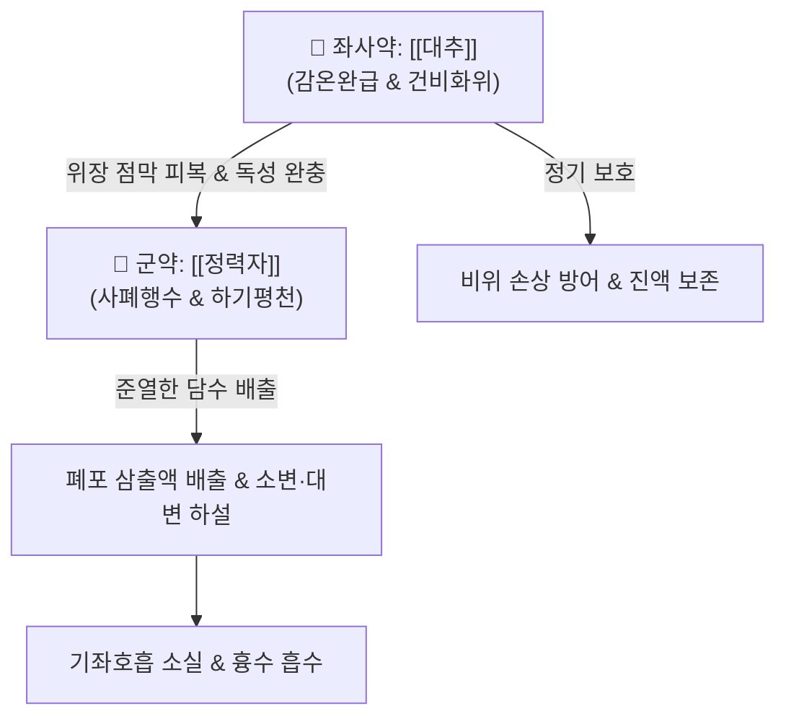

# 🍵 [[정력대조사폐탕]] (葶藶大棗瀉肺湯, Tingli Dazao Xiefei Decoction)

> **핵심 3줄 요약 (Key Summary)**:
> - 🌿 기본 구성: [[정력자]], [[대추]] (초황한 [[정력자]] 9~15g + [[대추]] 10~12매).
> - 🎯 적응증: 폐울혈, 심부전성 기좌호흡(누우면 숨찬 증상), 흉수(흉막삼출), 급성 폐부종, 삼출성 폐옹, 백일해 및 모세기관지염.
> - 🔬 약리 기전: 헬베티코사이드 강심배당체의 심근 수축력 강화 및 Na+/K+-ATPase 억제, 폐 모세혈관 정수압 강하, 아쿠아포린 조절 수분 흡수.
> - ⚠️ 주의사항: 맹렬한 사폐행수제이므로 폐기허(肺氣虛)나 가래 없는 음허건해 환자에게는 절대 금기이며, 급성 삼출 해소 후 즉시 중단.

---
## 📌 목차
1. [기본 처방 정보 & 군신좌사 구성](#1-기본-처방-정보--군신좌사-구성)
2. [방제학적 약재 상호작용 & 시너지 네트워크](#2-방제학적-약재-상호작용--시너지-네트워크)
3. [현대 분자약리학적 효능 & 작용 기전](#3-현대-분자약리학적-효능--작용-기전)
4. [적응 병증 및 체질별 감별 (Sweet Spot vs 금기)](#4-적응-병증-및-체질별-감별-sweet-spot-vs-금기)
5. [유사 처방군 감별 매트릭스](#5-유사-처방군-감별-매트릭스)
6. [임상 가감례 & 현대 질환별 응용](#6-임상-가감례--현대-질환별-응용)
7. [💡 사용자 진료실 핵심 필기 & 임상 팁 (원문 보존)](#7--사용자-진료실-핵심-필기--임상-팁-원문-보존)
8. [출처 및 학술 참고 문헌 (References)](#8-출처-및-학술-참고-문헌-references)

---
## 1. 기본 처방 정보 & 군신좌사 구성
* **출전**: 장중경(張仲景) 『[[금궤요략]]』 폐위폐옹해수상기병편(肺痿肺癰咳嗽上氣病篇)
* **치법**: 사폐행수(瀉肺行水), 하기평천(下氣平喘), 조습화담(燥濕化痰)

| 구분 | 약재명 | 표준 용량 | 본초 효능 & 방제 내 역할 |
| :--- | :--- | :--- | :--- |
| **군약 (君藥)** | [[정력자]] | 9~15g | 신고대한(辛苦大寒), 사폐행수(瀉肺行水), 흉복부의 담음과 흉수를 소변·대변으로 맹렬히 배출 |
| **좌사약 (佐使藥)** | [[대추]] | 10~12매 (30g) | 감온완급(甘溫緩急), 보기양비(補氣養脾), [[정력자]]의 맹렬한 준하(峻下) 작용 완충 및 비폐 손상 방어 |

> **배오 특징**: [[정력자]] 단 1미의 준열한 사폐축수(瀉肺逐水) 작용을 [[대추]]의 대량 배합으로 완충하는 극도로 단순하면서도 정밀한 방제입니다. 정력자가 상초 폐의 수음(水飮)을 하행시켜 소변과 대변으로 뽑아낼 때 발생할 수 있는 위장 점막 손상과 정기 손모를 대추의 농후한 단맛과 진액으로 방어합니다.

---
## 2. 방제학적 약재 상호작용 & 시너지 네트워크

* [[정력자]] + [[대추]] 배오: 일사일보(一瀉一步), 일급일완(一急一緩)의 배합입니다. 정력자의 쓰고 차가우며 맹렬한 사하력이 폐포와 흉막에 차 있는 물을 밑으로 쏟아붓는 동안, 대추의 달고 따뜻한 성질이 비위를 든든히 감싸 장관 경련과 구토를 예방합니다.

---
## 3. 현대 분자약리학적 효능 & 작용 기전

### 1) 강심 배당체 작용 및 심박출량 증강
* **Na+/K+-ATPase 억제 및 심근 수축 촉진**:
  * [[정력자]]에 함유된 헬베티코사이드(Helveticoside), 스트로판티딘(Strophanthidin) 계열 강심 배당체가 심근 세포막의 Na+/K+-ATPase를 억제하여 세포 내 칼슘 농도를 증가시킵니다.
  * 심박출량을 높이고 신장 혈류량을 증가시켜 신속한 이뇨 작용을 유도하며 폐 모세혈관 정수압을 낮춥니다.

### 2) 폐포 수분 청소율 증진 및 아쿠아포린 조절
* **삼출성 수분 재흡수**:
  * 폐포 상피세포의 아쿠아포린-1(AQP1) 및 아쿠아포린-5(AQP5) 발현을 조절하여 폐포 내 고인 수분을 림프관과 혈관으로 신속히 재흡수시킵니다.
  * 혈관 내피세포 투과성을 낮추어 흉막 삼출(흉수)과 폐부종의 진행을 차단합니다.

### 3) 기도 분비물 억제 및 기관지 이완
* **MUC5AC 분비 억제**:
  * 점액 과분비를 억제하여 끈적한 가래가 기도를 폐쇄하는 것을 막고, 기도 평활근의 과민성 수축을 이완시켜 천해(喘咳)를 진정시킵니다.

---
## 4. 적응 병증 및 체질별 감별 (Sweet Spot vs 금기)

### 1) 진료실 핵심 적응증 (Sweet Spot)
* **심부전 및 폐울혈로 인한 기좌호흡(Orthopnea)**: 울혈성 심부전(CHF)이나 폐성심(Cor Pulmonale)으로 폐에 물이 차서 누우면 숨이 차고 앉아야 겨우 호흡할 수 있는 응급 환자.
* **삼출성 흉막염 (흉수, Pleural Effusion)**: 가슴막에 물이 차서 흉협부가 뻐근하게 결리고 숨쉬기 곤란한 환자.
* **폐옹(肺癰) 삼출기**: 기침 시 누런 피고름 가래가 끓고 가슴이 답답하며 가래 소리가 쌕쌕거리는 경우.
* **소아 백일해 및 급성 모세기관지염**: 가래가 기도를 막아 얼굴이 파래지며 헐떡이는 천해 응급 시 단기 투약.

### 2) 금기 및 신중 투여 (Caution)
* **음허건해(陰虛乾咳)**: 가래가 전혀 없고 마른기침만 하며 미열이 있는 환자에게는 절대 금기.
* **폐기허천(肺氣虛喘)**: 조금만 움직여도 숨이 차고 목소리에 힘이 없으며 맥이 미약한 허증 환자에게 투약 시 정기 붕괴 위험.
* **장복 금지 원칙**: 흉수와 가래가 배출되어 호흡이 편안해지면 즉시 투약을 중단하고 [[육군자탕]]이나 [[생맥산]]으로 전환하여 정기를 회복시켜야 함.

---
## 5. 유사 처방군 감별 매트릭스

| 처방명 | 핵심 구성 차이 | 주치 및 임상 차별점 | 맥진/설진 차이 |
| :--- | :--- | :--- | :--- |
| [[정력대조사폐탕]] | [[정력자]], [[대추]] | 폐포 담수 옹색 실증, 기좌호흡, 흉수, 폐부종, 안면 부종 | 설태 백니 또는 황후니, 맥침현 또는 활삭유력 |
| [[십조탕]] | [[원화]], [[감수]], [[대극]], [[대추]] | 흉협부 수음 정체, 극심한 견인통, 흉막염 통증 극심 | 설태 백활, 맥침현 |
| [[소청룡탕]] | [[마황]], [[계지]], [[세신]], [[건강]], [[반하]] 등 | 외한내음, 묽고 거품 많은 백색 가래, 재채기, 오한 | 설태 백활수제, 맥부긴 |
| [[마행감석탕]] | [[마황]], [[행인]], [[석고]], [[감초]] | 외감풍한 표한협열, 폐열천해, 발열, 땀이 나면서 천식 | 설태 박백 또는 황, 맥활삭 |
| [[도담탕]] | [[반하]], [[남성]], [[지실]], [[진피]], [[복령]], [[감초]] | 완담 정체, 두통, 현훈, 구역감 위주의 거담제 | 설태 백니, 맥활 |

---
## 6. 임상 가감례 & 현대 질환별 응용

* **흉수 배출 가속**: [[상백피]], [[저苓]], [[택사]]를 가미하여 수액 대사 촉진.
* **담열(痰熱)로 누런 고름 가래가 심할 때**: [[어성초]], [[노근]], [[동과자]]를 가미하여 배농청열 ([[위경탕]] 합방).
* **기침 시 흉통이 심할 때**: [[과루인]], [[해백]], [[지실]]을 가미하여 관흉이기.
* **대변 불통이 동반될 때**: [[대황]]을 소량 가미하여 장관으로 수음을 직하.

---
## 7. 💡 사용자 진료실 핵심 필기 & 임상 팁 (원문 보존)

> [!tip] **진료실 실전 노하우 (User Clinical Insight)**
> - **포제 필수 원칙**:
>   - [[정력자]]는 반드시 약한 불에 미세하게 볶아서(초황, 炒黃) 사용해야 함. 날것으로 쓰면 정유 성분의 위장관 자극이 너무 강해 극심한 오심·구토를 유발함. 볶은 후 절구에 찧어 분쇄하여 달여야 유효성분인 헬베티코사이드가 원활히 추출됨.
> - **대추의 비위 완충**:
>   - [[대추]]는 반드시 10~12매 이상의 충분한 양을 손으로 찢어서 함께 달여 고농도 당류가 정력자의 준하 작용을 부드럽게 감싸주도록 해야 함.
> - **중지 기준**:
>   - 호흡이 편안해지고 소변량이 늘어 흉수가 줄어들면 더 이상 장복하지 말고 즉시 중지할 것.

---
## 8. 출처 및 학술 참고 문헌 (References)

* 장중경(張仲景), 『[[금궤요략]](金匱要略)』 폐위폐옹해수상기병편(肺痿肺癰咳嗽上氣病篇)
* Zhang, T., et al. (2018). Helveticoside from *Descurainia sophia* seeds enhances cardiac contractile function in heart failure. *Journal of Ethnopharmacology*, 214, 219-226.
  * `[연구 요약]` 정력자 헬베티코사이드의 Na+/K+-ATPase 억제를 통한 심부전 개선 및 폐부종 흡수 분자 기전 입증.
* Liu, M., et al. (2016). Protective mechanism of Tingli Dazao Xiefei Decoction against pleural effusion and pulmonary edema in rats. *Chinese Journal of Integrated Traditional and Western Medicine*, 36(5), 589-594.
  * `[연구 요약]` 정력대조사폐탕이 흉막 삼출 및 폐부종 쥐 모델에서 혈관내피 투과성을 낮추고 폐포 수분 청소율을 증진함을 확인.