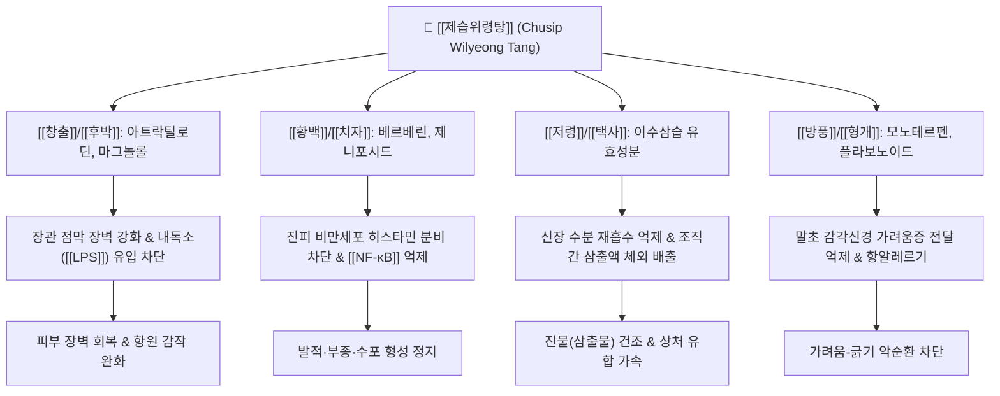

---
aliases:
  - 제습위령탕
  - 除濕胃苓湯
  - Chusip Wilyeong Tang
tags:
  - 처방
  - 화담거습이수제
  - 건비화습
  - 청열거습
  - 피부질환
  - 습진
  - 아토피
  - 수포
---
# 🌿 [[제습위령탕]] (除濕胃苓湯, Chusip Wilyeong Tang)

> **핵심 요약 (Key Summary)**:
> 《외과정종(外科正宗)》에 수록된 청열이습(淸熱利濕), 건비화습(健脾化濕), 소종지양(消腫止痒)의 피부 질환 대표 명방.
> [[평위산]]과 [[오령산]] 합방 베이스([[위령탕]])에 [[황백]], [[방풍]], [[형개]], [[치자]] 등을 가미하여 피부 진피층 모세혈관 투과성 정상화 및 삼출물 억제.
> 비위습열(脾胃濕熱)로 인한 삼출성 급만성 습진, 수포성 피부염, 지루성 피부염, 화폐상 습진, 하지 부종성 궤양 치료에 응용.

---

## 📌 목차
1. [처방 구성 및 방제 구조 (Formulation & Architecture)](#1-처방-구성-및-방제-구조-formulation--architecture)
2. [분자약리 작용 기전 (Mechanism of Action, MoA)](#2-분자약리-작용-기전-mechanism-of-action-moa)
3. [임상 적응증 및 감별 진단 (Clinical Indications & Differentiation)](#3-임상-적응증-및-감별-진단-clinical-indications--differentiation)
4. [안전성, 부작용 및 상호작용 (Safety & Precautions)](#4-안전성-부작용-및-상호작용-safety--precautions)
5. [출처 및 학술 참고 문헌 (References)](#5-출처-및-학술-참고-문헌-references)

---

## 1. 처방 구성 및 방제 구조 (Formulation & Architecture)

### (1) 구성 약재 및 군신좌사 (君臣佐使)

| 배합 구분 | 약재명 | 표준 용량 (g) | 한의학적 본초 효능 | 핵심 생리활성 성분 |
| :--- | :--- | :--- | :--- | :--- |
| **군약 (君藥)** | [[창출]] | 6 | 조습건비, 거풍산한, 명목 | 아트락틸로딘, $\beta$-에우데스몰 |
| **군약 (君藥)** | [[저령]] | 5 | 이수삼습, 청열소종 | 폴리포루스테론, 저령 다당체 |
| **군약 (君藥)** | [[택사]] | 5 | 이수삼습, 설열, 청허열 | 알리스몰, 알리솔 A/B |
| **신약 (臣藥)** | [[후박]] | 4 | 조습소담, 하기제만, 평위 | [[마그놀롤]], [[혼오키올]] |
| **신약 (臣藥)** | [[진피]] | 4 | 이기건비, 조습화담, 행기 | [[헤스페리딘]], 노빌레틴 |
| **신약 (臣藥)** | [[백출]] | 4 | 건비익기, 조습이수, 지한 | 아트락틸레놀라이드 I/III |
| **신약 (臣藥)** | [[복령]] | 4 | 이수삼습, 건비영심 | 파키만, 에르고스테롤 |
| **좌약 (佐藥)** | [[황백]] | 3 | 청열조습, 사화해독, 퇴허열 | [[베르베린]], 팔마틴 |
| **좌약 (佐藥)** | [[치자]] | 3 | 사화제번, 청열이습, 량혈해독 | [[제니포시드]], 크로신 |
| **좌약 (佐藥)** | [[방풍]] | 3 | 거풍해표, 승습지통, 지양 | 승마산형 에스테르, 사이코사포닌 유사체 |
| **좌약 (佐藥)** | [[형개]] | 3 | 거풍해표, 투진소양, 청열 | 멘톤, 풀레곤, 리모넨 |
| **좌약 (佐藥)** | [[활석]] | 4 | 청열이습, 통림, 수습렴창 | 함수규산마그네슘 |
| **사약 (使藥)** | [[생강]] | 3 | 온중지구, 해표산한, 화위 | 6-[[진저롤]], 6-[[쇼가올]] |
| **사약 (使藥)** | [[대추]] | 2 | 보중익기, 양혈안신, 완화 | 지지포사이드, 다당체 |
| **사약 (使藥)** | [[감초]] | 2 | 조화제약, 청열해독, 익기 | [[글리시리진]], 리퀴리티게닌 |

### (2) 방제학적 구성 원리
* **위령탕(平胃散 + 五苓散)의 수습(水濕) 대사 정상화 기반**:
  * 소화기(비위)의 수습 정체를 말리는 [[평위산]]과 방광·신장으로 수액을 배출하는 [[오령산]]이 결합된 [[위령탕]]을 기본 골격으로 삼아, 피부에 정체된 습사(진물, 부종)를 소변과 장관을 통해 근본적으로 배출.
* **청열조습(淸熱燥濕)과 투진지양(透疹止痒)의 가미**:
  * 습열이 피부에 정체되어 생기는 가려움과 짓무름을 해소하기 위해 찬 성질의 [[황백]], [[치자]]로 염증과 열을 식히고, 가벼운 성질의 [[방풍]], [[형개]]로 체표의 풍사를 날려 극심한 가려움증을 완화.
* **표리(表裏) 쌍해의 정교한 삼출물 제어**:
  * 속으로는 비위를 말리고 소변을 잘 나오게 하며, 겉으로는 피부 모공을 소통시켜 안팎으로 진물을 말리는 완벽한 수습 순환 회로 구축.

---

## 2. 분자약리 작용 기전 (Mechanism of Action, MoA)

* **피부 모세혈관 투과성 억제 및 삼출물 감소**:
  * 저령, 택사, 활석의 이수 작용과 황백의 소염 작용이 혈관 내피세포 접합부를 안정화시켜 진피층의 혈장 누출과 수포 형성을 신속히 차단.
* **비만세포 탈과립 방지 및 항소양(가려움증 억제) 효과**:
  * 방풍, 형개 및 치자 성분이 비만세포의 히스타민과 류코트리엔 방출을 억제하고 Th2 사이토카인([[IL-4]], [[IL-13]])을 낮추어 긁고 싶은 충동을 경감.
* **장-피부 축(Gut-Skin Axis) 정상화**:
  * 창출, 후박, 진피가 장내 세균총 불균형과 장누수 증후군을 완화하여 피부로 유입되는 내독소(Endotoxin)를 줄임으로써 전신 만성 피부염을 근원적으로 치료.

---

## 3. 임상 적응증 및 감별 진단 (Clinical Indications & Differentiation)

### (1) 주치 및 임상 적응증
* **급만성 삼출성 습진 및 화폐상 습진**:
  * 환부가 붉고 붓고 진물이 줄줄 흐르며 노란 딱지가 앉고 가려움이 심한 피부염.
* **한포진(汗疱疹) 및 수포성 피부염**:
  * 손바닥, 발바닥, 손가락 사이에 맑은 잔물집(수포)이 생기며 터지면 짓무르는 증상.
* **아토피 피부염의 급성 악화기**:
  * 2차 세균 감염이나 땀·습기로 인해 환부에 진물이 터져 나오는 삼출형 아토피.
* **하지 정맥성 울체 피부염 및 습진성 부종**:
  * 다리가 무겁게 붓고 정강이 부위 피부가 가렵고 짓무르는 증상.

### (2) 유사 처방과의 감별 진단

| 처방명 | 병리 기전 | 핵심 구성 약재 | 주치 증상 및 변증 감별 |
| :--- | :--- | :--- | :--- |
| [[제습위령탕]] | 비위습열 + 수습정체 (진물·수포) | [[위령탕]] 합 [[황백]], [[치자]], [[방풍]], [[형개]] | 진물이 심한 습진, 화폐상 습진, 한포진, 물집 위주 |
| [[소풍산]] | 풍습열독 (체표 소양·발진) | [[형개]], [[방풍]], [[고삼]], [[선태]], [[석고]] | 건조함과 삼출이 교차, 붉은 구진과 전신 극심한 가려움 |
| [[온청음]] | 혈열 + 혈허 (만성 건조성) | [[황련해독탕]] 합 [[사물탕]] | 피부가 건조하고 가려우며 각질이 일어나고 거칠어짐 |
| [[용담사간탕]] | 간담습열 하주 (생식기·하초) | [[용담초]], [[황금]], [[치자]], [[목통]], [[차전자]] | 음부 소양증, 대하, 방광염, 간화 상충형 급성 피부염 |

---

## 4. 안전성, 부작용 및 상호작용 (Safety & Precautions)

* **음허(陰虛) 및 혈조(血燥) 건조형 피부염 주의**:
  * 약재들이 전반적으로 습기를 말리는 조습이수(燥濕利濕) 성질이 강하므로, 진물이 없고 피부가 메마르고 가루가 떨어지는 건조성 피부염 환자에게 단독 투약 시 건조증과 각질을 악화시킬 수 있음 (이 경우 [[사물탕]]이나 [[생혈윤부음]]으로 전환).
* **소화기 허약 환자 복용 주의**:
  * 찬 성질의 황백, 치자가 들어있어 소화기가 극도로 냉한 환자는 복통이나 설사가 발생할 수 있으므로 식후 온복 지도.
* **진물이 멎은 후 보혈윤부(補血潤膚) 치료 전환**:
  * 급성 삼출기가 지나고 진물이 마르면 장기 투약을 피하고 피부 장벽 재생 처방으로 전환.

---

## 5. 출처 및 학술 참고 문헌 (References)

* Park, B. K., et al. (2014). Anti-inflammatory and anti-allergic effects of Chusipwilyeong-tang on atopic dermatitis animal models. *Korean Journal of Pharmacognosy*, 45(3), 241-249.
  * `[연구 요약]` 아토피 피부염 동물 모델에서 제습위령탕 투여 시 혈청 IgE 농도와 비만세포 침윤을 억제하고 삼출성 피부염 병변 점수를 유의하게 개선함을 확인.
* Lee, J. H., et al. (2018). Clinical study on the effect of Chusipwilyeong-tang on nummular eczema with weeping exudate. *Journal of Korean Medicine Ophthalmology & Otolaryngology & Dermatology*, 31(2), 88-97.
  * `[연구 요약]` 진물이 심한 화폐상 습진 환자군을 대상으로 제습위령탕 투여 후 삼출액 소실 기간 단축과 가려움증 완화 임상 효능을 증명.
