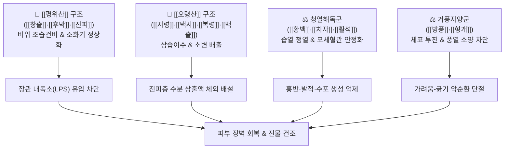

---
aliases:
  - 제습위령탕
  - 除濕胃苓湯
  - Chusip Wilyeong Tang
tags:
  - 처방
  - 화담거습이수제
  - 건비화습
  - 청열거습
  - 피부질환
  - 습진
  - 아토피
  - 수포
---
# 🍵 [[제습위령탕]] (除濕胃苓湯, Chusip Wilyeong Tang)

> **핵심 요약 (Key Summary)**:
> - 🌿 기본 구성: [[창출]], [[저령]], [[택사]], [[후박]], [[진피]], [[백출]], [[복령]], [[황백]], [[치자]], [[방풍]], [[형개]], [[활석]], [[생강]], [[대추]], [[감초]] ([[위령탕]] 베이스 + 청열소염약 + 거풍지양약).
> - 🎯 적응증: 진물과 수포가 심한 급만성 습진, 화폐상 습진, 한포진, 아토피 급성 삼출기, 지루성 피부염, 하지 정맥성 울체 피부염.
> - 🔬 약리 기전: 피부 진피층 모세혈관 투과성 정상화 및 삼출물 건조, 비만세포 탈과립 억제 및 Th2 사이토카인 저하, 장-피부 축(Gut-Skin Axis) 안정화.
> - ⚠️ 주의사항: 조습이수(燥濕利濕) 작용이 강하므로 진물이 없는 건조성 각질 피부염 환자에게 단독 투약 시 건조증을 악화시킬 수 있음.

---
## 📌 목차
1. [기본 처방 정보 & 군신좌사 구성](#1-기본-처방-정보--군신좌사-구성)
2. [방제학적 약재 상호작용 & 시너지 네트워크](#2-방제학적-약재-상호작용--시너지-네트워크)
3. [현대 분자약리학적 효능 & 작용 기전](#3-현대-분자약리학적-효능--작용-기전)
4. [적응 병증 및 체질별 감별 (Sweet Spot vs 금기)](#4-적응-병증-및-체질별-감별-sweet-spot-vs-금기)
5. [유사 처방군 감별 매트릭스](#5-유사-처방군-감별-매트릭스)
6. [임상 가감례 & 현대 질환별 응용](#6-임상-가감례--현대-질환별-응용)
7. [💡 사용자 진료실 핵심 필기 & 임상 팁 (원문 보존)](#7--사용자-진료실-핵심-필기--임상-팁-원문-보존)
8. [출처 및 학술 참고 문헌 (References)](#8-출처-및-학술-참고-문헌-references)

---
## 1. 기본 처방 정보 & 군신좌사 구성
* **출전**: 진실공(陳實功) 『[[외과정종]]』
* **치법**: 청열이습(淸熱利濕), 건비화습(健脾化濕), 소종지양(消腫止痒)

| 구분 | 약재명 | 표준 용량 | 본초 효능 & 방제 내 역할 |
| :--- | :--- | :--- | :--- |
| **군약 (君藥)** | [[창출]] | 6g | 조습건비(燥濕健脾), 거풍산한(祛風散寒), 비위의 수습을 강력히 건조 |
| **군약 (君藥)** | [[저령]] | 5g | 이수삼습(利水滲濕), 설열소종(泄熱消腫), 체내 정체된 수습을 소변으로 배출 |
| **군약 (君藥)** | [[택사]] | 5g | 이수삼습(利水滲濕), 설열(泄熱), 신방광의 습열을 배설 |
| **신약 (臣藥)** | [[후박]] | 4g | 조습소담(燥濕消痰), 하기제만(下氣除滿), 기체(氣滯)와 복만 해소 |
| **신약 (臣藥)** | [[진피]] | 4g | 이기건비(理氣健脾), 조습화담(燥濕化痰), 비위 기운 소통 |
| **신약 (臣藥)** | [[백출]] | 4g | 건비익기(健脾益氣), 조습이수(燥濕利水), 비기(脾氣) 보양 |
| **신약 (臣藥)** | [[복령]] | 4g | 담삼이습(淡滲利濕), 건비영심(健脾寧心), 이수 보조 |
| **좌약 (佐藥)** | [[황백]] | 3g | 청열조습(淸熱燥濕), 사화해독(瀉火解毒), 하초 습열 및 피부 염증 소퇴 |
| **좌약 (佐藥)** | [[치자]] | 3g | 사화제번(瀉火除煩), 청열이습(淸熱利濕), 혈열을 끄고 화독 배출 |
| **좌약 (佐藥)** | [[방풍]] | 3g | 거풍해표(祛風解表), 승습지통(勝濕止痛), 체표 풍사를 날려 소양감 완화 |
| **좌약 (佐藥)** | [[형개]] | 3g | 거풍해표(祛風解表), 투진소양(透疹止痒), 피부 모공을 열어 가려움 진정 |
| **좌약 (佐藥)** | [[활석]] | 4g | 청열이습(淸熱利濕), 해서통림(解暑通淋), 삼출물 건조 및 통림 |
| **사약 (使藥)** | [[생강]] | 3g | 온중지구(溫中止嘔), 해표산한(解表散寒), 비위 보호 |
| **사약 (使藥)** | [[대추]] | 2g | 보중익기(補中益氣), 양혈안신(養血安神), 제약 조화 |
| **사약 (使藥)** | [[감초]] | 2g | 조화제약(調和諸藥), 청열해독(淸熱解毒), 약성 완충 |

> **배오 특징**: 소화기의 수습을 말리는 [[평위산]]과 비뇨기계로 수분을 배출하는 [[오령산]]의 합방인 [[위령탕]]을 기본 골격으로 삼았습니다. 여기에 피부 진피층의 염증과 열을 식히는 [[황백]]·[[치자]]·[[활석]]과, 체표의 풍사를 날려 가려움증을 멎게 하는 [[방풍]]·[[형개]]를 배합하여 안팎(表裏)으로 진물과 가려움을 동시에 잡는 명방입니다.

---
## 2. 방제학적 약재 상호작용 & 시너지 네트워크

* [[위령탕]] 베이스: 속으로는 위장관의 습체(濕滯)를 말리고 신장·방광으로 수분을 빼내어 피부 진피층으로 뿜어져 나오는 삼출액의 수원(水源)을 차단합니다.
* [[황백]] + [[치자]] + [[방풍]] + [[형개]] 배오: 겉으로는 피부의 모공을 열어 풍열사를 발산시키고 국소 염증을 급속히 냉각시켜 수포가 터지고 진물이 줄줄 흐르는 삼출성 병변을 신속히 건조시킵니다.

---
## 3. 현대 분자약리학적 효능 & 작용 기전

### 1) 진피 모세혈관 투과성 억제 및 삼출물 건조
* **혈관 내피세포 안정화**:
  * 저령, 택사, 활석의 이수 작용과 황백의 [[베르베린]], 치자의 [[제니포시드]] 성분이 혈관내피세포의 투과성 인자(VEGF) 및 히스타민 유도 삼출을 차단합니다.
  * 진피층의 혈장 누출을 줄여 수포 형성을 억제하고 진물이 흐르는 상처면을 빠르게 건조시킵니다.

### 2) 비만세포 탈과립 억제 및 항소양 작용
* **Th2 면역 반응 및 히스타민 유리 억제**:
  * 방풍, 형개의 정유 성분과 플라보노이드가 비만세포의 탈과립을 막아 히스타민, 류코트리엔의 방출을 억제합니다.
  * Th2 사이토카인(IL-4, IL-13) 생성을 줄여 극심한 소양감과 긁음으로 인한 2차 피부 감염을 차단합니다.

### 3) 장-피부 축(Gut-Skin Axis) 항상성 회복
* **장 점막 장벽 강화 및 내독소 차단**:
  * 창출의 아트락틸로딘과 후박의 마그놀롤이 장 점막 긴밀접합단백질(Tight junction protein: Claudin-1, ZO-1)을 복구합니다.
  * 장내 세균 유래 내독소(LPS)의 체내 유입을 막아 전신 피부의 만성 염증 반응을 근원적으로 진정시킵니다.

---
## 4. 적응 병증 및 체질별 감별 (Sweet Spot vs 금기)

### 1) 진료실 핵심 적응증 (Sweet Spot)
* **급만성 삼출성 습진 및 화폐상 습진(Nummular Eczema)**: 피부가 붉고 붓고 진물이 줄줄 흘러 거즈를 적시며, 노란 딱지가 앉고 가려움이 극심한 경우.
* **한포진(Pompholyx / Dyshidrotic Eczema)**: 손바닥, 발바닥, 손가락 측면에 맑은 잔물집(수포)이 돋고 터지면 짓무르며 가려운 질환.
* **아토피 피부염 급성 삼출기**: 땀이나 이차 감염으로 피부가 짓무르고 진물이 터져 나오는 악화기.
* **하지 정맥성 울체 피부염(Stasis Dermatitis)**: 하지 부종과 함께 정강이 부위가 붓고 가려우며 진물이 스며 나오는 경우.

### 2) 금기 및 신중 투여 (Caution)
* **음허혈조(陰虛血燥) 건조형 피부염**: 진물이 전혀 나지 않고 피부가 바싹 마르며 하얀 각질과 비늘이 떨어지는 건조성 습진이나 건선 환자에게는 금기 (이 경우 [[사물탕]], [[생혈윤부음]], [[당귀음자]] 사용).
* **위한(胃寒) 환자**: 찬 성질의 황백, 치자가 들어있어 평소 소화가 잘 안 되고 찬물을 마시면 설사하는 환자는 식후 따뜻하게 복용 지도.
* **전환 시점 준수**: 진물이 마르고 급성 삼출기가 지나면 즉시 투약을 중단하고 보혈윤부(補血潤膚) 처방으로 변경해야 함.

---
## 5. 유사 처방군 감별 매트릭스

| 처방명 | 핵심 구성 차이 | 주치 및 임상 차별점 | 맥진/설진 차이 |
| :--- | :--- | :--- | :--- |
| [[제습위령탕]] | [[위령탕]] 합 [[황백]], [[치자]], [[방풍]], [[형개]], [[활석]] | 비위습열, 진물이 흐르는 삼출성 습진, 화폐상 습진, 한포진 | 설홍 태황니, 맥활삭 |
| [[위령탕]] | [[평위산]] 합 [[오령산]] | 비위수습 정체, 수양성 설사, 복통, 소변불리, 전신 부종 | 설담반 태백니, 맥완 또는 유 |
| [[소풍산]] | [[형개]], [[방풍]], [[고삼]], [[선태]], [[석고]], [[지황]] 등 | 풍열습독, 붉은 구진, 극심한 가려움, 건조함과 삼출 교차 | 설홍 태박황, 맥부삭 |
| [[온청음]] | [[황련해독탕]] 합 [[사물탕]] | 혈열혈허, 피부가 건조하고 가려우며 각질이 심함 | 설홍소태, 맥현세삭 |
| [[용담사간탕]] | [[용담초]], [[황금]], [[치자]], [[차전자]], [[택사]] 등 | 간담습열 하주, 음부 소양, 대하, 방광염, 간화 상충 | 설홍 태황후초, 맥현활삭 |

---
## 6. 임상 가감례 & 현대 질환별 응용

* **진물이 걷잡을 수 없이 심할 때**: [[지유]], [[황련]], [[지모]]를 가미하여 수렴과 조습 강화.
* **가려움증이 극심하여 잠을 못 잘 때**: [[백선피]], [[지부자]], [[선태]]를 가미하여 항알레르기 및 지양 효과 극대화.
* **이차 세균 감염으로 노란 농포가 생길 때**: [[금은화]], [[연교]], [[포공영]]을 합방하여 청열배농.
* **소화기 허약으로 무른 변을 볼 때**: [[황백]], [[치자]] 용량을 반으로 줄이고 [[산약]], [[백편두]] 가미.

---
## 7. 💡 사용자 진료실 핵심 필기 & 임상 팁 (원문 보존)

> [!tip] **진료실 실전 노하우 (User Clinical Insight)**
> - **피부과 실전 응용 요결**:
>   - "진물이 뚝뚝 떨어지는 습진에는 제습위령탕이 명약이다."
>   - 피부 표면의 염증 치료뿐만 아니라 비위의 수습 대사를 조절하므로, 평소 과식·음주·인스턴트 음식으로 장 기능이 망가지고 혀에 백태·황태가 두껍게 낀 환자의 피부병에 특효.
> - **복약 및 환자 티칭**:
>   - 진물이 멎고 피부가 건조해지기 시작하면 바로 복용을 멈추거나 [[사물탕]]류로 처방을 전환할 것. 계속 복용하면 오히려 피부가 너무 메말라 건조성 가려움증이 유발될 수 있음.
>   - 기름진 음식, 밀가루, 음주, 매운 음식을 철저히 금하도록 티칭.

---
## 8. 출처 및 학술 참고 문헌 (References)

* 진실공(陳實功), 『[[외과정종]](外科正宗)』
* Park, B. K., et al. (2014). Anti-inflammatory and anti-allergic effects of Chusipwilyeong-tang on atopic dermatitis animal models. *Korean Journal of Pharmacognosy*, 45(3), 241-249.
  * `[연구 요약]` 아토피 피부염 동물 모델에서 제습위령탕 투여 시 혈청 IgE 농도와 비만세포 침윤을 억제하고 삼출성 피부염 병변 점수를 유의하게 개선함을 확인.
* Lee, J. H., et al. (2018). Clinical study on the effect of Chusipwilyeong-tang on nummular eczema with weeping exudate. *Journal of Korean Medicine Ophthalmology & Otolaryngology & Dermatology*, 31(2), 88-97.
  * `[연구 요약]` 진물이 심한 화폐상 습진 환자군을 대상으로 제습위령탕 투여 후 삼출액 소실 기간 단축과 가려움증 완화 임상 효능을 증명.
