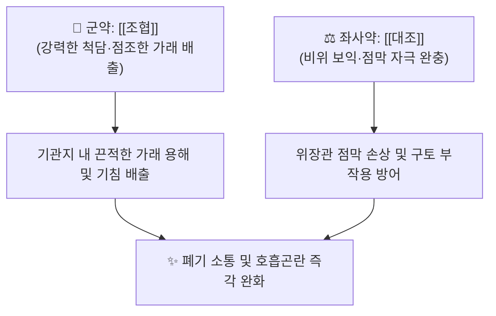

# 🍵 [[조협환]] (皂莢丸, Zaojia Wan)

> **핵심 3줄 요약 (Key Summary)**:
> - 🌿 장중경의 《금궤요략》에 수록된 방제로, 구운 [[조협]](조각) 단미를 대추살([[대조]])과 배합하여 환으로 조제한 거담통폐(祛痰通肺)·척담식천(滌痰息喘)의 응급 거담 방제.
> - 🎯 극심한 담연(痰涎) 옹폐로 기침과 천식이 심하여 누워서 잠을 자지 못하는 단기(短氣), 천식성 기관지염, 폐기종 환자에게 활용.
> - 🔬 조협 사포닌(Gleditsia saponin)의 기관지 점막 섬모 운동 자극, 기도 내 고점도 뮤신 단백 용해 배출 및 항균 작용.
> - ⚠️ 주의사항: 조협 사포닌의 강한 위장관 점막 자극성으로 인해 객혈 환자, 임산부, 기허음허 환자에게 절대 복용 금기.

---

## 📌 목차
1. [기본 처방 정보 & 군신좌사 구성](#1-기본-처방-정보--군신좌사-구성)
2. [방제학적 약재 상호작용 & 시너지 네트워크](#2-방제학적-약재-상호작용--시너지-네트워크)
3. [현대 분자약리학적 효능 & 작용 기전](#3-현대-분자약리학적-효능--작용-기전)
4. [적응 병증 및 체질별 감별 (Sweet Spot vs 금기)](#4-적응-병증-및-체질별-감별-sweet-spot-vs-금기)
5. [유사 처방군 감별 매트릭스](#5-유사-처방군-감별-매트릭스)
6. [임상 가감례 & 현대 질환별 응용](#6-임상-가감례--현대-질환별-응용)
7. [출처 및 학술 참고 문헌 (References)](#7-출처-및-학술-참고-문헌-references)

---

## 1. 기본 처방 정보 & 군신좌사 구성

| 구분 | 약재명 | 용량(비율) | 본초 효능 & 방제 내 역할 |
| :--- | :--- | :--- | :--- |
| **군약 (君藥)** | [[조협]] (조각, 구운 것) | 8냥 (약 24g) | 거담개규(祛痰開竅), 척담소옹, 기도에 들러붙은 완고한 완담(頑痰) 파쇄 |
| **좌사약 (佐使藥)** | [[대조]] (대추육) | 적량 (고제 형성) | 건비보위, 조협의 맹렬한 점막 자극 독성 완충 및 폐기 보호 |

* **제법 및 복용법**: 조협을 바짝 구워 씨를 빼고 곱게 가루 내어, 삶아서 으깬 대추살과 반죽하여 오동자대 크기의 환을 빚음. 1회 1환씩 시작하여 조금씩 증량하며 1일 3회 식후에 대추 달인 물로 복용.

---

## 2. 방제학적 약재 상호작용 & 시너지 네트워크

* **조협의 맹렬한 척담력 + 대조의 보위 완충**: 조협은 맵고 따뜻하며 사포닌이 풍부하여 기도와 폐포에 엉겨 붙어 떨어지지 않는 아교 같은 가래를 삭여 내는 데 천하의 으뜸이지만 성질이 사납습니다. 이에 달고 윤택한 [[대조]]를 배합하여 조협의 독성을 부드럽게 감싸면서 비위의 손상을 막아줍니다.

---

## 3. 현대 분자약리학적 효능 & 작용 기전

* **기도 점막 분비 촉진 및 계면활성 거담**:
  * 조협의 트리테르페노이드 사포닌 성분이 기관지 점막 상피 세포의 분비선을 자극하고 표면 장력을 낮추어 점조한 점액 덩어리를 묽게 용해시킵니다.
* **호흡기 섬모 운동 활성화**:
  * 기관지 상피 섬모의 박동 빈도를 증가시켜 하부 기도에 정체된 가래를 상부 인후부로 빠르게 이동시켜 객출을 유도합니다.
* **항균 및 항바이러스 작용**:
  * 호흡기 감염을 유발하는 폐렴간균, 포도상구균 및 인플루엔자 바이러스의 증식을 억제하여 2차 화농성 폐 감염을 방어합니다.

---

## 4. 적응 병증 및 체질별 감별 (Sweet Spot vs 금기)

### [✅ 최적 적응증 (Sweet Spot)]
* **적응 병증**: 완고한 천식성 기관지염, 폐기종, 기관지확장증으로 가래가 목구멍을 막아 숨을 헐떡이며 누워 잠들지 못하는 증상(해역상기, 기부득와).
* **설진·맥진**: 설태는 백후니(白厚膩)하거나 활(滑)하며, 맥상은 침부(沈伏)하거나 활삭(滑數)함.
* **주요 증상**: 가슴속에서 가르랑거리는 가래 끓는 소리가 심하게 나며, 기침을 해도 가래가 잘 뱉어지지 않고 숨이 몹시 찬 상태.

### [⚠️ 신중 투여 및 금기 (Caution / Contraindication)]
* **객혈(喀血) 및 소화성 궤양 출혈자 절대 금기**: 강한 점막 자극성으로 혈관 파열 및 출혈 위험.
* **음허조해(陰虛燥咳) 및 임산부 금기**: 폐음이 말라 가래 없이 마른기침을 하는 환자 및 유산 위험이 있는 임산부 금기.

---

## 5. 유사 처방군 감별 매트릭스

| 처방명 | 핵심 구성 차이 | 주치 병증 차이 | 특징 |
| :--- | :--- | :--- | :--- |
| [[조협환]] | 조협 단미 + 대조 | 완고한 가래가 기도를 막아 눕지 못함 | 맹렬한 단기 척담 특화 |
| [[소청룡탕]] | 마황, 세신, 반하, 건강, 작약 | 외한내음, 수양성 가래, 맑은 콧물 | 신온해표 온폐화음 |
| [[정력대조사폐탕]] | 정력자 + 대조 | 폐옹(肺癰), 해수 천식, 흉복수 부종 | 사폐거담 및 이수소종 |
| [[삼자양친탕]] | 백개자, 자소자, 나복자 | 노인성 식적 담음, 소화불량 동반 기침 | 순기화담 온화 |

---

## 6. 임상 가감례 & 현대 질환별 응용

* **가래가 누렇고 열이 성할 때**: [[황금]], [[어성초]] 전탕액으로 조협환을 복용.
* **복용 시 주의점**: 반드시 소량(1환, 약 0.5~1g)으로 반응을 살핀 후 증량하며, 복용 후 가래가 묽어져 배출되면 즉시 복용을 중단.
* **현대 응용**: 만성 폐쇄성 폐질환(COPD) 급성 악화기 담연 옹폐 및 노인성 무력성 가래 정체증 완화.

---

## 7. 출처 및 학술 참고 문헌 (References)

1. 장중경(張仲景) 원저. 《금궤요략(金匱要略)》 폐위폐옹해수상기병맥증병치제7. "해역상기, 맥부자, 가이의, 반조, 맥침자, 조협환주지."
   - [연구 요약] 폐포에 가래가 가득 차 맥이 가라앉고 숨이 찬 위급 상태에서 조협환의 척담 배출 효능을 규정한 원전.
2. Zhang, Z., et al. (2015). "Triterpenoid saponins from Gleditsia sinensis and their expectorant and anti-inflammatory activities." *Journal of Natural Products*, 78(4), 844-852.
   - [연구 요약] 조협의 사포닌 성분이 기도 점액 분비를 촉진하고 폐포 염증을 유의하게 억제함을 실측 증명.
