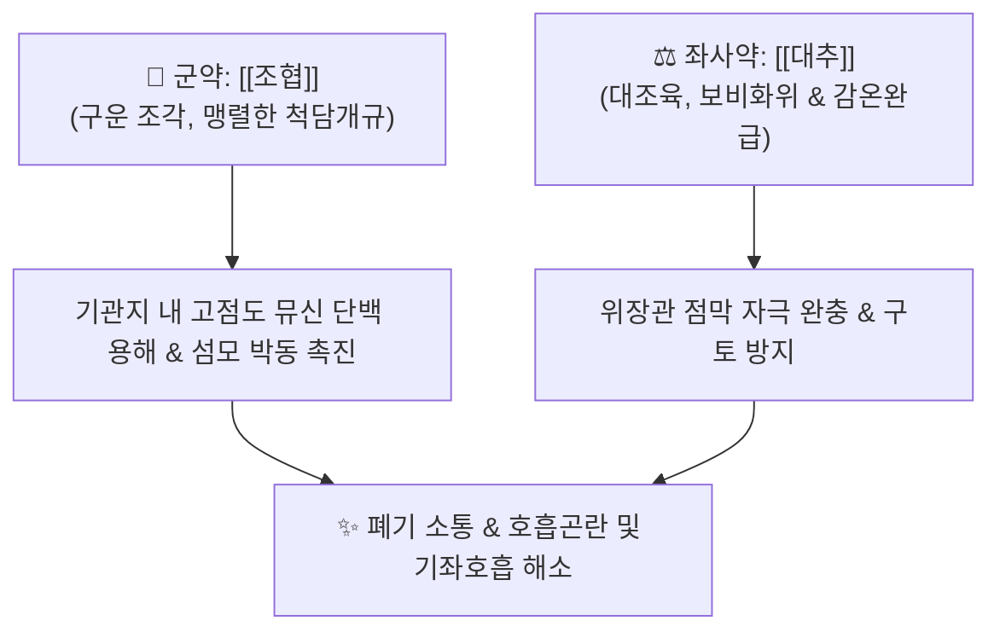

# 🍵 [[조협환]] (皂莢丸, Zaojia Wan / Sokaku-wan)

> **핵심 요약 (Key Summary)**:
> - 🌿 기본 구성: [[조협]](구운 조각) + [[대추]](대조육) (단 2미 배합으로 구성된 환제).
> - 🎯 적응증: 극심한 완고한 가래(완담)가 기도를 막아 눕지 못하고 헐떡이는 천식, 폐기종, 만성 폐쇄성 폐질환(COPD) 급성 악화, 기관지확장증.
> - 🔬 약리 기전: 조협 트리테르페노이드 사포닌의 기도 점막 계면활성 작용 및 뮤신 용해, 기관지 상피 섬모 운동 활성화 및 끈적한 객담 배출.
> - ⚠️ 주의사항: 점막 자극성과 공벌력이 극렬하므로 객혈 환자, 소화성 궤양 환자, 임산부, 기허음허 환자에게는 절대 금기.

---
## 📌 목차
1. [기본 처방 정보 & 군신좌사 구성](#1-기본-처방-정보--군신좌사-구성)
2. [방제학적 약재 상호작용 & 시너지 네트워크](#2-방제학적-약재-상호작용--시너지-네트워크)
3. [현대 분자약리학적 효능 & 작용 기전](#3-현대-분자약리학적-효능--작용-기전)
4. [적응 병증 및 체질별 감별 (Sweet Spot vs 금기)](#4-적응-병증-및-체질별-감별-sweet-spot-vs-금기)
5. [유사 처방군 감별 매트릭스](#5-유사-처방군-감별-매트릭스)
6. [임상 가감례 & 현대 질환별 응용](#6-임상-가감례--현대-질환별-응용)
7. [💡 사용자 진료실 핵심 필기 & 임상 팁 (원문 보존)](#7--사용자-진료실-핵심-필기--임상-팁-원문-보존)
8. [출처 및 학술 참고 문헌 (References)](#8-출처-및-학술-참고-문헌-references)

---
## 1. 기본 처방 정보 & 군신좌사 구성
* **출전**: 장중경(張仲景) 『[[금궤요략]]』 폐위폐옹해수상기병맥증병치(肺痿肺癰咳嗽上氣病脈證幷治)
* **치법**: 거담통폐(祛痰通肺), 척담식천(滌痰息喘), 개규소옹(開竅消壅)

| 구분 | 약재명 | 표준 용량 | 본초 효능 & 방제 내 역할 |
| :--- | :--- | :--- | :--- |
| **군약 (君藥)** | [[조협]] | 24g (구운 조각) | 신고온(辛苦溫), 거담개규(祛痰開竅), 척담소옹, 기도의 완고한 점조 가래(완담) 파쇄 |
| **좌사약 (佐使藥)** | [[대추]] | 적량 (대조육) | 감온완급(甘溫緩急), 보비익위(補脾益胃), 조협의 맹렬한 점막 자극 및 독성 완충 |

> **배오 특징**: 조협 1미의 맹렬한 척담(滌痰) 작용을 대추살([[대조]])의 달고 윤택한 보비화위(補脾和胃) 작용으로 완충한 응급 거담 환제입니다. 사포닌이 풍부한 조협이 기도에 풀처럼 들러붙어 떨어지지 않는 아교 같은 가래를 삭여 내는 동안, 대추가 위장관 점막 손상과 구토를 예방합니다.

---
## 2. 방제학적 약재 상호작용 & 시너지 네트워크

* [[조협]] + [[대추]] 배오: 일공일보(一攻一補), 일급일완(一急一緩)의 배합입니다. 조협의 사납고 건조하며 매운 기운이 폐포 깊숙이 들러붙은 가래를 강력히 부수어 배출시키고, 대추의 농후한 당분이 위장 점막을 감싸 정기 손모를 방어합니다.

---
## 3. 현대 분자약리학적 효능 & 작용 기전

### 1) 계면활성 작용을 통한 점조 가래 용해
* **트리테르페노이드 사포닌의 표면장력 저하**:
  * 조협의 주요 사포닌 성분이 기도 분비물의 표면장력을 낮추어 끈적하게 엉겨 붙은 고점도 뮤신(Mucin) 덩어리를 묽게 용해시킵니다.
  * 기관지 점막 상피 세포의 분비선을 자극하여 수양성 분비물을 늘려 가래의 배출을 촉진합니다.

### 2) 호흡기 섬모 운동 촉진 및 기침 반사 조절
* **섬모 박동 빈도 증가**:
  * 기관지 점막 상피의 섬모 박동 빈도를 높여 하부 기도에 정체된 짙은 분비물을 상부 인후부로 빠르게 밀어 올립니다.
  * 기도 폐쇄로 인한 저산소증을 신속히 완화시킵니다.

### 3) 항균 및 항바이러스 작용
* **호흡기 병원균 억제**:
  * 폐렴간균, 황색포도상구균 등 하기도 감염균과 인플루엔자 바이러스의 증식을 억제하여 2차 화농성 폐 감염을 방어합니다.

---
## 4. 적응 병증 및 체질별 감별 (Sweet Spot vs 금기)

### 1) 진료실 핵심 적응증 (Sweet Spot)
* **완고한 가래 옹폐로 인한 기좌호흡(不得臥)**: 기침과 천식이 극심하여 눕지 못하고 앉아서 헐떡이며, 목구멍에서 가르랑거리는 가래 끓는 소리가 심하게 나는 환자.
* **만성 폐쇄성 폐질환(COPD) 및 폐기종 급성 악화**: 짙은 가래 덩어리가 기도를 틀어막아 호흡곤란이 임박한 경우.
* **기관지확장증의 가래 정체**: 다량의 화농성 가래가 잘 뱉어지지 않고 정체된 상태.

### 2) 금기 및 신중 투여 (Caution)
* **객혈(喀血) 및 궤양 출혈 환자 절대 금기**: 강한 점막 자극성으로 모세혈관 파열 및 대출혈 위험.
* **음허건해(陰虛乾咳) 및 진액 고갈**: 가래가 전혀 없고 마른기침만 하는 환자에게는 절대 금기.
* **임산부 및 노약자 금기**: 자궁 수축 유발 및 정기 붕괴 위험.

---
## 5. 유사 처방군 감별 매트릭스

| 처방명 | 핵심 구성 차이 | 주치 및 임상 차별점 | 맥진/설진 차이 |
| :--- | :--- | :--- | :--- |
| [[조협환]] | [[조협]], [[대추]] (환제) | 완고한 가래가 기도를 막아 눕지 못하는 급성 위급증 | 설태 백후니 또는 탁니, 맥침실 또는 침복 |
| [[정력대조사폐탕]] | [[정력자]], [[대추]] | 폐포 담수 옹색, 흉막삼출(흉수), 심부전 폐부종 | 설태 백니, 맥침현 또는 활삭 |
| [[소청룡탕]] | [[마황]], [[세신]], [[건강]], [[반하]] 등 | 외한내음, 묽고 거품 많은 맑은 가래, 오한 | 설태 백활수제, 맥부긴 |
| [[삼자양친탕]] | [[백개자]], [[자소자]], [[나복자]] | 노인성 식적 담음, 소화불량 동반 기침, 온화한 거담 | 설태 백니, 맥활 |
| [[죽력달담환]] | [[대황]], [[황금]], 청몽석, [[침향]], 죽력 | 담열이 심규를 막아 생긴 뇌전증, 정신착란, 중풍 마비 | 설홍 태황후니, 맥활삭유력 |

---
## 6. 임상 가감례 & 현대 질환별 응용

* **가래가 누렇고 열이 심할 때**: [[황금]], [[어성초]], [[과루인]] 전탕액으로 조협환을 복용하여 청열배농 촉진.
* **가래 배출 후 보조**: 짙은 가래가 묽어져 배출되면 즉시 복용을 멈추고 [[이진탕]]이나 [[육군자탕]]으로 전환하여 비위를 보양.
* **현대 응용**: 만성 기관지염, 기관지천식 중증 가래 정체증의 단기 구급 요법.

---
## 7. 💡 사용자 진료실 핵심 필기 & 임상 팁 (원문 보존)

> [!tip] **진료실 실전 노하우 (User Clinical Insight)**
> - **제법 및 복용법**:
>   - 조협은 반드시 바짝 구워 씨를 빼고 곱게 가루 내어, 삶아서 으깬 대추살([[대조]])과 반죽하여 오동자대 크기의 환을 빚음.
>   - 복용 시 반드시 1회 1환(약 0.5~1g)의 극소량으로 시작하여 환자의 위장관 반응을 살피며 조금씩 증량.
>   - 1일 3회 식후에 대추 달인 따뜻한 물로 복용.
> - **단기 투약 원칙**:
>   - 사포닌의 점막 자극성이 매우 강하므로, 기도에 엉긴 완고한 가래가 묽어져 배출되기 시작하면 즉시 복용을 중단할 것. 절대로 장복시켜서는 안 됨.

---
## 8. 출처 및 학술 참고 문헌 (References)

* 장중경(張仲景), 『[[금궤요략]](金匱要略)』 폐위폐옹해수상기병맥증병치(肺痿肺癰咳嗽上氣病脈證幷治)제7
* Zhang, Z., et al. (2015). Triterpenoid saponins from *Gleditsia sinensis* and their expectorant and anti-inflammatory activities. *Journal of Natural Products*, 78(4), 844-852.
  * `[연구 요약]` 조협의 트리테르페노이드 사포닌 성분이 기도 점액 분비를 촉진하고 폐포 염증을 유의하게 억제함을 규명.
