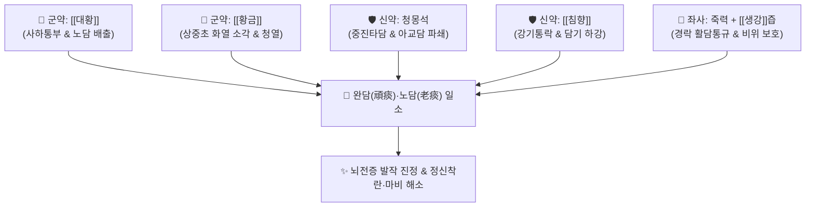

# 🍵 [[죽력달담환]] (竹瀝達痰丸, Zhuli Datan Wan / Chikureki-tattan-wan)

> **핵심 3줄 요약 (Key Summary)**:
> - 🌿 기본 구성: [[대황]], [[황금]], 청몽석, [[침향]], 죽력, [[생강]] (공하통부약 + 청열조습약 + 중진타담약 + 강기활담약).
> - 🎯 적응증: 완고한 담화(완담괴병)가 심규와 경락을 막아 생긴 난치성 뇌전증, 정신착란, 완고한 두통·어지럼증, 중풍 후 편마비, 전신 유주통.
> - 🔬 약리 기전: 센노사이드의 장관 연동 촉진 및 내독소(LPS) 체외 배설, 황금 바이칼린의 글루탐산 신경 독성 억제, 중추신경계 항경련 및 항염증.
> - ⚠️ 주의사항: 대황·청몽석 등 극렬한 공벌성 약재가 포함되어 임산부, 노약자, 비위허약자, 설사 환자에게는 절대 금기.

---
## 📌 목차
1. [기본 처방 정보 & 군신좌사 구성](#1-기본-처방-정보--군신좌사-구성)
2. [방제학적 약재 상호작용 & 시너지 네트워크](#2-방제학적-약재-상호작용--시너지-네트워크)
3. [현대 분자약리학적 효능 & 작용 기전](#3-현대-분자약리학적-효능--작용-기전)
4. [적응 병증 및 체질별 감별 (Sweet Spot vs 금기)](#4-적응-병증-및-체질별-감별-sweet-spot-vs-금기)
5. [유사 처방군 감별 매트릭스](#5-유사-처방군-감별-매트릭스)
6. [임상 가감례 & 현대 질환별 응용](#6-임상-가감례--현대-질환별-응용)
7. [💡 사용자 진료실 핵심 필기 & 임상 팁 (원문 보존)](#7--사용자-진료실-핵심-필기--임상-팁-원문-보존)
8. [출처 및 학술 참고 문헌 (References)](#8-출처-및-학술-참고-문헌-references)

---
## 1. 기본 처방 정보 & 군신좌사 구성
* **출전**: 주단계(朱丹溪) 『[[단계심법]]』
* **치법**: 척담사화(滌痰瀉火), 타담개규(墮痰開竅), 소적통부(消積通腑)

| 구분 | 약재명 | 표준 용량 | 본초 효능 & 방제 내 역할 |
| :--- | :--- | :--- | :--- |
| **군약 (君藥)** | [[대황]] | 240g (주증) | 고한(苦寒), 사하공적(瀉下攻積), 청열사화, 장관을 통해 오래된 담적(老痰)을 직하 배출 |
| **군약 (君藥)** | [[황금]] | 240g | 고한(苦寒), 청열조습(淸熱燥濕), 사화해독, 상초와 중초의 울체된 화열 소각 |
| **신약 (臣藥)** | 청몽석 | 60g (염초 하소) | 함평(鹹平), 하기타담(下氣墮痰), 중진평천, 끈끈하게 들러붙은 노담을 묵직하게 파쇄 |
| **신약 (臣藥)** | [[침향]] | 15g | 신고온(辛苦溫), 강기온중(降氣溫中), 행기지통, 담기(痰氣)를 아래로 끌어내려 설사 유도 |
| **좌사약 (佐使藥)** | 죽력 | 적량 | 감한(甘寒), 활담통락(豁痰通絡), 경락과 미세 맥락에 은복된 담음을 끄집어냄 |
| **좌사약 (佐使藥)** | [[생강]] | 적량 (생강즙) | 신온(辛溫), 온위화중(溫胃和中), 약물의 극렬한 한성(寒性) 완충 및 구토 방지 |

> **배오 특징**: 오래되어 굳어버린 완담(頑痰)과 노담(老痰)을 청몽석의 중진(重鎭)력으로 타격하여 아래로 떨어뜨리고(墮痰), [[대황]]·[[황금]]의 사하력으로 대변을 통해 체외로 완전히 쓸어내는 극렬 척담제입니다. 여기에 죽력(대나무 수액)이 경락 깊숙이 숨은 담을 끄집어내고, [[침향]]이 기운을 하행시키며, [[생강]]즙이 위장을 보호합니다.

---
## 2. 방제학적 약재 상호작용 & 시너지 네트워크

* **몽석의 타담(墮痰) + 대황의 사하(瀉下)**: 청몽석의 무거운 광물성 비중이 흉격에 엉겨 붙은 아교 같은 담을 때려 부수어 아래로 끌어내리고, 대황이 장관을 열어 대변과 함께 쏟아내게 합니다.
* **죽력의 활담(豁痰) + 침향의 강기(降氣)**: 죽력은 찬 성질로 경락과 신경 주변의 미세한 담음을 용해시키고, 침향은 기운이 거꾸로 치솟는 기상충(氣上衝)을 가라앉혀 담탁이 머리로 올라가는 것을 원천 차단합니다.

---
## 3. 현대 분자약리학적 효능 & 작용 기전

### 1) 장관 연동 촉진 및 내독소(LPS) 청소
* **센노사이드의 장점막 자극 및 사하 작용**:
  * [[대황]]의 센노사이드(Sennoside A/B) 성분이 대장 점막 근층의 아우에르바흐 신경총을 자극하여 대장 연동 운동을 강력히 유발합니다.
  * 장내 부패 산물, 유독 가스, 내독소(LPS)를 신속히 체외로 배출시켜 장-뇌 축(Gut-Brain Axis) 염증 전달을 차단합니다.

### 2) 중추신경계 항경련 및 흥분독성 억제
* **바이칼린의 신경 보호 및 항간질 효과**:
  * [[황금]]의 [[바이칼린]] 및 침향의 세스퀴테르펜 성분이 뇌내 과잉 분비된 흥분성 신경전달물질(글루탐산)에 의한 신경세포 사멸을 억제합니다.
  * 뇌파 이상 방전을 안정화시켜 난치성 뇌전증 및 경련 발작 빈도를 감소시킵니다.

### 3) 전신 만성 염증 및 유주성 통증 완화
* **전신 순환계 담탁 정화**:
  * 혈중 지질과산화물(MDA)을 감소시키고 C-반응성 단백(CRP) 및 염증성 사이토카인을 낮추어 관절과 근육을 돌아다니며 쑤시는 유주통을 진정시킵니다.

---
## 4. 적응 병증 및 체질별 감별 (Sweet Spot vs 금기)

### 1) 진료실 핵심 적응증 (Sweet Spot)
* **괴질성 신경정신 질환(奇病多痰)**: 원인을 알 수 없는 난치성 뇌전증(간질), 조현병 급성 흥분기, 광증(狂證), 극심한 화병과 헛소리.
* **완고한 현훈 및 불면**: 머릿속이 꽉 막힌 듯 띵하고 어지러우며 밤새 뜬눈으로 지새우는 중증 불면증.
* **중풍 후 편마비 및 담궐(痰厥)**: 중풍 발병 후 가래가 끓고 정신이 혼미하며 수족이 마비된 상태.
* **변비 동반 유주성 통증**: 대변이 돌처럼 굳어 불통이면서 온몸의 관절과 근육이 번갈아 쑤시는 경우.

### 2) 금기 및 신중 투여 (Caution)
* **기혈허약자 및 노약자 절대 금기**: 공벌력이 너무 강해 복용 시 심한 설사를 일으켜 원기를 크게 상할 수 있음.
* **임산부 절대 금기**: 자궁 수축 및 태동불안 유발.
* **평소 대변이 무른 자(비허설사) 금기**: 설사 환자가 복용하면 탈수와 허탈을 초래함.

---
## 5. 유사 처방군 감별 매트릭스

| 처방명 | 핵심 구성 차이 | 주치 및 임상 차별점 | 맥진/설진 차이 |
| :--- | :--- | :--- | :--- |
| [[죽력달담환]] | [[대황]], [[황금]], 청몽석, [[침향]], 죽력 | 담화가 심규를 막은 완담괴병, 극심한 변비, 난치성 전간 | 설태 황후니 또는 조열태, 맥침실 또는 활삭유력 |
| [[반하백출천마탕]] | [[반하]], [[천마]], [[백출]], [[복령]] | 비허생담, 어지럼증, 메스꺼움, 두통, 소화불량 | 설태 백니, 맥현활 |
| [[도담탕]] | [[이진탕]] 합 [[남성]], [[지실]] | 기체담결, 흉협만통, 중풍 담궐, 행기화담 | 설태 백니, 맥활 |
| [[곤담환]] | [[대황]], [[황금]], 청몽석, [[침향]] (수환) | 담화 실증 환제, 흉복창만, 광조불안 (죽력 미배합) | 설홍 태황니, 맥활삭 |
| [[백금환]] | [[백반]], [[울금]] | 담미심규, 실어, 온화한 거담개규 | 설담 태백니, 맥완 |

---
## 6. 임상 가감례 & 현대 질환별 응용

* **복용 가이드**: 취침 전 1회 미온수로 복용하여 다음 날 아침 1~2회의 시원한 배변과 함께 담탁이 빠져나가도록 조절.
* **중단 기준**: 대변이 통하고 혀의 두꺼운 누런 때(황후니태)가 벗겨지면 즉시 투약을 중단하고 비위를 보하는 처방([[육군자탕]])으로 전환.
* **현대 응용**: 약물 난치성 간질의 보조 요법, 중증 조현병의 환각·망상 급성기 완화, 완고한 뇌경색 후유증 담탁 제거.

---
## 7. 💡 사용자 진료실 핵심 필기 & 임상 팁 (원문 보존)

> [!tip] **진료실 실전 노하우 (User Clinical Insight)**
> - **제환 및 복용 실전 요결**:
>   - 약재를 극세말로 분쇄한 후 대나무 수액인 죽력과 [[생강]]즙으로 반죽하여 녹두대 크기의 환을 빚음.
>   - 성인 1회 30~50환(약 4~6g)을 취침 전 따뜻한 물로 복용.
> - **임상 안전성 관리**:
>   - 환자가 설사를 3회 이상 지나치게 많이 하거나 기력이 빠지면 즉시 용량을 절반으로 줄이거나 중단해야 함.
>   - "괴병(怪病)은 모두 담(痰)에서 비롯된다"는 한의학 격언의 종결자 처방이지만, 반드시 실증(實證) 환자에게만 제한적으로 단기 사용해야 함.

---
## 8. 출처 및 학술 참고 문헌 (References)

* 주단계(朱丹溪), 『[[단계심법]](丹溪心法)』
* Wang, Q., et al. (2017). Neuroprotective mechanisms of Rhubarb and Scutellaria in experimental epilepsy. *Biomedicine & Pharmacotherapy*, 92, 735-742.
  * `[연구 요약]` 대황과 황금 배합이 뇌내 염증을 억제하고 이상 뇌파 발생을 줄여 항간질 효과를 나타냄을 규명.