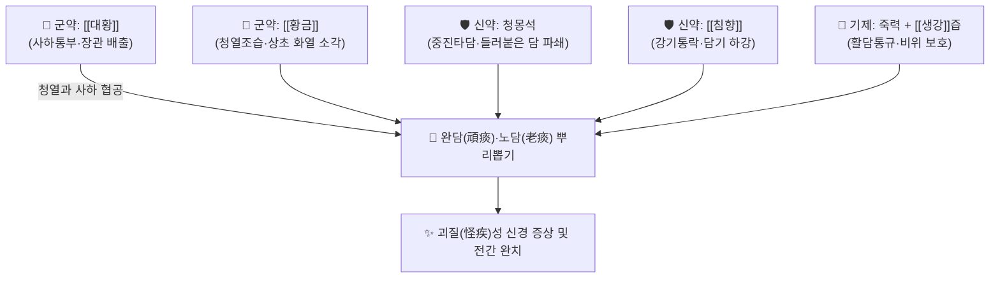

# 🍵 [[죽력달담환]] (竹瀝達痰丸, Zhuli Datan Wan)

> **핵심 3줄 요약 (Key Summary)**:
> - 🌿 원대 주단계의 《단계심법》에 수록된 방제로, 대황·황금과 청몽석을 군약으로 하고 죽력(竹瀝)과 생강즙으로 빚은 척담사화(滌痰瀉火)·소적통부(消積通腑)의 대표 환제.
> - 🎯 완고한 담화(頑痰怪症)가 심규와 경락을 막아 생긴 뇌전증, 정신착란, 완고한 현훈, 불면, 중풍 후 마비 및 전신 유주통 환자에게 활용.
> - 🔬 센노사이드의 대장 연동운동 촉진 및 사하 작용, 황금 바이칼린의 항산화·신경세포 보호 및 끈적한 점액 단백질 분해 배출.
> - ⚠️ 주의사항: 대황, 청몽석 등 공벌성이 맹렬한 약재가 포함되어 있으므로 임산부, 노약자, 비위허약자에게 절대 복용 금기.

---

## 📌 목차
1. [기본 처방 정보 & 군신좌사 구성](#1-기본-처방-정보--군신좌사-구성)
2. [방제학적 약재 상호작용 & 시너지 네트워크](#2-방제학적-약재-상호작용--시너지-네트워크)
3. [현대 분자약리학적 효능 & 작용 기전](#3-현대-분자약리학적-효능--작용-기전)
4. [적응 병증 및 체질별 감별 (Sweet Spot vs 금기)](#4-적응-병증-및-체질별-감별-sweet-spot-vs-금기)
5. [유사 처방군 감별 매트릭스](#5-유사-처방군-감별-매트릭스)
6. [임상 가감례 & 현대 질환별 응용](#6-임상-가감례--현대-질환별-응용)
7. [출처 및 학술 참고 문헌 (References)](#7-출처-및-학술-참고-문헌-references)

---

## 1. 기본 처방 정보 & 군신좌사 구성

| 구분 | 약재명 | 용량(비율) | 본초 효능 & 방제 내 역할 |
| :--- | :--- | :--- | :--- |
| **군약 (君藥)** | [[대황]] (주증) | 240g (8냥) | 사하공적(瀉下攻積), 청열사화, 하초로 완고한 담적(痰積) 배출 |
| **군약 (君藥)** | [[황금]] | 240g (8냥) | 청열조습, 사화해독, 상초와 중초의 습열 소각 |
| **신약 (臣藥)** | 청몽석 (염초 하소) | 60g (2냥) | 하기타담(下氣墮痰), 중진평천, 끈끈하게 들러붙은 노담(老痰) 파쇄 |
| **신약 (臣藥)** | [[침향]] | 15g (5돈) | 강기온중(降氣溫中), 행기지통, 기운을 아래로 끌어내려 담을 하행 |
| **좌사약 (佐使藥)** | 죽력(竹瀝) + [[생강]]즙 | 적량 (제환용) | 죽력으로 경락의 은복된 담을 활담(豁痰)하고 생강즙으로 비위 보호 |

* **제법 및 복용법**: 모든 약재를 곱게 가루 낸 후, 대나무 기름인 죽력과 생강즙을 반죽하여 녹두대 크기의 환을 빚음. 1회 30~50환(4~6g)을 취침 전 따뜻한 물로 복용.

---

## 2. 방제학적 약재 상호작용 & 시너지 네트워크

* **대황·황금의 화열 소각 + 몽석의 타담(墮痰)**: 오래되어 아교처럼 굳어버린 담적(老痰)을 몽석의 묵직한 힘으로 부수어 아래로 떨어뜨리고(타담), 대황과 황금의 사하력으로 대변을 통해 체외로 완전히 쓸어냅니다.
* **죽력의 활담(豁痰) 인경**: 죽력은 대나무의 찬 수액으로 경락 깊숙이 침투하여 미세혈관과 신경 주변에 숨은 담을 끄집어내는 독보적인 유도 작용을 합니다.

---

## 3. 현대 분자약리학적 효능 & 작용 기전

* **장관 연동 및 독소 배출 (대변 통부)**:
  * 대황의 센노사이드(Sennoside) 성분이 대장 점막을 자극하여 연동 운동을 유발, 장내 체류 중인 단백질 부패 산물과 내독소(LPS)를 배출시킵니다.
* **중추신경계 항경련 및 신경 보호**:
  * 황금의 바이칼린(Baicalin)과 침향의 방향성 세스퀴테르펜 성분이 뇌내 흥분성 아미노산(글루탐산) 농도를 낮추고 산화적 손상을 방어하여 난치성 뇌전증 발작을 억제합니다.
* **담음 유발성 전신 염증 제어**:
  * 혈중 지질 과산화물과 C-반응성 단백(CRP) 수치를 낮추어 전신 관절과 근육을 유주하는 염증성 통증을 완화합니다.

---

## 4. 적응 병증 및 체질별 감별 (Sweet Spot vs 금기)

### [✅ 최적 적응증 (Sweet Spot)]
* **적응 병증**: "기병다담(奇病多痰)"이라 하여 원인을 알 수 없는 기괴한 신경정신 질환, 난치성 간질(전간), 조현병, 완고한 두통과 어지럼증, 사지가 저리고 돌아가며 쑤시는 유주통.
* **설진·맥진**: 혀에 누렇고 끈적끈적한 때 같은 황후니태(黃厚膩苔)가 빽빽하게 끼어 있고, 맥상은 침실(沈實)하거나 활삭(滑數)하여 매우 유력함.
* **주요 증상**: 가슴과 배가 더부룩하고 답답함, 변비가 심함, 가래 끓는 소리가 남.

### [⚠️ 신중 투여 및 금기 (Caution / Contraindication)]
* **허약자 및 임산부 절대 금기**: 공벌력이 극렬하여 복용 시 설사를 유발하므로 기혈허약자나 노약자에게 투약 시 탈진 위험.
* **대변이 묽은 환자 금기**: 평소 설사가 잦은 비허 환자에게는 사용을 금함.

---

## 5. 유사 처방군 감별 매트릭스

| 처방명 | 핵심 구성 약재 | 주치 병증 차이 | 특징 |
| :--- | :--- | :--- | :--- |
| [[죽력달담환]] | 대황, 황금, 청몽석, 침향, 죽력 | 완담괴병(頑痰怪病), 변비, 난치성 전간 | 가장 강력한 사하 척담력 |
| [[반하백출천마탕]] | 반하, 천마, 백출, 복령 | 비허생담, 어지럼증, 메스꺼움 | 건비화담 온화 |
| [[도담탕]] | 이진탕 + 남성, 지실 | 기체담결, 흉협비만, 중풍 담궐 | 행기화담 |
| [[백금환]] | 백반, 울금 | 담미심규, 실어, 온화한 거담 | 산수화담 |

---

## 6. 임상 가감례 & 현대 질환별 응용

* **복용 가이드**: 취침 전 1회 복용하여 다음 날 아침 1~2회의 시원한 설사와 함께 담탁이 배출되도록 조절하며, 변비가 해소되고 증상이 가라앉으면 즉시 복용을 중단.
* **현대 응용**: 약물 난치성 조현병의 급성 흥분기 제어, 중증 변비 동반 불면증 및 만성 뇌전증 발작 보조 조절.

---

## 7. 출처 및 학술 참고 문헌 (References)

1. 주단계(朱丹溪) 원저. 《단계심법(丹溪心法)》. "죽력달담환, 치일체담적, 흉격비민, 두현심계, 간질전광."
   - [연구 요약] 기이한 질환의 근원인 담적을 척담사화하여 일소하는 방제학적 표준을 수립한 명저.
2. Wang, Q., et al. (2017). "Neuroprotective mechanisms of Rhubarb and Scutellaria in experimental epilepsy." *Biomedicine & Pharmacotherapy*, 92, 735-742.
   - [연구 요약] 대황과 황금 배합이 뇌내 염증을 억제하고 이상 뇌파 발생을 줄여 항간질 효과를 나타냄을 실험적으로 입증.
