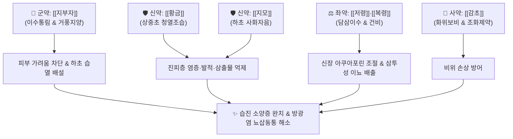

---
aliases:
  - Jibujatang
  - 지부자음
tags:
  - 처방
  - 화담거습이수제
  - 청열이습
  - 거풍지양
  - 피부과처방
---
# 🍵 [[지부자탕]] (地膚子湯, Jibujatang / Chifushito)

> **핵심 3줄 요약 (Key Summary)**:
> - 🌿 기본 구성: [[지부자]], [[복령]], [[황금]], [[지모]], [[저령]], [[감초]] (이수통림약 + 청열사화약 + 삼습건비약).
> - 🎯 적응증: 하초습열과 풍열 울체로 인한 급만성 습진, 두드러기, 음낭습진, 가려움증, 급만성 방광염 및 요도염(뇨적, 배뇨통).
> - 🔬 약리 기전: 지부자 사포닌의 비만세포 탈과립 억제 및 TRPV1 가려움 전달 차단, 황금 바이칼린의 NF-κB 염증 억제, 아쿠아포린 조절 삼투성 이뇨.
> - ⚠️ 주의사항: 약성이 차고 이수 작용이 강하므로 비위허한(소화불량, 묽은 변) 환자 및 마른 아토피(음허혈조) 환자는 감량 또는 보기약 합방.

---
## 📌 목차
1. [기본 처방 정보 & 군신좌사 구성](#1-기본-처방-정보--군신좌사-구성)
2. [방제학적 약재 상호작용 & 시너지 네트워크](#2-방제학적-약재-상호작용--시너지-네트워크)
3. [현대 분자약리학적 효능 & 작용 기전](#3-현대-분자약리학적-효능--작용-기전)
4. [적응 병증 및 체질별 감별 (Sweet Spot vs 금기)](#4-적응-병증-및-체질별-감별-sweet-spot-vs-금기)
5. [유사 처방군 감별 매트릭스](#5-유사-처방군-감별-매트릭스)
6. [임상 가감례 & 현대 질환별 응용](#6-임상-가감례--현대-질환별-응용)
7. [💡 사용자 진료실 핵심 필기 & 임상 팁 (원문 보존)](#7--사용자-진료실-핵심-필기--임상-팁-원문-보존)
8. [출처 및 학술 참고 문헌 (References)](#8-출처-및-학술-참고-문헌-references)

---
## 1. 기본 처방 정보 & 군신좌사 구성
* **출전**: 손사막(孫思邈) 『[[비급천금요방]]』
* **치법**: 청열이습(淸熱利濕), 거풍지양(祛風止痒), 통림소종(通淋消腫)

| 구분 | 약재명 | 표준 용량 | 본초 효능 & 방제 내 역할 |
| :--- | :--- | :--- | :--- |
| **군약 (君藥)** | [[지부자]] | 12g | 신고한(辛苦寒), 청열이습(淸熱利濕), 거풍지양, 방광경의 습열을 소변으로 빼내고 피부 가려움 진정 |
| **신약 (臣藥)** | [[황금]] | 8g | 고한(苦寒), 청열조습(淸熱燥濕), 사화해독, 상·중초의 습열과 피부 모세혈관 발적 소퇴 |
| **신약 (臣藥)** | [[지모]] | 8g | 고감한(苦甘寒), 청열사화(淸熱瀉火), 자음윤조, 하초 신방광의 허열과 음허화왕 식힘 |
| **좌약 (佐藥)** | [[복령]] | 10g | 담삼이습(淡滲利濕), 건비영심(健脾寧心), 비기를 보양하며 수습 운화 촉진 |
| **좌약 (佐藥)** | [[저령]] | 8g | 담삼이습(淡滲利濕), 설열소종(泄熱消腫), 신장·방광의 고인 습열을 소변으로 신속히 배출 |
| **사약 (使藥)** | [[감초]] | 4g | 보기화중(補氣和中), 조화제약(調和諸藥), 차가운 약성이 비위를 상하게 하지 않도록 완충 |

> **배오 특징**: [[지부자]]를 중심으로 이뇨와 거풍지양을 동시에 도모하는 처방입니다. [[황금]]·[[지모]]로 염증과 열을 식히고, [[저령]]·[[복령]]으로 습열 독소를 소변으로 신속히 씻어내어 체표의 피부 질환과 체내의 비뇨기 염증을 상하(上下)·내외(內外)로 협공하여 치료합니다.

---
## 2. 방제학적 약재 상호작용 & 시너지 네트워크

* **지부자 + 황금 + 지모 배오**: 지부자가 체표의 가려움증을 날려 보내는 동안 황금과 지모가 깊은 곳의 염증 반응을 냉각시켜 발적과 삼출물을 멎게 합니다.
* **저령 + 복령 배오**: 체내에 정체된 습기를 말끔히 흡수하여 소변으로 쏟아냄으로써 피부로 넘쳐흐르는 진물의 근원을 차단합니다.

---
## 3. 현대 분자약리학적 효능 & 작용 기전

### 1) 거풍지양 및 항알레르기 작용
* **비만세포 탈과립 차단 및 TRPV1 수용체 억제**:
  * [[지부자]]의 사포닌 성분(Momordin Ic)과 올레아놀산이 비만세포 탈과립을 억제하여 히스타민 방출을 차단합니다.
  * 감각신경 말단의 캡사이신/가려움 수용체(TRPV1) 활성화를 진정시켜 긁고 싶은 충동(Itch-Scratch 악순환)을 즉각적으로 끊어냅니다.

### 2) 항염증 및 진피 혈관투과성 정상화
* **NF-κB 및 염증 매개체 억제**:
  * [[황금]]의 [[바이칼린]]과 [[지모]]의 망기페린 성분이 NF-κB 활성화를 차단하고 TNF-α, IL-6, COX-2 발현을 억제합니다.
  * 피부 진피층 모세혈관의 투과성을 정상화하여 조직 부종과 삼출액 형성을 억제합니다.

### 3) 요로 상피 점막 항균 및 삼투성 이뇨
* **세균 흡착 억제 및 이뇨 촉진**:
  * 저령과 복령 다당체가 신장 세뇨관의 아쿠아포린(AQP2) 및 이온 수송체를 조절하여 소변량을 증대시킵니다.
  * 요로 상피세포 표면에 대장균(E. coli) 등 병원균이 달라붙는 것을 방해하여 잔뇨감과 배뇨통을 완화합니다.

---
## 4. 적응 병증 및 체질별 감별 (Sweet Spot vs 금기)

### 1) 진료실 핵심 적응증 (Sweet Spot)
* **삼출성 피부 질환**: 급만성 습진, 접촉성 피부염, 두드러기(담마진), 음낭습진, 주사비 등 붉고 짓무르며 가려움이 극심한 질환.
* **하초 습열성 비뇨기 질환**: 급만성 방광염, 요도염, 전립선염으로 소변이 붉고 찔끔거리며 배뇨통이 있는 경우.
* **피부-비뇨기 동반 증상**: 피부 가려움증과 함께 소변이 시원치 않은 증상이 겹쳐 나타날 때 최적의 명방.

### 2) 금기 및 신중 투여 (Caution)
* **비위허한(脾胃虛寒)**: 소화기가 냉하고 평소 묽은 변을 자주 보는 환자에게 투약 시 복통과 설사 위험.
* **음허혈조(陰虛血燥)**: 진물이 전혀 나지 않고 피부가 하얗게 트고 각질만 일어나는 건조성 만성 아토피 환자에게는 단독 사용을 금하고 자음윤조약([[생지황]], [[맥문동]])을 합방.

---
## 5. 유사 처방군 감별 매트릭스

| 처방명 | 핵심 구성 차이 | 주치 및 임상 차별점 | 맥진/설진 차이 |
| :--- | :--- | :--- | :--- |
| [[지부자탕]] | [[지부자]], [[황금]], [[지모]], [[복령]], [[저령]] | 하초습열, 피부 가려움증과 배뇨장애(방광염) 동반 | 설홍 태황박 또는 황니, 맥활삭 |
| [[팔정산]] | [[목통]], [[차전자]], [[구맥]], [[활석]], [[대황]] 등 | 비뇨기 급성 감염증, 요로결석, 혈뇨, 극심한 요통 | 설홍 태황후초, 맥활삭유력 |
| [[소풍산]] | [[형개]], [[방풍]], [[고삼]], [[선태]], [[석고]] 등 | 풍열습독, 전신 피부 가려움증 위주 (배뇨 증상 없음) | 설홍 태박황, 맥부삭 |
| [[제습위령탕]] | [[위령탕]] 합 [[황백]], [[치자]], [[방풍]], [[형개]] | 진물이 심하게 줄줄 흐르는 삼출성 화폐상 습진 | 설홍 태황후니, 맥활삭 |
| [[용담사간탕]] | [[용담초]], [[황금]], [[치자]], [[목통]], [[차전자]] 등 | 간담습열 하주, 음부 소양, 대하, 간화 상충 | 설홍 태황초, 맥현활삭 |

---
## 6. 임상 가감례 & 현대 질환별 응용

* **소양감이 극심할 때**: [[백선피]], [[고삼]], [[선태]]를 가미하여 항알레르기 작용 강화.
* **진물이 많이 흐를 때**: [[활석]], [[의이인]], [[창출]]을 가미하여 삼습건비 촉진.
* **소변 배뇨통 및 잔뇨감이 심할 때**: [[차전자]], [[편축]]을 가미하여 통림 이뇨.
* **소화기 허약 환자**: [[황금]] 용량을 줄이고 [[백출]], [[사인]]을 가미하여 비위 보호.

---
## 7. 💡 사용자 진료실 핵심 필기 & 임상 팁 (원문 보존)

> [!tip] **진료실 실전 노하우 (User Clinical Insight)**
> - **피부-비뇨기 동반 환자 감별 포인트**:
>   - 환자가 피부 가려움(습진, 두드러기)을 호소하면서 동시에 소변이 붉고 찌릿하거나 잦은 배뇨(방광염 증상)가 함께 나타난다면 지부자탕이 단연 퍼스트 초이스.
> - **소화기 부작용 대처법**:
>   - 찬 성질과 이뇨 작용으로 인해 위장이 약한 환자는 설사를 할 수 있으므로, 평소 변이 무른 환자는 [[백출]] 4g, [[사인]] 3g을 가미하여 조제 지도.
> - **외용법 병용 팁**:
>   - 지부자, 황금을 진하게 달인 물로 환부를 냉습포(Cold Wet Dressing)하면 소양감과 열감을 훨씬 빠르게 진정시킬 수 있음.

---
## 8. 출처 및 학술 참고 문헌 (References)

* 손사막(孫思邈), 『[[비급천금요방]](備急千金要方)』
* Sun, H. X., et al. (2007). Immunomodulatory and anti-inflammatory activities of *Kochia scoparia* fruit saponins. *Journal of Ethnopharmacology*, 111(2), 265-269.
  * `[연구 요약]` 지부자 추출 사포닌 성분의 대식세포 염증 매개물질 억제 및 피부 알레르기 염증 완화 효과를 검증.
* Matsuda, H., et al. (1997). Anti-allergic effects of Kochiae Fructus and its active constituents. *Biological and Pharmaceutical Bulletin*, 20(10), 1086-1091.
  * `[연구 요약]` 지부자의 항히스타민 및 비만세포 안정화 활성을 통한 거풍지양 분자 기전을 규명.