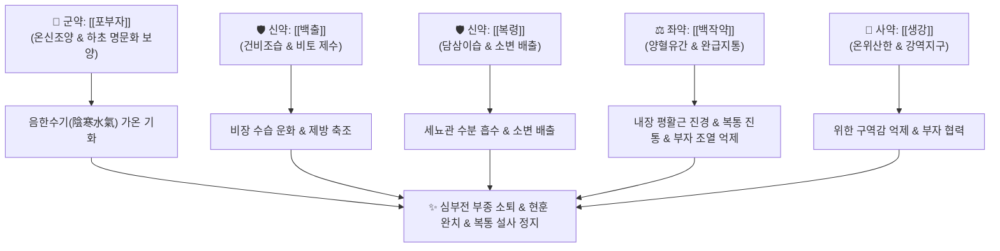

# 🍵 [[진무탕]] (眞武湯, Zhenwu Tang / Shinbu-to)

> **핵심 3줄 요약 (Key Summary)**:
> - 🌿 기본 구성: [[포부자]], [[백출]], [[복령]], [[백작약]], [[생강]] (온양보화약 [[부자]] + 건비이수약 [[백출]]·[[복령]] + 양혈유간약 [[작약]] + 온위화중약 [[생강]]).
> - 🎯 적응증: 비신양허(脾腎陽虛)로 수습이 범람한 심부전(폐부종, 기좌호흡), 만성 신부전성 전신 부종, 메니에르병성 회전성 어지럼증, 양허성 만성 복통 및 물설사.
> - 🔬 약리 기전: 부자 하이게나민의 심근 β-수용체 자극 및 심박출량 증가, 신장 아쿠아포린(AQP2) 조절 이뇨, 작약 파에오니플로린의 평활근 경련 억제 및 복통 완화.
> - ⚠️ 주의사항: 부자의 아코니틴 심실부정맥 독성 예방을 위해 1시간 이상 선전(先煎) 필수이며, 음허발열 및 실열 환자에게는 절대 금기.

---
## 📌 목차
1. [기본 처방 정보 & 군신좌사 구성](#1-기본-처방-정보--군신좌사-구성)
2. [방제학적 약재 상호작용 & 시너지 네트워크](#2-방제학적-약재-상호작용--시너지-네트워크)
3. [현대 분자약리학적 효능 & 작용 기전](#3-현대-분자약리학적-효능--작용-기전)
4. [적응 병증 및 체질별 감별 (Sweet Spot vs 금기)](#4-적응-병증-및-체질별-감별-sweet-spot-vs-금기)
5. [유사 처방군 감별 매트릭스](#5-유사-처방군-감별-매트릭스)
6. [임상 가감례 & 현대 질환별 응용](#6-임상-가감례--현대-질환별-응용)
7. [💡 사용자 진료실 핵심 필기 & 임상 팁 (원문 보존)](#7--사용자-진료실-핵심-필기--임상-팁-원문-보존)
8. [출처 및 학술 참고 문헌 (References)](#8-출처-및-학술-참고-문헌-references)

---
## 1. 기본 처방 정보 & 군신좌사 구성
* **출전**: 장중경(張仲景) 『[[상한론]]』 소음병편(少陰病篇) 및 태양병편(太陽病篇)
* **치법**: 온신건비(溫腎健脾), 온양이수(溫陽利水), 완급지통(緩急止痛)

| 구분 | 약재명 | 표준 용량 | 본초 효능 & 방제 내 역할 |
| :--- | :--- | :--- | :--- |
| **군약 (君藥)** | [[포부자]] | 4~8g (포) | 신대열(辛大熱), 온신조양(溫腎助陽), 명문화(命門火)를 북돋워 차가운 음한수기(陰寒水氣)를 증발시킴 (선전) |
| **신약 (臣藥)** | [[백출]] | 8~12g | 고온(苦溫), 조습건비(燥濕健脾), 비토(脾土)를 튼튼히 하여 수액이 넘치는 것을 막음(토극수) |
| **신약 (臣藥)** | [[복령]] | 8~12g | 담삼이습(淡滲利濕), 건비영심(健脾寧心), 정체된 수기를 흡수하여 소변으로 하행 배출 |
| **좌약 (佐藥)** | [[백작약]] | 8~12g | 산미미한(酸微微寒), 양혈렴음(養血斂陰), 유간지통(柔肝止痛), 부자의 조열을 견제하고 근육·내장 평활근 경련성 복통 억제 |
| **사약 (使藥)** | [[생강]] | 6~10g | 신온(辛溫), 온위산한(溫胃散寒), 해표화중, 부자를 도와 비위를 덥히고 오심·구역 진정 |

> **배오 특징**: 온양의 최강자인 [[부자]]와 삼습건비의 명약인 [[백출]]·[[복령]]을 결합하여 양기를 덥혀 물을 빼내는(溫陽利水) 방제학의 제왕입니다. 특히 산한(酸寒)한 [[백작약]]을 좌약으로 배합하여 부자의 맹렬한 열성이 음액을 말리는 부작용을 막고, 내장 평활근 경련으로 인한 극심한 복통을 완화하는 "강온 속에 유연함을 품은(剛柔相濟)" 구조입니다.

---
## 2. 방제학적 약재 상호작용 & 시너지 네트워크

* **부자 + 백출 + 복령 배오**: 부자가 온기를 공급하여 차가운 물을 수증기로 끓여 올리고, 백출이 둑을 쌓아 물길을 바로잡으며, 복령이 배수로를 열어 차가운 담수를 소변으로 배설합니다.
* **부자 + 백작약 배오**: 부자의 강력한 양기와 작약의 음혈 보존 작용이 음양의 균형을 맞추어 부작용 없이 한성 수음(水飮)을 제거합니다.

---
## 3. 현대 분자약리학적 효능 & 작용 기전

### 1) 심근 수축력 증강 및 혈역학적 개선 (강심 작용)
* **하이게나민(Higenamine)의 β-수용체 자극**:
  * [[부자]]의 수용성 알칼로이드인 하이게나민이 심근 β-아드레날린 수용체를 자극하고 세포 내 cAMP 농도를 높여 심근 수축력을 강화합니다.
  * 관상동맥을 확장시켜 심박출량을 증대시키고, 폐정맥 울혈과 심인성 부종을 신속히 완화합니다.

### 2) 신장 수분 배설 촉진 및 항아쿠아포린 작용
* **세뇨관 수분 재흡수 억제**:
  * [[백출]]과 [[복령]]의 유효 성분이 신장 집합관의 아쿠아포린-2(AQP2) 발현을 하향 조절하고 항이뇨호르몬(ADH)의 작용을 길항하여 저칼륨혈증 유발 없이 삼투성 이뇨를 촉진합니다.

### 3) 전정신경계 안정화 및 회전성 현훈 개선
* **내이 림프수종(Endolymphatic Hydrops) 흡수**:
  * 미세순환을 개선하고 내이 림프관의 수액 압력을 강하시켜 메니에르병 환자의 빙빙 도는 회전성 어지럼증과 이명을 완화합니다.

### 4) 위장관 진경 및 지사 작용
* **파에오니플로린의 아세틸콜린 수용체 조절**:
  * [[작약]]의 [[파에오니플로린]] 성분이 장관 평활근의 과긴장 수축을 억제하여 극심한 산통(복통)을 멎게 하고, 장 점막 흡수 기능을 복원하여 수양성 설사를 멈추게 합니다.

---
## 4. 적응 병증 및 체질별 감별 (Sweet Spot vs 금기)

### 1) 진료실 핵심 적응증 (Sweet Spot)
* **울혈성 심부전(CHF) 및 심인성 부종**: 몸이 붓고 숨이 차며 손발이 얼음처럼 차갑고 가슴이 두근거리는 경우.
* **메니에르병 및 전정신경염(회전성 현훈)**: 머리가 어지러워 똑바로 서지 못하고 배를 탄 것처럼 울렁거리며 구토하는 어지럼증.
* **소음병 허한성 복통 및 만성 설사**: 배가 얼음장같이 차고 쥐어짜듯 아프며 묽은 물변을 쏟아내는 경우.
* **만성 신부전 및 신증후군**: 전신 부종과 함께 소변량이 급감하고 피로가 극심한 양허증.

### 2) 금기 및 신중 투여 (Caution)
* **음허발열(陰虛發熱) 및 실열 환자 절대 금기**: 얼굴이 붉고 가슴에 열이 차며 혀가 붉고 입이 마르는 환자에게 투약 시 출혈 및 화열 악화.
* **부자 전탕 주의**: 아코니틴 중독(부정맥, 입술 마비)을 방지하기 위해 부자는 반드시 60분 이상 선전(先煎)하여 독성을 제거해야 함.

---
## 5. 유사 처방군 감별 매트릭스

| 처방명 | 핵심 구성 차이 | 주치 및 임상 차별점 | 맥진/설진 차이 |
| :--- | :--- | :--- | :--- |
| [[진무탕]] | [[부자]], [[백출]], [[복령]], [[백작약]], [[생강]] | 비신양허 수기범람, 심부전 부종, 회전성 현훈, 극심한 냉복통 | 설담반 치흔 백활태, 맥침미 또는 침지 |
| [[오령산]] | [[백출]], [[계지]], [[복령]], [[저령]], [[택사]] | 방광기화불리, 표증 미진, 구갈, 소변불리, 수역 (열증 겸유) | 설담 백태, 맥부 또는 활 |
| [[이중탕]] | [[인삼]], [[백출]], [[건강]], [[감초]] | 비위허한, 소화기 단독 냉증, 만성 복통, 설사 (수종·현훈 없음) | 설담 백태, 맥침세약 |
| [[부자이중탕]] | [[이중탕]] 합 [[부자]] | 비신한랭, 극심한 하복부 산통, 곽란, 완고한 한성 설사 | 설담백 활태, 맥침미약 |
| [[실비음]] | [[복령]], [[백출]], [[부자]], [[목향]], [[후박]] 등 | 비신양허 음수(陰水), 흉복창만, 만성 난치성 전신 부종 | 설담 비대 백니태, 맥침세 |

---
## 6. 임상 가감례 & 현대 질환별 응용

* **기침이 심할 때**: 기침을 하면 [[오미자]], [[세신]], [[건강]]을 가미하여 온폐화음.
* **소변 배뇨 반응에 따른 가감**:
  * 소변이 순조로우면 [[복령]]을 제거.
  * 소변이 잘 안 나오면 [[백작약]]을 제거하고 [[건강]]을 가미하여 이뇨 온양 촉진.
* **구역질이 심할 때**: 구역질이 나면 [[부자]]를 제거하고 [[생강]] 용량을 대폭 증가하여 온위지구.
* **복통이 극심할 때**: [[백작약]] 용량을 16~20g으로 증량([[작약감초탕]] 구조 강화).

---
## 7. 💡 사용자 진료실 핵심 필기 & 임상 팁 (원문 보존)

> [!tip] **진료실 실전 노하우 (User Clinical Insight)**
> - **복통 감별 및 핵심 적응증**:
>   - 복통이 굉장히 심할 때 활용.
>   - 열병의 허한증인 소음병에 배가 부르고 아프고 구역질이 나는 증상에 사용.
>   - **복통에 사용하는 처방 삼총사 감별**: [[이중탕]], [[부자이중탕]], [[진무탕]]. (소화기 중심 냉증은 이중탕, 극렬 복통과 장관 무력은 부자이중탕, 복통과 함께 전신 부종·현훈·소변불리가 겸발하면 진무탕).
> - **원전 가감 수칙 (상한론 원문 팁)**:
>   - 기침을 하면 [[오미자]], [[세신]], [[건강]]을 가함.
>   - 소변이 순조로우면 [[복령]] 제거, 소변이 잘 안 나오면 [[백작약]]을 제거하고 건강을 가함.
>   - 구역질이 나면 [[부자]]를 제거하고 [[생강]]을 증가.

---
## 8. 출처 및 학술 참고 문헌 (References)

* 장중경(張仲景), 『[[상한론]](傷寒論)』 소음병편(少陰病篇)
* * **Cao Y et al. (2026)**. Zhenwu decoction modulates sphingolipid metabolism reprogramming in chronic kidney disease via the SphK1/S1P/S1PR2 pathway. *Journal of ethnopharmacology*, 373: 122311. [PMID: 42595067](https://pubmed.ncbi.nlm.nih.gov/42595067/)
