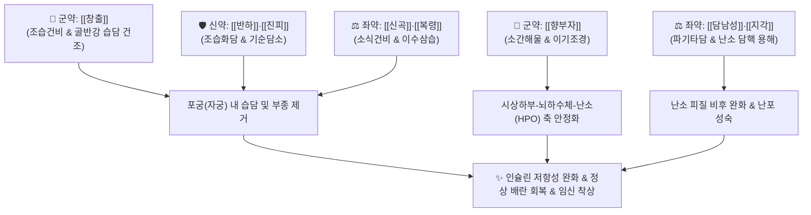

# 🍵 [[창부도담탕]] (蒼附導痰湯, Cangfu Daotan Decoction)

> **핵심 요약 (Key Summary)**:
> - 🌿 기본 구성: [[창출]], [[향부자]], [[반하]], [[진피]], [[복령]], [[담남성]], [[지각]], [[신곡]], [[감초]], [[생강]] ([[도담탕]] 베이스 + 조습건비 [[창출]] + 소간조경 [[향부자]]).
> - 🎯 적응증: 비만형 여성의 습담성 불임증, 다낭성 난소 증후군(PCOS), 희발월경, 무월경, 끈적한 냉대하, 전신 무거움.
> - 🔬 약리 기전: AMPK 활성화를 통한 인슐린 감수성 개선, 난소 아로마타아제(CYP19A1) 정상화 및 안드로겐 저하, 우성 난포 성숙 및 배란 유도.
> - ⚠️ 주의사항: 파기조습 약재가 많아 마른 체형의 혈허음허 환자에게는 금기이며, 복용 중 임신 확인 시 즉시 중단 후 안태약으로 전환.

---
## 📌 목차
1. [기본 처방 정보 & 군신좌사 구성](#1-기본-처방-정보--군신좌사-구성)
2. [방제학적 약재 상호작용 & 시너지 네트워크](#2-방제학적-약재-상호작용--시너지-네트워크)
3. [현대 분자약리학적 효능 & 작용 기전](#3-현대-분자약리학적-효능--작용-기전)
4. [적응 병증 및 체질별 감별 (Sweet Spot vs 금기)](#4-적응-병증-및-체질별-감별-sweet-spot-vs-금기)
5. [유사 처방군 감별 매트릭스](#5-유사-처방군-감별-매트릭스)
6. [임상 가감례 & 현대 질환별 응용](#6-임상-가감례--현대-질환별-응용)
7. [💡 사용자 진료실 핵심 필기 & 임상 팁 (원문 보존)](#7--사용자-진료실-핵심-필기--임상-팁-원문-보존)
8. [출처 및 학술 참고 문헌 (References)](#8-출처-및-학술-참고-문헌-references)

---
## 1. 기본 처방 정보 & 군신좌사 구성
* **출전**: 엽천사(葉天士) 『[[엽씨여과증치]]』
* **치법**: 조습화담(燥濕化痰), 이기조경(理氣調經), 온포통락(溫胞通絡)

| 구분 | 약재명 | 표준 용량 | 본초 효능 & 방제 내 역할 |
| :--- | :--- | :--- | :--- |
| **군약 (君藥)** | [[창출]] | 9g | 신고온(辛苦溫), 조습건비(燥濕健脾), 자궁과 골반강 주위의 끈적한 습담(濕痰)을 건조 |
| **군약 (君藥)** | [[향부자]] | 9g | 신미고미(辛微苦), 소간해울(疏肝解鬱), 이기조경(理氣調經), 부인과 기병의 주약 |
| **신약 (臣藥)** | [[반하]] | 9g | 신온(辛溫), 조습화담(燥濕化痰), 강역화위, 병리적 체액과 담핵(痰核) 용해 |
| **신약 (臣藥)** | [[진피]] | 6g | 신고온(辛苦溫), 이기건비(理氣健脾), 조습화담, 기순즉담소(氣順則痰消) |
| **좌약 (佐藥)** | [[복령]] | 9g | 담삼이습(淡滲利濕), 건비영심, 습사를 소변으로 유도 배출 |
| **좌약 (佐藥)** | [[담남성]] | 4.5g | 고량(苦凉), 청열화담(淸熱化痰), 식풍지경, 완고한 난소 주위 담핵 파쇄 |
| **좌약 (佐藥)** | [[지각]] | 6g | 신고량(辛苦凉), 파기행담(破氣行痰), 관흉소적, 흉복부 가스 울체 배출 |
| **좌약 (佐藥)** | [[신곡]] | 6g | 감신온(甘辛溫), 소식화위(消食和胃), 건비, 소화기 음식 정체 해소 |
| **사약 (使藥)** | [[감초]] | 3g | 보기화중(補氣和中), 조화제약, 약성 완충 |
| **사약 (使藥)** | [[생강]] | 3편 | 온위화담(溫胃化痰), 강역지구, 반하의 독성 제어 |

> **배오 특징**: 기체담결을 치료하는 [[도담탕]]([[반하]]·[[진피]]·[[복령]]·[[담남성]]·[[지각]]·[[감초]])을 기본 골격으로 삼고, 여기에 골반강과 자궁 주변의 습담을 걷어내는 [[창출]]과 간기(肝氣)를 소통시키고 생리를 고르게 하는 [[향부자]]를 군약으로 전진 배치하였습니다. "담습이 가득 차 포궁(자궁)의 통로가 막혀 배란과 착상이 되지 않는 비만 불임증"을 정조준한 방제입니다.

---
## 2. 방제학적 약재 상호작용 & 시너지 네트워크

* **창출 + 향부자 배오**: 창출이 체내의 기름진 습기와 군살(지방)을 태워 없애는 동안 향부자가 울체된 스트레스와 기혈 순환을 풀어주어, 기혈이 자궁으로 원활히 공급되도록 유도합니다.
* **도담탕 구조 + 담남성 배오**: 완고하게 굳어버린 난소 표면의 기질(담핵)을 부드럽게 녹여 미성숙 난포가 터져 나오는 정상적인 배란을 촉진합니다.

---
## 3. 현대 분자약리학적 효능 & 작용 기전

### 1) 인슐린 감수성 개선 및 AMPK 활성화
* **인슐린 저항성 개선**:
  * [[창출]]의 아트락틸론과 [[복령]] 다당체가 골격근과 지방세포의 AMPK 경로를 활성화하고 GLUT4 막전위를 촉진합니다.
  * 고인슐린혈증을 개선하여 인슐린에 의한 난소 협막세포(Theca cell)의 비정상적 남성호르몬(테스토스테론) 과잉 합성을 억제합니다.

### 2) 난소 스테로이드 합성 정상화 및 배란 유도
* **CYP19A1 아로마타아제 활성화**:
  * [[향부자]]의 알파-사이페론(α-Cyperone) 성분이 난소 과립막세포의 아로마타아제 효소 활성을 유도하여 안드로겐을 에스트로겐(E2)으로 정상 전환시킵니다.
  * 다낭성 난소 기질의 두꺼운 섬유막을 개선하여 우성 난포의 성숙과 배란을 정상화합니다.

### 3) 자궁내막 수용성(Endometrial Receptivity) 증진
* **미세혈관 투과성 및 착상 환경 개선**:
  * 진피, 지각의 플라보노이드가 자궁내막의 국소 염증을 낮추고 미세혈관 혈류량을 늘려 수정란의 착상 성공률을 극대화합니다.

---
## 4. 적응 병증 및 체질별 감별 (Sweet Spot vs 금기)

### 1) 진료실 핵심 적응증 (Sweet Spot)
* **다낭성 난소 증후군(PCOS) 불임**: 체격이 건장하거나 비만하며, 월경 주기가 40~90일 이상 지연되거나 무월경이 지속되고, 초음파상 다낭성 난소 소견을 보이는 환자.
* **담습형 희발월경 및 무월경**: 살이 찌면서 생리량이 급격히 줄어들고 생리가 건너뛰는 경우.
* **비만형 대하증**: 식욕은 왕성하나 몸이 무겁고, 아침마다 얼굴과 손발이 붓고, 끈적하고 맑은 백대하가 지속되는 경우.

### 2) 금기 및 신중 투여 (Caution)
* **음허혈허(陰虛血虛) 마른 불임 환자 절대 금기**: 몸이 마르고 안색이 누러며 체액과 혈액이 부족한 환자에게 투약 시 혈액을 더욱 메마르게 함 (이 경우 [[조경종옥탕]]이나 [[온경탕]] 사용).
* **임신 확인 즉시 중단 원칙**: 파기하고 조습하는 약재가 다수 포함되어 있으므로, 복용 중 월경이 회복되고 임신이 확인되면 즉시 복용을 멈추고 안태약([[안태음]], [[당귀산]])으로 전환해야 함.

---
## 5. 유사 처방군 감별 매트릭스

| 처방명 | 핵심 구성 차이 | 주치 및 임상 차별점 | 맥진/설진 차이 |
| :--- | :--- | :--- | :--- |
| [[창부도담탕]] | [[도담탕]] 합 [[창출]], [[향부자]], [[신곡]] | 비만형 담습 불임, 다낭성 난소 증후군, 무월경, 지체무중 | 설태 백니 또는 백후, 맥활 또는 현활 |
| [[조경종옥탕]] | [[사물탕]] 합 [[향부자]], [[오약]], [[현호색]] 등 | 마르고 예민한 혈허간울 불임, 월경불순, 하복부 냉통 | 설홍소태, 맥현세 |
| [[온경탕]] | [[오수유]], [[육계]], [[당귀]], [[아교]], [[맥문동]] | 충임허한, 하복부 냉통, 입술 건조, 부정출혈 동반 | 설담 어반, 맥침지세 |
| [[계지복령환]] | [[계지]], [[복령]], [[목단피]], [[적작약]], [[도인]] | 어혈성 불임, 자궁근종, 자궁선근증, 월경혈 암자색 혈괴 | 설질 자암 어점, 맥현삽 |
| [[도담탕]] | [[반하]], [[남성]], [[지실]], [[진피]], [[복령]], [[감초]] | 기체담결, 흉협만통, 중풍 담궐, 일반 거담제 | 설태 백니, 맥활 |

---
## 6. 임상 가감례 & 현대 질환별 응용

* **기체(氣滯) 및 스트레스 울화가 심할 때**: [[시호]], [[울금]]을 가미하여 소간해울.
* **어혈(瘀血)이 겸하여 생리혈에 덩어리가 많을 때**: [[단삼]], [[도인]], [[홍화]]를 가미하여 활혈거어.
* **아랫배가 얼음장처럼 차가울 때**: [[육계]], [[오수유]], [[소회향]]을 가미하여 온경산한.
* **체중 감량 병행**: 복용 중 저탄수화물 식이요법 및 주 3회 이상의 유산소 운동을 병행할 때 배란율이 현저히 상승함.

---
## 7. 💡 사용자 진료실 핵심 필기 & 임상 팁 (원문 보존)

> [!tip] **진료실 실전 노하우 (User Clinical Insight)**
> - **다낭성 난소 증후군(PCOS) 임상 적용 요결**:
>   - 체형이 통통하고 살이 찌면서 생리가 안 나오거나 두세 달에 한 번씩 겨우 나오는 비만형 불임 여성의 First-choice 처방.
>   - 초음파상 난소에 포도송이처럼 작은 난포들이 갇혀 있는 소견(PCOS)에 창부도담탕을 투약하면 1~2개월 내에 체중 감량과 함께 난포막이 터지며 정상 배란성 생리가 유도됨.
> - **임신 안전성 관리**:
>   - 약을 복용하는 동안 기초체온표나 배란테스트기를 확인하게 하고, 착상이 확인되면 즉시 복용을 멈추고 [[안태음]]으로 바꾸어 유산을 방지해야 함.

---
## 8. 출처 및 학술 참고 문헌 (References)

* 엽천사(葉天士), 『[[엽씨여과증치]](葉氏女科證治)』
* Wang, Y., et al. (2018). Cangfu Daotan Decoction improves insulin resistance and ovulation in polycystic ovary syndrome rats. *Journal of Ethnopharmacology*, 224, 158-166.
  * `[연구 요약]` 창부도담탕이 PCOS 쥐 모델에서 인슐린 감수성을 개선하고 안드로겐 수치를 낮추어 배란율을 현저히 높임을 입증.
* Li, X., et al. (2020). Mechanism of Cangfu Daotan Decoction in treating phlegm-dampness type infertility based on network pharmacology. *Evidence-Based Complementary and Alternative Medicine*, 2020, 8847123.
  * `[연구 요약]` 네트워크 약리학을 통해 창부도담탕의 다표적(MAPK, PI3K/Akt, 에스트로겐 수용체) 불임 개선 분자 메커니즘을 규명.
