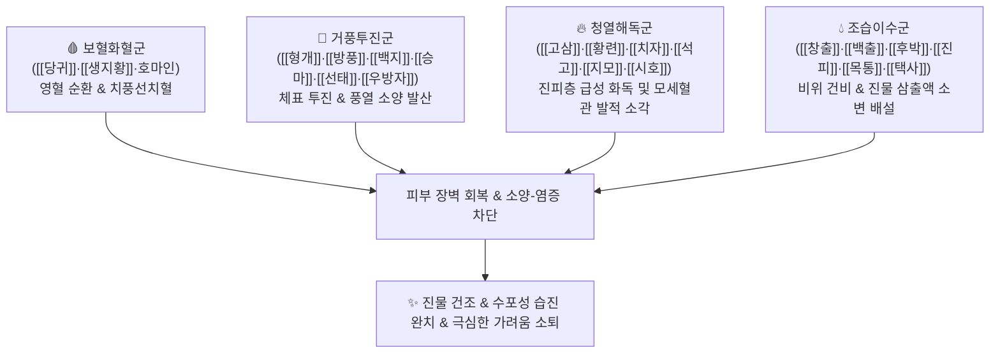

# 🍵 [[청기삼습탕]] (淸肌滲濕湯, Cheonggi Samseup Tang)

> **핵심 3줄 요약 (Key Summary)**:
> - 🌿 기본 구성: [[생지황]], [[당귀]], [[고삼]], [[목통]], [[석고]], [[선태]], [[우방자]], [[방풍]], [[지모]], [[창출]], [[형개]], 호마인, [[백지]], [[백출]], [[승마]], [[시호]], [[진피]], [[치자]], [[택사]], [[황련]], [[후박]], [[생강]], [[감초]] (사물탕 혈열 제어 + 거풍해표약 + 청열해독약 + 조습이수약 대방).
> - 🎯 적응증: 풍습열독(風濕熱毒)이 피부 진피층에 울체되어 발생한 극심한 습진, 화폐상 습진, 아토피 급성 악화, 전신 소양증, 주사비(딸기코), 짓무르는 피부 궤양.
> - 🔬 약리 기전: 피부 모세혈관 투과성 정상화 및 삼출물 억제, 비만세포 탈과립 차단 및 항히스타민 소양 억제, 황색포도상구균 등 2차 감염균 살균.
> - ⚠️ 주의사항: 23미의 다성분 대방이며 차고 습을 말리는 약재가 많으므로 비위가 극도로 냉하거나 진액이 마른 건조성 피부염 환자는 신중 투여.

---
## 📌 목차
1. [기본 처방 정보 & 군신좌사 구성](#1-기본-처방-정보--군신좌사-구성)
2. [방제학적 약재 상호작용 & 시너지 네트워크](#2-방제학적-약재-상호작용--시너지-네트워크)
3. [현대 분자약리학적 효능 & 작용 기전](#3-현대-분자약리학적-효능--작용-기전)
4. [적응 병증 및 체질별 감별 (Sweet Spot vs 금기)](#4-적응-병증-및-체질별-감별-sweet-spot-vs-금기)
5. [유사 처방군 감별 매트릭스](#5-유사-처방군-감별-매트릭스)
6. [임상 가감례 & 현대 질환별 응용](#6-임상-가감례--현대-질환별-응용)
7. [💡 사용자 진료실 핵심 필기 & 임상 팁 (원문 보존)](#7--사용자-진료실-핵심-필기--임상-팁-원문-보존)
8. [출처 및 학술 참고 문헌 (References)](#8-출처-및-학술-참고-문헌-references)

---
## 1. 기본 처방 정보 & 군신좌사 구성
* **출전**: 허준(許浚) 『[[동의보감]]』 잡병편(雜病篇) 옹저(癰疽), 공정현(龔廷賢) 『[[만병회춘]]』
* **치법**: 청열해독(淸熱解毒), 소풍지양(消風止痒), 삼습소종(滲濕消腫), 조화영위(調和營衛)

| 구분 | 약재명 | 표준 용량 | 본초 효능 & 방제 내 역할 |
| :--- | :--- | :--- | :--- |
| **군약 (君藥)** | [[고삼]] | 4g | 고한(苦寒), 청열조습(淸熱燥濕), 살충지양, 피부의 극심한 습열과 가려움증 직절 |
| **군약 (君藥)** | [[황련]] | 3g | 고한(苦寒), 사화해독(瀉火解毒), 청열조습, 심위의 화열 및 피부 급성 염증 소각 |
| **군약 (君藥)** | [[치자]] | 3g | 고한(苦寒), 사화제번(瀉火除煩), 청열이습, 삼초의 습열을 소변으로 도인 |
| **신약 (臣藥)** | [[생지황]] | 4g | 감한(甘寒), 청열량혈(淸熱凉血), 양음생진, 혈열을 식히고 진액 공급 |
| **신약 (臣藥)** | [[당귀]] | 4g | 감신온(甘辛溫), 보혈화혈(補血和血), 영혈(營血)을 순환시켜 "치풍선치혈(治風先治血)" |
| **신약 (臣藥)** | [[석고]] | 6g | 신한(辛寒), 청열사화(淸熱瀉火), 피부 기육(肌肉)의 울체된 대열 소퇴 |
| **신약 (臣藥)** | [[지모]] | 3g | 고감한(苦甘寒), 청열사화, 자음윤조, 석고의 열제 보조 |
| **좌약 (佐藥)** | [[형개]] | 3g | 거풍해표(祛風解表), 투진소양, 모공을 열어 체표 풍열 발산 |
| **좌약 (佐藥)** | [[방풍]] | 3g | 거풍해표, 승습지통, 풍사(風邪)를 흩뜨려 소양감 완화 |
| **좌약 (佐藥)** | [[백지]] | 3g | 거풍산한, 조습지통, 소종배농, 피부 표층 부종 및 통증 제거 |
| **좌약 (佐藥)** | [[승마]] | 2g | 승양투진(升陽透疹), 청열해독, 상행 발산 |
| **좌약 (佐藥)** | [[선태]] | 2g | 소풍열(疏風熱), 투진지양, 피부 신경 말단 가려움 억제 |
| **좌약 (佐藥)** | [[우방자]] | 3g | 소산풍열, 해독투진, 인후 및 피부 발적 완화 |
| **좌약 (佐藥)** | [[시호]] | 3g | 소간해울(疏肝解鬱), 반표반리 사열 투달 |
| **좌약 (佐藥)** | [[창출]] | 4g | 조습건비(燥濕健脾), 거풍산한, 비위와 피부의 습기 건조 |
| **좌약 (佐藥)** | [[백출]] | 4g | 건비익기(健脾益氣), 조습이수, 비기 보양 |
| **좌약 (佐藥)** | [[후박]] | 3g | 조습소담(燥濕消痰), 하기제만, 기체 해소 |
| **좌약 (佐藥)** | [[진피]] | 3g | 이기건비(理氣健脾), 조습화담, 기순즉습소 |
| **좌약 (佐藥)** | [[목통]] | 3g | 사심화(瀉心火), 청열이수, 하초로 습열 배출 |
| **좌약 (佐藥)** | [[택사]] | 4g | 이수삼습(利水滲濕), 설열, 삼투성 이뇨 |
| **좌약 (佐藥)** | 호마인 | 3g | 윤조활장(潤燥滑腸), 양혈윤부, 피부 건조 방지 |
| **사약 (使藥)** | [[생강]] | 3편 | 온중화위(溫中和胃), 제약의 찬 성질 완충 |
| **사약 (使藥)** | [[감초]] | 2g | 조화제약(調和諸藥), 청열해독 |

> **배오 특징**: 피부 질환에 쓸 수 있는 청열·거풍·삼습·보혈의 4대 기전을 총망라한 방대한 대방(23미)입니다. "혈이 돌면 풍은 저절로 사라진다(血行風自滅)"는 원리에 따라 [[당귀]]·[[생지황]]으로 혈열을 끄고 혈액을 돌리며, [[형개]]·[[방풍]]·[[선태]] 등으로 피부 겉의 풍사를 날리고, [[고삼]]·[[황련]]·[[치자]]·[[석고]]로 진피층의 염증 화독을 소각하며, [[창출]]·[[후박]]·[[목통]]·[[택사]]로 진물을 소변으로 빼내는 안팎 완벽한 입체 배오망을 이룹니다.

---
## 2. 방제학적 약재 상호작용 & 시너지 네트워크

* **보혈량혈 + 거풍소양**: 피를 맑게 하고 순환시켜 체표의 과민 면역 반응을 가라앉힙니다.
* **청열사화 + 이수삼습**: 속으로는 내장의 습열을 소변으로 뽑아내고, 겉으로는 진피층 모세혈관의 투과성을 정상화하여 줄줄 흐르는 진물을 급속히 건조시킵니다.

---
## 3. 현대 분자약리학적 효능 & 작용 기전

### 1) 비만세포 탈과립 억제 및 항소양 작용
* **히스타민 및 Th2 사이토카인 차단**:
  * [[고삼]]의 마트린(Matrine)과 [[선태]], [[방풍]] 복합 성분이 비만세포의 칼슘 유입을 억제하여 히스타민 탈과립을 차단합니다.
  * 감각신경 말단의 가려움 전달 경로를 차단하여 피부를 긁어 발생하는 2차 태선화와 진물 분비를 방지합니다.

### 2) 모세혈관 투과성 억제 및 삼출물 억제
* **VEGF 억제 및 염증성 부종 소퇴**:
  * [[황련]]의 [[베르베린]], [[치자]]의 [[제니포시드]], [[석고]]의 칼슘염이 혈관내피세포의 투과성을 급격히 낮추어 진피층 혈장 누출과 수포 형성을 억제합니다.

### 3) 광범위 항균 및 황색포도상구균 억제
* **피부 2차 세균 감염 차단**:
  * 고삼, 황련, 황백 계열 알칼로이드가 습진 및 아토피 환부의 단골 병원균인 메티실린 내성 황색포도상구균(MRSA) 및 진균의 증식을 억제합니다.

---
## 4. 적응 병증 및 체질별 감별 (Sweet Spot vs 금기)

### 1) 진료실 핵심 적응증 (Sweet Spot)
* **급만성 삼출성 습진 및 화폐상 습진**: 피부가 붉게 달아오르고 붓고 짓무르며 노란 진물이 터져 나오는 중증 피부염.
* **주사비(딸기코) 및 안면 습진**: 코와 뺨이 붉게 충혈되고 화농성 구진과 가려움이 동반된 경우.
* **음낭습진 및 하지 궤양**: 사타구니와 음낭이 짓무르고 냄새가 나며 극심하게 가려운 경우.
* **난치성 두드러기(담마진)**: 붉은 팽진이 전신에 돋고 열감과 가려움이 극심한 알레르기 질환.

### 2) 금기 및 신중 투여 (Caution)
* **건조성 피부염(음허혈조) 환자 신중**: 진물이 전혀 없이 피부가 메마르고 하얀 비늘이 일어나는 환자에게는 조습약이 피부를 더 건조하게 만들 수 있음.
* **비위허약자 식후 복용**: 차가운 약재가 다수 포함되어 소화기가 약한 환자는 복통이나 설사가 발생할 수 있으므로 식후 온복 지도.

---
## 5. 유사 처방군 감별 매트릭스

| 처방명 | 핵심 구성 차이 | 주치 및 임상 차별점 | 맥진/설진 차이 |
| :--- | :--- | :--- | :--- |
| [[청기삼습탕]] | 23미 대방 (청열·거풍·조습·보혈 망라) | 극심한 삼출성 습진, 화폐상 습진, 짓무르고 가려운 난치성 피부염 | 설홍 태황후니, 맥활삭유력 |
| [[제습위령탕]] | [[위령탕]] 합 [[황백]], [[치자]], [[방풍]], [[형개]] | 비위습열 중심, 소화기 장애 동반 진물성 습진 | 설홍 태황니, 맥활삭 |
| [[소풍산]] | [[형개]], [[방풍]], [[고삼]], [[선태]], [[석고]] 등 | 풍열습독, 붉은 구진, 극심한 가려움, 건조-삼출 교차 | 설홍 태박황, 맥부삭 |
| [[지부자탕]] | [[지부자]], [[황금]], [[지모]], [[복령]], [[저령]] | 하초습열, 피부 가려움과 배뇨장애(방광염) 동반 | 설홍 태황박, 맥활삭 |
| [[용담사간탕]] | [[용담초]], [[황금]], [[치자]], [[목통]], [[차전자]] 등 | 간담습열 하주, 음부 소양, 대하, 간화 상충 | 설홍 태황초, 맥현활삭 |

---
## 6. 임상 가감례 & 현대 질환별 응용

* **진물이 걷잡을 수 없이 쏟아질 때**: [[의이인]], [[활석]]을 증량하여 삼습수렴 촉진.
* **가려움증이 극심하여 긁느라 잠을 못 잘 때**: [[백선피]], [[지부자]]를 가미.
* **피부 발적이 심하고 열감이 치솟을 때**: [[석고]]를 12~20g으로 대폭 증량.
* **소화기가 약하여 대변이 묽을 때**: [[황련]], [[고삼]]을 감량하고 [[백출]], [[사인]]을 보강.

---
## 7. 💡 사용자 진료실 핵심 필기 & 임상 팁 (원문 보존)

> [!tip] **진료실 실전 노하우 (User Clinical Insight)**
> - **방제 내 약재 군별 구조화 필기 (원문 보존)**:
>   - **보혈활혈(양혈)**: [[당귀]], [[생지황]]
>   - **거풍해표(투진지양)**: [[형개]], [[방풍]] (외에 백지, 승마, 선태, 우방자)
>   - **청열사화(해독소염)**: [[시호]], [[치자]], [[황련]], [[석고]], [[우방자]] (외에 고삼, 지모)
>   - **조습건비·이수삼습**: [[후박]], [[백출]], [[창출]], [[목통]], [[택사]] (외에 진피)
>   - **조화제약**: [[생강]], [[감초]]
> - **실전 처방 가이드**:
>   - 피부과 영역에서 온갖 거풍제와 청열제를 써도 낫지 않고 진물이 계속 터져 나오는 난치성 화폐상 습진이나 접촉성 피부염에 최후의 보루로 투약하는 명방.
>   - 약재 가짓수가 23가지로 많으므로, 달일 때 약재가 충분히 잠기도록 물을 넉넉히 붓고 은근한 불로 달여야 함.

---
## 8. 출처 및 학술 참고 문헌 (References)

* 허준(許浚), 『[[동의보감]](東醫寶鑑)』 잡병편(雜病篇) 옹저(癰疽)
* 공정현(龔廷賢), 『[[만병회춘]](萬病回春)』
