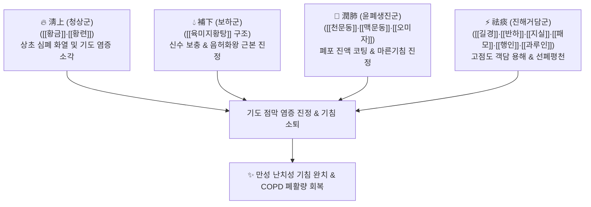

# 🍵 [[청상보화환]] (淸上補下丸, Cheongsangbohwa-hwan)

> **핵심 3줄 요약 (Key Summary)**:
> - 🌿 기본 구성: [[숙지황]], [[산수유]], [[산약]], [[복령]], [[목단피]], [[택사]] + [[황금]], [[황련]] + [[천문동]], [[맥문동]], [[오미자]] + [[길경]], [[반하]], [[지실]], [[패모]], [[행인]], [[과루인]], [[감초]] ([[육미지황탕]] 하초 보음 + 상초 청열사화 + 윤폐진해거담 대방).
> - 🎯 적응증: 감기 후 수개월간 낫지 않는 만성 기침, 만성 폐쇄성 폐질환(COPD), 진폐증, 기관지확장증, 폐신음허(肺腎陰虛)성 마른기침 및 끈적한 누런 가래.
> - 🔬 약리 기전: 뮤신 분비 정상화 및 기도 섬모 청소능 개선, 폐 조직 NF-κB 염증 캐스케이드 차단, 폐포 상피세포 산화 손상 방어 및 폐 섬유화 억제.
> - ⚠️ 주의사항: 숙지황 및 다수의 자음약(滋陰藥)으로 인해 비위가 약하거나 소화불량·설사 환자는 비위 장애를 유발할 수 있으므로 주의.

---
## 📌 목차
1. [기본 처방 정보 & 군신좌사 구성](#1-기본-처방-정보--군신좌사-구성)
2. [방제학적 약재 상호작용 & 시너지 네트워크](#2-방제학적-약재-상호작용--시너지-네트워크)
3. [현대 분자약리학적 효능 & 작용 기전](#3-현대-분자약리학적-효능--작용-기전)
4. [적응 병증 및 체질별 감별 (Sweet Spot vs 금기)](#4-적응-병증-및-체질별-감별-sweet-spot-vs-금기)
5. [유사 처방군 감별 매트릭스](#5-유사-처방군-감별-매트릭스)
6. [임상 가감례 & 현대 질환별 응용](#6-임상-가감례--현대-질환별-응용)
7. [💡 사용자 진료실 핵심 필기 & 임상 팁 (원문 보존)](#7--사용자-진료실-핵심-필기--임상-팁-원문-보존)
8. [출처 및 학술 참고 문헌 (References)](#8-출처-및-학술-참고-문헌-references)

---
## 1. 기본 처방 정보 & 군신좌사 구성
* **출전**: 허준(許浚) 『[[동의보감]]』 내경편(內景篇) 해수(咳嗽), 공정현(龔廷賢) 『[[만병회춘]]』
* **치법**: 청상보하(淸上補下), 자음강화(滋陰降火), 윤폐화담(潤肺化痰), 지해평천(止咳平喘)

| 구분 | 약재명 | 표준 용량 | 본초 효능 & 방제 내 역할 |
| :--- | :--- | :--- | :--- |
| **군약 (君藥)** | [[숙지황]] | 8g | 감미온(甘微溫), 자음보혈(滋陰補血), 익정전수, 하초 신수를 보충하여 보하(補下)의 핵심 |
| **군약 (君藥)** | [[황금]] | 4g | 고한(苦寒), 청열조습(淸熱燥濕), 폐열(肺熱) 소각 및 상초 화열 청상(淸上) |
| **군약 (君藥)** | [[황련]] | 3g | 고한(苦寒), 사화해독(瀉火解毒), 심폐의 울체된 번열과 화독 급속 냉각 |
| **신약 (臣藥)** | [[천문동]] | 4g | 감고한(甘苦寒), 양음윤조(養陰潤燥), 청폐생진, 폐의 진액을 보충하고 기침 진정 |
| **신약 (臣藥)** | [[맥문동]] | 6g | 감미고미한(甘微苦微寒), 양음윤폐(養陰潤肺), 익위생진, 인후 건조 완화 |
| **신약 (臣藥)** | [[산수유]] | 4g | 보익간신(補益肝腎), 삽정고탈, 신음 수렴 |
| **신약 (臣藥)** | [[산약]] | 4g | 보비양위(補脾養胃), 생진익폐, 비폐신 3경 동보 |
| **좌약 (佐藥)** | [[길경]] | 4g | 선폐거담(宣肺祛痰), 이인배농, 약 기운을 상초 폐로 끌어올리는 주형인경약 |
| **좌약 (佐藥)** | [[패모]] | 4g | 청열화담(淸熱化痰), 윤폐지해, 산결소옹, 끈끈한 가래 용해 |
| **좌약 (佐藥)** | [[행인]] | 4g | 강기지해평천(降氣止咳平喘), 윤장통변, 기도를 넓히고 기침 발작 억제 |
| **좌약 (佐藥)** | [[과루인]] | 4g | 청열화담, 관흉산결, 흉막 비만감 및 끈적한 누런 가래 제거 |
| **좌약 (佐藥)** | [[반하]] | 4g | 조습화담, 강역화위, 비위 담음 제거 |
| **좌약 (佐藥)** | [[지실]] | 4g | 파기소적(破氣消積), 화담제만, 흉격의 가체(氣滯) 해소 |
| **좌약 (佐藥)** | [[오미자]] | 3g | 렴폐자신(斂肺滋腎), 생진렴한, 폐기의 흩어짐을 수렴 |
| **좌약 (佐藥)** | [[목단피]] | 3g | 청열량혈(淸熱凉血), 활혈거어, 허열 소퇴 |
| **좌약 (佐藥)** | [[택사]] | 3g | 이수삼습(利水滲濕), 설신화, 수습 대사 정상화 |
| **좌약 (佐藥)** | [[복령]] | 4g | 담삼이습(淡滲利濕), 건비영심, 비토 운화 |
| **사약 (使藥)** | [[감초]] | 2g | 조화제약(調和諸藥), 윤폐지해, 차가운 약재와 보양 약재의 조화 |

> **배오 특징**: 처방 이름 그대로 "위의 폐열은 끄고(淸上), 아래의 신음은 채우는(補下)" 금수유통(金水流通)의 대표 거방입니다. 신장의 근원적 진액을 보충하는 [[육미지황탕]] 구조에, 상초의 염증을 끄는 [[황금]]·[[황련]], 폐포 점막을 적시는 [[천문동]]·[[맥문동]]·[[오미자]], 그리고 기침과 가래를 삭이는 6대 진해거담제([[길경]]·[[반하]]·[[지실]]·[[패모]]·[[행인]]·[[과루인]])를 결합하여 오래된 기침의 원인과 결과를 동시에 다스립니다.

---
## 2. 방제학적 약재 상호작용 & 시너지 네트워크

* **육미지황탕(보하) + 황금·황련(청상)**: 아랫목(신장)의 불씨를 꺼서 허열이 머리로 치솟는 것을 막고, 윗목(폐)의 실열을 직접 식혀 기침의 발열원을 원천 차단합니다.
* **천문동·맥문동(윤폐) + 패모·행인(거담)**: 바싹 마른 기도 점막에 촉촉한 수분을 공급하여 달라붙은 가래를 불려 떼어내고, 기침 반사를 정상화합니다.

---
## 3. 현대 분자약리학적 효능 & 작용 기전

### 1) 기도 뮤신(Mucin) 분비 조절 및 객담 용해
* **고점도 가래의 분해 및 점도 저하**:
  * [[맥문동]], [[천문동]]의 스테로이드 사포닌과 [[패모]]의 알칼로이드가 기도 점막 배상세포의 MUC5AC 과분비를 억제하고, 점액 수분 함량을 늘려 끈적한 가래를 묽게 용해시킵니다.
  * 섬모 상피세포의 박동을 회복시켜 기관지 내 객담 배출을 촉진합니다.

### 2) 폐 조직 항염증 및 NF-κB 경로 차단
* **만성 염증 사이토카인 억제**:
  * [[황금]]의 [[바이칼린]]과 [[황련]]의 [[베르베린]]이 기관지 상피세포와 대식세포의 NF-κB 활성화를 차단하여 TNF-α, IL-1β, IL-6 생성을 억제합니다.
  * 만성 염증으로 인한 기도 개형(Airway Remodeling)과 평활근 비후를 억제합니다.

### 3) 폐포 상피세포 보호 및 항산화·항섬유화
* **산화 스트레스 방어**:
  * [[숙지황]], [[산수유]]의 페닐에타노이드 배당체와 오미자 쉬잔드린이 활성산소종(ROS)을 소거하고 폐 조직의 지질과산화를 방어하여 만성 폐기종 및 진폐증 환자의 폐 손상을 지연시킵니다.

---
## 4. 적응 병증 및 체질별 감별 (Sweet Spot vs 금기)

### 1) 진료실 핵심 적응증 (Sweet Spot)
* **감기 후 지속되는 만성 기침(Post-infectious Cough)**: 감기는 다 나았는데 2~3달 이상 목이 간질거리며 콜록콜록하는 만성 기침.
* **만성 폐쇄성 폐질환(COPD) 및 만성 기관지염**: 아침마다 끈적한 가래를 뱉어내기 힘들고 숨이 차며 기침이 반복되는 경우.
* **진폐증(Pneumoconiosis) 및 미세먼지 노출 기침**: 분진 노출 직업군에서 발생하는 만성 마른기침과 흉부 답답함.
* **음허화왕형 각혈/토혈**: 마른기침과 함께 가래에 피가 비치는 증상.

### 2) 금기 및 신중 투여 (Caution)
* **소화기 허약자(비위허약) 신중**: 숙지황과 다량의 자음약이 포함되어 있어 평소 소화가 잘 안 되고 헛배가 부르며 설사를 자주 하는 환자는 소화불량 및 설사를 유발할 수 있음.
* **외감 초기(감기 발열 초기) 금기**: 오한, 발열이 있는 감기 초기에는 수렴하는 오미자나 보음약을 쓰면 사기(邪氣)를 가둘 수 있으므로 금기.

---
## 5. 유사 처방군 감별 매트릭스

| 처방명 | 핵심 구성 차이 | 주치 및 임상 차별점 | 맥진/설진 차이 |
| :--- | :--- | :--- | :--- |
| [[청상보화환]] | [[육미지황탕]] 합 [[황금]], [[황련]] 합 윤폐진해거담약 | 폐신음허, 감기 후 만성 기침, COPD, 진폐증 | 설홍소태 또는 열문, 맥세삭 |
| [[맥문동탕]] | [[맥문동]], [[반하]], [[인삼]], [[갱미]], [[대추]], [[감초]] | 폐위음허, 인후 건조, 얼굴이 붉어지며 토할 듯한 발작성 마른기침 | 설홍 건조 무태, 맥허삭 |
| [[청폐탕]] | [[생대감]] 베이스 합 청열윤폐거담약 (숙지황 없음) | 습담열성 기침, 끈적하고 누런 다량의 가래, 만성 기관지염 | 설태 황니, 맥활삭 |
| [[백합고금탕]] | [[백합]], [[생지황]], [[숙지황]], [[패모]], [[맥문동]] 등 | 폐음허 각혈, 폐결핵성 조해, 인후 작열통 | 설홍 건조 소태, 맥세삭 |
| [[삼자양친탕]] | [[백개자]], [[자소자]], [[나복자]] | 노인성 식적 담음, 소화불량 동반 온화한 기침 | 설태 백니, 맥활 |

---
## 6. 임상 가감례 & 현대 질환별 응용

* **객혈 및 토혈이 동반될 때**: [[백급]], [[아교]], [[한련초]]를 가미하여 수렴지혈 촉진.
* **소화기가 약하여 더부룩할 때**: [[사인]], [[백출]]을 가미하고 [[숙지황]]을 건지황으로 대체하거나 감량.
* **가래가 누렇고 열감이 극심할 때**: [[어성초]], [[상백피]]를 가미하여 청열배농 강화.
* **밤에 기침이 심하여 잠을 못 잘 때**: [[산조인]], [[백자인]]을 가미하여 양심안신.

---
## 7. 💡 사용자 진료실 핵심 필기 & 임상 팁 (원문 보존)

> [!tip] **진료실 실전 노하우 (User Clinical Insight)**
> - **처방 구조 분석 요결**:
>   - [[육미지황탕]] + [[황금]], [[황련]] + [[천문동]], [[맥문동]] + 진해거담제 6미 결합 형태.
> - **적응증 핵심**:
>   - 감기 걸린 후 기침이 떨어지지 않고 계속할 때의 명약 (COPD, 진폐증 환자 다용).
> - **임상 감별 및 안전성 복약 지도 (원문 팁)**:
>   - **토혈/객혈 응용**: [[백급]]을 추가하여 토혈 및 혈담에 적극 활용.
>   - **소화기 주의**: 육미지황탕 + 보음지제 구성이기에 소화기가 안 좋은 사람에게는 위장 장애를 일으킬 수 있으므로 주의 및 식후 복용 지도.
>   - **원인 감별 필수**: 기침의 원인이 울혈성 심부전 등 심장 질환인지, 기관지·폐 등 호흡기 질환인지 맥진과 흉부 증상을 통해 명확히 감별한 후 투약할 것.

---
## 8. 출처 및 학술 참고 문헌 (References)

* 허준(許浚), 『[[동의보감]](東醫寶鑑)』 내경편(內景篇) 해수(咳嗽)
* 공정현(龔廷賢), 『[[만병회춘]](萬病回春)』
* Lee, S. Y., et al. (2017). Inhibitory effects of Cheongsangbohwa-hwan on airway inflammation and mucin secretion in chronic obstructive pulmonary disease animal model. *BMC Complementary and Alternative Medicine*, 17(1), 345.
  * `[연구 요약]` 청상보화환이 COPD 동물 모델에서 기도 염증과 호중구 침윤을 억제하고 MUC5AC 과분비를 정상화함을 입증.