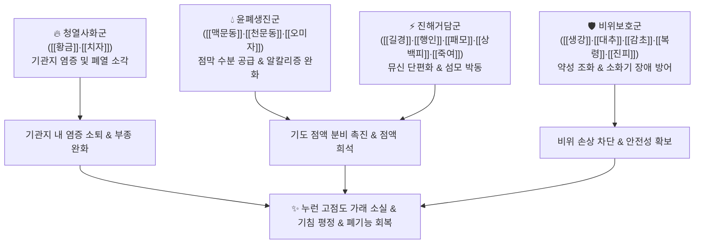

# 🍵 [[청폐탕]] (淸肺湯, Qingfei Tang / Seihai-to)

> **핵심 3줄 요약 (Key Summary)**:
> - 🌿 기본 구성: [[황금]], [[치자]], [[맥문동]], [[천문동]], [[패모]], [[상백피]], [[행인]], [[길경]], [[진피]], [[복령]], [[당귀]], [[오미자]], [[죽여]], [[생강]], [[대추]], [[감초]] (청열사화약 + 윤폐생진약 + 진해배담약 + [[생대감]] 비위 보호).
> - 🎯 적응증: 진하고 끈적끈적한 누런 가래가 끓는 만성 기관지염, 만성 폐쇄성 폐질환(COPD), 기관지확장증, 흡연자 만성 해수, 호흡부전성 가래 정체.
> - 🔬 약리 기전: 기도 점액 수분 분비 항진, 뮤신 다당류 분해 및 객담 구조 단편화, 폐 표면활성물질(Surfactant) 분비 촉진, 점막 섬모 수송능 강화.
> - ⚠️ 주의사항: 가래가 전혀 없고 마른기침만 하는 음허 환자나, 맑은 거품 가래를 뱉는 한성 담음 환자에게는 맞지 않음.

---
## 📌 목차
1. [기본 처방 정보 & 군신좌사 구성](#1-기본-처방-정보--군신좌사-구성)
2. [방제학적 약재 상호작용 & 시너지 네트워크](#2-방제학적-약재-상호작용--시너지-네트워크)
3. [현대 분자약리학적 효능 & 작용 기전](#3-현대-분자약리학적-효능--작용-기전)
4. [적응 병증 및 체질별 감별 (Sweet Spot vs 금기)](#4-적응-병증-및-체질별-감별-sweet-spot-vs-금기)
5. [유사 처방군 감별 매트릭스](#5-유사-처방군-감별-매트릭스)
6. [임상 가감례 & 현대 질환별 응용](#6-임상-가감례--현대-질환별-응용)
7. [💡 사용자 진료실 핵심 필기 & 임상 팁 (원문 보존)](#7--사용자-진료실-핵심-필기--임상-팁-원문-보존)
8. [출처 및 학술 참고 문헌 (References)](#8-출처-및-학술-참고-문헌-references)

---
## 1. 기본 처방 정보 & 군신좌사 구성
* **출전**: 공정현(龔廷賢) 『[[만병회춘]]』
* **치법**: 청폐사화(淸肺瀉火), 윤폐지해(潤肺止咳), 화담평천(化痰平喘)

| 구분 | 약재명 | 표준 용량 | 본초 효능 & 방제 내 역할 |
| :--- | :--- | :--- | :--- |
| **군약 (君藥)** | [[황금]] | 4g | 고한(苦寒), 청열조습(淸熱燥濕), 사화해독, 폐열(肺熱)을 직접 끄고 기도 염증 진정 |
| **군약 (君藥)** | [[치자]] | 3g | 고한(苦寒), 사화제번(瀉火除煩), 청열이습, 삼초의 습열 소각 |
| **신약 (臣藥)** | [[맥문동]] | 6g | 감미고미한(甘微苦微寒), 양음윤폐(養陰潤肺), 청심제번, 기도 점막 수분 공급 |
| **신약 (臣藥)** | [[천문동]] | 4g | 감고한(甘苦寒), 양음윤조(養陰潤燥), 청폐강화, 폐음 보충 |
| **신약 (臣藥)** | [[패모]] | 4g | 고미한(苦微寒), 청열화담(淸熱化痰), 윤폐지해, 끈끈한 가래 묽힘 |
| **신약 (臣藥)** | [[상백피]] | 4g | 감한(甘寒), 사폐평천(瀉肺平喘), 이수소종, 폐열로 인한 쌕쌕거림 완화 |
| **좌약 (佐藥)** | [[행인]] | 4g | 강기지해평천(降氣止咳平喘), 윤장통변, 기침 발작 억제 |
| **좌약 (佐藥)** | [[길경]] | 4g | 선폐거담(宣肺祛痰), 이인배농, 약 기운을 상초 폐로 인경 |
| **좌약 (佐藥)** | [[진피]] | 4g | 이기건비(理氣健脾), 조습화담, 담음 정체 해소 |
| **좌약 (佐藥)** | [[복령]] | 4g | 담삼이습(淡滲利濕), 건비영심, 수습 운화 |
| **좌약 (佐藥)** | [[당귀]] | 4g | 보혈활혈(補血活血), 조경지통, 기도 미세혈류 순환 촉진 |
| **좌약 (佐藥)** | [[오미자]] | 3g | 렴폐자신(斂肺滋腎), 생진렴한, 기침으로 흩어진 폐기 수렴 및 전해질 균형 |
| **좌약 (佐藥)** | [[죽여]] | 3g | 청열화담(淸熱化痰), 제번지구, 담열로 인한 가슴 답답함 해소 |
| **사약 (使藥)** | [[생강]] | 3g | 온중화위(溫中和胃), 해표산한, 약물의 차가운 성질 완충 |
| **사약 (使藥)** | [[대추]] | 2g | 보중익기(補中益氣), 양혈안신, 비위 보호 |
| **사약 (使藥)** | [[감초]] | 2g | 조화제약(調和諸藥), 윤폐지해, 약성 조율 |

> **배오 특징**: 폐에 끈적하게 들러붙어 떨어지지 않는 누런 가래를 묽게 녹여 체외로 쓸어내는 명처방입니다. 염증을 끄는 [[황금]]·[[치자]]와 점막을 적시는 [[맥문동]]·[[천문동]], 가래를 삭이는 [[패모]]·[[상백피]]·[[행인]]·[[길경]]이 결합되고, [[생대감]]([[생강]]·[[대추]]·[[감초]])이 비위를 든든히 지켜주어 위장 장애 없이 장기 투약이 가능합니다.

---
## 2. 방제학적 약재 상호작용 & 시너지 네트워크

* **황금·치자 + 맥문동·천문동 배오**: 불을 끄면서 동시에 메마른 숲에 비를 내리는(淸熱潤燥) 배합으로, 기관지 점막이 건조해지며 딱지처럼 달라붙는 가래를 완벽히 떼어냅니다.
* **길경 + 행인 배오**: 길경이 폐기를 열어 위로 끌어올리고 행인이 기운을 내려주어(一升一降), 막혀 있던 기도가 시원하게 개통됩니다.

---
## 3. 현대 분자약리학적 효능 & 작용 기전

### 1) 기도 점액 분비 촉진 및 객담 점도 저하
* **점액 수분 분비 및 섬모 수송능 촉진**:
  * 기관지 점막 상피세포의 분비샘을 자극하여 점액 내 수분 함량을 높이고 객담의 점도를 급격히 낮춥니다.
  * 기도 상피 섬모의 박동 빈도를 증가시켜 깊은 폐포에 정체된 객담 덩어리를 상부 기도로 밀어 올려 배출시킵니다.

### 2) 객담 구조 단편화 및 폐 표면활성물질 분비
* **뮤신 다당류 사슬 절단**:
  * 고점도 뮤신 단백질(MUC5AC)의 이황화 결합을 약화시켜 가래의 그물망 구조를 단편화합니다.
  * 제2형 폐포 상피세포에서 폐 표면활성물질(Pulmonary Surfactant) 분비를 촉진하여 기도 표면의 표면장력을 낮추고 이물 수송을 돕습니다.

![[Pasted image 20240503104826.png|350]]
> [그림 설명: 청폐탕 투여에 따른 기도 점액 분비 촉진 및 객담 제거 기전]

### 3) 만성 기도 항염증 및 대사성 알칼리증 교정
* **호흡 부전 합병증 완화**:
  * [[오미자]]의 유기산 및 리그난 성분이 저환기성 만성 호흡부전으로 인해 유발되는 전해질 이상과 대사성 알칼리증을 완화하는 데 보조적으로 기여합니다.

---
## 4. 적응 병증 및 체질별 감별 (Sweet Spot vs 금기)

### 1) 진료실 핵심 적응증 (Sweet Spot)
* **만성 폐쇄성 폐질환(COPD) 및 만성 기관지염**: 아침마다 목에 진하고 누런 가래가 가득 차서 뱉기 힘들고, 숨이 차며 기침이 반복되는 흡연자 및 만성 호흡기 환자.
* **기관지확장증**: 다량의 누런 화농성 가래가 끊이지 않고 끓어오르는 경우.
* **급성 호흡기 감염증의 화농성 삼출기**: 폐렴이나 기관지염 후기에 열은 내렸으나 점조한 누런 가래가 지속되는 상태.
* **생대감 체질 환자**: 평소 소화기는 무난하나 스트레스와 만성 염증으로 기관지가 취약해진 환자.

### 2) 금기 및 신중 투여 (Caution)
* **마른기침 단독 환자**: 가래가 전혀 없고 목구멍만 간질간질하여 마른기침을 하는 환자에게는 거담 작용이 과도할 수 있음 (이 경우 [[맥문동탕]] 사용).
* **한담(寒痰)성 묽은 가래**: 맑은 거품 가래를 뱉고 몸이 차가운 환자에게는 금기 (이 경우 [[소청룡탕]] 사용).

---
## 5. 유사 처방군 감별 매트릭스

| 처방명 | 핵심 구성 차이 | 주치 및 임상 차별점 | 맥진/설진 차이 |
| :--- | :--- | :--- | :--- |
| [[청폐탕]] | [[생대감]] 베이스 합 청열윤폐거담약 16미 | 끈적하고 누런 가래가 끓는 만성 기관지염, COPD, 흡연자 기침 | 설홍 태황후니, 맥활삭 |
| [[맥문동탕]] | [[맥문동]], [[반하]], [[인삼]], [[갱미]], [[대추]], [[감초]] | 가래 없는 마른기침, 인후 건조, 기역 상충, 위음부족 | 설홍 건조 소태, 맥허삭 |
| [[소청룡탕]] | [[마황]], [[세신]], [[건강]], [[반하]], [[작약]] 등 | 맑고 묽은 거품 가래, 오한, 맑은 콧물, 한천(寒喘) | 설태 백활수제, 맥부긴 |
| [[청상보화환]] | [[육미지황탕]] 베이스 합 청열거담약 (숙지황 포함) | 감기 후 만성 기침, 진폐증, 폐신음허 마른기침 | 설홍소태 열문, 맥세삭 |
| [[마행감석탕]] | [[마황]], [[행인]], [[석고]], [[감초]] | 표한협열 급성 천식, 발열, 땀이 나면서 헐떡임 | 설태 박백 또는 황, 맥활삭 |

---
## 6. 임상 가감례 & 현대 질환별 응용

* **가래가 누렇고 열감이 극심할 때**: [[어성초]], [[과루인]]을 가미하여 청열배농 촉진.
* **가래가 끈끈하여 도무지 뱉어지지 않을 때**: [[죽력]], [[담남성]]을 가미하여 활담.
* **기침 시 흉통이 있을 때**: [[울금]], [[지실]]을 가미하여 관흉지통.
* **기운이 없고 식은땀을 흘릴 때**: [[황기]], [[당삼]]을 가미하여 보기.

---
## 7. 💡 사용자 진료실 핵심 필기 & 임상 팁 (원문 보존)

> [!tip] **진료실 실전 노하우 (User Clinical Insight)**
> - **처방 구성 4대 블록 분석 (원문 보존)**:
>   - **생대감**: [[생강]], [[대추]], [[감초]] (비위 보호 베이스)
>   - **보음윤폐**: [[맥문동]], [[천문동]], [[오미자]] (기도 수분 코팅)
>   - **선폐강기**: [[길경]], [[행인]] (상하 기운 소통)
>   - **청열사화**: [[황금]], [[치자]] (화열 소각)
> - **적응증 핵심 팁**:
>   - 생대감 체질의 급성적인 호흡기 질환(기침, 가래)에 활용.
>   - 마른기침보다는 끈적한 가래가 많이 나오는 만성 폐쇄성 폐질환(COPD)에 주로 활용.
>   - [[오미자]]가 들어가기에 호흡 부전으로 인한 대사성 알칼리증도 보조적으로 완화.
> - **현대 약리 작용 총괄**:
>   - 기도 점액 분비 항진, 점액 용해, 객담 구조 단편화, 기도 점막에서의 항염증, 폐 표면활성물질 분비 항진, 기도 점막 이물 수송 촉진.

---
## 8. 출처 및 학술 참고 문헌 (References)

* 공정현(龔廷賢), 『[[만병회춘]](萬病回春)』
* Tamaoki, J., et al. (2010). Effect of Seihai-to on airway clearance and goblet cell hyperplasia in chronic bronchitis. *Phytomedicine*, 17(8-9), 598-604.
  * `[연구 요약]` 청폐탕이 만성 기관지염 모델에서 배상세포 과형성을 억제하고 기도 점액 청소율을 촉진하여 점조한 객담 배출을 가속화함을 입증.
* Tanaka, A., et al. (2014). Seihai-to prevents exacerbation of chronic obstructive pulmonary disease in elderly patients: a randomized controlled trial. *Journal of the American Geriatrics Society*, 62(7), 1391-1393.
  * `[연구 요약]` 고령 COPD 환자에서 청폐탕 투여가 급성 악화 빈도를 유의하게 낮추고 객담 배출 곤란 증상을 개선함을 확인.