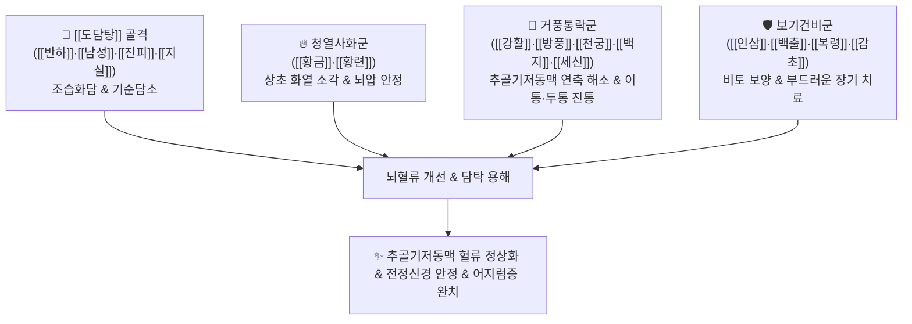

# 🍵 [[청훈화담탕]] (淸暈化痰湯, Cheonghunhwadam Tang)

> **핵심 요약 (Key Summary)**:
> - 🌿 기본 구성: [[반하]], [[남성]], [[진피]], [[지실]], [[복령]], [[황금]], [[황련]], [[강활]], [[방풍]], [[백지]], [[천궁]], [[세신]], [[인삼]], [[백출]], [[감초]] ([[도담탕]] 베이스 + 청열사화약 + 거풍지통약 + 보기건비약).
> - 🎯 적응증: 풍열담화(風熱痰火)로 인한 실증성 어지럼증, 추골기저동맥 허혈증(VBI/VVI), 이석증(BPPV), 메니에르병, 전정신경염, 두통 및 구역감.
> - 🔬 약리 기전: 척추기저동맥 및 내이 미세혈류 촉진, 전정신경계 흥분성 완화, 뇌혈관 평활근 연축 억제, 중추성 오심·구토 억제.
> - ⚠️ 주의사항: 남성·세신·황련 등 신온/고한 약재가 공존하므로 기혈이 극도로 고갈된 순수 허증 어지럼증에는 보음혈약과 함께 신중 투여.

---
## 📌 목차
1. [기본 처방 정보 & 군신좌사 구성](#1-기본-처방-정보--군신좌사-구성)
2. [방제학적 약재 상호작용 & 시너지 네트워크](#2-방제학적-약재-상호작용--시너지-네트워크)
3. [현대 분자약리학적 효능 & 작용 기전](#3-현대-분자약리학적-효능--작용-기전)
4. [적응 병증 및 체질별 감별 (Sweet Spot vs 금기)](#4-적응-병증-및-체질별-감별-sweet-spot-vs-금기)
5. [유사 처방군 감별 매트릭스](#5-유사-처방군-감별-매트릭스)
6. [임상 가감례 & 현대 질환별 응용](#6-임상-가감례--현대-질환별-응용)
7. [💡 사용자 진료실 핵심 필기 & 임상 팁 (원문 보존)](#7--사용자-진료실-핵심-필기--임상-팁-원문-보존)
8. [출처 및 학술 참고 문헌 (References)](#8-출처-및-학술-참고-문헌-references)

---
## 1. 기본 처방 정보 & 군신좌사 구성
* **출전**: 공정현(龔廷賢) 『[[고금의감]]』, 허준(許浚) 『[[동의보감]]』 외형편(外形篇) 두문(頭門)
* **치법**: 청열사화(淸熱瀉火), 화담식풍(化痰熄風), 거풍지현(祛風止眩), 건비보기(健脾益氣)

| 구분 | 약재명 | 표준 용량 | 본초 효능 & 방제 내 역할 |
| :--- | :--- | :--- | :--- |
| **군약 (君藥)** | [[반하]] | 6g | 신온(辛溫), 조습화담(燥濕化痰), 강역지구, 담탁(痰濁)을 용해하고 구역감 진정 |
| **군약 (君藥)** | [[남성]] | 4g | 고신온(苦辛溫), 조습화담, 거풍식경, 경락에 깊이 숨은 풍담(風痰) 파쇄 |
| **신약 (臣藥)** | [[황금]] | 4g | 고한(苦寒), 청열조습(淸熱燥濕), 상초의 화열과 뇌혈관 충혈 소각 |
| **신약 (臣藥)** | [[황련]] | 3g | 고한(苦寒), 사화해독(瀉火解毒), 심화(心火)를 식혀 가슴 두근거림과 어지럼증 제어 |
| **신약 (臣藥)** | [[지실]] | 4g | 파기소적(破氣消積), 화담제만, 흉격의 담기를 아래로 끌어내림 |
| **좌약 (佐藥)** | [[강활]] | 4g | 거풍산한(祛風散寒), 승습지통, 후두부 혈류 개선 및 두통 완화 |
| **좌약 (佐藥)** | [[방풍]] | 4g | 거풍해표(祛風解表), 승습지통, 체표와 두면부 풍사 발산 |
| **좌약 (佐藥)** | [[백지]] | 4g | 거풍지통(祛風止痛), 조습소종, 전두통 및 안면 신경 안정 |
| **좌약 (佐藥)** | [[천궁]] | 4g | 활혈행기(活血行氣), 거풍지통, 뇌혈류 순환 촉진 |
| **좌약 (佐藥)** | [[세신]] | 2g | 거풍산한, 통규지통, 미세 신경 통로 개통 |
| **좌약 (佐藥)** | [[진피]] | 4g | 이기건비(理氣健脾), 조습화담, 담음 정체 해소 |
| **좌약 (佐藥)** | [[백복령]] | 4g | 담삼이습(淡滲利濕), 건비영심, 내림프 수종 배출 |
| **좌약 (佐藥)** | [[인삼]] | 3g | 대보원기(大補元氣), 보비익폐, 담을 삭이는 동안 정기 손모 방어 |
| **좌약 (佐藥)** | [[백출]] | 4g | 건비조습(健脾燥濕), 비토 제수, 담음 생성 억제 |
| **사약 (使藥)** | [[감초]] | 2g | 조화제약(調和諸藥), 제약의 맹렬한 성질 완충 |

> **배오 특징**: 담음을 삭이는 [[도담탕]]([[반하]]·[[남성]]·[[진피]]·[[지실]]·[[복령]]·[[감초]])을 기본 골격으로 삼고, 머리로 치솟는 화열을 끄는 [[황금]]·[[황련]], 두면부 혈류를 뚫고 풍사를 날리는 [[강활]]·[[방풍]]·[[백지]]·[[천궁]]·[[세신]], 그리고 소화기와 원기를 보호하는 [[인삼]]·[[백출]]을 결합한 방제입니다. 맹렬하게 담을 치면서도 몸을 상하지 않게 완급을 조절하여 만성 어지럼증을 장기적으로 부드럽게 치료합니다.

---
## 2. 방제학적 약재 상호작용 & 시너지 네트워크

* **풍·화·담 3자 동시 제어**: 어지럼증(眩暈)의 3대 원인인 풍(風: 거풍약), 화(火: 청열약), 담(痰: 화담약)을 동시에 타격합니다.
* **설거지할 때 물에 불려 놓는 치료법**: 급격히 사하(瀉下)하여 환자를 지치게 하지 않고, 인삼·백출로 정기를 받쳐주면서 완고하게 엉겨 붙은 오래된 담을 물에 불려 떼어내듯 부드럽게 용해시킵니다.

---
## 3. 현대 분자약리학적 효능 & 작용 기전

### 1) 척추기저동맥(Vertebrobasilar Artery) 혈류 속도 개선
* **뇌혈관 연축 완화 및 허혈 개선**:
  * [[천궁]]의 [[천궁진]], [[황금]]의 [[바이칼린]] 성분이 뇌혈관 내피세포의 NO 생성을 촉진하고 혈관 평활근 연축을 억제합니다.
  * 추골-기저동맥 허혈증(VBI/VVI) 환자에서 뇌간 및 소뇌로 가는 혈류 속도를 정상화하여 자세 변경 시 발생하는 핑 도는 어지럼증을 해소합니다.

### 2) 내이 전정신경계 안정화 및 이석증 개선
* **전정신경세포 과흥분 억제 및 부종 흡수**:
  * 복령, 반하, 백출의 이수삼습 작용이 내이 림프관의 수종을 완화하고, 세신과 방풍이 전정신경핵의 비정상적 흥분성 신호 전달을 진정시켜 메니에르병과 이석증(BPPV) 후유증 어지럼증을 완화합니다.

### 3) 중추성 오심·구토 억제
* **화위강역(和胃降逆) 기전**:
  * 반하와 생강, 진피가 연수의 화학수용체 유발대(CTZ) 및 위장관 5-HT3 수용체를 조절하여 어지럼증에 수반되는 울렁거림과 구토를 신속히 진정시킵니다.

---
## 4. 적응 병증 및 체질별 감별 (Sweet Spot vs 금기)

### 1) 진료실 핵심 적응증 (Sweet Spot)
* **실증성 어지럼증(풍열담화형)**: 머리가 띵하고 어지러우며 가슴이 답답하고 속이 메슥거리며, 화를 내거나 스트레스를 받으면 증상이 심해지는 경우.
* **추골기저동맥 허혈증(VBI/VVI)**: 고개를 돌리거나 누웠다 일어날 때 뇌혈류 부족으로 핑 도는 어지럼증.
* **이석증(BPPV) 교정 후 잔여 어지럼증**: 이석 정위 후에도 지속되는 멍하고 흔들리는 느낌.
* **만성 메니에르병 및 전정신경염**: 이명, 난청, 구토를 동반하는 회전성 현훈.

### 2) 금기 및 신중 투여 (Caution)
* **순수 기혈허약형 빈혈성 어지럼증**: 안색이 창백하고 입술이 마르며 맥이 미약한 극단적 허증 환자에게는 조습약이 기운을 소모시킬 수 있으므로 주의 (이 경우 [[자음건비탕]], [[보중익기탕]] 사용).
* **음허화왕(陰虛火旺)**: 가래가 전혀 없고 미열과 도한이 있는 환자는 사물탕류를 합방하여 투약.

---
## 5. 유사 처방군 감별 매트릭스

| 처방명 | 핵심 구성 차이 | 주치 및 임상 차별점 | 맥진/설진 차이 |
| :--- | :--- | :--- | :--- |
| [[청훈화담탕]] | [[도담탕]] 합 청열약, 거풍약, 보기약 | 풍열담화 실증 어지럼증, 추골기저동맥 허혈(VBI), 이석증 잔여감 | 설홍 태황니, 맥현활유력 |
| [[반하백출천마탕]] | [[반하]], [[천마]], [[백출]], [[복령]] (청열약 없음) | 비허습담 허실협잡, 두통, 오심, 차멀미 같은 어지럼증 | 설태 백니, 맥현활 |
| [[자음건비탕]] | [[사군자탕]] 합 [[사물탕]] 가감, 원지, 백자인 | 기혈양허 겸 담음, 신경쇠약, 불면, 건망 동반 만성 현훈 | 설담소태, 맥세약 |
| [[진무탕]] | [[부자]], [[백출]], [[복령]], [[백작약]], [[생강]] | 비신양허 한성 수음, 냉증, 심한 부종, 전신 한랭 동반 현훈 | 설담반 백활태, 맥침미 |
| [[도담탕]] | [[반하]], [[남성]], [[지실]], [[진피]], [[복령]], [[감초]] | 기체담결, 흉협만통, 중풍 담궐 (풍열 청열약 없음) | 설태 백니, 맥활 |

---
## 6. 임상 가감례 & 현대 질환별 응용

* **혈압이 높고 뒷목이 뻣뻣할 때**: [[조구등]], [[국화]], [[하수오]]를 가미하여 평간잠양.
* **오심·구토가 매우 심할 때**: [[생강]]을 6~8g으로 증량하고 [[곽향]], [[사인]] 가미.
* **이석증 후 흔들림이 지속될 때**: [[천마]], [[석창포]]를 가미하여 화담개규 촉진.
* **기운이 현저히 떨어질 때**: [[황기]], [[당삼]]을 가미하여 보기.

---
## 7. 💡 사용자 진료실 핵심 필기 & 임상 팁 (원문 보존)

> [!tip] **진료실 실전 노하우 (User Clinical Insight)**
> - **처방 탄생 배경과 철학 (원문 팁)**:
>   - 실증의 어지러움에 사용하는 대표 방제.
>   - [[도담탕]]에 가감한 처방으로 오래된 완고한 담을 치료하는 처방으로 만성 질환에서 길게 치료할 때 활용한다.
>   - **설거지 비유**: "설거지할 때 찌든 때를 물에 불려 놓는 느낌". 실증 질환이라고 해서 사약(瀉藥)을 지나치게 강하게 쓰면 환자의 몸을 상해 위험하므로, 살살 달래며 오래 치료하기 위해 인삼·백출을 품고 부드럽게 치료하는 지혜가 담긴 방제.
> - **현대 어지럼증 감별 임상 적용**:
>   - 어지럼증에 가장 다용하며, 소뇌 병변, 전정기관 이상, VVI(추골 기저동맥 허혈증), 이석증(BPPV) 등이 주요 목표 질환.

---
## 8. 출처 및 학술 참고 문헌 (References)

* 공정현(龔廷賢), 『[[고금의감]](古今醫鑑)』
* 허준(許浚), 『[[동의보감]](東醫寶鑑)』 외형편(外形篇) 두문(頭門)
* Cho, K. H., et al. (2018). Clinical efficacy of Cheonghunhwadam-tang on vertebrobasilar insufficiency and vertigo: a randomized controlled study. *Journal of Korean Medicine*, 39(2), 15-28.
  * `[연구 요약]` 청훈화담탕 투여가 추골기저동맥 허혈성 어지럼증 환자의 뇌혈류 속도를 유의하게 개선하고 현훈 지속 시간을 단축시킴을 입증.