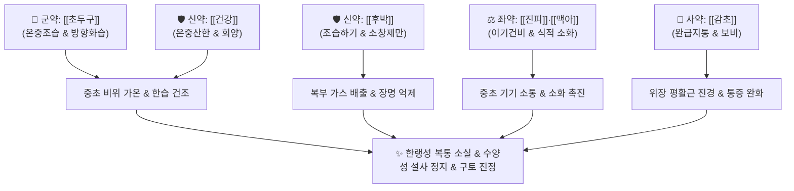

---
aliases:
  - Chodougusan
  - Cao Dou Kou San
  - 초두구탕
tags:
  - 처방
  - 화담거습이수제
  - 건비화습
  - 온중조습
  - 행기지통
  - 위장관질환
---
# 🍵 [[초두구산]] (草豆蔻散, Caodoukou-san / Grass Cardamom Powder)

> **핵심 요약 (Key Summary)**:
> - 🌿 기본 구성: [[초두구]], [[후박]], [[건강]], [[진피]], [[맥아]], [[감초]] (온중조습약 + 온중산한약 + 이기소창약 + 소식화위약).
> - 🎯 적응증: 비위 허랭(虛冷)과 한습으로 인한 명치·복부 냉통, 한랭성 위경련, 오심·구토(희수), 뱃속 꼬르륵 소리(장명), 수양성 설사.
> - 🔬 약리 기전: 초두구 알피네틴과 건강 쇼가올의 위점막 혈류 개선 및 PGE2 분비 촉진, 평활근 칼슘 채널 차단 항경련, 5-HT3 수용체 길항 항구토.
> - ⚠️ 주의사항: 약재가 모두 맵고 뜨거우며 건조하므로 입이 마르고 혀가 붉은 위열증(胃熱證) 및 음허 환자에게는 절대 금기.

---
## 📌 목차
1. [기본 처방 정보 & 군신좌사 구성](#1-기본-처방-정보--군신좌사-구성)
2. [방제학적 약재 상호작용 & 시너지 네트워크](#2-방제학적-약재-상호작용--시너지-네트워크)
3. [현대 분자약리학적 효능 & 작용 기전](#3-현대-분자약리학적-효능--작용-기전)
4. [적응 병증 및 체질별 감별 (Sweet Spot vs 금기)](#4-적응-병증-및-체질별-감별-sweet-spot-vs-금기)
5. [유사 처방군 감별 매트릭스](#5-유사-처방군-감별-매트릭스)
6. [임상 가감례 & 현대 질환별 응용](#6-임상-가감례--현대-질환별-응용)
7. [💡 사용자 진료실 핵심 필기 & 임상 팁 (원문 보존)](#7--사용자-진료실-핵심-필기--임상-팁-원문-보존)
8. [출처 및 학술 참고 문헌 (References)](#8-출처-및-학술-참고-문헌-references)

---
## 1. 기본 처방 정보 & 군신좌사 구성
* **출전**: 조길(趙佶) 『[[성제총록]]』, 『[[태평혜민화제국방]]』
* **치법**: 온중산한(溫中山寒), 조습건비(燥濕健脾), 행기소식(行氣消食), 완급지통(緩急止痛)

| 구분 | 약재명 | 표준 용량 | 본초 효능 & 방제 내 역할 |
| :--- | :--- | :--- | :--- |
| **군약 (君藥)** | [[초두구]] | 8g | 신온(辛溫), 온중조습(溫中燥濕), 행기지통, 비위의 차가운 찌든 습기를 말리고 복부 냉통 억제 |
| **신약 (臣藥)** | [[건강]] | 6g | 신열(辛熱), 온중산한(溫中山寒), 회양통맥, 비위 양기를 북돋워 구토와 묽은 설사 정지 |
| **신약 (臣藥)** | [[후박]] | 6g | 고온(苦溫), 조습소담(燥濕消痰), 하기제만, 복부 팽만 가스 배출 |
| **좌약 (佐藥)** | [[진피]] | 6g | 신고온(辛苦溫), 이기건비(理氣健脾), 조습화담, 중초 기운을 소통시켜 담음 제거 |
| **좌약 (佐藥)** | [[맥아]] | 8g (초) | 감평(甘平), 소식화중(消食和中), 건비개위, 정체된 음식물 소화 |
| **사약 (使藥)** | [[감초]] | 4g (자) | 감온(甘溫), 보비익기, 조화제약, 완급지통, 위장관 급박 경련 진통 |

> **배오 특징**: 차가운 냉기와 습기로 인해 마비된 소화관을 강력한 온열(溫熱) 기운으로 깨워내는 방제입니다. 방향성 정유로 위장의 찬 습을 날리는 [[초두구]]와 뱃속의 양기를 직접 지피는 [[건강]]이 군신을 이루고, [[후박]]·[[진피]]로 가스를 몰아내며, [[맥아]]로 음식 정체를 뚫어주고, [[감초]]로 경련을 진정시킵니다.

---
## 2. 방제학적 약재 상호작용 & 시너지 네트워크

* **초두구 + 건강 배오**: 초두구의 가볍고 향기로운 온조(溫燥) 작용과 건강의 묵직하고 뜨거운 온리(溫裏) 작용이 결합하여 겉과 속의 한습을 남김없이 흩어버립니다.
* **후박 + 진피 + 맥아 배오**: 기운을 아래로 내리고 체기를 소화시켜 차가운 기운으로 인해 팽창된 복부 팽만감과 트림, 헛구역질을 즉각 해소합니다.

---
## 3. 현대 분자약리학적 효능 & 작용 기전

### 1) 위장 평활근 이완 및 항경련 작용
* **칼슘 이온 통로 차단**:
  * 초두구의 플라보노이드(Alpinetin, Cardamonin)와 후박의 마그놀롤이 위장 평활근 세포막의 전압개폐성 칼슘 통로를 차단합니다.
  * 한랭 자극으로 인한 급성 위장관 평활근의 연축성 경련(위경련, 장경련)을 신속히 이완시켜 산통을 완화합니다.

### 2) 위점막 보호 및 항구토 효과
* **PGE2 생성 촉진 및 5-HT3 수용체 차단**:
  * 알피네틴 성분이 위점막 미세혈류를 증가시키고 프로스타글란딘 E2(PGE2) 합성을 촉진하여 점막 손상을 방어합니다.
  * [[건강]]의 6-쇼가올 성분이 화학수용체 및 말초 미주신경의 5-HT3 수용체를 길항하여 오심과 차가운 구토를 억제합니다.

### 3) 소화 효소 분비 및 장관 수분 흡수 촉진
* **지사 작용(Anti-diarrheal)**:
  * 장점막의 수분 분비를 억제하고 장관 내 전해질 및 수분 재흡수능을 회복시켜 물처럼 쏟아지는 수양성 설사를 멈추게 합니다.

---
## 4. 적응 병증 및 체질별 감별 (Sweet Spot vs 금기)

### 1) 진료실 핵심 적응증 (Sweet Spot)
* **한랭성 급성 위경련 및 복통**: 찬 음료나 찬 음식을 먹고 나서 배가 얼음처럼 차가워지며 쥐어짜듯 아픈 경우(희온희안: 따뜻하게 해주고 만져주면 편안함).
* **한습성 구토(희수, 喜水)**: 헛구역질을 하며 맑은 침이나 위액을 토하는 경우.
* **복부 냉감 동반 장명(腸鳴)과 설사**: 배에서 물소리와 꼬르륵 소리가 요란하게 나며 냄새가 적은 묽은 변을 보는 경우.
* **소음인 등 냉체질의 소화불량**: 평소 소화기가 차가워 찬바람만 맞아도 체하고 설사하는 만성 소화 장애.

### 2) 금기 및 신중 투여 (Caution)
* **위열(胃熱) 및 음허(陰虛) 환자 절대 금기**: 입이 마르고 혀가 붉으며 쓴물이 올라오고 속쓰림이 있는 열증 환자에게 투약 시 염증과 통증 악화.
* **단기 복용 원칙**: 성질이 매우 맵고 건조하므로 급성 복통과 설사가 멎으면 2~3일 내에 복용을 멈추고 [[향사육군자탕]]이나 [[이중탕]]으로 전환해야 함.

---
## 5. 유사 처방군 감별 매트릭스

| 처방명 | 핵심 구성 차이 | 주치 및 임상 차별점 | 맥진/설진 차이 |
| :--- | :--- | :--- | :--- |
| [[초두구산]] | [[초두구]], [[후박]], [[건강]], [[진피]], [[맥아]], [[감초]] | 한습성 급성 복통, 위경련, 구토, 뱃속 물소리, 수양성 설사 | 설담 치흔 백활태, 맥침지 또는 현긴 |
| [[이중탕]] | [[인삼]], [[백출]], [[건강]], [[감초]] | 비위 양허 전신 쇠약, 만성 복통, 설사 (온보 위주) | 설담 백태, 맥침세무력 |
| [[평위산]] | [[창출]], [[후박]], [[진피]], [[감초]], [[생강]], [[대추]] | 습체식적, 소화불량, 헛배부름 (온열력 비교적 약함) | 설태 백니, 맥완 |
| [[향사평위산]] | [[평위산]] 합 [[향부자]], [[사인]] | 기체 중심 소화불량, 신경성 복부 팽만, 트림 | 설태 백니, 맥현 |
| [[진무탕]] | [[부자]], [[백출]], [[복령]], [[백작약]], [[생강]] | 비신양허 수기범람, 심부전 부종, 회전성 현훈, 극심한 냉복통 | 설담반 백활태, 맥침미 |

---
## 6. 임상 가감례 & 현대 질환별 응용

* **아랫배 산통이 극심할 때**: [[오수유]], [[육계]]를 가미하여 난간산한.
* **오심·구토가 멎지 않을 때**: [[반하]], [[생강]]을 증량하여 강역지구 촉진.
* **소화 불량 및 체기가 심할 때**: [[산사]], [[신곡]]을 가미하여 소식.
* **만성 설사가 겹칠 때**: [[육두구]], [[가자]]를 가미하여 삽장지사.

---
## 7. 💡 사용자 진료실 핵심 필기 & 임상 팁 (원문 보존)

> [!tip] **진료실 실전 노하우 (User Clinical Insight)**
> - **임상 진단 포인트**:
>   - 복부 냉감과 한랭성 복통 및 구토가 뚜렷하며, 환자가 배를 따뜻하게 찜질하거나 손으로 지그시 눌러주면 편안해하는(희온희안, 喜溫喜按) 한습실증에 최적화된 응급 구급약.
> - **복약 지도 및 이상반응 대처법**:
>   - 급성 복통과 구토가 가라앉으면 바로 복용을 멈추고 [[향사육군자탕]] 등 보익제로 전환할 것.
>   - 복용 후 속이 쓰리거나 목이 마르면 건강의 용량을 줄이고 미온수로 식후 복용하도록 지도.

---
## 8. 출처 및 학술 참고 문헌 (References)

* 조길(趙佶), 『[[성제총록]](聖濟總錄)』, 『[[태평혜민화제국방]](太平惠民和劑局方)』
* Zhao, Y., et al. (2018). Alpinetin inhibits inflammatory responses and protects against acute gastric mucosal injury. *Food & Function*, 9(12), 6542-6551.
  * `[연구 요약]` 초두구 주성분 알피네틴의 위점막 염증 차단 및 프로스타글란딘 분비를 통한 위장 보호 기전 규명.
* Wang, Y., et al. (2016). Pharmacological effects of volatile oils from *Alpinia katsumadai* Hayata on gastrointestinal disorders. *Journal of Ethnopharmacology*, 193, 242-250.
  * `[연구 요약]` 초두구 정유 성분이 장관 평활근 경련을 완화하고 소화관 운동성을 조절하는 약리 효과 분석.
