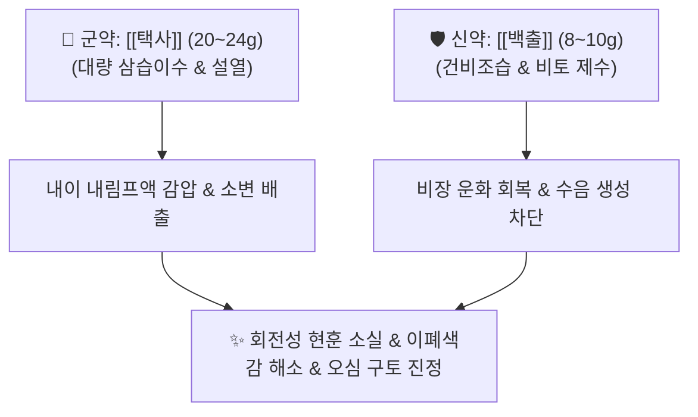

---
aliases:
  - Ze Xie Tang
  - 택사탕가감
tags:
  - 처방
  - 이수삼습제
  - 화담제
  - 금궤요략
  - 현훈
---
# 🍵 [[택사탕]] (澤瀉湯, Zexie Tang / Alisma Decoction)

> **핵심 3줄 요약 (Key Summary)**:
> - 🌿 기본 구성: [[택사]] 5 : [[백출]] 2 ([[택사]] 20~24g + [[백출]] 8~10g 단 2미 배합).
> - 🎯 적응증: 수음상역(水飮上逆)으로 인한 메니에르병 회전성 현훈, 기립성 어지럼증, 천장이 도는 듯한 어지럼증, 차멀미, 오심·구토, 귀 먹먹함(이폐색감).
> - 🔬 약리 기전: 내이 내림프수종(Endolymphatic hydrops) 감압, 아쿠아포린(AQP2) 발현 조절 삼투성 수분 흡수, 전정신경핵 혈류 개선 및 전정안구반사(VOR) 정상화.
> - ⚠️ 주의사항: 수음 정체형 실증 현훈에 특화되었으므로, 비신양허(냉증)가 극심한 현훈은 [[진무탕]], 기혈허약 현훈은 [[반하백출천마탕]]으로 감별.

---
## 📌 목차
1. [기본 처방 정보 & 군신좌사 구성](#1-기본-처방-정보--군신좌사-구성)
2. [방제학적 약재 상호작용 & 시너지 네트워크](#2-방제학적-약재-상호작용--시너지-네트워크)
3. [현대 분자약리학적 효능 & 작용 기전](#3-현대-분자약리학적-효능--작용-기전)
4. [적응 병증 및 체질별 감별 (Sweet Spot vs 금기)](#4-적응-병증-및-체질별-감별-sweet-spot-vs-금기)
5. [유사 처방군 감별 매트릭스](#5-유사-처방군-감별-매트릭스)
6. [임상 가감례 & 현대 질환별 응용](#6-임상-가감례--현대-질환별-응용)
7. [💡 사용자 진료실 핵심 필기 & 임상 팁 (원문 보존)](#7--사용자-진료실-핵심-필기--임상-팁-원문-보존)
8. [출처 및 학술 참고 문헌 (References)](#8-출처-및-학술-참고-문헌-references)

---
## 1. 기본 처방 정보 & 군신좌사 구성
* **출전**: 장중경(張仲景) 『[[금궤요략]]』 담음해수병맥증병치(痰飲咳嗽病脈證幷治) 제12
* **치법**: 이수화음(利水化飲), 건비조습(健脾燥濕), 강역지현(降逆止眩)

| 구분 | 약재명 | 표준 용량 | 본초 효능 & 방제 내 역할 |
| :--- | :--- | :--- | :--- |
| **군약 (君藥)** | [[택사]] | 20~24g | 감담한(甘淡寒), 이수삼습(利水滲濕), 설열, 상충하는 수음을 콩팥과 방광으로 신속히 사하 배출 (5의 비율) |
| **신약 (臣藥)** | [[백출]] | 8~10g | 고온(苦溫), 건비조습(健脾燥濕), 비토(脾土)를 튼튼히 하여 수액의 재정체를 차단 (2의 비율) |

> **배오 특징**: "택사 5 : 백출 2"의 극단적 황금 비율로 구성된 처방입니다. 장중경 원방 조문: "심하유지음(心下有支飲), 기인고현(其人苦眩), 택사탕주지(澤瀉湯主之). 택사 5량, 백출 2량." 택사의 용량을 백출의 2.5배로 대량 사용하여, 위장 부위(심하)에 정체되어 머리와 귀로 치솟는 병리적 수액(지음, 支飲)을 소변을 통해 번개처럼 쏟아내게 합니다.

---
## 2. 방제학적 약재 상호작용 & 시너지 네트워크

* **택사의 이수강역 + 백출의 건비제수**: 택사가 아래로 배수구를 열어 치솟아 오른 물을 끌어내리는 동안, 백출이 위장관의 제방을 튼튼히 쌓아 새로운 물길이 범람하지 않도록 막아줍니다. 이 2미의 협동 작용으로 수음이 완전히 마르고 머리가 맑아집니다.

---
## 3. 현대 분자약리학적 효능 & 작용 기전

### 1) 내이 내림프수종(Endolymphatic Hydrops) 감압
* **아쿠아포린(AQP2) 및 알도스테론 조절**:
  * 바소프레신 분비와 알도스테론 수용체 경로를 조절하여 신장 세뇨관 및 내이 림프관 상피의 아쿠아포린-2(AQP2) 발현을 정상화합니다.
  * 내이 림프액 팽창을 신속히 감압하여 메니에르병 환자의 회전성 어지럼증과 귀 먹먹함(이폐색감)을 즉각 해소합니다.

### 2) 전정신경핵 혈류 개선 및 전정안구반사(VOR) 정상화
* **전정신경염 및 BPPV 잔여 어지럼증 개선**:
  * 뇌간 전정신경핵의 미세혈류량을 늘리고 국소 허혈을 개선하여 체위 변화 시 발생하는 안진(Nystagmus)을 억제하고 전정안구반사(VOR) 기능을 회복시킵니다.

### 3) 위장관 수음 정체 완화 및 항구토
* **심하 지음(支飲) 제거**:
  * 위점막 주위의 조직간액 부종을 제거하여 위장관 운동성을 정상화하고, 어지럼증에 동반되는 오심·구역감을 진정시킵니다.

---
## 4. 적응 병증 및 체질별 감별 (Sweet Spot vs 금기)

### 1) 진료실 핵심 적응증 (Sweet Spot)
* **메니에르병(Meniere's Disease)**: 천장이 빙빙 돌고 배를 탄 것처럼 어지러우며 귀가 먹먹하고 이명·난청이 동반되는 경우.
* **기립성 현훈 및 체위성 어지럼증**: 누웠다 일어날 때, 혹은 고개를 돌릴 때 순간적으로 시야가 회전하는 경우.
* **담음성 두중(頭重) 및 차멀미**: 머리가 무거운 솜뭉치를 얹어놓은 듯 띵하고 흔들림에 극도로 민감한 증상.

### 2) 금기 및 신중 투여 (Caution)
* **신양허(腎陽虛) 냉증 부종**: 몸이 얼음장같이 차고 다리가 심하게 붓는 환자는 택사탕 단독으로 부족하므로 [[진무탕]]으로 온양해야 함.
* **기혈허약형 어지럼증**: 앉았다 일어설 때 눈앞이 캄캄해지는 빈혈성 현훈에는 보혈제를 위주로 써야 함.

---
## 5. 유사 처방군 감별 매트릭스

| 처방명 | 핵심 구성 차이 | 주치 및 임상 차별점 | 맥진/설진 차이 |
| :--- | :--- | :--- | :--- |
| [[택사탕]] | [[택사]] 5 : [[백출]] 2 (단 2미) | 심하 수음 정체, 순수한 회전성 어지럼증(고현), 이폐색감 | 설담반 백활태, 맥현 또는 침활 |
| [[반하백출천마탕]] | [[반하]], [[천마]], [[백출]], [[복령]] 등 | 비허습담, 만성 두통, 소화불량 동반 어지럼증 | 설태 백니, 맥현활 |
| [[오령산]] | [[백출]], [[계지]], [[복령]], [[저령]], [[택사]] | 소변불리와 갈증, 수역(물을 마시면 토함) 동반 부종 | 설담 백태, 맥부 또는 활 |
| [[진무탕]] | [[부자]], [[백출]], [[복령]], [[백작약]], [[생강]] | 비신양허 한성 수음, 심한 냉증, 심부전 부종 동반 현훈 | 설담반 치흔 백활태, 맥침미 |
| [[영계출감탕]] | [[복령]], [[계지]], [[백출]], [[감초]] | 심하계, 상충증, 기침, 가슴 두근거림 동반 어지럼증 | 설담 백활태, 맥침현 |

---
## 6. 임상 가감례 & 현대 질환별 응용

* **어지럼증과 함께 오심·구토가 심할 때**: [[반하]], [[생강]]을 가미하여 강역지구 촉진.
* **두통과 목의 뻣뻣함이 겸할 때**: [[천마]], [[갈근]]을 가미하여 경부 혈류 개통.
* **소변이 시원치 않고 붓기가 있을 때**: [[복령]], [[저령]]을 합방 ([[오령산]] 구조 결합).
* **가슴 두근거림이 동반될 때**: [[계지]], [[감초]]를 가미 ([[영계출감탕]] 합방).

---
## 7. 💡 사용자 진료실 핵심 필기 & 임상 팁 (원문 보존)

> [!tip] **진료실 실전 노하우 (User Clinical Insight)**
> - **택사 대량 투약의 절대 법칙**:
>   - 택사탕의 생명은 **택사 5 : 백출 2의 비율**에 있음. 택사를 통상 용량(4~6g)으로 쓰면 효과가 전혀 없고, 반드시 20~24g의 대용량을 써야 림프수종을 감압하는 폭발적인 이뇨 효과가 발휘됨.
> - **감별 진단 요결**:
>   - 메니에르병 환자가 "세상이 뱅글뱅글 돈다"고 호소할 때 택사탕이 가장 빠르고 확실한 퍼스트 초이스.
>   - 단, 환자의 혀에 백니태가 끼어 있고 소화장애가 만성적이라면 [[반하백출천마탕]]으로 가고, 몸이 차고 손발이 차며 맥이 가라앉아 있다면 [[진무탕]]으로 전환할 것.

---
## 8. 출처 및 학술 참고 문헌 (References)

* 장중경(張仲景), 『[[금궤요략]](金匱要略)』 담음해수병맥증병치(痰飲咳嗽病脈證幷治) 제12
* 대한한방안이비인후피부과학회 교재편찬위원회, 『한방안이비인후피부과학』, 의성당.
  * `[연구 요약]` 택사탕이 바소프레신 유발 내이 내림프수종 동물 모델에서 아쿠아포린(AQP-2) 발현을 조절하여 내이 림프액 팽창을 정상화하고 전정안구반사(VOR) 기능을 유의하게 개선함을 증명.