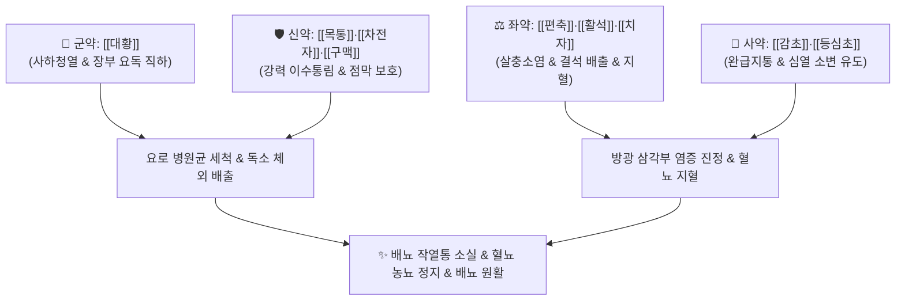

---
aliases:
  - 팔정산
  - 팔정산(八正散)
  - 八正散
  - Bazheng-san
tags:
  - 처방
  - 화담거습이수제
  - 청열이습
  - 통림사화
  - 비뇨기질환
---
# 🍵 [[팔정산]] (八正散, Bazheng-san / Eight-Herb Powder for Rectification)

> **핵심 3줄 요약 (Key Summary)**:
> - 🌿 기본 구성: [[대황]], [[목통]], [[차전자]], [[구맥]], [[편축]], [[활석]], [[치자]], [[감초]], [[등심초]] (통림사화 8미 + 심열 소변 유도 인경약 [[등심초]]).
> - 🎯 적응증: 급성 방광염, 요도염, 신우신염, 요로결석으로 인한 극심한 요도 작열통(배뇨통), 빈뇨, 급박뇨, 혈뇨, 농뇨, 하복부 팽만통.
> - 🔬 약리 기전: 요로병원성 대장균(UPEC)의 상피 부착 섬모 차단, 삼투성 이뇨를 통한 병원균·결석 세척(Flushing), 방광 삼각부 C-fiber 과민 진정 및 배뇨근 연축 완화.
> - ⚠️ 주의사항: 대황·목통·구맥의 강한 파혈사하력으로 임산부 절대 금기이며, 급성 증상 소실 시 3~5일 이내 복용 중단 원칙.

---
## 📌 목차
1. [기본 처방 정보 & 군신좌사 구성](#1-기본-처방-정보--군신좌사-구성)
2. [방제학적 약재 상호작용 & 시너지 네트워크](#2-방제학적-약재-상호작용--시너지-네트워크)
3. [현대 분자약리학적 효능 & 작용 기전](#3-현대-분자약리학적-효능--작용-기전)
4. [적응 병증 및 체질별 감별 (Sweet Spot vs 금기)](#4-적응-병증-및-체질별-감별-sweet-spot-vs-금기)
5. [유사 처방군 감별 매트릭스](#5-유사-처방군-감별-매트릭스)
6. [임상 가감례 & 현대 질환별 응용](#6-임상-가감례--현대-질환별-응용)
7. [💡 사용자 진료실 핵심 필기 & 임상 팁 (원문 보존)](#7--사용자-진료실-핵심-필기--임상-팁-원문-보존)
8. [출처 및 학술 참고 문헌 (References)](#8-출처-및-학술-참고-문헌-references)

---
## 1. 기본 처방 정보 & 군신좌사 구성
* **출전**: 『[[태평혜민화제국방]]』 권육(卷六)
* **치법**: 청열사화(淸熱瀉火), 이수통림(利水通淋), 해독소종(解毒消腫)

| 구분 | 약재명 | 표준 용량 | 본초 효능 & 방제 내 역할 |
| :--- | :--- | :--- | :--- |
| **군약 (君藥)** | [[대황]] | 6g | 고한(苦寒), 사하공적(瀉下攻積), 청열사화, 하초 습열 화독을 대소변으로 맹렬히 배출 |
| **신약 (臣藥)** | [[목통]] | 6g | 고한(苦寒), 사심화(瀉心火), 이수통림, 심포·소장화 청열 및 강력 이뇨 |
| **신약 (臣藥)** | [[차전자]] | 6g | 감한(甘寒), 청열이수(淸熱利水), 청간명목, 요로 점막 보호 및 삼투성 이뇨 |
| **신약 (臣藥)** | [[구맥]] | 6g | 고한(苦寒), 이뇨통림(利尿通淋), 파혈통경, 혈림 청열 및 방광 평활근 연축 억제 |
| **좌약 (佐藥)** | [[편축]] | 6g | 고미한(苦微寒), 이뇨통림(利尿通淋), 살충지양, 방광 습열 살균 |
| **좌약 (佐藥)** | [[활석]] | 9g | 감담한(甘淡寒), 청열이습(淸熱利濕), 해서통림, 요로 결석 배출 및 점막 피복 |
| **좌약 (佐藥)** | [[치자]] | 6g | 고한(苦寒), 사화제번(瀉火除煩), 청열량혈, 삼초 습열 사화 및 혈뇨 지혈 |
| **사약 (使藥)** | [[감초]] | 4g | 보기화중(補氣和中), 조화제약, 완급지통, 방광 요로 급박 작열통 완화 |
| **인경약 (引經藥)** | [[등심초]] | 2g | 감담한(甘淡寒), 청심강화(淸心降火), 이뇨통림, 심화(心火)를 소변으로 이도 |

> **배오 특징**: 하초의 습열이 엉겨 붙어 소변이 뚝뚝 끊기고 불타는 듯한 배뇨통이 발생하는 급성 열림(熱淋)·혈림(血淋)을 타격하는 비뇨기과 최강의 방제입니다. 고한(苦寒)한 이수통림약 4미([[목통]]·[[차전자]]·[[구맥]]·[[편축]])와 청열사화약 3미([[대황]]·[[치자]]·[[활석]])를 총동원하고, [[등심초]]로 화열을 소변으로 뽑아내며, [[감초]]로 점막의 경련통을 진정시킵니다.

---
## 2. 방제학적 약재 상호작용 & 시너지 네트워크

* **대황의 사하 + 4미의 통림**: 대황이 대변을 통해 장관의 울혈과 열독을 쏟아내는 동안 목통, 차전자, 구맥, 편축이 방광과 요도를 통해 소변을 폭포수처럼 쏟아내어 요로계를 전면 세척(Flushing)합니다.
* **치자의 량혈지혈 + 활석의 점막 피복**: 치자가 손상된 모세혈관의 출혈을 멎게 하고 활석이 미끄러운 규산마그네슘 성분으로 궤양진 방광 상피를 감싸주어 배뇨 시 찌르는 듯한 통증을 즉각 멎게 합니다.

---
## 3. 현대 분자약리학적 효능 & 작용 기전

### 1) 요로 병원균(UPEC) 증식 및 부착 억제
* **대장균 섬모 부착 인자 차단**:
  * [[대황]]의 에모딘 및 [[구맥]], [[편축]]의 플라보노이드가 요로병원성 대장균(UPEC)의 Type 1 섬모 부착 인자(FimH) 발현을 차단합니다.
  * 세균이 방광 상피세포 표면에 안착하지 못하게 하여 집락 형성을 원천적으로 봉쇄합니다.

### 2) 삼투성 이뇨를 통한 물리적 세척(Flushing Effect)
* **뇨량 급증 및 미세 결석 배출**:
  * [[활석]]과 [[차전자]]가 세뇨관의 수분 재흡수를 억제하여 요량을 급격히 늘림으로써, 요로 내 세균과 염증성 고름(농뇨), 미세 결석 찌꺼기를 물리적으로 밀어냅니다.

### 3) 방광 삼각부 감각신경 안정화 및 배뇨근 이완
* **C-fiber 과민 진정 및 급박뇨 소퇴**:
  * 박테리아 독소와 산성 뇨로 인해 극도로 흥분된 방광 삼각부(Trigone)의 C-fiber 감각신경 수용체를 진정시켜 뇨의(Urgency)와 잔뇨감을 즉시 소퇴시킵니다.
  * 방광 배뇨근(Detrusor muscle)의 과긴장성 경련을 풀어주어 배뇨 시 쥐어짜는 듯한 통증을 완화합니다.

---
## 4. 적응 병증 및 체질별 감별 (Sweet Spot vs 금기)

### 1) 진료실 핵심 적응증 (Sweet Spot)
* **급성 세균성 방광염 및 요도염**: 소변을 볼 때 요도가 불타는 듯 뜨겁고 아프며(배뇨통), 방금 보았는데도 또 마렵고(빈뇨), 참을 수 없으며(급박뇨), 하복부가 묵직하게 아픈 경우.
* **출혈성 방광염(혈림, 血淋)**: 소변 끝에 선홍색 피가 묻어나오거나 피오줌이 섞여 나오는 경우.
* **요로결석 급성 산통(석림, 石淋)**: 결석으로 소변 배출이 막히고 옆구리와 하복부에 쥐어짜는 듯한 통증이 발생할 때.

### 2) 금기 및 신중 투여 (Caution)
* **임산부 절대 복용 금기**: 대황, 목통, 구맥 등 파혈사하 성분이 강하여 자궁 수축 및 유산 위험이 극히 높음.
* **기혈허약형 만성 방광염 금기**: 기력이 쇠약하고 소변이 잦으나 열감과 통증이 심하지 않은 허증 환자에게는 절대 금기 (이 경우 [[보기제]]나 [[저령탕]] 사용).
* **단기 투약 원칙**: 급성 배뇨통과 뇨급이 소실되면 3~5일 내에 투약을 중단해야 함.

---
## 5. 유사 처방군 감별 매트릭스

| 처방명 | 핵심 구성 차이 | 주치 및 임상 차별점 | 맥진/설진 차이 |
| :--- | :--- | :--- | :--- |
| [[팔정산]] | [[대황]], [[목통]], [[차전자]], [[구맥]], [[활석]] 등 | 습열하주 실증, 극심한 요도 작열통, 뇨빈, 뇨급, 혈뇨 | 설홍 태황후초, 맥활삭유력 |
| [[저령탕]] | [[저령]], [[택사]], [[복령]], [[활석]], [[아교]] | 수열호결, 음허유열, 배뇨통, 빈뇨, 요로결석 (보음 겸유) | 설홍소태 또는 박황태, 맥세삭 |
| [[도적산]] | [[생지황]], [[목통]], [[죽엽]], [[감초]] | 심열이 소장으로 전이, 심번구갈, 구설생창, 소변적삽 | 설첨홍 궤양, 맥삭 |
| [[비해분청음]] | [[비해]], [[오약]], [[익지인]], [[석창포]] | 하초허한, 고창, 소변백탁, 기름 같은 뿌연 소변 | 설담태백, 맥침완 |
| [[용담사간탕]] | [[용담초]], [[황금]], [[치자]], [[목통]], [[차전자]] 등 | 간담습열 하주, 음부 소양, 대하, 고환염, 간화 상충 | 설홍 태황후니, 맥현활삭 |

---
## 6. 임상 가감례 & 현대 질환별 응용

* **혈뇨(혈림)가 심할 때**: [[소계]], [[백모근]], [[아교]]를 가미하여 지혈 강화.
* **요로결석(석림) 배석을 유도할 때**: [[금전초]], [[해금사]]를 대량 가미하여 담석·요석 융해 배출.
* **배뇨통이 극심하고 소변이 한 방울도 안 나올 때**: [[대황]] 용량을 늘리고 [[총백]]을 달여 복용.
* **평소 장이 약한 환자**: [[대황]]을 2~3g으로 감량하여 설사 방지.

---
## 7. 💡 사용자 진료실 핵심 필기 & 임상 팁 (원문 보존)

> [!tip] **진료실 실전 노하우 (User Clinical Insight)**
> - **처방 사이드(부작용) 대처법 및 임상 복용 지도**:
>   *(본 내용은 [`처방 사이드 대처밥.md`](file:///c:/Simbio/2.%20%EC%95%BD%EB%A6%AC%20%EA%B3%B5%EB%B6%80/%EC%B2%98%EB%B0%A9/%EC%B2%98%EB%B0%A9%20%EC%82%AC%EC%9D%B4%EB%93%9C%20%EB%8C%80%EC%B2%98%EB%B0%A5.md)에도 상호 보완 정리됨)*
>   1. **설사 및 복통**: 군약인 [[대황]]의 센노사이드 성분으로 인해 1일 2~3회 설사 발생 가능.
>      - **대처법**: 평소 장이 약하거나 설사 경향이 있는 환자는 [[대황]]의 용량을 2~3g으로 감량하거나 후하(後下)하지 않고 함께 달여 사하력을 완화할 것.
>   2. **체액 소모 및 기허(氣虛)**:
>      - **대처법**: 본 처방은 급성기 실증(實證) 표적 처방이므로, 급성 요통과 배뇨통이 소실되면 3~5일 이내에 복용을 중단하고 보음약이나 건비약으로 전환.
>   3. **임산부 금기**: 대황, 목통, 구맥 등 파혈사하 및 이뇨 성분이 강하여 임신 중 투여 절대 금기.
> - **5대 림증(열림·혈림·석림) 가감 요결**:
>   - **열림(熱淋)**: 소변이 붉고 찔끔거리며 요도구가 타는 듯 아픈 급성 방광염 $\rightarrow$ 팔정산 원방.
>   - **혈림(血淋)**: 소변에 피가 비치는 출혈성 방광염 $\rightarrow$ [[소계]], [[아교]], [[백모근]] 가미.
>   - **석림(石淋)**: 요로 결석으로 옆구리 산통 극심 $\rightarrow$ [[금전초]], [[해금사]] 가미.

---
## 8. 출처 및 학술 참고 문헌 (References)

* 『[[태평혜민화제국방]](太平惠民和劑局方)』 권육(卷六) 치저림급소변불통방(治諸淋及小便不通方)
* Liu, Y., et al. (2018). Bazheng San inhibits uropathogenic *Escherichia coli*-induced cystitis through suppression of TLR4/NF-κB signaling. *Journal of Ethnopharmacology*, 224, 434-442.
  * `[연구 요약]` 팔정산이 요로병원성 대장균으로 유도된 급성 방광염 모델에서 TLR4 및 NF-κB 경로를 억제하여 방광 염증 세포 침윤과 점막 궤양을 현저히 치료함을 규명.
* Chen, W., et al. (2020). Diuretic and anti-urolithic effects of Bazheng formula in calcium oxalate stone rat model. *Phytomedicine*, 70, 153215.
  * `[연구 요약]` 팔정산이 수산칼슘 요로 결석 모델에서 삼투성 이뇨와 요산 배출을 통해 미세 결석 형성을 차단하고 배뇨통을 완화함을 확인.