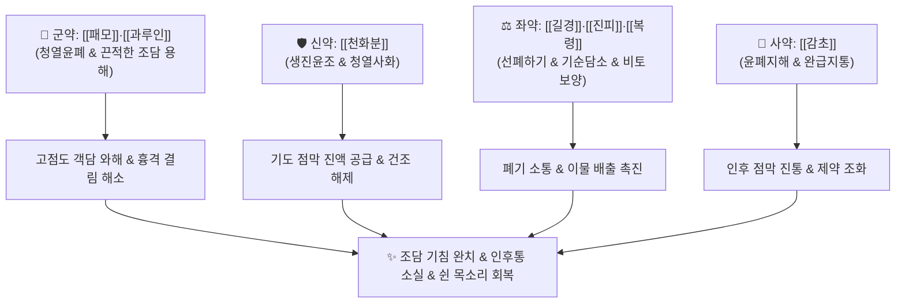

# 🍵 [[패모괄루산]] (貝母栝蔞散, Beimu Gualou San / Fritillaria and Trichosanthes Powder)

> **핵심 3줄 요약 (Key Summary)**:
> - 🌿 기본 구성: [[패모]], [[과루인]], [[천화분]], [[길경]], [[복령]], [[진피]], [[감초]] (윤폐화담 [[패모]]·[[과루인]] + 생진윤조 [[천화분]] + 선폐강기약).
> - 🎯 적응증: 폐조열(肺燥熱)로 인한 조담(燥痰) 기침, 끈적한 가래가 목에 딱 붙어 도무지 뱉어지지 않는 기침, 만성 기관지염, 인후 건조통, 목쉼(음아).
> - 🔬 약리 기전: 뮤신 단백질 이황화 결합 분해 및 객담 점도 저하, 기도 무스카린 M3 수용체 및 칼슘 유입 억제를 통한 기관지 평활근 진경, 기도 섬모 수송능 촉진.
> - ⚠️ 주의사항: 달고 촉촉한 윤폐약(潤肺藥)이므로 묽고 거품 많은 가래를 뱉는 한담(寒痰)·습담 환자에게는 금기.

---
## 📌 목차
1. [기본 처방 정보 & 군신좌사 구성](#1-기본-처방-정보--군신좌사-구성)
2. [방제학적 약재 상호작용 & 시너지 네트워크](#2-방제학적-약재-상호작용--시너지-네트워크)
3. [현대 분자약리학적 효능 & 작용 기전](#3-현대-분자약리학적-효능--작용-기전)
4. [적응 병증 및 체질별 감별 (Sweet Spot vs 금기)](#4-적응-병증-및-체질별-감별-sweet-spot-vs-금기)
5. [유사 처방군 감별 매트릭스](#5-유사-처방군-감별-매트릭스)
6. [임상 가감례 & 현대 질환별 응용](#6-임상-가감례--현대-질환별-응용)
7. [💡 사용자 진료실 핵심 필기 & 임상 팁 (원문 보존)](#7--사용자-진료실-핵심-필기--임상-팁-원문-보존)
8. [출처 및 학술 참고 문헌 (References)](#8-출처-및-학술-참고-문헌-references)

---
## 1. 기본 처방 정보 & 군신좌사 구성
* **출전**: 정국팽(程國彭) 『[[의학심오]]』
* **치법**: 윤폐청열(潤肺淸熱), 이기화담(理氣化痰), 지해평천(止咳平喘)

| 구분 | 약재명 | 표준 용량 | 본초 효능 & 방제 내 역할 |
| :--- | :--- | :--- | :--- |
| **군약 (君藥)** | [[패모]] | 6~9g | 고미한(苦微寒), 청열화담(淸熱化痰), 윤폐지해, 굳어버린 조담(燥痰)을 묽게 용해 |
| **군약 (君藥)** | [[과루인]] | 6~9g | 감한(甘寒), 청열화담, 윤장통변, 관흉산결, 끈적한 가래를 녹이고 흉통 완화 |
| **신약 (臣藥)** | [[천화분]] | 6~9g | 감미고한(甘微苦寒), 청열생진(淸熱生津), 소종배농, 바짝 마른 기도에 진액 공급 |
| **좌약 (佐藥)** | [[길경]] | 4~6g | 신미고평(辛微苦平), 선폐거담(宣肺祛痰), 이인배농, 폐기를 열어 약성을 상초로 유도 |
| **좌약 (佐藥)** | [[진피]] | 4~6g | 신고온(辛苦溫), 이기건비(理氣健脾), 조습화담, 기순즉담소(氣順則痰消) |
| **좌약 (佐藥)** | [[복령]] | 4~6g | 담삼이습(淡滲利濕), 건비영심, 담음 생성의 근원인 비토를 보양 |
| **사약 (使藥)** | [[감초]] | 2~3g | 감평(甘平), 윤폐지해, 조화제약, [[길경]]과 함께 인후 건조통 완화 |

> **배오 특징**: 습담(濕痰)에는 [[반하]]·[[남성]]처럼 맵고 마른(辛燥) 약을 쓰지만, 바짝 마른 조담(燥痰)에 조열한 약을 쓰면 폐 진액이 더욱 타들어갑니다. 패모괄루산은 달고 서늘하며 촉촉한(甘寒滋潤) [[패모]]·[[과루인]]·[[천화분]]을 사용하여, 메마른 기도 점막에 진액을 부어주어 풀처럼 딱 달라붙은 끈적한 가래를 물처럼 불려 녹여내는(潤燥化痰) 명방입니다.

---
## 2. 방제학적 약재 상호작용 & 시너지 네트워크

* **패모·과루인 + 천화분 배오**: 폐의 화열을 끄고 진액을 생성하여 기관지 벽에 딱지처럼 붙은 가래를 부드럽게 박리시킵니다.
* **길경 + 감초 배오**: [[길경탕]](桔梗湯) 구조가 내재되어 있어, 기침으로 헐고 아픈 인후 점막의 염증과 통증을 진정시킵니다.

---
## 3. 현대 분자약리학적 효능 & 작용 기전

### 1) 뮤신(Mucin) 이황화 결합 분해 및 객담 점도 저하
* **고점도 가래의 화학적 용해**:
  * [[과루인]]의 불포화지방산과 트리테르페노이드 사포닌 성분이 기도 점액 분비선의 장액 분비를 촉진하고, 객담 내 뮤신(MUC5AC) 고분자 결합을 와해시켜 점도를 낮춥니다.
  * [[패모]]의 프라디민 알칼로이드가 점액 수화(Hydration)를 촉진하여 가래 배출을 가속화합니다.

### 2) 기관지 평활근 연축 억제 및 진해 작용
* **무스카린 M3 수용체 및 칼슘 채널 차단**:
  * 패모의 주요 알칼로이드(Verticine, Verticinone)가 기관지 평활근의 무스카린 M3 수용체 과흥분을 억제하고 칼슘 유입을 차단하여 발작성 기도 경련을 이완시킵니다.

### 3) 기도 점막 섬모 수송능 회복 및 항염증
* **섬모 박동 빈도 촉진**:
  * 건조 손상으로 마비된 기관지 섬모 세포의 자가 청소능(Mucociliary Clearance)을 회복시키고, TNF-α, IL-6 등 염증성 매개체를 낮추어 인후 점막 부종을 가라앉힙니다.

---
## 4. 적응 병증 및 체질별 감별 (Sweet Spot vs 금기)

### 1) 진료실 핵심 적응증 (Sweet Spot)
* **폐조열 조담해수(燥痰咳嗽)**: 기침을 켁켁거리며 발작적으로 연거푸 하지만 가래가 목구멍에 딱 달라붙어 도무지 뱉어지지 않는 경우.
* **인후 건조 및 쉰 목소리(음아, 瘖啞)**: 목구멍이 불타는 듯 마르고 아프며 목소리가 잠기고 흉통이 동반되는 경우.
* **만성 건조성 기관지염 및 흡연자 마른기침**: 가을·겨울 환절기나 건조한 환경에서 심해지는 만성 기침.
* **백일해 회복기 잔여 기침**: 열은 내렸으나 마른기침과 끈적한 가래가 지속되는 상태.

### 2) 금기 및 신중 투여 (Caution)
* **한담(寒痰) 및 습담(濕痰) 환자 절대 금기**: 묽고 거품이 많은 맑은 가래가 줄줄 나오는 환자에게 투약 시 습을 조장하여 기침을 악화시킴 (이 경우 [[소청룡탕]]이나 [[이진탕]] 사용).
* **비위허한(脾胃虛寒) 설사 환자 신중**: 찬 성질의 윤폐약이 들어있어 평소 장이 차고 묽은 변을 자주 보는 환자는 복통이 발생할 수 있음.

---
## 5. 유사 처방군 감별 매트릭스

| 처방명 | 핵심 구성 차이 | 주치 및 임상 차별점 | 맥진/설진 차이 |
| :--- | :--- | :--- | :--- |
| [[패모괄루산]] | [[패모]], [[과루인]], [[천화분]], [[길경]] | 폐조열 조담, 말라붙은 가래, 뱉기 힘듦, 인후통, 목마름 | 설홍소진 태건황 또는 건소태, 맥세삭 |
| [[이진탕]] | [[반하]], [[진피]], [[복령]], [[감초]] | 비위습담, 묽고 다량의 가래, 메스꺼움, 가슴 답답함 | 설태 백니, 맥활 |
| [[청폐탕]] | [[생대감]] 베이스 합 청열윤폐거담약 16미 | 폐열담탁, 누렇고 끈적한 화농성 가래, COPD | 설태 황후니, 맥활삭 |
| [[맥문동탕]] | [[맥문동]], [[반하]], [[인삼]], [[갱미]], [[대추]], [[감초]] | 위음부족 기역, 가래 없는 발작성 마른기침, 인후 작열감 | 설홍 건조 무태, 맥허삭 |
| [[백합고금탕]] | [[백합]], [[생지황]], [[숙지황]], [[패모]], [[맥문동]] 등 | 신음부족 폐음허 각혈, 폐결핵성 조해, 도한, 조열 | 설홍소태 열문, 맥세삭 |

---
## 6. 임상 가감례 & 현대 질환별 응용

* **목구멍 통증이 심할 때**: [[현삼]], [[우방자]]를 가미하여 해독청인.
* **가래에 피가 조금 비칠 때**: [[백모근]], [[아교]], [[지유]]를 가미하여 지혈.
* **폐열이 심하여 가슴이 답답할 때**: [[황금]], [[지각]]을 가미하여 청폐관흉.
* **만성적인 마른기침에 음허가 겹칠 때**: [[사삼]], [[맥문동]]을 가미하여 자음윤폐 강화.

---
## 7. 💡 사용자 진료실 핵심 필기 & 임상 팁 (원문 보존)

> [!tip] **진료실 실전 노하우 (User Clinical Insight)**
> - **습담(濕痰)과 조담(燥痰)의 치료 차별성 (원문 요결)**:
>   - 습담에는 반하·남성처럼 맵고 마른(辛燥) 약으로 습을 말려야 하지만, **조담(말라붙은 가래)에 그런 약을 쓰면 폐 진액이 더 말라 기침이 심각하게 악화**됨.
>   - 패모괄루산은 패모, 과루인, 천화분의 달고 차가우며 촉촉한(甘寒滋潤) 약성으로 굳어버린 가래를 물처럼 녹여 배출시키는 윤폐청열의 전형.
> - **수반 증상별 실전 가감 팁**:
>   - 목구멍 통증이 심할 때: + [[현삼]], [[우방자]].
>   - 가래에 피가 조금 비칠 때: + [[백모근]], [[지유]].
>   - 폐열이 심하여 가슴이 답답할 때: + [[황금]], [[지각]].
> - **현대 질환 매핑**:
>   - 급만성 기관지염 조열기, 미세먼지 유발 기도 점막 건조증, 기관지확장증 점조담, 백일해 회복기 잔여 기침.

---
## 8. 출처 및 학술 참고 문헌 (References)

* 정국팽(程國彭), 『[[의학심오]](醫學心悟)』
* Shen, Y., et al. (2019). *Fritillaria* and *Trichosanthes* combination improves mucociliary clearance and attenuates airway inflammation in dry cough model. *Phytomedicine*, 62, 152960.
  * `[연구 요약]` 패모와 과루 배합의 기도 점액섬모 수송능 향상 및 기도 과민성 억제 분자 기전 입증.