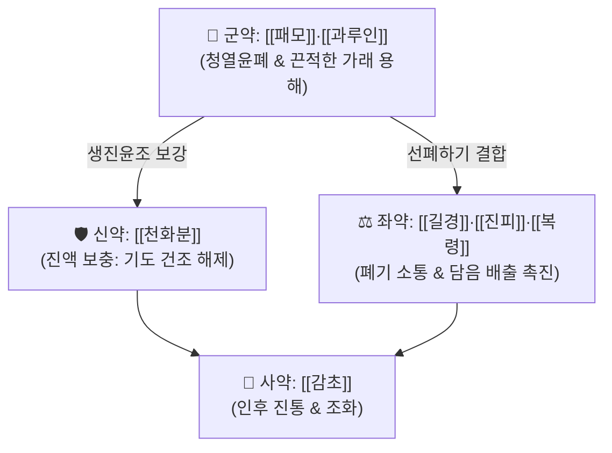

# 🍵 [[패모괄루산]] (貝母栝蔞散, Beimu Gualou San)

> **핵심 3줄 요약 (Key Summary)군약 (君藥)군약 (君藥)신약 (臣藥)좌약 (佐藥)좌약 (佐藥)좌약 (佐藥)사약 (使藥)** | [[감초]] | 3g | 윤폐지해, 길경과 배오하여 인후통 완화 및 제약 조화 |

---

## 2. 방제학적 약재 상호작용 & 윤폐화담 네트워크

* **습담(濕痰)과 조담(燥痰)의 치료 차별성**:
  * 습담에는 반하·남성처럼 맵고 마른(辛燥) 약으로 습을 말려야 하지만, **조담에 그런 약을 쓰면 폐 진액이 더 말라 기침이 악화**됨.
  * 패모괄루산은 패모, 과루인, 천화분의 달고 차가우며 촉촉한(甘寒滋潤) 약성으로 굳어버린 가래를 물처럼 녹여 배출시키는 윤폐청열의 전형.

---

## 3. 현대 분자약리학적 효능 & 기도 점액 용해 기전

* **뮤신(Mucin) 이황화 결합 분해 및 점도 저하**:
  * 과루인의 사포닌 및 불포화지방산이 호흡기 분비선의 장액성 분비를 촉진하고 객담 내 뮤신 고분자 결합을 와해시켜 끈적임을 즉각 완화.
* **기관지 평활근 진경 및 진해**:
  * 패모 알칼로이드(Verticine 등)가 기도 무스카린 M3 수용체 및 칼슘 유입을 억제하여 발작적인 기도 연축을 진정.

---

## 4. 적응 병증 및 체질별 감별 (Sweet Spot vs 금기)

### ✅ 최적 적응증 (Sweet Spot)
* **폐조열(肺燥熱) 조담해수**:
  * 기침을 연거푸 켁켁거리며 하지만 가래가 목에 딱 붙어 도무지 뱉어지지 않음.
  * 목구멍과 입술이 바짝 마르고 목소리가 쉬며(음아), 가슴이 결리고 아픔.
  * 만성 기관지염, 가을·겨울철 건조성 만성 해수, 흡연자 마른기침.
* **설진 및 맥진**:
  * **설진(舌診)**: 설홍소진(舌紅少津), 설태건황(苔乾黃) 또는 건소태.
  * **맥진(脈診)**: 맥삭(脈數) 또는 세삭.

### ⚠️ 신중 투여 및 금기 (Caution / Contraindication)
* **한담·습담 환자 금기**:
  * 묽고 맑은 가래가 줄줄 나오는 환자에게는 [[소청룡탕]]이나 [[이진탕]]을 써야 하며 패모괄루산은 금기.

---

## 5. 유사 처방군 감별 매트릭스 (이진탕 vs 패모괄루산)

| 처방명 | 목표 담음 종류 | 주치 증상 | 핵심 약물 |
| :--- | :--- | :--- | :--- |
| [[이진탕]] | 습담 (濕痰, 묽고 많은 가래) | 가슴 답답, 오심, 가래 뱉으면 시원함 | 반하, 진피, 복령 (신온조습) |
| [[패모괄루산]] | 조담 (燥痰, 말라붙은 가래) | 뱉기 힘들고 끈적함, 인후통, 입마름 | 패모, 과루인, 천화분 (감한윤폐) |
| [[청폐탕]] | 열담 (熱痰, 누렇고 탁한 가래) | 폐열, 신열, 누런 농성 가래 | 황금, 치자, 맥문동 (청열사화) |

---

## 6. 임상 가감례 & 호흡기 질환 응용

* **수반 증상별 가감법**:
  * 목구멍 통증이 심할 때 $\rightarrow$ + [[현삼]], [[우방자]]
  * 가래에 피가 조금 비칠 때 $\rightarrow$ + [[백모근]], [[지유]]
  * 폐열이 심하여 가슴이 답답할 때 $\rightarrow$ + [[황금]], [[지각]]
* **현대 질환 매핑**:
  * 급만성 기관지염 조열기, 미세먼지 유발 기도 점막 건조증, 기관지확장증 점조담, 백일해 회복기 잔여 기침.

---

## 7. 출처 및 학술 참고 문헌 (References)
* Cheng GP. *Yixue Xinwu* (Medical Revelations). 1732.
  * `[연구 요약]`: 패모괄루산 원전 수록, 조담해수의 윤폐청열 치법 수록.
* Shen Y, et al. Fritillaria and Trichosanthes combination improves mucociliary clearance and attenuates airway inflammation in dry cough model. *Phytomedicine*. 2019;62:152960.
  * `[연구 요약]`: 패모와 과루 배합의 기도 점액섬모 수송능 향상 및 기도 과민성 억제 분자 기전 입증.
