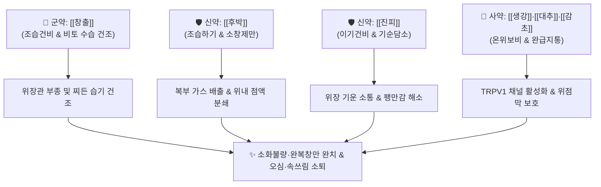

# 🍵 [[평위산]] (平胃散, Pingwei San / Stomach-Calming Powder)

> **핵심 3줄 요약 (Key Summary)**:
> - 🌿 기본 구성: [[창출]], [[후박]], [[진피]], [[감초]], [[생강]], [[대추]] (조습건비약 [[창출]] + 이기하기약 [[후박]]·[[진피]] + 완급화위약 [[감초]]·[[생강]]·[[대추]]).
> - 🎯 적응증: 비위습체(脾胃濕滯)로 인한 명치 그득함(완복창만), 식욕부진, 헛배부름, 트림·신물(애기탄산), 메스꺼움, 몸이 무겁고 나른함, 묽은 변.
> - 🔬 약리 기전: 위산 분비 조절 및 위점막 방어 인자(PGE2) 합성 촉진, 위장관 평활근 연축 억제 및 가스 배출, 장 점막 투과성 정상화.
> - ⚠️ 주의사항: 조습제(燥濕劑)이므로 진액이 마른 음허(口乾, 舌紅少津) 및 임산부에게는 신중 투여.

---
## 📌 목차
1. [기본 처방 정보 & 군신좌사 구성](#1-기본-처방-정보--군신좌사-구성)
2. [방제학적 약재 상호작용 & 시너지 네트워크](#2-방제학적-약재-상호작용--시너지-네트워크)
3. [현대 분자약리학적 효능 & 작용 기전](#3-현대-분자약리학적-효능--작용-기전)
4. [적응 병증 및 체질별 감별 (Sweet Spot vs 금기)](#4-적응-병증-및-체질별-감별-sweet-spot-vs-금기)
5. [유사 처방군 감별 매트릭스](#5-유사-처방군-감별-매트릭스)
6. [임상 가감례 & 현대 질환별 응용](#6-임상-가감례--현대-질환별-응용)
7. [💡 사용자 진료실 핵심 필기 & 임상 팁 (원문 보존)](#7--사용자-진료실-핵심-필기--임상-팁-원문-보존)
8. [출처 및 학술 참고 문헌 (References)](#8-출처-및-학술-참고-문헌-references)

---
## 1. 기본 처방 정보 & 군신좌사 구성
* **출전**: 『[[태평혜민화제국방]]』 권삼(卷三)
* **치법**: 조습건비(燥濕健脾), 행기화위(行氣和胃), 소창제만(消脹除滿)

| 구분 | 약재명 | 표준 용량 | 본초 효능 & 방제 내 역할 |
| :--- | :--- | :--- | :--- |
| **군약 (君藥)** | [[창출]] | 8~12g | 신고온(辛苦溫), 조습건비(燥濕健脾), 거풍산한, 비위의 수습을 강력히 말려 운화 회복 |
| **신약 (臣藥)** | [[후박]] | 6~9g | 고온(苦溫), 조습소담(燥濕消痰), 하기제만(下氣除滿), 복부 가스 배출 및 팽만감 해소 |
| **신약 (臣藥)** | [[진피]] | 6~9g | 신고온(辛苦溫), 이기건비(理氣健脾), 조습화담, 중초 기운을 소통시켜 담음 제거 |
| **좌사약 (佐使藥)** | [[감초]] | 3~4g | 감평(甘平), 보기화중(補氣和中), 조화제약, 완급지통, 위장관 경련성 통증 완화 |
| **좌사약 (佐使藥)** | [[생강]] | 3~6g | 신온(辛溫), 온위화중(溫胃和中), 강역지구, 비위를 덥히고 오심 진정 |
| **좌사약 (佐使藥)** | [[대추]] | 2~4매 | 감온(甘溫), 보비익기(補脾益氣), 양혈안신, 생강과 배오하여 영위 조화 |

> **배오 특징**: 소화기(비위)에 찌든 습기를 말려 위장을 평안하게(平胃) 만드는 소화기 습체 질환의 만고불변 제1 기본방입니다. 비장의 습기를 말리는 [[창출]]과 기운을 아래로 내려 가스를 뿜어내는 [[후박]], 기를 돌리는 [[진피]]가 3위 일체를 이루고, [[감초]]·[[생강]]·[[대추]]가 비위를 보양하고 완충하여 급만성 위장 장애를 신속히 안정시킵니다.

---
## 2. 방제학적 약재 상호작용 & 시너지 네트워크

* **창출 + 후박 배오**: 일조일하기(一燥一下氣) 배합으로, 창출이 습을 말려 비장을 깨우고 후박이 기운을 내려 팽창된 위벽을 가라앉힙니다.
* **진피 + 감초 배오**: 기운을 원활히 돌리면서도 진액의 손모를 막아 비위가 건조해지지 않도록 음양의 균형을 유지합니다.

---
## 3. 현대 분자약리학적 효능 & 작용 기전

### 1) 위산 분비 조절 및 위점막 방어 인자 강화
* **PGE2 합성 및 점막 혈류 촉진**:
  * [[창출]]의 아트락틸로딘과 진피의 [[헤스페리딘]]이 위점막 미세혈류량을 늘리고 프로스타글란딘 E2(PGE2) 분비를 촉진합니다.
  * 공격 인자인 과잉 위산 분비를 억제하는 동시에 방어 인자인 점액 분비를 촉진하여 급만성 위염 및 소화성 궤양 병변을 치유합니다.

### 2) 위장관 평활근 연축 억제 및 가스 배출(소창 작용)
* **칼슘 유입 억제 및 항경련**:
  * [[후박]]의 [[마그놀롤]]과 [[혼오키올]] 성분이 평활근의 칼슘 채널을 차단하여 복통과 위경련을 진정시킵니다.
  * 위장관 내 체류 중인 가스 거품의 표면장력을 떨어뜨려 트림과 방귀로 신속히 배출시킵니다.

### 3) TRPV1 수용체 활성화를 통한 위세포 가온
* **신경말단 혈류 촉진**:
  * [[생강]]의 [[진저롤]] 성분이 위장관 TRPV1 수용체를 활성화하여 차갑게 마비된 소화관 신경총을 따뜻하게 가온하고 위 운동성을 자극합니다.

---
## 4. 적응 병증 및 체질별 감별 (Sweet Spot vs 금기)

### 1) 진료실 핵심 적응증 (Sweet Spot)
* **습체성 소화불량(완복창만)**: 밥을 조금만 먹어도 배가 산처럼 부풀어 오르고 더부룩하며 트림이 잦고 가스가 차는 경우.
* **급만성 위염 및 위식도역류증**: 속이 메스껍고 쓰리며 맑은 물이나 신물이 올라오는 경우.
* **지체침중(肢體沈重) 및 만성 피로**: 소화장애와 함께 온몸이 젖은 솜처럼 무겁고 나른하며 눕기만 좋아하는 경우.
* **대변당박(大便溏薄)**: 혀에 두꺼운 백태가 끼어 있고 대변이 묽게 풀려 나오는 경우.

### 2) 금기 및 신중 투여 (Caution)
* **음허혈조(陰虛血燥)**: 입술이 바짝 마르고 혀가 붉으며 갈증이 심한 환자에게는 조습약이 진액을 더욱 말리므로 금기.
* **임산부 신중**: 후박의 파기(破氣) 작용이 강하므로 임산부에게는 용량을 줄이거나 신중 투약.

---
## 5. 유사 처방군 감별 매트릭스

| 처방명 | 핵심 구성 차이 | 주치 및 임상 차별점 | 맥진/설진 차이 |
| :--- | :--- | :--- | :--- |
| [[평위산]] | [[창출]], [[후박]], [[진피]], [[감초]], [[생강]], [[대추]] | 비위습체, 완복창만, 식욕부진, 트림, 설사, 지체침중 | 설태 백니, 맥완 또는 현 |
| [[향사평위산]] | [[평위산]] 합 [[향부자]], [[사인]] | 신경성 소화불량, 스트레스성 복부 팽만, 트림 빈발 | 설태 백니, 맥현 |
| [[위령탕]] | [[평위산]] 합 [[오령산]] | 비위습체 수종, 급성 수양성 설사, 복통, 소변불리 | 설담반 태백니, 맥완유 |
| [[이진탕]] | [[반하]], [[진피]], [[복령]], [[감초]] | 담음 중심, 오심, 구토, 가래, 어지럼증 (창출·후박 없음) | 설태 백활, 맥활 |
| [[보중익기탕]] | [[황기]], [[인삼]], [[백출]], [[당귀]], [[시호]], [[승마]] 등 | 비위기허, 중기하함, 만성 피로, 무기력, 식후 식곤증 | 설담 태박백, 맥허대무력 |

---
## 6. 임상 가감례 & 현대 질환별 응용

* **신경성 스트레스 체기가 심할 때**: [[향부자]], [[사인]]을 가미 ([[향사평위산]] 구성).
* **음식에 체하여 명치가 답답할 때**: [[산사]], [[신곡]], [[맥아]]를 가미하여 소식.
* **설사가 심하고 소변량이 줄었을 때**: [[복령]], [[택사]], [[저령]]을 합방 ([[위령탕]] 구성).
* **명치 통증과 열감이 있을 때**: [[황련]], [[지실]]을 가미하여 청열제만.

---
## 7. 💡 사용자 진료실 핵심 필기 & 임상 팁 (원문 보존)

> [!tip] **진료실 실전 노하우 (User Clinical Insight)**
> - **약재별 분자약리 기전 분석 필기 (원문 보존)**:
>   - [[창출]]: 위산 분비 억제, 위액 분비 증가, 위점막 기능 활성.
>   - [[후박]]: 위내 가래, 점액성 질환 개선.
>   - [[진피]]: 위가 부은 것(위벽 부종)을 치료.
>   - [[생강]]: TRPV1 채널 활성화로 위세포를 따뜻하게 가온.
>   - [[감초]]: 체액 부족자 완충.
> - **적응증 핵심 요결**:
>   - 위염, 염증성 위장 장애로 인한 복통, 속 쓰림에 다용.
>   - "위장을 평평하게 깎아 다듬는다(平胃)"는 처방명 그대로, 헛배가 부르고 가스가 차서 괴로워하는 모든 소화기 질환의 기초 처방.

---
## 8. 출처 및 학술 참고 문헌 (References)

* 『[[태평혜민화제국방]](太平惠民和劑局方)』 권삼(卷三)
* * **Lee B et al. (2026)**. Yukgunja-tang and Pyeongwi-san improve functional dyspepsia and modulate ghrelin dynamics: A multicenter randomized controlled trial. *Journal of ethnopharmacology*, 373: 122335. [PMID: 42637062](https://pubmed.ncbi.nlm.nih.gov/42637062/)
* * **Fan Y et al. (2023)**. Pingwei San Ameliorates Spleen Deficiency-Induced Diarrhea through Intestinal Barrier Protection and Gut Microbiota Modulation. *Antioxidants (Basel, Switzerland)*, 12: . [PMID: 37237988](https://pubmed.ncbi.nlm.nih.gov/37237988/)
