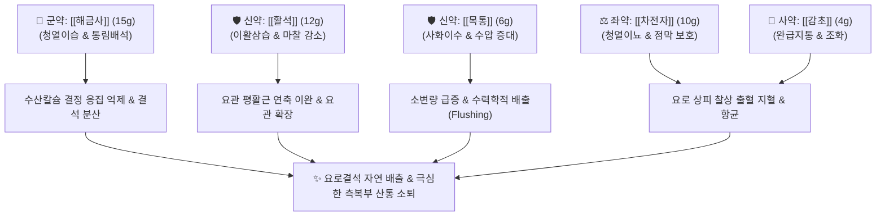

---
aliases:
  - Haegeumsasan
  - Hai Jin Sha San
  - 해금사탕
tags:
  - 처방
  - 화담거습이수제
  - 이수삼습
  - 청열이습
  - 통림배석
  - 요로결석
  - 비뇨기과처방
---
# 🍵 [[해금사산]] (海金沙散, Haijinsha-san / Lygodium Spore Powder)

> **핵심 3줄 요약 (Key Summary)**:
> - 🌿 기본 구성: [[해금사]], [[활석]], [[목통]], [[차전자]], [[감초]] (통림배석 군약 [[해금사]] + 이활삼습 [[활석]]·[[목통]] + 청열이뇨 [[차전자]] + 완급지통 [[감초]]).
> - 🎯 적응증: 요로결석증(신장·요관·방광 결석)으로 인한 격렬한 옆구리 산통 및 혈뇨, 급만성 방광염, 요도염의 배뇨통(뇨삽동통), 잔뇨감.
> - 🔬 약리 기전: 수산칼슘(Calcium oxalate) 결정 성장 및 응집 억제, 요관 평활근 연축 이완을 통한 요관 구경 확장, 삼투성 이뇨 수력학적 밀어내기(Flushing).
> - ⚠️ 주의사항: 8mm 이상의 대형 결석이나 요관 완전 폐색·수신증 환자는 단독 투약보다 체외충격파쇄석술(ESWL)을 반드시 병행.

---
## 📌 목차
1. [기본 처방 정보 & 군신좌사 구성](#1-기본-처방-정보--군신좌사-구성)
2. [방제학적 약재 상호작용 & 시너지 네트워크](#2-방제학적-약재-상호작용--시너지-네트워크)
3. [현대 분자약리학적 효능 & 작용 기전](#3-현대-분자약리학적-효능--작용-기전)
4. [적응 병증 및 체질별 감별 (Sweet Spot vs 금기)](#4-적응-병증-및-체질별-감별-sweet-spot-vs-금기)
5. [유사 처방군 감별 매트릭스](#5-유사-처방군-감별-매트릭스)
6. [임상 가감례 & 현대 질환별 응용](#6-임상-가감례--현대-질환별-응용)
7. [💡 사용자 진료실 핵심 필기 & 임상 팁 (원문 보존)](#7--사용자-진료실-핵심-필기--임상-팁-원문-보존)
8. [출처 및 학술 참고 문헌 (References)](#8-출처-및-학술-참고-문헌-references)

---
## 1. 기본 처방 정보 & 군신좌사 구성
* **출전**: 전을(錢乙) 『[[소아약증직결]]』, 허준(許浚) 『[[동의보감]]』
* **치법**: 청열이습(淸熱利濕), 통림배석(通淋排石), 완급지통(緩急止痛)

| 구분 | 약재명 | 표준 용량 | 본초 효능 & 방제 내 역할 |
| :--- | :--- | :--- | :--- |
| **군약 (君藥)** | [[해금사]] | 15g | 감한(甘寒), 이수통림(利尿通淋), 요로 결석(모래알과 돌)을 소변으로 쓸어내어 배출 |
| **신약 (臣藥)** | [[활석]] | 12g | 감담한(甘淡寒), 청열이습, 요로 점막 상피의 마찰을 줄이고 수액 배출 촉진 |
| **신약 (臣藥)** | [[목통]] | 6g | 고한(苦寒), 사심화(瀉心火), 이수통림, 심포와 소장열을 내려 소변 개통 |
| **좌약 (佐藥)** | [[차전자]] | 10g (포전) | 감한(甘寒), 청열이뇨(淸熱利尿), 요로 점막의 부종과 찰상 염증 진정 |
| **사약 (使藥)** | [[감초]] | 4g | 보기화중, 조화제약, 완급지통, 요로 평활근 경련 및 배뇨 작열통 완화 |

> **본초 안전성 수칙**: [[목통]]은 신장 독성을 유발하는 관목통(마두령과)을 절대 배제하고, 안전한 으름덩굴 줄기인 정품 목통만을 규격품으로 사용합니다.

---
## 2. 방제학적 약재 상호작용 & 시너지 네트워크

* **해금사 + 활석 배오**: 해금사가 미세 결석을 분산시켜 이동시키고, 활석의 미끄러운 성질이 요관 내벽의 마찰 저항을 줄여 결석이 걸리지 않고 매끄럽게 빠져나오게 합니다.
* **차전자 + 목통 배오**: 방광과 요관으로 수분을 집중 유입시켜 결석 뒤쪽에서 강한 수압을 형성하여 아래로 밀어내는 수력학적 세척 효과를 발휘합니다.

---
## 3. 현대 분자약리학적 효능 & 작용 기전

### 1) 수산칼슘 결석 형성 및 응집 억제
* **결정 성장 차단**:
  * [[해금사]]의 플라보노이드 및 지방산 성분이 소변 내 수산칼슘(Calcium Oxalate) 결정의 핵형성과 응집을 억제하고 결석 결정의 크기 증가를 막습니다.

### 2) 요관 평활근 이완 및 구경 확장
* **마그네슘 이온의 항경련 효과**:
  * [[활석]]의 규산마그네슘 성분이 요관 평활근의 과긴장 수축을 풀어주어 요관 내경을 확장시킴으로써 결석 통과를 원활하게 돕습니다.

### 3) 수력학적 밀어내기(Flushing Effect)
* **삼투성 이뇨 및 소변 유속 증가**:
  * 차전자와 목통의 이뇨 성분이 소변량을 급증시켜 결석을 요도 밖으로 밀어내는 물리적 추진력을 제공합니다.

---
## 4. 적응 병증 및 체질별 감별 (Sweet Spot vs 금기)

### 1) 진료실 핵심 적응증 (Sweet Spot)
* **비뇨기 결석 질환(신장·요관·방광 결석)**: 직경 6mm 이하의 결석으로 인한 옆구리 및 하복부의 쥐어짜는 듯한 격렬한 산통, 혈뇨.
* **사림(砂淋) 및 석림(石淋)**: 소변을 볼 때 모래알 같은 찌꺼기가 섞여 나오고 배뇨 시 요도가 찌릿하게 아픈 경우.
* **급만성 방광염 및 요도염**: 소변이 붉고 찔끔거리며 시원치 않은 증상.

### 2) 금기 및 신중 투여 (Caution)
* **대형 결석(8mm 이상) 단독 투약 금기**: 결석 크기가 너무 커서 요관을 완전히 폐색하고 수신증(Hydronephrosis)이 발생한 경우 체외충격파쇄석술(ESWL)을 병행해야 함.
* **음허(陰虛) 환자 신중**: 소변량이 지나치게 많아져 진액이 소모될 수 있으므로 결석 배출 후 즉시 복용을 중단.

---
## 5. 유사 처방군 감별 매트릭스

| 처방명 | 핵심 구성 차이 | 주치 및 임상 차별점 | 맥진/설진 차이 |
| :--- | :--- | :--- | :--- |
| [[해금사산]] | [[해금사]], [[활석]], [[목통]], [[차전자]], [[감초]] | 요로결석(6mm 이하), 배석 특화, 배뇨 산통 완화 | 설태 박황 또는 황니, 맥현삭 |
| [[팔정산]] | [[대황]], [[치자]], [[구맥]], [[편축]] 추가 | 극심한 고열, 작열통, 혈뇨, 급성 방광염 실증 (사화력 최강) | 설홍 태황후초, 맥활삭유력 |
| [[석위산]] | [[석위]] 중심, [[동규자]], [[왕불류행]] | 결석 배출 및 뇨로 폐색 해소에 특화된 유사 방제 | 설태 황박, 맥침현 |
| [[저령탕]] | [[저령]], [[택사]], [[복령]], [[활석]], [[아교]] | 혈뇨와 음허 발열이 두드러진 만성 방광염, 요로결석 | 설홍소태, 맥세삭 |
| [[비해분청음]] | [[비해]], [[오약]], [[익지인]], [[석창포]] | 하초허한, 고창, 소변백탁, 기름 같은 뿌연 소변 | 설담태백, 맥침완 |

---
## 6. 임상 가감례 & 현대 질환별 응용

* **결석 배출 효과를 극대화할 때**: [[금전초]], [[계내금]], [[우슬]]을 대량 가미하여 삼석탕(三石湯) 구조 형성.
* **옆구리 산통이 극심할 때**: [[백작약]], [[현호색]]을 가미하여 진경지통.
* **혈뇨가 심할 때**: [[소계]], [[백모근]]을 가미하여 지혈.
* **소변이 잘 안 나올 때**: [[저령]], [[택사]]를 합방하여 이뇨 촉진.

---
## 7. 💡 사용자 진료실 핵심 필기 & 임상 팁 (원문 보존)

> [!tip] **진료실 실전 노하우 (User Clinical Insight)**
> - **결석 크기별 진료 지침 (원문 요결)**:
>   - **6mm 이하 결석**: 해금사산 단독 복용으로 1~2주 내에 자연 배출 성공률이 매우 높음.
>   - **8mm 이상 대형 결석**: 요관 완전 폐색이나 신장 손상(수신증) 위험이 있으므로, 비뇨기과 체외충격파쇄석술(ESWL) 후 잔여 결석 배출 및 재발 방지 목적으로 처방할 것.
> - **환자 생활 티칭 팁**:
>   - 처방 복용 기간 동안 매일 2~2.5L 이상의 미온수를 꾸준히 섭취하도록 지도.
>   - 줄넘기나 가벼운 계단 오르기 등 진동 운동을 병행하면 결석이 요관을 타고 내려오는 속도가 배가됨.
>   - 소변으로 결석이 배출된 것이 확인되면 투약을 종료하고 신음(腎陰)을 보강하는 처방으로 마무리할 것.

---
## 8. 출처 및 학술 참고 문헌 (References)

* 전을(錢乙), 『[[소아약증직결]](小兒藥證直訣)』
* 허준(許浚), 『[[동의보감]](東醫寶鑑)』
* * **Shi Q et al. (2026)**. Dual high-resolution profiling integrates α-glucosidase inhibition and DPPH assays to identify bioactive constituents in Lygodium japonicum roots. *Journal of chromatography. B, Analytical technologies in the biomedical and life sciences*, 1281: 125210. [PMID: 42456228](https://pubmed.ncbi.nlm.nih.gov/42456228/)
