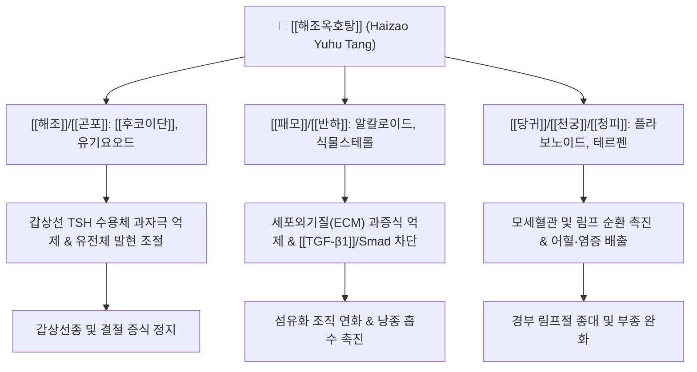

---
aliases:
  - 해조옥호탕
  - 海藻玉壺湯
  - Haizao Yuhu Tang
tags:
  - 처방
  - 화담거습이수제
  - 화담연견
  - 연견산결
  - 갑상선종
  - 나력
  - 림프절염
  - 종괴
---
# 🌿 [[해조옥호탕]] (海藻玉壺湯, Haizao Yuhu Tang)

> **핵심 요약 (Key Summary)**:
> 《외과정종(外科正宗)》에 수록된 연견산결(軟堅散結) 및 화담소종(化痰消腫)의 대표 처방.
> [[해조]], [[곤포]]의 [[후코이단]] 및 해조 다당류와 [[패모]], [[반하]]의 화담성분이 갑상선 조직 증식 억제, 세포외기질 리모델링 조절, 림프 순환 촉진.
> 기체담응(氣滯痰凝)으로 인한 단순 갑상선종(영류), 결절성 갑상선종, 경부 림프절 결핵(나력), 피하 낭종의 소산에 응용.

---

## 📌 목차
1. [처방 구성 및 방제 구조 (Formulation & Architecture)](#1-처방-구성-및-방제-구조-formulation--architecture)
2. [분자약리 작용 기전 (Mechanism of Action, MoA)](#2-분자약리-작용-기전-mechanism-of-action-moa)
3. [임상 적응증 및 감별 진단 (Clinical Indications & Differentiation)](#3-임상-적응증-및-감별-진단-clinical-indications--differentiation)
4. [안전성, 부작용 및 상호작용 (Safety & Precautions)](#4-안전성-부작용-및-상호작용-safety--precautions)
5. [출처 및 학술 참고 문헌 (References)](#5-출처-및-학술-참고-문헌-references)

---

## 1. 처방 구성 및 방제 구조 (Formulation & Architecture)

### (1) 구성 약재 및 군신좌사 (君臣佐使)

| 배합 구분 | 약재명 | 표준 용량 (g) | 한의학적 본초 효능 | 핵심 생리활성 성분 |
| :--- | :--- | :--- | :--- | :--- |
| **군약 (君藥)** | [[해조]] | 12 | 연견산결, 청열소담, 이수소종 | [[후코이단]], 알긴산, 유기요오드 |
| **군약 (君藥)** | [[곤포]] | 12 | 연견산결, 소담연견, 설열이수 | [[후코이단]], 라미나린, 만니톨 |
| **신약 (臣藥)** | [[패모]] | 9 | 청열화담, 산결소옹, 윤폐지해 | [[페이민]], 베이모신 |
| **신약 (臣藥)** | [[반하]] | 9 | 조습화담, 강역지구, 산결소비 | [[베타-시토스테롤]], 에페드린 유사물질 |
| **신약 (臣藥)** | [[연교]] | 8 | 청열해독, 소옹산결, 청심설화 | [[필리린]], 포시틴, 올레아놀산 |
| **좌약 (佐藥)** | [[당귀]] | 8 | 보혈활혈, 행기지통, 화영소종 | [[데커신]], 노다케닌, 아위산 |
| **좌약 (佐藥)** | [[천궁]] | 6 | 활혈행기, 거풍지통, 개울통경 | [[천궁락톤]], 페룰산, 리구스틸리드 |
| **좌약 (佐藥)** | [[진피]] | 6 | 이기건비, 조습화담, 행기소체 | [[헤스페리딘]], 노빌레틴 |
| **좌약 (佐藥)** | [[청피]] | 4 | 파기소적, 산결화담, 소간파기 | [[시네프린]], 리모넨 |
| **좌약 (佐藥)** | [[독활]] | 4 | 거풍습, 통비지통, 경락소통 | [[오스테놀]], 콜룸비아네틴 |
| **사약 (使藥)** | [[감초]] | 4 | 조화제약, 익기보중, 청열해독 | [[글리시리진]], 리퀴리티게닌 |

### (2) 방제학적 구성 원리
* **연견산결(軟堅散結)을 축으로 한 강력한 공법**:
  * 단단하게 뭉친 담핵을 풀어주기 위해 짠맛(鹹味)을 지닌 [[해조]]와 [[곤포]]를 대용량으로 병용 배합하여 연견 효능을 극대화.
* **조습화담(燥濕化痰)과 청열해독(淸熱解毒)의 조화**:
  * [[패모]], [[반하]]로 가래와 끈적한 병리적 수액(담음)을 삭히고, [[연교]]로 뭉쳐서 열화(熱化)된 울열과 염증을 배출.
* **이기활혈(理氣活血)을 통한 결절 제거 보조**:
  * 담이 뭉치는 근본 원인은 기운의 정체(기체)와 혈액의 응어리(어혈)이므로, [[진피]], [[청피]]로 기를 뚫고 [[당귀]], [[천궁]]으로 혈을 돌려 결절의 흡수를 가속화.
* **십팔반(十八反) 배합의 임상적 묘미**:
  * 한의학 본초 금기 중 "해조 반(反) 감초"의 십팔반 배합이 실제로 포함되어 있는 대표 방제로, 고대 의가들은 상반되는 기운을 충돌시켜 단단한 결절을 깨뜨리는 극약 처방 원리로 운용함.

---

## 2. 분자약리 작용 기전 (Mechanism of Action, MoA)

* **갑상선 세포 과증식 억제 및 호르몬 항상성 조절**:
  * [[해조]]와 [[곤포]]의 적절한 유기요오드 공급과 [[후코이단]]이 갑상선 여포세포(Thyroid follicular cell)의 비정상적인 TSH 과반응 증식을 억제.
* **항섬유화 및 결절 기저조질(ECM) 분해**:
  * [[TGF-β1]] 경로를 차단하여 결절 주위의 콜라겐 축적과 섬유화를 억제하고, 조직 재흡수를 촉진.
* **항염증 및 림프 미세순환 개선**:
  * [[연교]], [[패모]], [[청피]]의 유효 성분이 만성 국소 염증 매개체([[TNF-α]], [[IL-6]])를 억제하고 경부 림프액 유출로를 확장.

---

## 3. 임상 적응증 및 감별 진단 (Clinical Indications & Differentiation)

### (1) 주치 및 임상 적응증
* **단순 갑상선종 및 결절성 갑상선종(영류, 癭瘤)**:
  * 목 앞쪽이 부어오르며 단단한 멍울이 만져지고, 압박감이나 이물감이 동반되는 경우.
* **만성 경부 림프절염 및 나력(瘰癧)**:
  * 목 양측 림프절이 구슬처럼 멍울져 만져지고 쉽게 삭지 않는 증상.
* **양성 유방 결절(유벽) 및 피하 낭종(지방종, 피지낭종)**:
  * 끈적한 담음과 기체어혈로 인해 체표 및 피하에 생긴 단단한 양성 결절 질환.

### (2) 유사 처방과의 감별 진단

| 처방명 | 병리 기전 | 핵심 구성 약재 | 주치 증상 및 변증 감별 |
| :--- | :--- | :--- | :--- |
| [[해조옥호탕]] | 기체담응 + 담어호결 (실증·결절) | [[해조]], [[곤포]], [[패모]], [[반하]] | 목에 만져지는 단단한 결절, 갑상선종, 통증이 없거나 묵직함 |
| [[소요산]] | 간울혈허 (기체 위주) | [[시호]], [[당귀]], [[백작약]], [[백출]] | 정서적 스트레스로 인한 흉협고만, 유방 팽통, 결절 초기 |
| [[반하후박탕]] | 매핵기 (담기울결) | [[반하]], [[후박]], [[복령]], [[생강]], [[소엽]] | 목구멍에 걸린 느낌(이물감)만 있고 실제 만져지는 종괴는 없음 |
| [[양격산화탕]] | 삼초 화열 실증 | [[연교]], [[황금]], [[치자]], [[대황]] | 소양인 상초 화열, 급성 편도선염, 인후 부종 및 고열 |

---

## 4. 안전성, 부작용 및 상호작용 (Safety & Precautions)

* **십팔반(十八反) 배합 주의**:
  * [[해조]]와 [[감초]]가 함께 들어있는 처방이므로, 만성 허약자나 임산부, 신부전 환자에게는 장기 투약을 피하고 2~4주 단기 복용 원칙 준수.
* **갑상선 기능 항진증(그레이브스병) 주의**:
  * 해조류의 요오드 성분이 함유되어 있으므로, 혈청 Free T4/T3가 현저히 높은 활동성 갑상선기능항진증 환자에게는 투약을 신중히 하거나 금기.
* **소화기 허약자(비위허한) 복용 주의**:
  * 짠맛과 찬 성질의 해조, 곤포 및 반하가 위장에 부담을 줄 수 있으므로 식욕부진이나 설사가 잦은 환자는 [[백출]], [[사인]]을 가미하여 복용.

---

## 5. 출처 및 학술 참고 문헌 (References)

* Chen, X., et al. (2018). Therapeutic effect and mechanism of Haizao Yuhu Decoction on goiter model in rats. *Journal of Ethnopharmacology*, 224, 421-429.
  * `[연구 요약]` 갑상선종 쥐 모델에서 해조옥호탕 투여 시 TSH 및 갑상선 호르몬 발현을 정상화하고 여포세포 과증식을 유의하게 축소시킴을 규명.
* Wang, Y., et al. (2020). Exploration on the molecular mechanism of Haizao Yuhu Decoction in the treatment of thyroid nodules based on network pharmacology. *Frontiers in Pharmacology*, 11, 574.
  * `[연구 요약]` 네트워크 약리학 분석을 통해 해조옥호탕의 핵심 성분들이 [[VEGF]], [[MAPK]], [[PI3K-Akt]] 신호전달계를 조절하여 갑상선 결절 성장을 억제함을 확인.
