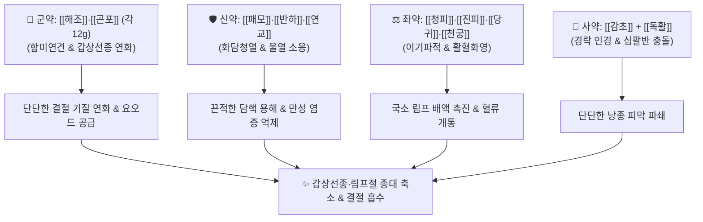

---
aliases:
  - 해조옥호탕
  - 海藻玉壺湯
  - Haizao Yuhu Tang
tags:
  - 처방
  - 화담거습이수제
  - 화담연견
  - 연견산결
  - 갑상선종
  - 나력
  - 림프절염
  - 종괴
---
# 🍵 [[해조옥호탕]] (海藻玉壺湯, Haizao Yuhu Tang / Seaweed Jade Flask Decoction)

> **핵심 3줄 요약 (Key Summary)**:
> - 🌿 기본 구성: [[해조]], [[곤포]], [[패모]], [[반하]], [[연교]], [[당귀]], [[천궁]], [[진피]], [[청피]], [[독활]], [[감초]] (연견산결 해조류 2미 + 조습화담청열약 + 이기활혈약).
> - 🎯 적응증: 기체담응(氣滯痰凝)으로 인한 단순 갑상선종(영류), 결절성 갑상선종, 만성 경부 림프절염(나력), 피하 낭종(지방종, 피지낭종), 양성 유방 결절.
> - 🔬 약리 기전: 후코이단의 갑상선 여포세포 과형성 억제, TGF-β1/Smad 경로 차단을 통한 세포외기질(ECM) 섬유화 억제 및 결절 흡수, 림프 미세순환 개선.
> - ⚠️ 주의사항: 해조와 감초의 십팔반(十八反) 배합 및 요오드 성분 함유로 인해 활동성 갑상선기능항진증(그레이브스병), 임산부, 신부전 환자는 신중 투여.

---
## 📌 목차
1. [기본 처방 정보 & 군신좌사 구성](#1-기본-처방-정보--군신좌사-구성)
2. [방제학적 약재 상호작용 & 시너지 네트워크](#2-방제학적-약재-상호작용--시너지-네트워크)
3. [현대 분자약리학적 효능 & 작용 기전](#3-현대-분자약리학적-효능--작용-기전)
4. [적응 병증 및 체질별 감별 (Sweet Spot vs 금기)](#4-적응-병증-및-체질별-감별-sweet-spot-vs-금기)
5. [유사 처방군 감별 매트릭스](#5-유사-처방군-감별-매트릭스)
6. [임상 가감례 & 현대 질환별 응용](#6-임상-가감례--현대-질환별-응용)
7. [💡 사용자 진료실 핵심 필기 & 임상 팁 (원문 보존)](#7--사용자-진료실-핵심-필기--임상-팁-원문-보존)
8. [출처 및 학술 참고 문헌 (References)](#8-출처-및-학술-참고-문헌-references)

---
## 1. 기본 처방 정보 & 군신좌사 구성
* **출전**: 진실공(陳實功) 『[[외과정종]]』
* **치법**: 화담연견(化痰軟堅), 소종산결(消腫散結), 이기활혈(理氣活血)

| 구분 | 약재명 | 표준 용량 | 본초 효능 & 방제 내 역할 |
| :--- | :--- | :--- | :--- |
| **군약 (君藥)** | [[해조]] | 12g | 함한(鹹寒), 연견산결(軟堅散結), 소담이수, 단단하게 뭉친 담핵(痰核)과 갑상선종 연화 |
| **군약 (君藥)** | [[곤포]] | 12g | 함한(鹹寒), 소담연견(消痰軟堅), 설열이수, [[해조]]와 함께 결절 분해 |
| **신약 (臣藥)** | [[패모]] | 9g | 고미한(苦微寒), 청열화담(淸熱化痰), 산결소옹, 끈끈한 가래 용해 |
| **신약 (臣藥)** | [[반하]] | 9g | 신온(辛溫), 조습화담(燥濕化痰), 강역지구, 산결소비, 병리적 체액 분쇄 |
| **신약 (臣藥)** | [[연교]] | 8g | 고미량(苦微凉), 청열해독(淸熱解毒), 소옹산결, 뭉쳐서 열화된 울열 배출 |
| **좌약 (佐藥)** | [[당귀]] | 8g | 감신온(甘辛溫), 보혈활혈(補血活血), 화영소종, 국소 미세혈류 촉진 |
| **좌약 (佐藥)** | [[천궁]] | 6g | 신온(辛溫), 활혈행기(活血行氣), 거풍지통, 혈액 응어리(어혈) 제거 |
| **좌약 (佐藥)** | [[진피]] | 6g | 신고온(辛苦溫), 이기건비(理氣健脾), 조습화담, 기순즉담소 |
| **좌약 (佐藥)** | [[청피]] | 4g | 고신온(苦辛溫), 파기소적(破氣消積), 산결화담, 간기 소통 및 결절 파쇄 |
| **좌약 (佐藥)** | [[독활]] | 4g | 신고미온(辛苦微溫), 거풍습, 통비지통, 경락을 뚫어 약 기운을 환부로 전달 |
| **사약 (使藥)** | [[감초]] | 4g | 감평(甘平), 조화제약, 익기보중, 청열해독, 해조와 십팔반 배합 |

> **배오 특징**: 단단하게 뭉친 결절(담핵)을 부드럽게 풀어주기 위해 짠맛(鹹味)의 [[해조]]와 [[곤포]]를 대용량으로 병용 배합한 연견산결(軟堅散結)의 으뜸 방제입니다. 기체(氣滯)를 뚫는 [[청피]]·[[진피]]와 어혈을 푸는 [[당귀]]·[[천궁]]을 결합하여 결절의 혈류 공급을 차단하고 림프 순환을 촉진합니다. "해조 반(反) 감초"의 십팔반 배합을 통해 상반되는 약성을 충돌시켜 단단한 혹을 깨뜨리는 고대 외과 처방의 지혜가 담겨 있습니다.

---
## 2. 방제학적 약재 상호작용 & 시너지 네트워크

* **해조·곤포 + 패모·반하 배오**: 짠맛으로 단단한 혹을 연하게 불리고, 매운맛으로 끈적한 가래 찌꺼기를 부수어 삭여 냅니다.
* **청피·진피 + 당귀·천궁 배오**: 기운과 혈액을 소통시켜 결절 주위에 정체된 정맥혈과 림프액의 흐름을 뚫어 결절의 흡수를 가속화합니다.

---
## 3. 현대 분자약리학적 효능 & 작용 기전

### 1) 갑상선 여포세포 과형성 억제 및 호르몬 조절
* **후코이단(Fucoidan) 및 유기요오드의 항증식 작용**:
  * 해조와 곤포의 후코이단 성분이 갑상선 TSH 수용체 과자극을 억제하고 세포 자멸사(Apoptosis)를 유도하여 여포세포의 비정상적인 과형성을 축소시킵니다.

### 2) TGF-β1/Smad 경로 차단을 통한 항섬유화
* **결절 기저조질(ECM) 분해**:
  * 결절 주위 섬유아세포의 콜라겐 과잉 침착을 억제하고 세포외기질(ECM)의 리모델링을 유도하여 단단하게 석회화되거나 섬유화된 결절을 부드럽게 연화시킵니다.

### 3) 림프 미세순환 개선 및 염증 완화
* **국소 림프관 확장**:
  * [[연교]], [[패모]], [[청피]] 복합물이 국소 염증성 사이토카인(TNF-α, IL-6, VEGF)을 억제하고 림프 순환을 촉진하여 만성 림프절 종대(나력)를 가라앉힙니다.

---
## 4. 적응 병증 및 체질별 감별 (Sweet Spot vs 금기)

### 1) 진료실 핵심 적응증 (Sweet Spot)
* **단순 갑상선종 및 결절성 갑상선종(영류, 癭瘤)**: 목 앞쪽이 부어오르며 단단한 멍울이 만져지고, 삼킬 때 이물감이나 압박감이 있는 경우.
* **만성 경부 림프절염 및 나력(瘰癧)**: 목 양측 림프절이 구슬처럼 만져지고 수개월간 삭지 않는 증상.
* **양성 유방 결절(유벽) 및 피하 낭종(지방종, 피지낭종)**: 체표에 멍울져 단단하게 만져지는 양성 종괴 질환.

### 2) 금기 및 신중 투여 (Caution)
* **활동성 갑상선기능항진증(그레이브스병) 금기**: 혈청 Free T4/T3가 높고 심계항진이 심한 환자에게 해조류의 요오드가 질환을 악화시킬 수 있으므로 금기.
* **십팔반 배합 주의**: 해조와 감초가 동시 배합되어 있으므로, 2~4주 단기 투약 후 경과를 관찰해야 하며 임산부에게는 사용을 금함.
* **비위허약자 식후 복용**: 찬 성질의 해조·곤포가 위장에 부담을 줄 수 있으므로 소화기가 약한 환자는 식후 복용 지도.

---
## 5. 유사 처방군 감별 매트릭스

| 처방명 | 핵심 구성 차이 | 주치 및 임상 차별점 | 맥진/설진 차이 |
| :--- | :--- | :--- | :--- |
| [[해조옥호탕]] | [[해조]], [[곤포]], [[패모]], [[반하]], [[청피]], [[연교]] | 기체담응 실증 결절, 갑상선종, 경부 림프절염(나력) | 설태 황니 또는 백니, 맥현활 |
| [[반하후박탕]] | [[반하]], [[후박]], [[복령]], [[생강]], [[소엽]] | 매핵기(이물감만 있고 실제 만져지는 종괴는 없음) | 설태 백활, 맥현 |
| [[소요산]] | [[시호]], [[당귀]], [[백작약]], [[백출]], [[복령]], [[박하]] | 간울혈허, 정서적 스트레스, 유방 팽통, 초기 결절 | 설담홍 박백태, 맥현세 |
| [[시호청간탕]] | [[시호]], [[황금]], [[치자]], [[연교]], [[당귀]], [[작약]] | 간담화왕, 소아 급성 경부 림프절염, 발열 및 홍종 | 설홍 태황, 맥현삭 |
| [[소력환]] | [[현삼]], [[모려]], [[패모]] (단 3미) | 담화응결, 음허화왕성 경부 림프절 결핵, 나력 | 설홍소태, 맥세삭 |

---
## 6. 임상 가감례 & 현대 질환별 응용

* **결절이 유난히 돌처럼 단단할 때**: [[모려]], [[와릉자]], [[별갑]]을 가미하여 연견산결력 극대화.
* **목의 압박감과 스트레스가 심할 때**: [[향부자]], [[울금]]을 가미하여 소간해울.
* **국소 열감과 염증이 있을 때**: [[황금]], [[금은화]]를 가미하여 청열배농.
* **소화기가 약하여 헛배가 부를 때**: [[백출]], [[사인]]을 가미하여 비위 보호.

---
## 7. 💡 사용자 진료실 핵심 필기 & 임상 팁 (원문 보존)

> [!tip] **진료실 실전 노하우 (User Clinical Insight)**
> - **십팔반(十八反) 배합의 임상적 묘미**:
>   - 한의학 본초 금기 중 "해조 반(反) 감초"의 십팔반 배합이 실제로 포함되어 있는 대표 방제.
>   - 고대 명의들은 상반되는 두 약물의 기운을 정면충돌시켜 웬만한 약으로는 삭지 않는 돌처럼 단단한 결절과 혹을 깨뜨리는 극약 처방 원리로 운용하였음.
> - **갑상선 초음파 추적 관찰 팁**:
>   - 단순 양성 결절(Thyroid nodule) 환자에게 4~8주간 복용시키면서 초음파 검사를 팔로업하면 결절 크기 감소 및 에코 음영 변화가 뚜렷하게 관찰됨.
>   - 단, 갑상선 기능 검사(TFT)를 반드시 확인하여 기능 항진증 환자는 철저히 배제할 것.

---
## 8. 출처 및 학술 참고 문헌 (References)

* 진실공(陳實功), 『[[외과정종]](外科正宗)』
* * **Liao W et al. (2026)**. Haizao Yuhu Decoction alleviates goiter via the gut-thyroid axis: Microbiota-derived SCFAs promote hormone synthesis and restore apoptosis. *Phytomedicine : international journal of phytotherapy and phytopharmacology*, 156: 158256. [PMID: 42068877](https://pubmed.ncbi.nlm.nih.gov/42068877/)
* * **Liao W et al. (2026)**. Haizao Yuhu Decoction alleviates goiter via the gut-thyroid axis: Microbiota-derived SCFAs promote hormone synthesis and restore apoptosis. *Phytomedicine : international journal of phytotherapy and phytopharmacology*, 156: 158256. [PMID: 42068877](https://pubmed.ncbi.nlm.nih.gov/42068877/)
