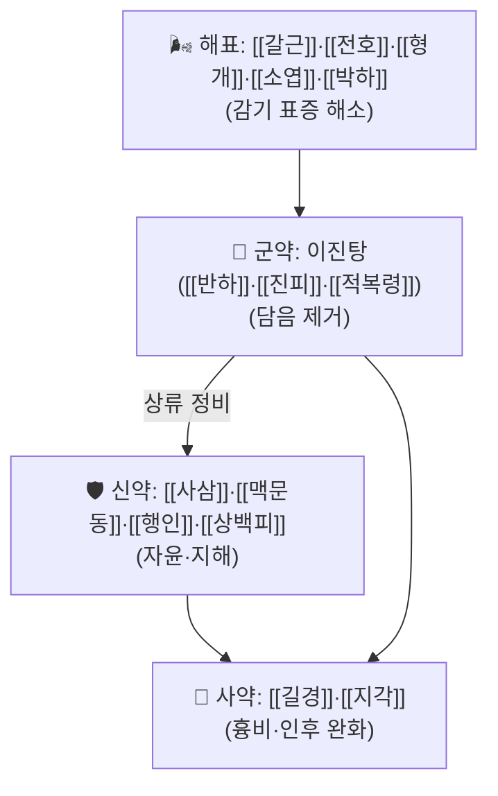

# 🍵 [[행갈청량산]] (杏葛淸喨散, Haenggal Cheongryangsan)

> **핵심 3줄 요약 (Key Summary)**:
> - 🌿 **[[이진탕]](반하·진피·복령·생강·감초) + 해표제([[형개]]·[[소엽]]·[[박하]]) + 자윤·진해제([[사삼]]·[[맥문동]]·[[행인]]·[[상백피]]) + 해열·거풍제([[갈근]]·[[전호]]) + 흉비해소제([[지각]]·[[길경]])** 5개 축이 결합된 복합 화담·자윤 방제. 『청강의감』 처방 스터디 3회차(2026-09-08)에서 **목쉼(聲嘶) 통치방**으로 제시되었다.
> - 🎯 임상 적응증은 **감기·인후염·후두염·식도염 등 원인과 무관하게, 가래가 끼고 목소리가 맑지 못하며 칼칼할 때**. 다만 강의 원출처에서 강사는 "급성 목쉼은 1~2주 침묵·휴식만으로 회복되는 경우가 많아 로컬 한의원에서 실제 처방할 상황이 드물다"는 **냉담한 임상 평가**를 함께 제시했다.
> - 🔬 처방 전체를 대상으로 한 현대 분자약리·임상 연구는 **확인되지 않음(근거 미확인)**. 아래 기전 서술은 구성 본초 각각의 개별 약리 지견을 요약한 수준이며, 처방 수준의 수치·표적 인용은 하지 않는다.
> - ⚠️ 주의사항: 급성 목쉼과 만성 허스키 목소리를 감별하지 않고 투여하면 효과가 불명확하다. 만성 목쉼은 대개 **위식도역류질환(GERD)** 동반이 많아 자음윤폐제+항역류 처방([[반하사심탕]]·[[생강사심탕]])으로 전환이 필요하며, 본방의 해표·거담 위주 구성만으로는 부족할 수 있다. 성대결절·성대폴립·후두암 등 기질적 병변 감별 없이 장기 투여하지 않는다.

---
## 📌 목차
1. [기본 처방 정보 & 군신좌사 구성](#1-기본-처방-정보--군신좌사-구성)
2. [방제학적 약재 상호작용 & 시너지 네트워크](#2-방제학적-약재-상호작용--시너지-네트워크)
3. [현대 분자약리학적 효능 & 작용 기전](#3-현대-분자약리학적-효능--작용-기전)
4. [적응 병증 및 체질별 감별 (Sweet Spot vs 금기)](#4-적응-병증-및-체질별-감별-sweet-spot-vs-금기)
5. [유사 처방군 감별 매트릭스](#5-유사-처방군-감별-매트릭스)
6. [임상 가감례 & 현대 질환별 응용](#6-임상-가감례--현대-질환별-응용)
7. [💡 사용자 진료실 핵심 필기 & 임상 팁 (원문 보존)](#7--사용자-진료실-핵심-필기--임상-팁-원문-보존)
8. [출처 및 학술 참고 문헌 (References)](#8-출처-및-학술-참고-문헌-references)

---
## 1. 기본 처방 정보 & 군신좌사 구성

* **출전**: 『청강의감(淸江醫鑑)』 처방 스터디 3회차(2026-09-08) — [[인후부_喉風·咽腫·聲嘶 가미현근탕·행갈청량산 처방(청강의감 3)]] 강의록 기준. **고전 1차 원전(예: 동의보감·방약합편)과의 조문 대조는 확인되지 않아 근거 미확인으로 남긴다.**
* **치법(治法)**: **선폐화담(宣肺化痰) · 해표윤조(解表潤燥) · 지해이기(止咳理氣)** — 감기(표증) + 담음(화담) + 진액 부족(자윤) 세 축을 동시에 다스리는 구조.
* **방명 유래**: 喨(맑을 량, 口+亮)은 "목소리가 맑다"는 뜻으로, 처방명 자체가 '목소리를 청량하게 한다'는 치료 목표를 담고 있다.

| 구분 | 약재명 | 방제 내 역할 |
| :--- | :--- | :--- |
| **군약 (君藥)** | [[반하]] · [[진피]] · [[적복령]] (=[[이진탕]] 축) | 담음(가래) 제거 — 식도·기관지 점막의 청소 기능을 회복시켜 목에 걸리는 가래 자체를 줄이는 핵심 작용 |
| **신약 (臣藥)** | [[사삼]] · [[맥문동]] · [[행인]] · [[상백피]] | 자음윤폐(滋陰潤肺)·지해(止咳) — 마르고 칼칼한 기관지·인후 점막에 진액을 보태고 기침을 가라앉힘 |
| **좌약 (佐藥)** | [[갈근]] · [[전호]] · [[형개]] · [[소엽]] · [[박하]] | 해표산열(解表散熱) — 감기 표증(발열·오한·인후 건조감)을 먼저 해소해 담음 처리의 조건을 만듦 |
| **사약 (使藥)** | [[길경]] · [[지각]] · [[생강]] · [[대추]] · [[감초]] | 길경·지각으로 흉비(胸痞)·기침을 가라앉히고, 생강·대추·감초로 이진탕 계열 전체를 조화 |

> **배오 특징**: 본방은 **이진탕(화담) + 해표제 + 자윤제**의 3단 결합으로, 강의 원출처는 이를 "형개·소엽·박하(감기) → 갈근·전호(발열) → 사삼·맥문동(건조) → 행인·상백피(기침) → 지각·길경(흉비) → 반하·진피·복령·생강·대추·감초(이진탕=담음)"의 6단 인수분해로 설명한다. **표준 용량은 문헌 대조가 되지 않아 본 노트에 g 단위로 기재하지 않는다(근거 미확인).**

---
## 2. 방제학적 약재 상호작용 & 시너지 네트워크

* **해표제 + 이진탕 배오**: 감기로 표사(表邪)가 남아 있는 상태에서 담음만 다스리면 재발이 쉬우므로, 형개·소엽·박하·갈근·전호로 먼저 표증을 흩어낸 뒤 이진탕 축이 담음을 처리하는 "표리쌍해(表裏雙解)" 구조다.
* **사삼·맥문동 + 행인·상백피 배오**: 사삼·맥문동이 점막에 진액을 보태는 동안 행인·상백피가 기침·호흡 가쁨을 가라앉혀, "마른 기침"과 "가래 기침"을 동시에 겨냥한다.
* **길경·감초(=[[감길탕]]) 내재**: 길경+감초 조합이 처방 안에 그대로 들어 있어, 인후 점막 뮤신 분비를 정상화하는 감길탕의 작용이 본방에도 기본값으로 포함된다.
* **이진탕(반하·진피·복령·생강·감초) 내재**: 담음을 다스리는 핵심 축이 처방 안에 통째로 들어 있어, 식도·기관지 청소능 저하로 인한 가래 정체를 정면으로 겨냥한다.

---
## 3. 현대 분자약리학적 효능 & 작용 기전

> ❗ **본 처방(행갈청량산) 전체를 대상으로 한 PubMed 등재 연구는 확인되지 않았다(근거 미확인).** 아래는 구성 본초 개별 약리의 일반 지견 요약이며, 처방 수준의 표적·수치는 기재하지 않는다.

* **[[반하]]·[[진피]]·[[복령]] (이진탕 축)**: 전통적으로 거담(祛痰)·진해(鎭咳) 작용으로 설명되며, 개별 성분 단위 연구(반하의 에페드린 유사 알칼로이드, 진피의 헤스페리딘류 등)는 각 본초 노트에서 별도로 다룬다.
* **[[사삼]]·[[맥문동]]**: 교과서 효능은 보음(補陰)·윤폐(潤肺)·생진(生津)이며, 사삼의 실체 기원(잔대 vs 더덕)과 성분 연구가 빈약하다는 점은 원 강의에서도 지적된 바다(§5.1 참조). 맥문동 사포닌의 점막 보호 지견은 [[맥문동]] 노트 참조.
* **[[행인]]**: 아미그달린을 함유하며 전통적으로 지해·거담·평천 작용으로 쓰이나, 과량 시 시안화물 독성 위험이 있어 용량 제한이 필요하다(개별 근거는 [[행인]] 노트 참조).
* **[[갈근]]**: 해열·발한 작용 및 이소플라본류 성분 연구가 축적되어 있으나, 본방 맥락(목쉼)에서의 직접 적용 연구는 확인되지 않음.
* **처방 전체 수준의 종합**: 개별 본초의 거담·진해·자음 작용을 단순 합산해 "복합 화담·자윤 방제"로 이해하는 것이 현재 가능한 최선이며, **처방 전체의 임상시험·동물실험 데이터는 근거 미확인**이다.

---
## 4. 적응 병증 및 체질별 감별 (Sweet Spot vs 금기)

**[✅ 최적 적응증 (Sweet Spot)]**

* **원출처 주치**: 비염·인후염·후두염·식도염 등 원인 질환과 무관하게 **가래가 끼고 목소리가 맑지 못하며 칼칼한 상태**(聲嘶) 전반.
* **임상 주치**: 노래·강연·과음 등으로 급성 성대 피로·경도 염증이 생겼을 때, 또는 감기 끝물에 가래가 남아 목이 칼칼한 경우.
* **감별이 필요한 급성·만성 구분**(원 강의 강조점):
  * **급성 목쉼**(감기·과성·기침으로 성대가 부은 경우) → 염증 대증 타격이 효과적 — [[가미현근탕]] 계열(현삼·산두근/고삼·우방자+감길탕+이진탕)이 원 강의의 1차 추천이며, 본방은 그보다 **자윤·진해 비중이 높은 보조·대체 선택지**로 이해한다.
  * **만성 허스키 목소리**(점액·위산 역류로 성대가 지속 손상) → 폐음·진액 보약(육미지황탕·맥문동·천문동 류) + 항역류 처방([[반하사심탕]]·[[생강사심탕]])이 우선이며, **본방 단독으로는 부족**하다.

**[⚠️ 신중 투여 및 금기 (Caution / Contraindication)]**

* 1~2주 음성 휴식만으로 회복되는 경미한 급성 성대염에 불필요하게 장기 투여하지 않는다(원 강의에서 강사가 직접 지적한 과잉 처방 위험).
* 성대결절·성대폴립·후두암 등 **기질적 병변이 의심되면 이과·후두과 의뢰가 우선**이며, 본방으로 증상만 덮어 진단을 늦추지 않는다.
* GERD가 뚜렷한 만성 목쉼에는 본방 단독보다 항역류 처방 병행이 필요하다.

---
## 5. 유사 처방군 감별 매트릭스

| 처방명 | 핵심 구성 차이 | 주치 및 체질 차이 |
| :--- | :--- | :--- |
| [[행갈청량산]] | 이진탕+해표제+사삼·맥문동(자윤)+행인·상백피(지해) | 가래+목소리 칼칼함(聲嘶) 통치, 자윤 비중이 높음 |
| [[가미현근탕]] | [[현삼]]·[[산두근]]·[[길경]]·[[연교]]·[[형개]]·[[방풍]]·[[우방자]]·[[황금]]·[[지각]]·[[박하]]·[[감초]] | 인후 염증(喉風·咽腫) 통치, 소염 비중이 높음 — 급성 염증기에 본방보다 우선 |
| [[이진탕]] | [[반하]]·[[진피]]·[[복령]]·[[생강]]·[[감초]] 단독 | 순수 담음·가래 처리, 해표·자윤 성분 없음 |
| [[반하사심탕]] | 반하·황금·황련·인삼·건강·대조·감초 | 역류성(GERD) 인후두염·만성 목쉼에 우선 적용 |

> ⚠️ 표 내부에서는 파이프(`|`)가 들어간 링크를 쓰지 않고 순수한 [[처방명]] 단독 형태로만 작성했다.

---
## 6. 임상 가감례 & 현대 질환별 응용

* **수반 증상별 가감**:
  * 인후 염증(붓고 빨갛게)이 뚜렷할 때 → [[현삼]]·[[우방자]]·[[고삼]] 가 ([[가미현근탕]] 방향)
  * 역류·속쓰림 동반 시 → [[반하사심탕]]·[[생강사심탕]] 방향으로 전환
  * 기침이 심할 때 → [[오미자]]·[[관동화]] 가
* **현대 질환별 응용**(모두 보조적 응용이며 근거 미확인):
  * 급성 인후두염·후두염 후유증, 성대 과사용(교사·가수·강사) 후 목쉼, 감기 후 잔존 가래·목쉼, 경도 만성 기관지염 동반 목소리 변화.

---
## 7. 💡 사용자 진료실 핵심 필기 & 임상 팁 (원문 보존)

> [!tip] **진료실 실전 노하우 (원 강의 인용)**
> - 원 강의 강사의 평가: "로컬에서 목 쉬어서 처방을 달라는 환경 자체가 거의 없다"는 전제 위에, 책에 실린 처방 해설(전날 술·노래 후 다음 날 아침 실음 → 6첩 복용 후 회복)에 대해 "발목 삔 환자에게 6첩 쓰고 일주일 쉬게 해서 걷게 했다는 식의 기술과 다를 바 없다"고 냉담하게 평가했다. 즉 **급성 성대 염증·경도 성대결절은 약 없이 1~2주 침묵·휴식으로도 회복되는 경우가 많다**는 것이 임상적 맥락이다.
> - 강사의 창방 시연: 산두근을 고삼으로 바꾸고 사삼까지 얹은 **가미쌍삼탕**(현삼·고삼·사삼+감길탕+고삼·우방자+이진탕) 또는 '청량탕' 재구성안 — "이름이 어려운 처방은 실용적으로 바꿔 쓰면 된다"는 운용 철학.
> - 원장님 자신의 임상 필기는 아직 확보되지 않았다. 확보 시 이 블록에 원문 그대로 보존할 것.

---
## 8. 출처 및 학술 참고 문헌 (References)

1. **[[인후부_喉風·咽腫·聲嘶 가미현근탕·행갈청량산 처방(청강의감 3)]]** — 『청강의감』 처방 스터디 3회차(PPT 43슬라이드+Vimeo 영상 자막, 2026-09-08 정리).
   - **[1차 출처]**: 본 노트의 구성·치법·임상 평가 전체가 이 강의록에서 유래함. 고전 원전과의 직접 조문 대조는 미확인.
2. **제공된 PubMed 논문 없음** — 행갈청량산 처방 전체를 대상으로 한 현대 임상·분자약리 연구는 확인되지 않았다(근거 미확인). 구성 개별 본초([[사삼]]·[[맥문동]]·[[행인]]·[[갈근]] 등)의 약리 근거는 각 본초 노트를 참조한다.

> ⚠️ **노트 신뢰도 표시**: 본 노트는 사용자 소장 강의 자료(청강의감 3)를 1차 출처로 하며, 고전 원전 조문 대조 및 처방 전체 수준의 현대 연구는 확인되지 않은 상태다. 임상 적용 전 환자의 급성/만성 목쉼 감별과 GERD·기질적 병변 여부를 반드시 확인할 것.
