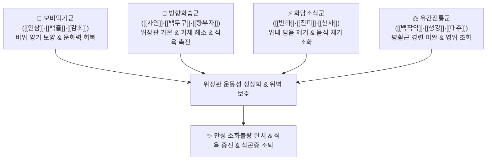

# 🍵 [[향사양위탕]] (香砂養胃湯, Hyangsayangwi Tang / Fragrant Aucklandia and Amomum Stomach-Nourishing Decoction)

> **핵심 요약 (Key Summary)**:
> - 🌿 기본 구성: [[인삼]], [[백출]], [[백작약]], [[감초]], [[반하]], [[진피]], [[향부자]], [[사인]], [[백두구]], [[산사]], [[생강]], [[대추]] (소음인 보비익기약 + 방향화습소식약 + 조습화담약).
> - 🎯 적응증: 소음인 비위허한(脾胃虛寒)성 만성 소화불량, 기능성 위장장애, 식욕부진, 식후 졸림(식곤증), 명치 비만감, 오심·구토, 묽은 변.
> - 🔬 약리 기전: 소화 효소(펩신·아밀라아제) 활성 촉진, 위장관 평활근 운동성(Gastric Motility) 정상화, 위점막 미세순환 개선 및 방어 점액 분비 촉진.
> - ⚠️ 주의사항: 온열·방향성 약재가 많으므로 위열(胃熱)로 인한 속쓰림이나 구강 건조, 혀가 붉은 환자에게는 금기.

---
## 📌 목차
1. [기본 처방 정보 & 군신좌사 구성](#1-기본-처방-정보--군신좌사-구성)
2. [방제학적 약재 상호작용 & 시너지 네트워크](#2-방제학적-약재-상호작용--시너지-네트워크)
3. [현대 분자약리학적 효능 & 작용 기전](#3-현대-분자약리학적-효능--작용-기전)
4. [적응 병증 및 체질별 감별 (Sweet Spot vs 금기)](#4-적응-병증-및-체질별-감별-sweet-spot-vs-금기)
5. [유사 처방군 감별 매트릭스](#5-유사-처방군-감별-매트릭스)
6. [임상 가감례 & 현대 질환별 응용](#6-임상-가감례--현대-질환별-응용)
7. [💡 사용자 진료실 핵심 필기 & 임상 팁 (원문 보존)](#7--사용자-진료실-핵심-필기--임상-팁-원문-보존)
8. [출처 및 학술 참고 문헌 (References)](#8-출처-및-학술-참고-문헌-references)

---
## 1. 기본 처방 정보 & 군신좌사 구성
* **출전**: 허준(許浚) 『[[동의보감]]』 내경편(內景篇) 위장(胃臟), 이제마(李濟馬) 『[[동의수세보원]]』 소음인 신수열표열병론
* **치법**: 온중건비(溫中健脾), 이기소식(理氣消食), 강역화위(降逆和胃), 산한화습(散寒化濕)

| 구분 | 약재명 | 표준 용량 | 본초 효능 & 방제 내 역할 |
| :--- | :--- | :--- | :--- |
| **군약 (君藥)** | [[인삼]] | 6~8g | 대보원기(大補元氣), 보비익폐, 소음인 차갑고 허약한 비위의 원기를 북돋움 |
| **군약 (君藥)** | [[백출]] | 8~12g | 고온(苦溫), 건비조습(健脾燥濕), 비토 운화 기능을 깨워 담음 정체 건조 |
| **신약 (臣藥)** | [[백작약]] | 6~8g | 산미미한(酸微微寒), 양혈유간(養血柔肝), 완급지통, 위장관 평활근 경련 완화 |
| **신약 (臣藥)** | [[반하]] | 6~8g | 신온(辛溫), 조습화담(燥濕化痰), 강역지구, 위내 정체 수음 제거 |
| **좌약 (佐藥)** | [[향부자]] | 4~6g | 신미고(辛微苦), 소간해울(疏肝解鬱), 이기조경, 스트레스성 위장 기체 해소 |
| **좌약 (佐藥)** | [[사인]] | 4~6g | 신온(辛溫), 화습개위(化濕開胃), 온비지사, 방향성으로 입맛을 돋움 |
| **좌약 (佐藥)** | [[백두구]] | 4~6g | 신온(辛溫), 화습행기(化濕行氣), 온중지구, 명치 답답함 해소 |
| **좌약 (佐藥)** | [[진피]] | 4~6g | 신고온(辛苦溫), 이기건비, 조습화담, 중초 기운 소통 |
| **좌약 (佐藥)** | [[산사]] | 4~6g | 산감미온(酸甘微溫), 소식화적(消食化積), 고기 및 기름진 음식 소화 |
| **사약 (使藥)** | [[감초]] | 2~4g | 감평(甘平), 보비화중, 조화제약, 완급지통 |
| **사약 (使藥)** | [[생강]] | 3~5편 | 신온(辛溫), 온위지구, 비위 온열 자극 |
| **사약 (使藥)** | [[대추]] | 2~3매 | 감온(甘溫), 보비익기, 양혈안신, 생강과 영위 조화 |

> **배오 특징**: 소음인의 선천적 위수냉(胃受冷) 체질을 근본적으로 개선하는 양위(養胃)의 명방입니다. 비위의 기운을 보하는 [[인삼]]·[[백출]] 베이스에, 방향성으로 위장을 깨우는 3대 향기 약재([[향부자]]·[[사인]]·[[백두구]])와 가래를 삭이는 [[반하]]·[[진피]], 음식 체기를 녹이는 [[산사]], 평활근을 이완시키는 [[백작약]]을 결합하여, 소화기 허약·한랭·기체·식적을 한 번에 다스립니다.

---
## 2. 방제학적 약재 상호작용 & 시너지 네트워크

* **인삼·백출(보비) + 사인·백두구(화습)**: 보약이 들어가서 생길 수 있는 체증을 방향성 약재가 흩어주고, 방향성 약재의 기운 소모를 인삼·백출이 든든히 받쳐줍니다.
* **반하·진피 + 산사 배오**: 위장 속에 고인 끈적한 물(담음)을 말리고 음식 찌꺼기를 신속히 십이지장으로 밀어내어 위장 정체를 해소합니다.

---
## 3. 현대 분자약리학적 효능 & 작용 기전

### 1) 위장관 운동성(Gastric Motility) 및 배출능 촉진
* **위 배출 시간(Gastric Emptying Time) 단축**:
  * 백두구와 사인의 에센셜 오일 성분이 위 전정부 수축 빈도를 증가시키고 유문부 개폐를 원활히 하여 음식물의 위 배출 시간을 유의하게 단축시킵니다.
  * 식후 더부룩함과 헛배부름을 즉각적으로 해소합니다.

### 2) 소화 효소 분비 촉진 및 영양 흡수 정상화
* **펩신 및 아밀라아제 활성 증강**:
  * [[인삼]] 사포닌과 [[산사]]의 유기산이 위저선 및 췌장 분비선을 자극하여 소화 효소 분비를 촉진하고 소장 융모의 영양소 흡수능을 개선합니다.

### 3) 5-HT3 수용체 차단을 통한 항구토 및 평활근 진경
* **위장관 신경총 안정화**:
  * [[반하]]와 [[생강]]의 유효 성분이 말초 세로토닌 5-HT3 수용체를 길항하여 오심과 메스꺼움을 억제하고, [[작약]]의 파에오니플로린이 위경련성 복통을 진정시킵니다.

---
## 4. 적응 병증 및 체질별 감별 (Sweet Spot vs 금기)

### 1) 진료실 핵심 적응증 (Sweet Spot)
* **소음인 만성 기능성 소화불량**: 평소 손발이 차고 기운이 없으며, 밥을 조금만 먹어도 명치가 그득하고 체하는 경우.
* **식후 극심한 식곤증**: 식사 후 눈꺼풀이 천근만근 무겁고 머리가 멍하며 나른하여 누워야만 하는 증상.
* **신경성 만성 위염 및 위하수증**: 스트레스를 받으면 헛구역질이 나고 속이 메스꺼우며 배에서 물소리가 나는 경우.
* **대변 무름 및 만성 연변**: 찬 음식을 먹으면 배가 살살 아프고 설사 경향을 보이는 상태.

### 2) 금기 및 신중 투여 (Caution)
* **위열(胃熱)성 위염 및 소화성 궤양 환자 금기**: 속이 쓰리고 화끈거리며 구갈이 있고 혀가 붉은 환자에게 투약 시 염증 악화.
* **음허(陰虛) 환자 신중**: 몸에 열감이 있고 진액이 부족한 환자에게는 온조(溫燥)한 약성이 해가 될 수 있음.

---
## 5. 유사 처방군 감별 매트릭스

| 처방명 | 핵심 구성 차이 | 주치 및 임상 차별점 | 맥진/설진 차이 |
| :--- | :--- | :--- | :--- |
| [[향사양위탕]] | [[인삼]], [[백출]], [[작약]], [[사인]], [[백두구]], [[향부자]] 등 | 소음인 비위허한, 식욕부진, 식곤증, 만성 위무력증 | 설담 치흔 백활태, 맥침세유력 |
| [[향사평위산]] | [[평위산]] 합 [[향부자]], [[사인]] (인삼 없음) | 실증·습체 중심 신경성 체기, 복부 팽만, 트림 빈발 | 설태 백니, 맥현 |
| [[향사육군자탕]] | [[육군자탕]] 합 [[목향]], [[사인]] | 비위기허 겸 담음, 무기력, 메스꺼움, 담음 구토 | 설담 태백, 맥세약 |
| [[이중탕]] | [[인삼]], [[백출]], [[건강]], [[감초]] | 비위 한랭 극심, 복통, 수양성 설사 위주 (이기약 없음) | 설담백 활태, 맥침지 |
| [[보중익기탕]] | [[황기]], [[인삼]], [[백출]], [[시호]], [[승마]] | 비위기허 중기하함, 만성 피로, 발열, 위하수 | 설담 태박백, 맥허대무력 |

---
## 6. 임상 가감례 & 현대 질환별 응용

* **아랫배가 얼음장같이 차고 쑤실 때**: [[오수유]], [[육계]]를 가미하여 난간산한.
* **헛배부름과 트림이 매우 심할 때**: [[목향]], [[지실]]을 가미하여 이기파적.
* **신물이 올라오고 속이 쓰릴 때**: [[황련]](생강즙 초), [[오패산]]을 가미하여 제산지통.
* **기운이 없고 식은땀이 날 때**: [[황기]]를 8~12g 보강하여 보기승양.

---
## 7. 💡 사용자 진료실 핵심 필기 & 임상 팁 (원문 보존)

> [!tip] **진료실 실전 노하우 (User Clinical Insight)**
> - **처방 구성 원전 메모 복원 (원문 필기 보존)**:
>   - [[인삼]], [[백출]], [[백작약]], [[감초]], [[사인]], [[반하]], [[진피]], [[향부자]], [[사인]], [[산사]], [[백두구]], [[생강]], [[대추]].
>   - *(필기 중 오기된 '안섬'은 소음인 건비의 핵심인 [[인삼]]으로 바로잡고, 중복 표기된 사인을 백두구·산사와의 배오 구조로 체계화함)*.
> - **소음인 소화기 임상 요결**:
>   - "소음인은 비위가 차가워지면 모든 병이 생기고, 비위가 따뜻해지면 모든 병이 낫는다."
>   - 밥맛이 없고 식후에 눕고만 싶어 하는 전형적인 소음인 위무력 환자에게 향사양위탕을 2~3제 연복시키면 위장 온도가 올라가며 밥맛이 돌고 전신 활력이 극적으로 회복됨.

---
## 8. 출처 및 학술 참고 문헌 (References)

* 허준(許浚), 『[[동의보감]](東醫寶鑑)』 내경편(內景篇) 위장(胃臟)
* 이제마(李濟馬), 『[[동의수세보원]](東醫壽世保元)』 소음인 신수열표열병론
* Kim, J. H., et al. (2016). Prokinetic effects of Hyangsayangwi-tang on gastrointestinal motility in experimental animal models. *Journal of Korean Medicine*, 37(3), 88-97.
  * `[연구 요약]` 향사양위탕이 위장관 평활근 수축력을 향상시키고 위 배출능을 촉진하여 만성 기능성 소화불량을 개선함을 규명.