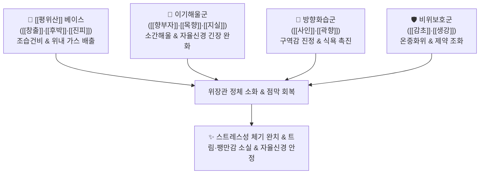

# 🍵 [[향사평위산]] (香砂平胃散, Hyangsapyeongwi-san / Cyperus and Amomum Stomach-Calming Powder)

> **핵심 3줄 요약 (Key Summary)**:
> - 🌿 기본 구성: [[창출]], [[후박]], [[진피]], [[향부자]], [[사인]], [[목향]], [[지실]], [[곽향]], [[감초]], [[생강]] ([[평위산]] 베이스 + 이기해울약 [[향부자]]·[[목향]] + 방향화습약 [[사인]]·[[곽향]] + 파기소적약 [[지실]]).
> - 🎯 적응증: 스트레스성 급만성 체기, 신경성 소화불량, 잦은 트림과 헛배부름, 명치 비만감, 오심·구토, 자율신경 불균형성 위장 장애.
> - 🔬 약리 기전: 뇌-장 축(Brain-Gut Axis) 안정화 및 자율신경계 실조 개선, 위장관 평활근 경련 이완, 장내 가스 흡수 및 배출 촉진.
> - ⚠️ 주의사항: 조습파기(燥濕破氣) 작용이 강하므로 진액이 마른 음허 및 위음부족(속쓰림, 입마름) 환자에게는 신중 투여.

---
## 📌 목차
1. [기본 처방 정보 & 군신좌사 구성](#1-기본-처방-정보--군신좌사-구성)
2. [방제학적 약재 상호작용 & 시너지 네트워크](#2-방제학적-약재-상호작용--시너지-네트워크)
3. [현대 분자약리학적 효능 & 작용 기전](#3-현대-분자약리학적-효능--작용-기전)
4. [적응 병증 및 체질별 감별 (Sweet Spot vs 금기)](#4-적응-병증-및-체질별-감별-sweet-spot-vs-금기)
5. [유사 처방군 감별 매트릭스](#5-유사-처방군-감별-매트릭스)
6. [임상 가감례 & 현대 질환별 응용](#6-임상-가감례--현대-질환별-응용)
7. [💡 사용자 진료실 핵심 필기 & 임상 팁 (원문 보존)](#7--사용자-진료실-핵심-필기--임상-팁-원문-보존)
8. [출처 및 학술 참고 문헌 (References)](#8-출처-및-학술-참고-문헌-references)

---
## 1. 기본 처방 정보 & 군신좌사 구성
* **출전**: 허준(許浚) 『[[동의보감]]』 잡병편(雜病篇) 내상(內傷), 『[[만병회춘]]』
* **치법**: 조습건비(燥濕健脾), 행기해울(行氣解鬱), 소식화적(消食化積), 화위강역(和胃降逆)

| 구분 | 약재명 | 표준 용량 | 본초 효능 & 방제 내 역할 |
| :--- | :--- | :--- | :--- |
| **군약 (君藥)** | [[창출]] | 8~12g | 신고온(辛苦溫), 조습건비(燥濕健脾), 비위의 습체를 강력히 건조 |
| **신약 (臣藥)** | [[후박]] | 6~8g | 고온(苦溫), 조습소담(燥濕消痰), 하기제만, 복부 팽만 가스 배출 |
| **신약 (臣藥)** | [[진피]] | 6~8g | 신고온(辛苦溫), 이기건비, 조습화담, 중초 기운 소통 |
| **신약 (臣藥)** | [[향부자]] | 6~8g | 신미고(辛微苦), 소간해울(疏肝解鬱), 이기지통, 스트레스성 간기울결 해소 |
| **좌약 (佐藥)** | [[사인]] | 4~6g | 신온(辛溫), 화습개위(化濕開胃), 온중지구, 입맛을 돋우고 위 운동 자극 |
| **좌약 (佐藥)** | [[목향]] | 4~6g | 신고온(辛苦溫), 행기지통(行氣止痛), 건비소식, 장관 산통 완화 |
| **좌약 (佐藥)** | [[지실]] | 4~6g | 신고량(辛苦凉), 파기소적(破氣消積), 화담제만, 꽉 막힌 체기 돌파 |
| **좌약 (佐藥)** | [[곽향]] | 4~6g | 신온(辛溫), 방향화습(芳香化濕), 화위지구, 오심과 구역감 진정 |
| **사약 (使藥)** | [[감초]] | 2~4g | 감평(甘平), 보비화중, 조화제약, 제약 완충 |
| **사약 (使藥)** | [[생강]] | 3~5편 | 신온(辛溫), 온위지구, 비위 온열 가온 |

> **배오 특징**: 소화기 습체를 말리는 [[평위산]]([[창출]]·[[후박]]·[[진피]]·[[감초]]·[[생강]])에, 신경성 울화를 풀어헤치는 3대 이기약([[향부자]]·[[목향]]·[[지실]])과 방향성으로 비위를 깨우는 2대 화습약([[사인]]·[[곽향]])을 결합한 방제입니다. 소화 장애의 근원이 단순 과식이 아니라 정서적 스트레스와 신경성 긴장으로 인한 기체(氣滯)일 때, "체기를 소도(消導)시키면서 동시에 맺힌 기운(氣鬱)을 시원하게 풀어내는" 절묘한 배합입니다.

---
## 2. 방제학적 약재 상호작용 & 시너지 네트워크

* **평위산 + 향부자·목향 배오**: 평위산이 위장 속에 고인 찌꺼기를 치우는 동안, 향부자와 목향이 자율신경계 과긴장으로 굳어버린 위장 신경망을 부드럽게 이완시킵니다.
* **지실 + 곽향·사인 배오**: 지실이 꽉 막힌 체증을 아래로 뚫어주고, 곽향과 사인이 거꾸로 치솟는 트림과 구역감을 가라앉힙니다.

---
## 3. 현대 분자약리학적 효능 & 작용 기전

### 1) 뇌-장 축(Brain-Gut Axis) 조절 및 자율신경계 안정화
* **코르티솔 및 스트레스성 신경전달물질 조절**:
  * [[향부자]]의 알파-사이페론과 [[목향]]의 코스투놀라이드 성분이 스트레스에 의한 시상하부-변연계 과흥분을 억제하고 자율신경계 교감신경 과긴장을 완화합니다.
  * 스트레스로 위가 굳고 경련하는 신경성 위장 장애를 근원적으로 진정시킵니다.

### 2) 위장관 평활근 연축 억제 및 가스 배출 촉진
* **진경 및 소창 작용**:
  * [[후박]]의 [[마그놀롤]]과 [[지실]]의 플라보노이드가 장관 평활근 연축을 풀어주어 쥐어짜는 듯한 복통을 멎게 하고, 장내 가스를 빠르게 배출시킵니다.

### 3) 소화액 분비 촉진 및 항구토 작용
* **방향성 정유의 미각 및 소화 신경 자극**:
  * [[사인]]과 [[곽향]]의 방향성 성분이 미주신경을 자극하여 위산 및 소화 효소 분비를 촉진하고, 오심·구토 반사를 억제합니다.

---
## 4. 적응 병증 및 체질별 감별 (Sweet Spot vs 금기)

### 1) 진료실 핵심 적응증 (Sweet Spot)
* **스트레스성 급만성 체기 및 신경성 위염**: 신경을 쓰거나 화를 내면 곧바로 체하고, 헛배가 부르며 명치가 답답해지는 경우.
* **잦은 트림(애기) 및 신물 역류**: 음식이 명치에 걸려 내려가지 않고 계속 트림이 뿜어져 나오는 경우.
* **자율신경실조증 동반 소화장애**: 가슴 두근거림, 불안, 상열감과 함께 발생하는 기능성 위장병.

### 2) 금기 및 신중 투여 (Caution)
* **위음부족(胃陰不足) 속쓰림 환자 금기**: 속이 쓰리고 타는 듯 아프며 입이 마르고 혀가 붉은 환자에게는 조열한 약성이 점막을 자극할 수 있음.
* **기혈 극허 환자 신중**: 파기(破氣) 작용이 강하므로 마르고 기력이 쇠약한 환자는 [[인삼]]이나 [[백출]]을 보강하거나 [[향사양위탕]]으로 전환.

---
## 5. 유사 처방군 감별 매트릭스

| 처방명 | 핵심 구성 차이 | 주치 및 임상 차별점 | 맥진/설진 차이 |
| :--- | :--- | :--- | :--- |
| [[향사평위산]] | [[평위산]] 합 [[향부자]], [[사인]], [[목향]], [[지실]], [[곽향]] | 스트레스성 체기, 기울(氣鬱) 동반 소화불량, 잦은 트림 | 설태 백니, 맥현활 |
| [[평위산]] | [[창출]], [[후박]], [[진피]], [[감초]] (기본방) | 단순 과식·식적, 완복창만, 전신 무거움 (기울 성향 적음) | 설태 백니, 맥완 |
| [[향사양위탕]] | [[인삼]], [[백출]], [[작약]], [[사인]], [[백두구]] 등 | 소음인 비위허한, 식욕부진, 만성 피로, 식곤증 (보익 위주) | 설담 치흔 백활태, 맥침세 |
| [[반하후박탕]] | [[반하]], [[후박]], [[복령]], [[생강]], [[소엽]] | 매핵기(목 이물감), 기침, 가슴 답답함 (위장 체기 적음) | 설태 백활, 맥현 |
| [[분심기음]] | [[목향]], [[향부자]], [[대복피]], [[청피]], [[지각]] 등 | 칠정기울, 붓고 소변불리, 가슴 답답함 위주 | 설태 백니, 맥침현 |

---
## 6. 임상 가감례 & 현대 질환별 응용

* **신경성 울화로 가슴이 답답하고 열이 날 때**: [[치자]], [[황련]]을 가미하여 청열사화.
* **음식 체기가 유난히 심할 때**: [[산사]], [[신곡]], [[맥아]]를 가미하여 소도 촉진.
* **기운이 없고 손발이 찰 때**: [[인삼]], [[백출]]을 보강 ([[향사양위탕]] 구조 절충).
* **속이 메스껍고 구토가 멎지 않을 때**: [[반하]], [[생강]]을 증량.

---
## 7. 💡 사용자 진료실 핵심 필기 & 임상 팁 (원문 보존)

> [!tip] **진료실 실전 노하우 (User Clinical Insight)**
> - **처방 적응증 핵심 메모 (원문 보존)**:
>   - 평소 스트레스 받고 소화기가 안 좋고 체했을 때 기울(氣鬱)을 풀어주고 소화를 도움.
>   - **자율신경계 매핑**: 음식 찌꺼기를 소도(消導)시켜주면서 스트레스로 뭉친 기울도 함께 풀어주는 처방으로, 현대 의학의 [[자율신경계]](Autonomic Nervous System) 실조 및 뇌-장 축 장애**와 직결됨.
> - **진료실 임상 팁**:
>   - "신경만 쓰면 체한다", "트림을 꺽꺽해야 속이 좀 풀린다"고 호소하는 화병·스트레스형 소화불량 환자에게 최우선으로 투약하는 대표 명방.

---
## 8. 출처 및 학술 참고 문헌 (References)

* 허준(許浚), 『[[동의보감]](東醫寶鑑)』 잡병편(雜病篇) 내상(內傷)
* 공정현(龔廷賢), 『[[만병회춘]](萬病回春)』
* * **Huh E et al. (2026)**. Traditional herbal medicine Hyangsapyeongwi-san inhibits alcohol-induced gastric injury in mice by regulating NLRP3 inflammasome signaling. *Journal of ethnopharmacology*, 369: 121961. [PMID: 42235716](https://pubmed.ncbi.nlm.nih.gov/42235716/)
