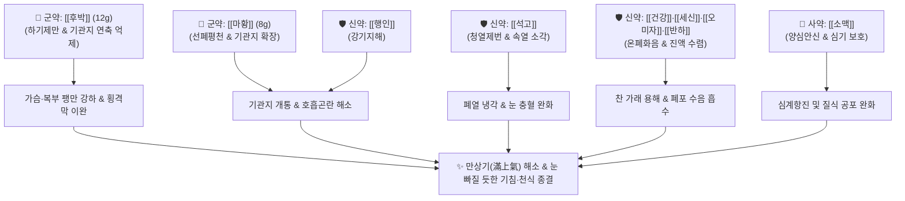

# 🍵 [[후박마황탕]] (厚朴麻黃湯, Houpu Mahuang Tang / Magnolia and Ephedra Decoction)

> **핵심 3줄 요약 (Key Summary)**:
> - 🌿 기본 구성: [[후박]], [[마황]], [[석고]], [[반하]], [[행인]], [[세신]], [[건강]], [[오미자]], [[소맥]] ([[소청룡탕]] 온폐화음 + [[마행감석탕]] 선폐청열 + [[후박]] 하기제만 + [[소맥]] 안신).
> - 🎯 적응증: 기침·천식이 심하여 가슴과 배가 터질 듯 부풀어 오르고(만상기), 눈이 튀어나올 듯 헐떡이는(목여탈상) 중증 기관지천식, 만성 폐쇄성 폐질환(COPD) 급성 발작, 폐기종.
> - 🔬 약리 기전: 마황 에페드린의 β2-아드레날린 수용체 자극 및 후박 마그놀롤의 칼슘 유입 차단을 통한 이중 기관지 확장, 기도 염증 억제, 복부 팽만 완화.
> - ⚠️ 주의사항: 마황이 고용량 포함되어 고혈압, 빈맥성 부정맥, 협심증 환자 및 전립선비대증 환자는 신중 투여.

---
## 📌 목차
1. [기본 처방 정보 & 군신좌사 구성](#1-기본-처방-정보--군신좌사-구성)
2. [방제학적 약재 상호작용 & 시너지 네트워크](#2-방제학적-약재-상호작용--시너지-네트워크)
3. [현대 분자약리학적 효능 & 작용 기전](#3-현대-분자약리학적-효능--작용-기전)
4. [적응 병증 및 체질별 감별 (Sweet Spot vs 금기)](#4-적응-병증-및-체질별-감별-sweet-spot-vs-금기)
5. [유사 처방군 감별 매트릭스](#5-유사-처방군-감별-매트릭스)
6. [임상 가감례 & 현대 질환별 응용](#6-임상-가감례--현대-질환별-응용)
7. [💡 사용자 진료실 핵심 필기 & 임상 팁 (원문 보존)](#7--사용자-진료실-핵심-필기--임상-팁-원문-보존)
8. [출처 및 학술 참고 문헌 (References)](#8-출처-및-학술-참고-문헌-references)

---
## 1. 기본 처방 정보 & 군신좌사 구성
* **출전**: 장중경(張仲景) 『[[금궤요략]]』 폐위폐옹해수상기병맥증병치(肺痿肺癰咳嗽上氣病脈證幷治) 제7
* **치법**: 선폐평천(宣肺平喘), 하기제만(下氣除滿), 화담산음(化痰散飲), 청열제번(淸熱除煩)

| 구분 | 약재명 | 표준 용량 | 본초 효능 & 방제 내 역할 |
| :--- | :--- | :--- | :--- |
| **군약 (君藥)** | [[후박]] | 12g | 고온(苦溫), 하기제만(下氣除滿), 조습소담, 흉복부의 팽만감과 거꾸로 솟구치는 기운을 아래로 내림 |
| **군약 (君藥)** | [[마황]] | 8g | 신온(辛溫), 선폐평천(宣肺平喘), 발한산한, 닫힌 기관지를 강력히 열어 호흡곤란 해소 |
| **신약 (臣藥)** | [[석고]] | 12g | 신한(辛寒), 청열사화(淸熱瀉火), 제번지갈, 속에서 끓어오르는 폐열과 번열 소각 |
| **신약 (臣藥)** | [[반하]] | 8g | 신온(辛溫), 조습화담(燥濕化痰), 강역지구, 기도 내 끈적한 체액 분쇄 |
| **신약 (臣藥)** | [[행인]] | 6g | 고미온(苦微溫), 강기평천(降氣平喘), 윤장, 마황과 배오하여 기침 발작 억제 |
| **좌약 (佐藥)** | [[건강]] | 4g | 신열(辛熱), 온폐산한(溫肺散寒), 한음(寒飲)을 덥혀 삭임 |
| **좌약 (佐藥)** | [[세신]] | 3g | 신온(辛溫), 온폐화음(溫肺化飲), 통규지통, 깊은 폐포의 찬 가래 배출 |
| **좌약 (佐藥)** | [[오미자]] | 4g | 산온(酸溫), 렴폐자신(斂肺滋腎), 마황의 과도한 발산을 수렴하여 폐기 보존 |
| **좌약 (佐藥)** | [[소맥]] | 15~20g | 감미량(甘微凉), 양심안신(養心安神), 익기제열, 호흡곤란으로 인한 심신 불안 진정 |

> **배오 특징**: 호흡기 질환 최고의 콤비인 [[소청룡탕]]과 [[마행감석탕]]의 핵심 구조를 품고 있으면서, [[후박]]의 강력한 하기제만(下氣除滿)력으로 흉복부의 팽만을 단번에 꺼뜨리는 응급 평천제입니다. 겉이나 깊은 곳에 찬 가래(건강·세신·반하)가 있으면서도 속에서는 열(석고)이 뭉쳐 눈이 빠질 듯 헐떡거리는 한열협잡(寒熱夾雜)의 위급 천식을 일거에 제압합니다.

---
## 2. 방제학적 약재 상호작용 & 시너지 네트워크

* **후박 + 마황 배오**: 마황이 위로 기도를 활짝 열어젖히고, 후박이 가슴과 배를 짓누르는 압력을 아래로 푹 꺼뜨려(一宣一下) 헐떡이는 숨을 평정합니다.
* **석고 + 건강·세신 배오**: 한열(寒熱)을 병용하여 속에서 뿜어져 나오는 번열을 식히면서도 폐포에 엉긴 찬 가래를 따뜻하게 삭여 냅니다.

---
## 3. 현대 분자약리학적 효능 & 작용 기전

### 1) 이중 기전을 통한 강력한 기관지 확장 작용
* **β2-수용체 자극 및 평활근 칼슘 채널 차단**:
  * [[마황]]의 에페드린 성분이 기관지 평활근의 β2-아드레날린 수용체를 자극하여 기관지 내경을 즉각적으로 넓힙니다.
  * [[후박]]의 [[마그놀롤]]과 [[혼오키올]] 성분이 세포막 칼슘 통로를 차단하고 아세틸콜린 유도성 연축을 억제하여 마황과의 시너지로 난치성 기관지 연축을 강력히 차단합니다.

### 2) 위장-폐 축(Gut-Lung Axis) 팽만감 해소 및 횡격막 거상 완화
* **복압 강하를 통한 흉강 용적 확보**:
  * 후박과 반하가 복부 팽만, 위내 가스 저류, 위산 분비 과다를 억제하여 팽창된 위장이 횡격막을 위로 밀어 올려 호흡을 압박하는 기전(만상기, 滿上氣)을 차단합니다.

### 3) 중추성 호흡 흥분 진정 및 심신 안정
* **소맥의 신경 안정 효과**:
  * 호흡곤란과 질식감으로 인해 유발되는 환자의 공포, 불안, 교감신경 과항진을 소맥이 부드럽게 진정시킵니다.

---
## 4. 적응 병증 및 체질별 감별 (Sweet Spot vs 금기)

### 1) 진료실 핵심 적응증 (Sweet Spot)
* **만상기(滿上氣)성 중증 천식**: 기침과 천식이 극심하여 가슴과 배가 터질 듯이 그득하고 숨이 차서 누워있지 못하는 환자.
* **목여탈상(目如脫狀)**: 숨이 너무 가빠서 얼굴이 붉어지고 눈알이 밖으로 튀어나올 듯이 헐떡거리는 위급 상태.
* **COPD 및 폐기종 급성 악화**: 가슴이 답답하고 기도가 좁아져 쌕쌕거리는 천명음이 심하게 들리는 경우.
* **소화기 팽만 동반 호흡기 질환**: 복부 팽만감, 위산 과다, 헛배부름과 함께 만성 비염·기관지염이 동반된 환자.

### 2) 금기 및 신중 투여 (Caution)
* **순수 허천(虛喘) 환자 금기**: 기력이 다하여 목소리가 기어들어가고 숨만 헐떡이는 폐신양허 환자에게는 공벌력이 과도하여 금기 (이 경우 [[인삼]], [[호도]] 위주 사용).
* **심혈관 질환자 주의**: 마황의 교감신경 흥분 작용으로 인해 고혈압, 심계항진, 부정맥 환자는 맥박과 혈압을 모니터링하며 신중 투여.

---
## 5. 유사 처방군 감별 매트릭스

| 처방명 | 핵심 구성 차이 | 주치 및 임상 차별점 | 맥진/설진 차이 |
| :--- | :--- | :--- | :--- |
| [[후박마황탕]] | [[후박]], [[마황]], [[석고]], [[반하]], [[소맥]] 등 | 한열협잡, 흉복창만(만상기), 눈이 빠질 듯 헐떡임(목여탈상) | 설태 황백협잡 또는 황니, 맥부대 또는 활 |
| [[소청룡탕]] | [[마황]], [[계지]], [[세신]], [[건강]], [[작약]] (석고 없음) | 외한내음 순수 한증, 묽고 거품 많은 가래, 오한 | 설태 백활수제, 맥부긴 |
| [[마행감석탕]] | [[마황]], [[행인]], [[석고]], [[감초]] (4미) | 폐열 실증, 발열, 땀이 나면서 천식 (복부 팽만 없음) | 설태 박황, 맥활삭 |
| [[정력대조사폐탕]] | [[정력자]], [[대추]] | 폐포 담수 옹색, 흉수, 심부전 폐부종, 기좌호흡 | 설태 백니, 맥침현 |
| [[반하후박탕]] | [[반하]], [[후박]], [[복령]], [[생강]], [[소엽]] | 칠정기울 매핵기, 목 이물감, 흉민 (기관지 수축·천식 없음) | 설태 백활, 맥현 |

---
## 6. 임상 가감례 & 현대 질환별 응용

* **속열이 더욱 극심하여 입이 바짝 마를 때**: [[석고]]를 20~30g으로 증량.
* **가래가 누렇고 진득하게 들러붙을 때**: [[과루인]], [[패모]], [[황금]] 가미.
* **가슴 통증이 동반될 때**: [[울금]], [[지실]] 가미하여 관흉이기.
* **호흡곤란이 가라앉은 후**: 사기가 꺾이면 즉시 복용을 멈추고 [[육군자탕]]이나 [[생맥산]]으로 전환.

---
## 7. 💡 사용자 진료실 핵심 필기 & 임상 팁 (원문 보존)

> [!tip] **진료실 실전 노하우 (User Clinical Insight)**
> - **처방 4대 블록 구조 (원문 필기 보존)**:
>   - [[마황]], [[반하]] (기관지 확장 및 조습)
>   - [[건강]], [[오미자]], [[세신]] (온폐화음 수렴)
>   - [[석고]], [[소맥]] (청열제번 및 안신)
>   - [[후박]], [[행인]] (하기소창 및 강기평천)
> - **적응증 핵심 메모**:
>   - 기관지 수축 및 호흡기계 급박 증상에 다용.
>   - 복부 창만증, 위산 분비 과다 패턴의 소화기 장애와 기관지, 비 점막의 호흡기계 문제에 적극 활용.
> - **분자약리 시너지 기전**:
>   - [[후박]]의 마그놀롤(Magnolol)과 혼오키올(Honokiol)이 기관지 평활근에 대한 수축 반응을 억제하여, [[마황]]의 에페드린과 함께 기관지를 강력하게 확장시킴.

---
## 8. 출처 및 학술 참고 문헌 (References)

* 장중경(張仲景), 『[[금궤요략]](金匱要略)』 폐위폐옹해수상기병맥증병치(肺痿肺癰咳嗽上氣病脈證幷治) 제7
* * **Yuan X et al. (1998)**. [Clinical and experimental study on the Houpu Mahuang oral liquid in treating bronchial asthma]. *Zhongguo Zhong xi yi jie he za zhi Zhongguo Zhongxiyi jiehe zazhi = Chinese journal of integrated traditional and Western medicine*, 18: 517-9. [PMID: 11475724](https://pubmed.ncbi.nlm.nih.gov/11475724/)
