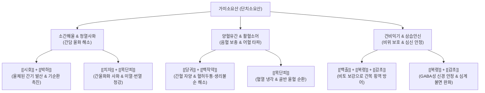

---
aliases:
  - 가미소요산
  - 단치소요산
  - 加味逍遙散
  - 丹梔逍遙散
  - Gamisoyo-san
tags:
  - 처방/이기화해제
  - 이기화해제/소간해울
  - 간울화화
  - 갱년기증후군
  - PMS
---
# 🍵 [[가미소요산]] (加味逍遙散, Gamisoyo-san / Augmented Rambling Powder)

> **핵심 3줄 요약 (Key Summary)**:
> - 🌿 기본 구성: [[시호]], [[당귀]], [[백작약]], [[백출]], [[복령]], [[감초]], [[목단피]], [[치자]], [[박하]], [[생강]] 배오.
> - 🎯 간울혈허(肝鬱血虛)에 화(火)가 성하여 발생하는 갱년기 장애, 안면홍조, 신경성 불면, 감정기복, 월경불순 및 월경전증후군(PMS).
> - 🔬 GABA_A 수용체 BZp 결합부위 조절을 통한 항불안·진정, HPA축 코르티솔 정상화, 5-HT 세로토닌 신경계 안정, 혈관운동신경 흥분 억제.
> - <font color="#fa7e7e">⚠️ 주의사항: 목단피의 활혈산어 작용으로 임산부 및 유산 위험군 신중 투여, 음허내열이 극심하여 진액이 고갈된 환자는 자음강화제 배오.</font>

---

## 📌 목차
1. [기본 처방 정보 & 군신좌사 구성](#1-기본-처방-정보--군신좌사-구성)
2. [방제학적 약재 상호작용 & 시너지 네트워크](#2-방제학적-약재-상호작용--시너지-네트워크)
3. [현대 분자약리학적 효능 & 작용 기전](#3-현대-분자약리학적-효능--작용-기전)
4. [적응 병증 및 체질별 감별 (Sweet Spot vs 금기)](#4-적응-병증-및-체질별-감별-sweet-spot-vs-금기)
5. [유사 처방군 감별 매트릭스](#5-유사-처방군-감별-매트릭스)
6. [임상 가감례 & 현대 질환별 응용](#6-임상-가감례--현대-질환별-응용)
7. [💡 사용자 진료실 핵심 필기 & 임상 팁 (원문 보존)](#7--사용자-진료실-핵심-필기--임상-팁-원문-보존)
8. [출처 및 학술 참고 문헌 (References)](#8-출처-및-학술-참고-문헌-references)

---

## 1. 기본 처방 정보 & 군신좌사 구성

* **출전**: 송대(宋代) 태평혜민화제국방(太平惠民和劑局方)의 소요산에 명대(明代) 설기(薛己)의 《내과적요(內科摘要)》에서 목단피·치자 가미
* **이명**: 단치소요산(丹梔逍遙散), 팔미소요산(八味逍遙散)
* **치법**: 소간해울(疏肝解鬱), 청열양혈(淸熱凉血), 건비양혈(健脾養血)
* **적응증**: 간울화화(肝鬱化火), 조열자한(潮熱自汗), 심계정충, 두통목현, 월경부조, 갱년기 안면홍조

| 구분 | 약재명 | 표준 용량 | 본초 효능 & 방제 내 역할 |
| :--- | :--- | :--- | :--- |
| **군약 (君藥)** | [[시호]] | 6g | 소간해울(疏肝解鬱), 승양달표, 맺힌 간기(肝氣)를 시원하게 소통 |
| **신약 (臣藥)** | [[당귀]] | 6g | 보혈양혈(補血養血), 활혈지통, 간혈(肝血)을 자양하여 시호의 조열성 완충 |
| **신약 (臣藥)** | [[백작약]] | 6g | 양혈유간(養血柔肝), 완급지통, 간목(肝木)의 횡역을 달래고 음혈 보충 |
| **좌약 (佐藥)** | [[백출]] | 6g | 건비익기(健脾益氣), 조습, '견간지병 지간전비' 원칙으로 비토(脾土) 방어 |
| **좌약 (佐藥)** | [[복령]] | 6g | 영심안신(寧心安神), 건비삼습, 수습 정체 해소 및 정신 안정 |
| **좌약 (佐藥)** | [[목단피]] | 4g | 청열양혈(淸熱凉血), 활혈산어, 간담의 울열을 식히고 혈체 해소 |
| **좌약 (佐藥)** | [[치자]] | 4g | 사화제번(瀉火除煩), 청열이습, 삼초의 울열과 심번(心煩) 청강 |
| **좌약 (佐藥)** | [[박하]] | 2g | 신량발산(辛凉發散), 소간해울 보조, 상초의 열기 발산 (후하) |
| **좌약 (佐藥)** | [[생강]] | 3g | 강역지구(降逆止嘔), 온중화위, 시호·치자의 한량성을 위장관에서 조화 |
| **사약 (使藥)** | [[감초]] | 3g | 보기화중(補氣和中), 조화제약, 작약과 결합하여 완급지통 극대화 |

---

## 2. 방제학적 약재 상호작용 & 시너지 네트워크



* **소간(疏肝)과 청열(淸熱)의 시너지**:
  - 기본 소요산의 [[시호]]·[[박하]]가 기체(氣滯)를 흩뜨리고, 가미된 [[치자]]·[[목단피]]가 기체로 인해 발생한 울화(鬱火)를 혈분(血分)과 기분(氣分) 양단에서 청열합니다.
* **유간(柔肝)과 건비(健脾)의 협동**:
  - [[당귀]]와 [[백작약]]이 간체(肝體)를 부드럽게 감싸고, [[백출]]과 [[복령]]이 비위를 튼튼히 하여 "간병을 보면 비장으로 전변할 것을 알고 비장을 먼저 보한다(見肝之病 知肝傳脾 當先實脾)"는 난경(難經)의 방제 원리를 완벽히 구현합니다.

---

## 3. 현대 분자약리학적 효능 & 작용 기전

```
                  [가미소요산 탕전액 투여]
                             │
     ┌───────────────────────┼───────────────────────┐
     ▼                       ▼                       ▼
[GABA_A BZp 수용체 조절]    [HPA축 코르티솔 정상화]   [에스트로겐양 혈관운동 안정]
사이코사포닌 / 파에오니플로린   글리시리진 / 게니포시드    단삼/작약/목단피 페놀 화합물
신경세포 과흥분성 억제        ACTH 및 Cortisol 억제    체온조절중추 5-HT 과민 둔화
불안·초조·수면장애 완화       만성 스트레스 면역 저하 개선 안면홍조·발한(자한) 억제
```

1. **GABA_A 수용체 BZp 부위 결합 및 중추 신경 안정**:
   - [[시호]]의 사이코사포닌(Saikosaponin a, d)과 [[백작약]]의 파에오니플로린(Paeoniflorin)은 뇌 내 GABA_A 수용체의 벤조디아제핀(Benzodiazepine, BZp) 결합 부위에 양성 알로스테릭 조절자로 작용하여 억제성 염화이온(Cl-) 유입을 촉진합니다.
   - 이는 항불안제(Diazepam 등)와 유사하게 감정 기복, 극심한 불안감, 신경성 불면증을 부작용이나 내성 없이 완화시킵니다.
2. **시상하부 체온조절중추 및 갱년기 안면홍조 억제 (HRT 유사 효과)**:
   - [[치자]]의 게니포시드(Geniposide)와 [[목단피]]의 파에오놀(Paeonol)은 시상하부의 세로토닌 5-HT_2A 수용체 과민을 완화하고, 노르에피네프린 과분비를 억제하여 급격한 혈관 확장과 안면홍조, 야간 도한(Night sweats)을 효과적으로 억제합니다.
3. **HPA축 정상화 및 항염증·항스트레스 작용**:
   - 만성 스트레스로 인한 HPA(시상하부-뇌하수체-부신) 축의 기능 항진을 억제하여 혈중 코르티솔 수치를 안정화시키고, 말초 림프구의 NF-κB 활성화를 차단하여 스트레스성 전신 염증 반응을 낮춥니다.

---

## 4. 적응 병증 및 체질별 감별 (Sweet Spot vs 금기)

### 1) Sweet Spot (최적 적용군)
* **주요 체질**: 소양인(少陽人) 화열체질, 또는 소음인·태음인 중 스트레스로 간울화화가 극심해진 환자
* **핵심 증상**:
  - 갱년기 증후군: 안면홍조, 상열감, 가슴 답답함, 발한, 감정 기복(짜증, 분노).
  - 신경증: 스트레스 시 악화되는 불면, 우울감, 두통, 현훈, 턱관절 장애.
  - 부인과 질환: 월경전증후군(PMS), 월경불순, 골반통, 배란통.
* **설진/맥진**: 설홍태박황(舌紅苔薄黃) 또는 태황니(苔黃膩), 맥현삭(脈弦數) 혹은 현세(弦細).

### 2) 금기 및 신중 투여군
* **임산부 및 절박유산 위험군**: [[목단피]]의 활혈산어 및 자궁 수축 촉진 가능성으로 인해 임신 초기 환자에게는 단독 투여를 금하거나 목단피를 거하고 처방.
* **비위 허한성 만성 설사 환자**: [[치자]], [[목단피]]의 한량성이 장관 연동을 촉진하여 수양성 설사를 유발할 수 있으므로, 비위가 몹시 차고 무른 변을 보는 환자는 백출·생강을 증량하거나 이중탕 계열과 합방.

---

## 5. 유사 처방군 감별 매트릭스

| 처방명 | 핵심 구성 차이 | 주치 및 임상 차별점 | 맥진/설진 차이 |
| :--- | :--- | :--- | :--- |
| [[가미소요산]] | 소요산 + [[목단피]], [[치자]] | 간울혈허에 **화(火)가 상열**하는 갱년기 안면홍조, 조열, 심번 | 설홍태황, 맥현삭 |
| [[소요산]] | 시호, 당귀, 작약, 백출, 복령, 감초, 박하, 생강 | 화열이 뚜렷하지 않은 단순 **간울혈허**, 기체 협통, 생리불순 | 설담홍태백, 맥현 |
| [[시호소간산]] | 시호, 지각, 작약, 천궁, 향부자, 진피, 감초 | 혈허나 열증보다 **간기울결의 통증**(협륵통, 위완통, 팽만) 위주 | 설태박백, 맥현긴 |
| [[가미귀비탕]] | 귀비탕 + [[목단피]], [[치자]] | **심비양허**(불안, 건망, 빈혈) 기반에 허화가 동반된 만성 불면증 | 설담홍무태, 맥세삭 |
| [[단치보혈탕]] | 사물탕 + 단피, 치자, 시호 | 간혈허가 주증이고 기체보다는 **음혈 부족과 혈열**이 중심인 경우 | 설홍소태, 맥세 |

---

## 6. 임상 가감례 & 현대 질환별 응용

### 1) 주요 가감례
* **열감 및 야간 발한이 극심한 경우**: [[지모]] 4g, [[황백]] 4g 가미 (자음강화).
* **가슴 답답함과 매핵기(목 이물감)가 동반된 경우**: [[반하]] 6g, [[후박]] 4g 가미 (반하후박탕 합방).
* **두통 및 안구 건조·충혈이 심한 경우**: [[국화]] 4g, [[결명자]] 6g 가미.
* **자궁 출혈 및 과다 월경 경향**: [[목단피]]를 빼고 [[아교]] 4g, [[초초포황]] 4g 가미.

### 2) 현대 질환별 응용
* **갱년기 혈관운동성 증후군**: 호르몬 대체요법(HRT) 부작용 환자나 유방암 병력으로 HRT를 쓸 수 없는 환자에게 1차 선택제.
* **월경전 긴장증(PMS) & 월경전 불쾌장애(PMDD)**: 생리 7~10일 전부터 복용하여 분노, 부종, 두통 예방.
* **스트레스성 피부염 (성인 여드름, 아토피, 지루성 피부염)**: 상열감과 함께 턱이나 볼 주변으로 염증성 구진이 올라오는 환자에게 우수한 소염 효과.

---

## 7. 💡 사용자 진료실 핵심 필기 & 임상 팁 (원문 보존)

> [!tip] **진료실 실전 노하우 (User Clinical Insight)**
> 
> ### 1) 처방 구성 분석
> * [[당귀]], [[적작약]] / [[생강]], [[감초]] / [[복령]], [[창출]] / [[시호]], [[치자]], [[박하]], [[목단피]]
> * [[당귀]], [[적작약]], [[생강]], [[감초]]: 피가 맑지 못함
> * [[창출]], [[복령]]: 항상성 조절이 안되고 위장관, 신장의 복강 혈류량을 확보하여 혈압, 혈당 베이스 형성
> * [[시호]], [[치자]], [[박하]], [[목단피]]: 시원하게 해줌
> 
> ### 2) 적응증
> * <font color="#fa7e7e">시원한 약재들이 들어가, 수습이 머리나 아랫배에 몰렸을 때, 쉽게 피로하고 정신불안, 불면 등의 정신증상에 사용</font>
> * 갱년기, 생리전 밥은 잘 먹긴 하는 여성에게 활용
> * 감정기복도 크고, 체온 변화도 계속 발생할 때 사용(에어컨 틀어주고 싶을 때)
> * 상반신의 열감, 안면 홍조, 자한, 스트레스 시에 악화되는 피부증상(여드름, 아토피, 탈모 등)을 동반하는 경우에 활용
> * 턱관절 증후군이나 경추통, 치통 등의 중추신경계 문제와 인접한 통증 질환에도 활용할 수 있다.
> 
> ### 3) 주의사항
> * 목단피가 들어있어 유산이나 조산을 발생시킬 위험성이 있어 가임기의 여성에게는 조심
> 
> ### 4) 약리 작용
> * 갱년기의 중추성 안면홍조, 수면장애, GABA 수용체 BZp 결합부위 자극하여 항불안, 항스트레스, 통각과민, 통증의 하행성 억제계 기능저하 개선
> * 호르몬 보충 요법(HRT)과 동등한 효과를 보인다는 연구가 있다.
> * 가임기 여성의 난소기능저하, 자궁근종, 외음부염증, 회음부통증, 월경전증후군 개선
> 
> ### 5) GABA 수용체의 BZp 결합부위
> * [[3. 이론 공부/영양학/GABA]]는 신경전달물질의 억제, 차단의 역할을 하며, 이때 이를 활성화하는 부위가 BZp 결합부위이다.
> * 이는 여러 양방의 항경련제, 항불안제에서 표적으로 하는 결합 부위이다.
> 
> ![[가미소요산-20240520005122753.png|441]]
> > [가미소요산의 GABA_A 수용체 BZp 결합부위 활성화 및 신경세포 억제 기전 도해]

---

## 8. 출처 및 학술 참고 문헌 (References)

1. Xue, J. (明代). 《내과적요(內科摘要)》: "加味逍遙散 治肝脾血虛發熱 或潮熱 晡熱 或自汗盜汗 或頭目昏眩 怔忡不寐."
2. Chen, H. Y., et al. (2014). "Clinical effectiveness and safety of Jia-Wei-Xiao-Yao-San in postmenopausal women with climacteric symptoms: a systematic review and meta-analysis." *Journal of Ethnopharmacology*, 154(1): 120-132.
   - [연구 요약] 갱년기 여성을 대상으로 한 메타분석에서 가미소요산 투여가 쿠퍼만 지수(Kupperman Menopausal Index)와 안면홍조 빈도를 유의하게 감소시키고, 호르몬 대체요법(HRT) 대비 자궁내막 증식 등의 부작용 위험이 현저히 낮음을 입증함.
3. Mizowaki, M., et al. (2001). "Anxiolytic-like effects of Kamishoyosan in mice: involvement of the GABAergic system." *Phytomedicine*, 8(5): 341-348.
   - [연구 요약] 동물 모델에서 가미소요산이 GABA_A 수용체의 벤조디아제핀 결합 부위에 직접 작용하여 진정 작용 및 항불안 효과를 발휘함을 분자생물학적으로 규명함.
4. Terauchi, M., et al. (2010). "Effects of Kamishoyosan on psychological and somatic symptoms in peri- and postmenopausal women." *Maturitas*, 67(4): 374-378.
   - [연구 요약] 폐경 전후기 여성의 불안, 우울, 신체화 증상 및 자율신경 실조증에 대한 가미소요산의 임상적 개선 효능을 다기관 임상시험을 통해 증명함.