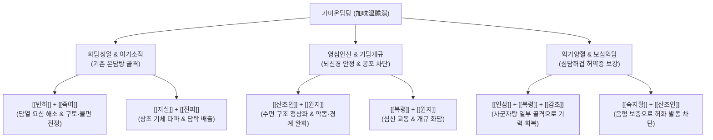

---
aliases:
  - 가미온담탕
  - 加味溫膽湯
  - Gami-ondam-tang
tags:
  - 처방/이기화해제
  - 이기화해제/화담안신
  - 심담허겁
  - 담한증
  - 공황장애
  - 불면증
---
# 🍵 [[가미온담탕]] (加味溫膽湯, Gami-ondam-tang / Augmented Gallbladder-Warming Decoction)

> **핵심 3줄 요약 (Key Summary)**:
> - 🌿 기본 구성: [[반하]], [[진피]], [[복령]], [[지실]], [[죽여]], [[감초]], [[산조인]], [[원지]], [[인삼]], [[숙지황]], [[생강]], [[대조]] 배오.
> - 🎯 심담허겁(心膽虛怯) 및 담탁요심(痰濁擾心)으로 인해 잘 놀라고 가슴이 뛰며 혼자 있기 두려워하는 담한증(膽寒證), 공황장애, 외상후스트레스장애(PTSD), 신경쇠약 불면.
> - 🔬 전두엽-편도체 공포 회로 진정, GABA_A 및 5-HT1A 신경전달 촉진, 해마 BDNF 발현 증강, 스트레스성 HPA축 코르티솔 과잉 분비 차단.
> - <font color="#fa7e7e">⚠️ 주의사항: 숙지황 배오로 비위가 극도로 허한하여 소화 흡수가 불량한 환자는 사인을 가미하거나 식후 온복 지도, 급성 실열 번조는 황련을 증량.</font>

---

## 📌 목차
1. [기본 처방 정보 & 군신좌사 구성](#1-기본-처방-정보--군신좌사-구성)
2. [방제학적 약재 상호작용 & 시너지 네트워크](#2-방제학적-약재-상호작용--시너지-네트워크)
3. [현대 분자약리학적 효능 & 작용 기전](#3-현대-분자약리학적-효능--작용-기전)
4. [적응 병증 및 체질별 감별 (Sweet Spot vs 금기)](#4-적응-병증-및-체질별-감별-sweet-spot-vs-금기)
5. [유사 처방군 감별 매트릭스](#5-유사-처방군-감별-매트릭스)
6. [임상 가감례 & 현대 질환별 응용](#6-임상-가감례--현대-질환별-응용)
7. [💡 사용자 진료실 핵심 필기 & 임상 팁 (원문 보존)](#7--사용자-진료실-핵심-필기--임상-팁-원문-보존)
8. [출처 및 학술 참고 문헌 (References)](#8-출처-및-학술-참고-문헌-references)

---

## 1. 기본 처방 정보 & 군신좌사 구성

* **출전**: 송대(宋代) 진언(陳言)의 《삼인극일병증방론(三因極一病證方論)》 온담탕에 명대(明代) 《만병회춘(萬病回春)》 및 《동의보감(東醫寶鑑)》 신형문(身形門)에서 산조인·원지·인삼·숙지황 가미
* **치법**: 청열이기(淸熱理氣), 조습화담(燥濕化痰), 영심안신(寧心安神), 익기보혈(益氣補血)
* **적응증**: 심담허겁(心膽虛怯), 촉사이경(觸事易驚), 몽매불녕(夢寐不寧), 공황장애, 심계정충, 야경증, 담한증

| 구분 | 약재명 | 표준 용량 | 본초 효능 & 방제 내 역할 |
| :--- | :--- | :--- | :--- |
| **군약 (君藥)** | [[반하]] | 8g | 조습화담(燥濕化痰), 강역지구, 심흉부에 맺힌 담음(痰飮)을 말리고 내림 |
| **군약 (君藥)** | [[죽여]] | 6g | 청열화담(淸熱化痰), 제번지구, 담열(痰熱)을 식혀 심신 안정 |
| **신약 (臣藥)** | [[지실]] | 6g | 파기소적(破氣消積), 화담제비, 흉격의 기체를 깨뜨려 담음 하강 유도 |
| **신약 (臣藥)** | [[진피]] | 6g | 이기건비(理氣健脾), 조습화담, 기순환을 촉진하여 담탁 소멸 |
| **좌약 (佐藥)** | [[복령]] | 8g | 영심안신(寧心安神), 건비삼습, 심신을 안정시키고 수습 배출 |
| **좌약 (佐藥)** | [[산조인]] (초) | 8g | 양심익간(養心益肝), 영심안신, 심혈을 길러 신경성 불면과 경계 완화 |
| **좌약 (佐藥)** | [[원지]] | 6g | 영심안신(寧心安神), 거담개규, 심신간(心腎間) 교통 및 정신 집중 |
| **좌약 (佐藥)** | [[인삼]] | 4g | 대보원기(大補元氣), 보비익폐, 심담의 기운을 보하여 공포심 억제 |
| **좌약 (佐藥)** | [[숙지황]] | 6g | 자음보혈(滋陰補血), 익정전수, 심혈과 신음을 보하여 허열 안정 |
| **좌약 (佐藥)** | [[생강]] | 4g | 온중강역(溫中降逆), 조습, 반하의 독성을 제어하고 비위 온화 |
| **좌약 (佐藥)** | [[대조]] | 4g | 보비익기(補脾益氣), 양혈안신, 생강과 배오하여 영위를 조화 |
| **사약 (使藥)** | [[감초]] | 3g | 보기화중(補氣和中), 조화제약, 제약을 중화 |

---

## 2. 방제학적 약재 상호작용 & 시너지 네트워크



* **화담(化痰)과 안신(安神)의 이중 축**:
  - 기본 온담탕의 [[반하]]·[[죽여]]·[[지실]]·[[진피]]가 뇌를 흐리는 담탁(痰濁)과 상초의 열기(담열)를 제거하고, 가미된 [[산조인]]·[[원지]]가 편도체의 과흥분을 진정시켜 심신을 안정시킵니다.
* **공보겸시(攻補兼施)의 완벽한 밸런스**:
  - 담탁을 쳐내는 이기·화담제에 [[인삼]]·[[숙지황]]의 기혈 보양 약재를 결합하여, 기혈이 허해진 상태에서 담열이 생겨 발생하는 심담허겁(心膽虛怯)의 본(本, 기혈 부족)과 표(標, 담열 요심)를 동시에 치료합니다.

---

## 3. 현대 분자약리학적 효능 & 작용 기전

```
                  [가미온담탕 탕전액 복용]
                             │
     ┌───────────────────────┼───────────────────────┐
     ▼                       ▼                       ▼
[편도체 공포회로 과흥분 차단]  [수면 구조 및 뇌신경 보호]  [자율신경계 과항진 정상화]
GABA_A 수용체 활성화 / Glu 억제 5-HT1A 촉진 & 해마 BDNF 증가 교감신경 긴장 억제 & HRV 개선
놀람·공포·불안 발작 억제       비렘 수면 증가, 야경증 완화   가슴 두근거림·식은땀 진정
```

1. **GABA_A 수용체 촉진 및 글루타메이트 흥분독성 차단**:
   - [[산조인]]의 쥬주보사이드(Jujuboside A/B)와 [[복령]]의 파키믹산(Pachymic acid)은 중추신경계 GABA_A 수용체의 기능을 촉진하고 시냅스 간극의 흥분성 신경전달물질(Glutamate) 유리를 억제합니다.
   - 이는 편도체(Amygdala) 중심핵의 공포 회로 과항진을 차단하여 사소한 소리에도 깜짝 놀라고 혼자 있지 못하는 담한증(膽寒證) 및 공황 발작을 진정시킵니다.
2. **해마 BDNF 발현 증강 및 뇌신경 가소성(Neuroplasticity) 회복**:
   - [[원지]]의 테누이폴린(Tenuifolin)과 [[인삼]]의 진세노사이드(Ginsenoside Rg1, Rb1)는 해마의 신경영양인자(BDNF, Brain-Derived Neurotrophic Factor) 분비를 촉진하고 CREB 인산화를 유도합니다.
   - 만성 스트레스나 트라우마로 위축된 해마 신경세포를 보호하고 외상후스트레스장애(PTSD)의 부정적 공포 기억 재응고를 억제합니다.
3. **자율신경계 안정 및 심박변이도(HRV) 개선**:
   - [[죽여]]와 [[지실]]의 플라보노이드 성분이 혈관 내피세포 및 심장 교감신경의 베타-아드레날린성 과흥분을 차단하여 심계항진, 흉민, 돌발적 오한·발한 증상을 완충합니다.

---

## 4. 적응 병증 및 체질별 감별 (Sweet Spot vs 금기)

### 1) Sweet Spot (최적 적용군)
* **주요 체질**: 신경이 예민하고 체력이 다소 저하된 소음인, 혹은 간담 기능이 허약해진 태음인
* **핵심 증상**:
  - 담한증(膽寒證): 매사에 겁이 많고, 문 닫는 소리나 낯선 소리에 깜짝깜짝 놀람, 밤에 혼자 잠들지 못하고 불을 켜놓고 잠.
  - 정신신경과 질환: 공황장애, 범불안장애, 외상후스트레스장애(PTSD), 수면장애(다몽, 가위눌림, 조기 각성).
  - 소화기·자율신경 질환: 신경성 위염, 가슴 답답함, 목 안의 이물감, 어지럼증, 메스꺼움.
* **설진/맥진**: 설담홍태백니(舌淡紅苔白膩) 또는 태미황(苔微黃), 맥현세(脈弦細) 혹은 활삭(滑數).

### 2) 금기 및 신중 투여군
* **비위 극허성 만성 설사 환자**: 숙지황의 점체성으로 인해 평소 소화력이 전혀 없고 묽은 변을 보는 환자는 숙지황을 빼거나 [[사인]]을 가미하여 복용 지도.
* **급성 고열 및 화열 실증 환자**: 헛소리를 하거나 얼굴이 붉고 극심한 갈증이 있는 실열 환자에게는 [[황련온담탕]]이나 [[안궁우황환]] 계열을 우선 사용.

---

## 5. 유사 처방군 감별 매트릭스

| 처방명 | 핵심 구성 차이 | 주치 및 임상 차별점 | 맥진/설진 차이 |
| :--- | :--- | :--- | :--- |
| [[가미온담탕]] | 온담탕 + [[산조인]], [[원지]], [[인삼]], [[숙지황]] | **심담허겁 담한증**, 극도의 공포심, 공황장애, 만성 신경쇠약 | 설담태백니, 맥현세 |
| [[온담탕]] | 반하, 진피, 복령, 지실, 죽여, 감초, 생강, 대조 | 기체 담열로 인한 **단순 불면, 오심구토, 현훈, 흉민** | 설태황니, 맥현활 |
| [[황련온담탕]] | 온담탕 + [[황련]] | 담열이 극심하여 발생하는 **심번, 불안, 구갈, 혓바늘, 분노** | 설홍태황니, 맥활삭 |
| [[귀비탕]] | 인삼, 황기, 백출, 복령, 산조인, 용안육, 당귀, 원지 등 | 담음 증상 없이 **순수 사려과다로 인한 심비양허**(빈혈, 피로) | 설담태박, 맥세약 |
| [[천왕보심단]] | 생지황, 현삼, 천문동, 맥문동, 인삼, 단삼, 산조인 등 | **심신불교(心腎不交) 음허화왕**, 손발 화끈거림, 구갈, 도한 | 설홍소태, 맥세삭 |

---

## 6. 임상 가감례 & 현대 질환별 응용

### 1) 주요 가감례
* **가슴에 열감이 심하고 혓바늘이 돋는 경우**: [[황련]] 3~4g 가미 (청심사화).
* **목 안에 가래가 걸려 뱉어도 안 나오는 경우 (매핵기)**: [[후박]] 4g, [[소엽]] 3g 가미.
* **어지럼증(현훈)과 이명이 심한 경우**: [[백출]] 4g, [[천마]] 4g 가미 (반하백출천마탕 합방).
* **소화가 더부룩하고 식욕이 없는 경우**: [[사인]] 3g, [[백두구]] 3g 가미.

### 2) 현대 질환별 응용
* **공황장애(Panic Disorder)**: 공황 발작의 빈도와 강도를 줄이고 양방 신경안정제(알프라졸람 등) 감량기 반동 불안 억제.
* **소아 야경증 & 수면 공포증**: 밤마다 자다 깨서 비명을 지르고 우는 소아의 담한증 치료.
* **시험 불안증 & 면접 공포증**: 중요한 일정을 앞두고 가슴이 터질 듯 뛰고 손발이 차가워지는 자율신경실조증 교정.

---

## 7. 💡 사용자 진료실 핵심 필기 & 임상 팁 (원문 보존)

> [!tip] **진료실 실전 노하우 (User Clinical Insight)**
> 
> * **담한증(膽寒證)에 활용**:
>   - 평소 겁이 많아 혼자 집에 있지 못하거나 어두운 곳을 무서워하는 증상.
>   - 작은 소리에도 깜짝깜짝 놀라고, 가슴이 두근거리며, 잠자리에 누우면 헛것이 보일 것 같은 불안감에 불을 켜놓고 자야 하는 환자에게 특효.
>   - 기본 온담탕의 담탁(痰濁) 제거력에 산조인·원지의 신경 진정 및 인삼·숙지황의 기혈 보양력이 합쳐져 담허(膽虛)로 인한 신경성 공포증을 완벽히 다스림.

---

## 8. 출처 및 학술 참고 문헌 (References)

1. Chen, Y. (宋代). 《삼인극일병증방론(三因極一病證方論)》: "溫膽湯 治心膽虛怯 觸事易驚 夢寐不祥 異象惑亂 嘔涎心悸."
2. Heo, J. (朝鮮). 《동의보감(東醫寶鑑)》 신형문(身形門): "加味溫膽湯 治心膽虛怯 觸事易驚 晝夜不寐 及痰氣鬱結."
