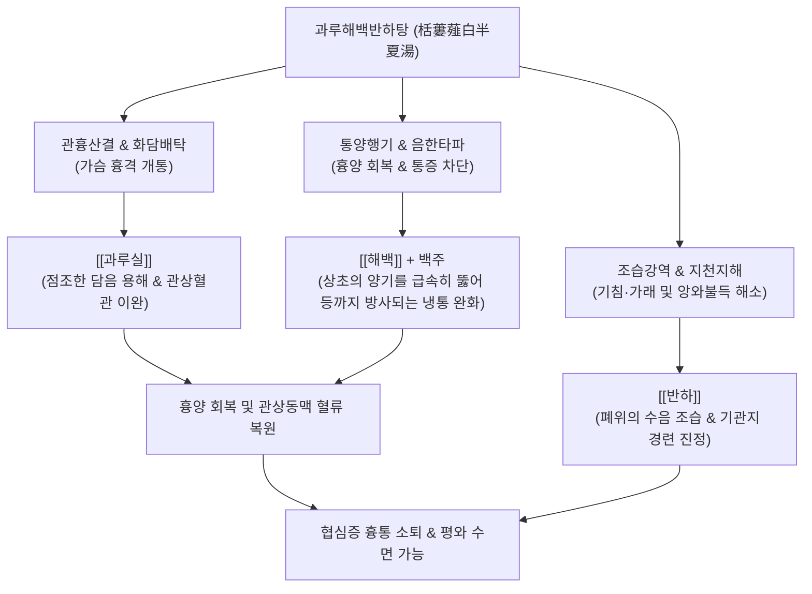

---
aliases:
  - 과루해백반하탕
  - 栝蔞薤白半夏湯
  - Gwalouhaebaekbanha-tang
  - Gualou Xiebai Banxia Decoction
tags:
  - 처방/이기화해제
  - 이기화해제/통양산결
  - 흉비철배
  - 협심증
  - 앙와불득
---
# 🍵 [[과루해백반하탕]] (栝蔞薤白半夏湯, Gwalouhaebaekbanha-tang / Trichosanthes, Bakeri, and Pinellia Decoction)

> **핵심 3줄 요약 (Key Summary)**:
> - 🌿 기본 구성: [[과루실]], [[해백]], [[반하]] 배오 (백주 또는 청주로 전탕).
> - 🎯 흉양(胸陽) 부진 및 한담(寒痰)의 응체로 앞가슴 통증이 등 뒤까지 꿰뚫듯 아픈 흉비철배(胸痺徹背), 천식, 가래, 바로 눕지 못하는 앙와불득(仰臥不得), 협심증.
> - 🔬 관상동맥 확장 및 심근 산소 소모량 감소, 알리신 계열 성분의 혈소판 응집(TXA2) 억제, 기관지·소화관 평활근 연축 완화 및 점액 분비 억제.
> - <font color="#fa7e7e">⚠️ 주의사항: 백주(청주) 전탕 원칙이나 알코올 불내증 환자는 물로 전탕, 음허화왕(陰虛火旺)으로 혀가 붉고 진액이 마른 흉통 환자는 투여 금기.</font>

---

## 📌 목차
1. [기본 처방 정보 & 군신좌사 구성](#1-기본-처방-정보--군신좌사-구성)
2. [방제학적 약재 상호작용 & 시너지 네트워크](#2-방제학적-약재-상호작용--시너지-네트워크)
3. [현대 분자약리학적 효능 & 작용 기전](#3-현대-분자약리학적-효능--작용-기전)
4. [적응 병증 및 체질별 감별 (Sweet Spot vs 금기)](#4-적응-병증-및-체질별-감별-sweet-spot-vs-금기)
5. [유사 처방군 감별 매트릭스](#5-유사-처방군-감별-매트릭스)
6. [임상 가감례 & 현대 질환별 응용](#6-임상-가감례--현대-질환별-응용)
7. [💡 사용자 진료실 핵심 필기 & 임상 팁 (원문 보존)](#7--사용자-진료실-핵심-필기--임상-팁-원문-보존)
8. [출처 및 학술 참고 문헌 (References)](#8-출처-및-학술-참고-문헌-references)

---

## 1. 기본 처방 정보 & 군신좌사 구성

* **출전**: 한대(漢代) 장중경(張仲景)의 《금궤요략(金匱要略)》 흉비심통단기병맥증병치(胸痺心痛短氣病脈證幷治)
* **치법**: 통양산결(通陽散結), 조습화담(燥濕化痰), 강역지도(降逆止痛)
* **적응증**: 흉양부진(胸陽不振), 담탁응체(痰濁凝滯), 흉비철배(胸痺徹背), 심흉통, 천해단기, 앙와불득

| 구분 | 약재명 | 표준 용량 | 본초 효능 & 방제 내 역할 |
| :--- | :--- | :--- | :--- |
| **군약 (君藥)** | [[과루실]] (전과루) | 15~20g | 화담산결(化痰散結), 관흉리지, 가슴에 엉긴 탁한 담음을 씻어내고 흉격을 넓힘 |
| **군약 (君藥)** | [[해백]] | 12g | 통양산결(通陽散結), 행기지도, 흉양(胸陽)을 소통시키고 음한(陰寒)의 응체를 타파 |
| **신약 (臣藥)** | [[반하]] | 9~12g | 조습화담(燥濕化痰), 강역지구, 수음(水飮)을 말리고 치솟는 기운을 내려 앙와불득 해소 |
| **좌사약 (佐使藥)** | 백주 (청주) | 500~1000ml | 신온통양(辛溫通陽), 행혈행기, 약력을 상초 심흉부로 강력하게 이끌어 흉양 활성화 |

---

## 2. 방제학적 약재 상호작용 & 시너지 네트워크



* **관흉(寬胸)과 통양(通陽)의 결합**:
  - [[과루실]]의 감한(甘寒) 윤조 화담력과 [[해백]]의 신고온(辛苦溫) 통양력이 음양 상보를 이루어, 차가운 담탁이 가슴을 꽉 막고 있는 병리를 신속히 뚫어줍니다.
* **반하와 백주의 약효 증폭**:
  - 과루해백백주탕에 [[반하]]를 가미함으로써 수음(水飮)의 역상을 강력하게 눌러주고, 백주가 지용성 유효 성분의 용출과 심흉부 약효 전달을 극대화합니다.

---

## 3. 현대 분자약리학적 효능 & 작용 기전

```
                 [과루해백반하탕 전탕액 복용]
                              │
        ┌─────────────────────┼─────────────────────┐
        ▼                     ▼                     ▼
 [관상동맥 확장 및 혈류 증대] [혈소판 응집 및 혈전 차단]  [기관지·식도 평활근 연축 억제]
 과루실 트리테르페노이드    해백 알리신/함황 화합물   반하 알칼로이드 성분
 심근 산소 소비량 감소      TXA2 억제, 혈소판 부착 방어 미주신경 과항진 완화
 허혈성 심근 괴사 방어      관상동맥 미세혈류 순환 개선 기침·호흡곤란·앙와불득 해소
```

1. **관상동맥 확장 및 심근 허혈 방어**:
   - [[과루실]]의 [[쿠쿠르비타신]](Cucurbitacin) 및 유기산 성분은 관상동맥의 평활근을 이완시켜 관혈류량을 증가시키고, 심근세포 미토콘드리아의 ATP 생성을 보존하여 급성 허혈성 심근 손상을 방어합니다.
2. **혈소판 응집 억제 및 항혈전 작용**:
   - [[해백]]의 [[디알릴 디설파이드]](Diallyl disulfide) 등 천연 유기 황화합물은 트롬복산 $A_2(TXA_2)$ 합성을 저해하고 혈소판 막당단백(GPIIb/IIIa) 활성화를 차단하여 관상동맥 내 미세혈전 형성을 억제합니다.
3. **기도 과민성 및 식도 경련 진정**:
   - [[반하]]의 [[에페드린 유사 알칼로이드]] 및 [[아미노산]] 성분은 중추성 기침 반사를 억제하고 기관지 점막의 과다 분비를 말려, 눕기만 하면 기침과 숨참이 악화되는 앙와불득(Orthopnea) 증상을 즉각적으로 개선합니다.

---

## 4. 적응 병증 및 체질별 감별 (Sweet Spot vs 금기)

### 1) Sweet Spot (최적 적용군)
* **주요 체질**: 상초의 양기가 부족하고 흉격에 습담이 정체하기 쉬운 태음인, 또는 고령의 양허체질
* **핵심 증상**:
  - 흉비철배(胸痺徹背): 가슴이 뻐근하게 조여오면서 통증이 등 뒤(날개뼈 사이)까지 관통하듯 방사되는 통증.
  - 앙와불득(仰臥不得): 눕기만 하면 가슴이 막히고 가래가 끓어 숨이 차서 앉아서 밤을 지새우는 증상.
  - 협심증, 허혈성 심장질환, 관상동맥 연축증, 역류성 식도염으로 인한 비심인성 흉통.
* **설진/맥진**: 설담암태백니(舌淡暗苔白膩) 또는 백활(白滑), 맥침지(脈沈遲) 혹은 현활(弦滑).

### 2) 금기 및 신중 투여군
* **음허화왕(陰虛火旺)성 흉통 환자**: 혀가 붉고 태가 없으며(설홍무태), 입이 바짝 마르고 조열이 있는 환자에게는 백주와 반하의 온조성이 화열을 조장할 수 있으므로 금기.
* **알코올 알레르기 및 간경화 환자**: 백주 전탕을 피하고 순수 물로 달여 복용하도록 지도.

---

## 5. 유사 처방군 감별 매트릭스

| 처방명 | 핵심 구성 차이 | 주치 및 임상 차별점 | 맥진/설진 차이 |
| :--- | :--- | :--- | :--- |
| [[과루해백반하탕]] | 과루실, 해백, 반하, 백주 | **흉비철배 + 앙와불득**, 담음과 수음이 극심하여 눕지 못하는 중증 | 설담태백니, 맥침현 |
| [[과루해백백주탕]] | 과루실, 해백, 백주 | **흉비 초기**, 가슴 결림과 뻐근한 통증 위주 (반하 없음) | 설태백박, 맥현 |
| [[지실해백계지탕]] | 과루실, 해백, 지실, 후박, 계지 | 흉비에 **비기(痞氣)와 하복부 기운 치솟음(분돈)**이 동반된 팽만 | 설태백후니, 맥침현 |
| [[단삼음]] | 단삼, 단향, 사인 | 담음보다는 **순수 어혈과 기체**로 인한 심흉부 자통(刺痛) | 설암유어점, 맥삽 |
| [[복령행인감초탕]] | 복령, 행인, 감초 | 흉비 중 **호흡 곤란과 가래, 수음(水飮)** 위주 (통증은 경미) | 설담태수활, 맥부활 |

---

## 6. 임상 가감례 & 현대 질환별 응용

### 1) 주요 가감례
* **가슴의 찌르는 듯한 어혈 통증이 심한 경우**: [[단삼]] 8g, [[울금]] 6g, [[삼칠근]] 3g 가미.
* **기체(氣滯)로 가슴과 명치가 꽉 막힌 경우**: [[지실]] 6g, [[후박]] 6g 가미 (지실해백계지탕의 방의 도입).
* **심양허(心陽虛)로 손발이 차고 오한이 심한 경우**: [[부자]] 4g, [[계지]] 6g 가미.
* **식도 역류성 산역(신트림) 및 가슴쓰림 동반 시**: [[황련]] 3g, [[오수유]] 2g 가미 (좌금환 방의).

### 2) 현대 질환별 응용
* **안정형 및 변이형 협심증**: 관상동맥 연축(Coronary artery spasm)을 풀어주고 심근 허혈 손상을 예방.
* **역류성 식도염 및 식도 경련증**: 심장 이상이 없는데도 흉골 뒤쪽이 뻐근하게 조여오고 등 뒤까지 아픈 식도성 흉통 치료.
* **만성 기관지염 및 심장성 천식**: 가래와 함께 야간 기좌호흡(Orthopnea)을 유발하는 노인성 심폐 부전 완화.

---

## 7. 💡 사용자 진료실 핵심 필기 & 임상 팁 (원문 보존)

> [!tip] **진료실 실전 노하우 (User Clinical Insight)**
> 
> * **흉비철배(胸痺徹背)와 앙와불득(仰臥不得)의 감별 포인트**:
>   - 앞가슴의 통증이 등 뒤 견갑골 사이로 꿰뚫고 지나가는 듯한 전형적인 허혈성 흉통(Cardiac referred pain)에 1차 처방.
>   - 환자가 "누우면 가슴이 답답하고 숨이 막혀 밤새 앉아서 잔다"고 호소할 때 반하의 배오가 필수적임.
> * **전탕법 노하우**:
>   - 원방은 백주(맑은 청주) 1되와 물을 섞어 달이나, 알코올에 예민하거나 간질환이 있는 현대 환자에게는 물로만 달이거나 청주를 1~2스푼만 넣어 알코올을 날린 후 복용시킴.

---

## 8. 출처 및 학술 참고 문헌 (References)

1. Zhang, Z. J. (漢代). 《금궤요략(金匱要略)》 흉비심통단기병맥증병치: "胸痺不得臥 心痛徹背者 栝蔞薤白半夏湯主之."
2. * **Han DS et al. (2026)**. [Effects of Gualou Xiebai Banxia Decoction on pulmonary vascular remodeling in rats with hypoxic pulmonary hypertension]. *Zhongguo Zhong yao za zhi = Zhongguo zhongyao zazhi = China journal of Chinese materia medica*, 51: 4723-4733. [PMID: 42693025](https://pubmed.ncbi.nlm.nih.gov/42693025/)
4. * **Fan M et al. (2025)**. Banxia Gualou Xiebai Tang and Qishen Yiqi Dropping Pills Combined Therapy for Qi Deficiency, Phlegm, and Blood Stasis Syndrome in Post-PCI Coronary Heart Disease Patients. *International journal of general medicine*, 18: 1795-1805. [PMID: 40191232](https://pubmed.ncbi.nlm.nih.gov/40191232/)
