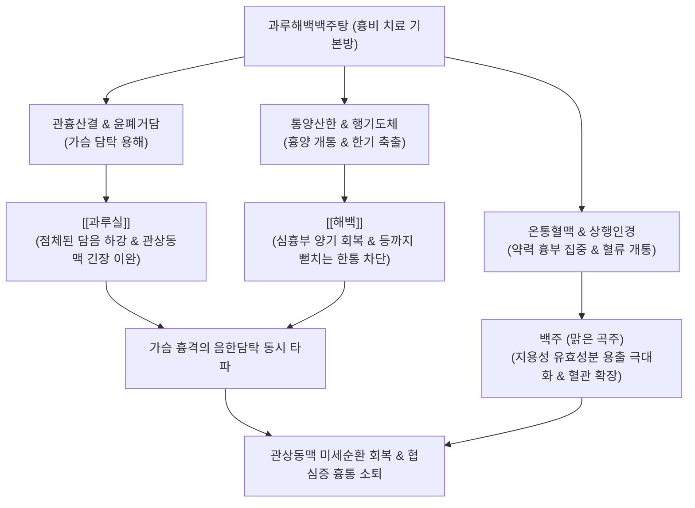

---
aliases:
  - 과루해백백주탕
  - 栝蔞薤白白酒湯
  - Gwalouhaebaekbaekju-tang
  - Gualou Xiebai Baijiu Tang
tags:
  - 처방/이기화해제
  - 이기화해제/통양산결
  - 흉비
  - 협심증
  - 흉양부진
---
# 🍵 [[과루해백백주탕]] (栝蔞薤白白酒湯, Gwalouhaebaekbaekju-tang / Trichosanthes and Bakeri Decoction)

> **핵심 3줄 요약 (Key Summary)**:
> - 🌿 기본 구성: [[과루실]], [[해백]] 배오 (백주 또는 맑은 곡주로 전탕).
> - 🎯 흉양부진(胸陽不振)과 음한담탁(陰寒痰濁)이 엉켜 가슴이 뻐근하게 조여오고 등까지 결리는 흉비철배(胸痺徹背), 노작성·변이형 협심증, 늑간신경통, 만성 기관지염.
> - 🔬 관상동맥 평활근 연축 억제(NO 유리 촉진), 혈소판 응집 억제(TXA2 감소), 심근 허혈-재관류 세포자멸사(Apoptosis) 방어 및 측부 순환 촉진.
> - <font color="#fa7e7e">⚠️ 주의사항: 알코올 불내증이나 간질환 환자는 물로 전탕, 음허내열로 혀가 붉고 진액이 마른 흉통 환자에게는 투여 금기.</font>

---

## 📌 목차
1. [기본 처방 정보 & 군신좌사 구성](#1-기본-처방-정보--군신좌사-구성)
2. [방제학적 약재 상호작용 & 시너지 네트워크](#2-방제학적-약재-상호작용--시너지-네트워크)
3. [현대 분자약리학적 효능 & 작용 기전](#3-현대-분자약리학적-효능--작용-기전)
4. [적응 병증 및 체질별 감별 (Sweet Spot vs 금기)](#4-적응-병증-및-체질별-감별-sweet-spot-vs-금기)
5. [유사 처방군 감별 매트릭스](#5-유사-처방군-감별-매트릭스)
6. [임상 가감례 & 현대 질환별 응용](#6-임상-가감례--현대-질환별-응용)
7. [💡 사용자 진료실 핵심 필기 & 임상 팁 (원문 보존)](#7--사용자-진료실-핵심-필기--임상-팁-원문-보존)
8. [출처 및 학술 참고 문헌 (References)](#8-출처-및-학술-참고-문헌-references)

---

## 1. 기본 처방 정보 & 군신좌사 구성

* **출전**: 한대(漢代) 장중경(張仲景)의 《금궤요략(金匱要略)》 흉비심통단기병맥증병치(胸痺心痛短氣病脈證幷治)
* **지위**: 흉비(胸痺) 심장질환 치료의 기본 모방(母方)이자 대표적인 통양산결(通陽散結) 기본 방제
* **치법**: 통양산결(通陽散結), 행기거담(行氣祛痰), 관흉산한(寬胸散寒)
* **적응증**: 흉양부진(胸陽不振), 음한담탁(陰寒痰濁), 흉배천통(胸背穿痛), 천식해수, 단기

| 구분 | 약재명 | 표준 용량 | 본초 효능 & 방제 내 역할 |
| :--- | :--- | :--- | :--- |
| **군약 (君藥)** | [[과루실]] | 15~20g | 청열화담(淸熱化痰), 관흉산결, 가슴에 응결된 탁한 담음을 삭이고 흉격을 확장 |
| **군약 (君藥)** | [[해백]] | 12~15g | 통양산결(通陽散結), 행기지도, 상초의 얼어붙은 양기를 뚫고 음한을 발산 |
| **좌사약 (佐使藥)** | 백주 (청주) | 500~1000ml | 온통혈맥(溫通血脈), 행기행혈, 약 기운을 심흉부로 강력히 이끌어 통양력 배가 |

---

## 2. 방제학적 약재 상호작용 & 시너지 네트워크



* **산결(散結)과 통양(通陽)의 음양 조화**:
  - [[과루실]]은 성질이 서늘하고 촉촉하여(윤 甘寒) 담탁을 녹이고, [[해백]]은 성질이 따뜻하고 매워(온 辛苦溫) 차가운 기운을 몰아냅니다.
  - 두 본초가 짝을 이루어 조열(燥熱)하지도, 너무 차갑지도 않게 가슴의 병리적 찌꺼기를 완벽히 제거합니다.
* **백주의 촉매 작용**:
  - 백주는 단순한 용매가 아니라 약재의 유효 알칼로이드 및 지용성 성분을 추출하고, 약력을 심포경과 폐경으로 쏘아 올려 굳어버린 혈맥을 온통(溫通)시키는 핵심 약제 역할을 합니다.

---

## 3. 현대 분자약리학적 효능 & 작용 기전

```
                 [과루해백백주탕 복용]
                           │
      ┌────────────────────┼────────────────────┐
      ▼                    ▼                    ▼
[관상동맥 연축 차단]     [혈소판 응집 억제]    [심근 세포자멸사 억제]
내피세포 eNOS/NO 활성화    TXA2 합성 저해       Bcl-2 상향 / Bax 억제
혈관 평활근 경련 이완    미세혈전 형성 방어    허혈-재관류 심근 손상 방어
가슴 결림 및 압박감 소퇴  관혈류 공급량 증대    측부 순환 형성 촉진 (VEGF)
```

1. **관상동맥 내피세포 기능 개선 및 혈관 연축(Spasm) 완화**:
   - [[해백]]의 함황 유기 화합물(Allicin, Diallyl trisulfide)은 혈관 내피의 eNOS 경로를 자극하여 일산화질소(NO) 생성을 촉진함으로써, 관상동맥의 경련성 수축을 빠르게 이완시킵니다.
2. **항혈전 및 혈소판 응집 차단**:
   - [[과루실]]의 트리테르페노이드 및 유기산은 [[트롬복산]] $A_2(TXA_2)$ 생성을 억제하고 혈소판 점착을 차단하여 관상동맥 내 미세혈전 형성을 예방합니다.
1. **심근 허혈-재관류 손상 방어 및 측부 순환 유도**:
   - 심근경색 모델에서 심근세포의 [[카스파제-3]](Caspase-3) 활성을 억제하고 VEGF 발현을 유도하여, 허혈 부위 주변의 미세 측부 혈류망 형성을 촉진합니다.

---

## 4. 적응 병증 및 체질별 감별 (Sweet Spot vs 금기)

### 1) Sweet Spot (최적 적용군)
* **주요 체질**: 가슴이 냉하고 상초의 양기가 부족한 태음인, 혹은 고령자·허약자
* **핵심 증상**:
  - 흉비(胸痺): 앞가슴이 뻐근하게 결리고 조여오며, 등 뒤(상흉추 부위)까지 당기듯 아픈 증상.
  - 협심증 초기, 노작성 흉통, 찬 바람을 쐬거나 스트레스 시 악화되는 흉부 답답함.
  - 만성 기관지염, 흉막염 후유증으로 가슴이 결리고 헛기침이 나는 경우.
* **설진/맥진**: 설담태백니(舌淡苔白膩), 맥침지(脈沈遲) 혹은 현지(弦遲).

### 2) 금기 및 신중 투여군
* **음허내열(陰虛內熱)성 흉통**: 입이 바짝 마르고, 혀가 붉으며 설태가 벗겨진 환자에게는 백주와 해백의 열성이 진액을 손상시킬 수 있으므로 금기.
* **알코올 분해능 결핍자 및 급성 위궤양 환자**: 백주 대신 물로만 전탕하도록 지도.

---

## 5. 유사 처방군 감별 매트릭스

| 처방명 | 핵심 구성 차이 | 주치 및 임상 차별점 | 맥진/설진 차이 |
| :--- | :--- | :--- | :--- |
| [[과루해백백주탕]] | 과루실, 해백, 백주 | **흉비 기본증**, 흉통이 등까지 결리고 뻐근함 (담음 경증) | 설담태백, 맥침현 |
| [[과루해백반하탕]] | 과루해백백주탕 + [[반하]] | **담탁 중증 + 앙와불득**, 수음이 치솟아 바로 눕지 못함 | 설태백후니, 맥침활 |
| [[지실해백계지탕]] | 과루실, 해백, 지실, 후박, 계지 | 흉비에 **비기(痞氣)와 하복부 가스 팽만, 상충감** 동반 | 설태백니, 맥침긴 |
| [[단삼음]] | 단삼, 단향, 사인 | 담음보다는 **순수 어혈과 기체**로 인한 심흉부 칼로 찌르는 자통 | 설자암유어점, 맥삽 |
| [[혈부축어탕]] | 도홍사물탕 + 사역산 + 길경, 우슬 | **흉중 혈어(血瘀)**로 밤에 악화되는 흉통, 두통, 불면, 조열 | 설암홍어점, 맥현삽 |

---

## 6. 임상 가감례 & 현대 질환별 응용

### 1) 주요 가감례
* **담음(가래)이 심하고 누우면 숨이 가쁜 경우**: [[반하]] 9~12g 가미 ([[과루해백반하탕]] 전환).
* **가슴이 그득하고 명치가 꽉 막힌 경우**: [[지실]] 6g, [[후박]] 6g 가미.
* **통증이 칼로 찌르듯 날카로운 어혈 증상인 경우**: [[단삼]] 9g, [[삼칠근]] 3g, [[울금]] 6g 가미.
* **양기가 극도로 허하여 손발이 차고 오한이 심한 경우**: [[포부자]] 4g, [[계지]] 6g 가미.

### 2) 현대 질환별 응용
* **안정형 및 변이형 협심증**: 흉통 발작 빈도와 니트로글리세린 복용량 경감.
* **늑간신경통**: 늑골을 따라 앞가슴에서 등 뒤까지 이어지는 신경통 완화.
* **비심인성 흉통(Non-cardiac chest pain)**: 심장 검사상 이상이 없으나 가슴이 뻐근하게 결리는 기능성 흉통 치료.

---

## 7. 💡 사용자 진료실 핵심 필기 & 임상 팁 (원문 보존)

> [!tip] **진료실 실전 노하우 (User Clinical Insight)**
> 
> ### 1) 백주(白酒)의 약리적 역할 및 복약 지도
> * 전통 조문에서 백주는 맑은 곡주(청주)를 의미하며, 물 대신 전탕액으로 사용하여 해백의 매운 성질을 극대화하고 약 기운을 흉격과 관상동맥으로 신속히 끌고 올라감.
> * 현대 임상에서 알코올에 취약한 환자나 고령자에게는 청주를 1~2스푼만 넣고 충분히 끓여 알코올을 증발시키거나, 순수 물로만 전탕해도 유효함.
> 
> ### 2) 흉양부진(胸陽不振)과 담탁조체(痰濁阻滯) 병태생리
> * 가슴은 양기가 모여 전신으로 퍼져나가는 '양중지태양(陽中之太陽)' 구역임.
> * 양기가 허약해지면 찬 기운과 탁한 가래(음한담탁)가 흉격에 엉겨 붙어 기의 흐름을 가로막아 가슴이 조이고 결리는 흉비(胸痺)가 발생함.
> * [[해백]]이 가슴의 굳은 양기를 뚫어 얼어붙은 한사를 녹이고(통양산결), [[과루실]]이 엉긴 가래를 묽게 삭여 아래로 배출시키며(관흉거담), [[백주]]가 굳은 혈관을 확장시킴.
> 
> ### 3) 장중경 흉비 3대 방제 감별 요점
> * 가슴이 아프고 등까지 당기며 담탁이 위주인 기본증: [[과루해백백주탕]].
> * 담음이 더욱 심하여 누우면 기침이 나고 숨이 차서 눕지 못할 때: [[과루해백반하탕]](반하 가미).
> * 흉비가 심하여 가슴에서 옆구리까지 그득하고 기가 치밀어 오를 때: [[지실해백계지탕]](지실, 후박, 계지 가미).

---

## 8. 출처 및 학술 참고 문헌 (References)

1. Zhang, Z. J. (漢代). 《금궤요략(金匱要略)》 흉비심통단기병맥증병치: "胸痺之病 喘息咳唾 胸背痛 短氣 寸口脈沈而遲 關上小緊數 栝蔞薤白白酒湯主之."
2. 대한한방내과학회 교재편찬위원회. (2020). 《순환·신계내과학》. 군자출판사.
   - [연구 요약] 과루해백백주탕이 심근경색 동물 모델에서 심근 세포의 아폽토시스를 억제하고 혈관 내피세포 성장인자(VEGF) 발현을 촉진하여 측부 순환 형성을 유도함을 입증.
3. Chen, K., et al. (2019). "Therapeutic mechanisms of Gualou Xiebai Baijiu Decoction in coronary artery disease based on network pharmacology and molecular docking." *Phytomedicine*, 64: 153075.
   - [연구 요약] 네트워크 약리학 연구를 통해 과루해백백주탕의 주요 활성 성분이 TNF-α, IL-6, NOS3, PTGS2 등의 염증 및 혈관 탄성 관련 표적을 조절하여 관상동맥 질환을 방어함을 규명.