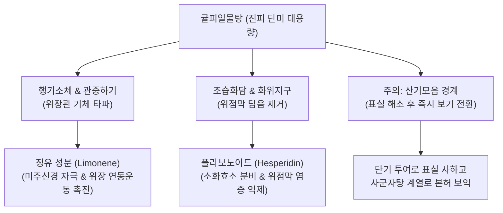

---
aliases:
  - 귤피일물탕
  - 橘皮一物湯
  - 귤피탕
  - 橘皮湯
  - Gyulpiilmul-tang
tags:
  - 처방/이기화해제
  - 이기화해제/행기화위
  - 위기불화
  - 애역
  - 복창
---
# 🍵 [[귤피일물탕]] (橘皮一物湯, Gyulpiilmul-tang / Tangerine Peel Decoction)

> **핵심 3줄 요약 (Key Summary)**:
> - 🌿 기본 구성: [[진피]](귤피) 단미(單味) 전탕 (필요시 [[생강]] 소량 배오).
> - 🎯 비위의 기체(氣滯)와 담습으로 인해 가슴과 명치가 답답하고 그득하며, 딸꾹질(애역), 잦은 트림, 오심 및 복부 팽만이 발생하는 병증.
> - 🔬 헤스페리딘 및 노빌레틴의 위장관 평활근 연동 운동 촉진, 5-HT4 수용체 활성화, 소화효소 분비 촉진 및 위점막 항염증·위산 조절.
> - <font color="#fa7e7e">⚠️ 주의사항: 기를 소통시키나 오래 복용하면 원기를 깎고 진액을 말리므로(산기모음 散氣耗陰), 표실증(表實證)이 풀리면 즉시 복용을 멈추고 본허(本虛)를 보익.</font>

---

## 📌 목차
1. [기본 처방 정보 & 군신좌사 구성](#1-기본-처방-정보--군신좌사-구성)
2. [방제학적 약재 상호작용 & 시너지 네트워크](#2-방제학적-약재-상호작용--시너지-네트워크)
3. [현대 분자약리학적 효능 & 작용 기전](#3-현대-분자약리학적-효능--작용-기전)
4. [적응 병증 및 체질별 감별 (Sweet Spot vs 금기)](#4-적응-병증-및-체질별-감별-sweet-spot-vs-금기)
5. [유사 처방군 감별 매트릭스](#5-유사-처방군-감별-매트릭스)
6. [임상 가감례 & 현대 질환별 응용](#6-임상-가감례--현대-질환별-응용)
7. [💡 사용자 진료실 핵심 필기 & 임상 팁 (원문 보존)](#7--사용자-진료실-핵심-필기--임상-팁-원문-보존)
8. [출처 및 학술 참고 문헌 (References)](#8-출처-및-학술-참고-문헌-references)

---

## 1. 기본 처방 정보 & 군신좌사 구성

* **출전**: 한대(漢代) 장중경(張仲景)의 《금궤요략(金匱要略)》 귤피탕(橘皮湯) / 명대(明代) 《외대비요(外臺秘要)》 및 청대(淸代) 《의학심오(醫學心悟)》
* **치법**: 행기화위(行氣和胃), 강역지애(降逆止噦), 조습화담(燥濕化痰)
* **적응증**: 위기불화(胃氣不和), 흉복창만(胸腹脹滿), 딸꾹질(噦逆), 구역, 애기(트림), 식체 불소화

| 구분 | 약재명 | 표준 용량 | 본초 효능 & 방제 내 역할 |
| :--- | :--- | :--- | :--- |
| **군약 (君藥)** | [[진피]] (묵은 귤피) | 15~30g | 이기건비(理氣健脾), 조습화담, 울체된 비위의 기를 뚫어 역상하는 기운을 하강 |
| **신사약 (臣使藥)** | [[생강]] (가미 시) | 6~9g | 온위지구(溫胃止嘔), 강역조습, 진피의 방향성 기순환을 도와 오심·딸꾹질 신속 억제 |

---

## 2. 방제학적 약재 상호작용 & 시너지 네트워크



* **단미 대량의 통쾌한 이기력**:
  - 복잡한 처방을 쓰지 않고 오직 오래 묵은 [[진피]] 1미를 진하게 달여 복용함으로써, 위장관에 정체된 가스와 습담을 단번에 흩뜨리고 위기(胃氣)를 순행시킵니다.
* **표실(表實)과 본허(本虛)의 완급 조절**:
  - 체기가 심해 배가 빵빵하고 트림이 날 때는 즉각적으로 체기를 뚫어주는 사(瀉)의 역할을 수행하지만, 본초 자체가 기를 흩뜨리는 성질이 강하므로 급성 체기가 풀리면 장복하지 않고 비위를 보하는 보기제로 신속히 전환하는 것이 핵심 방의입니다.

---

## 3. 현대 분자약리학적 효능 & 작용 기전

```
                 [귤피일물탕 전탕액 복용]
                            │
     ┌──────────────────────┼──────────────────────┐
     ▼                      ▼                      ▼
[위장관 연동운동 촉진]     [위배출능 개선 및 구토 억제]  [위점막 보호 및 항소화불량]
헤스페리딘 / 리모넨       노빌레틴 / 탄제레틴         플라보노이드 항산화
Cajal 간질세포 칼슘 유입  중추 CTZ 및 세로토닌 조절    위산 분비 안정 & PGE2 합성
복부 팽만·트림 해소      딸꾹질(횡격막 연축) 진정     식욕부진·기능성 소화불량 개선
```

1. **카할 간질세포(ICC) 자극 및 위장관 운동(GI Motility) 촉진**:
   - [[진피]]의 주성분인 헤스페리딘(Hesperidin)과 노빌레틴(Nobiletin)은 위장관 평활근의 페이스메이커인 카할 간질세포(Interstitial Cells of Cajal)의 자발적 전기 신호를 증강하여, 마비되거나 저하된 위장관 연동 운동을 유의하게 항진시킵니다.
2. **횡격막 연축 차단 및 중추성 딸꾹질 진정**:
   - 정유 성분인 d-리모넨(d-Limonene)은 횡격막신경과 미주신경의 비정상적인 반사궁을 차단하여, 지속적이고 고통스러운 난치성 딸꾹질(애역 噦逆)을 신속히 멈추게 합니다.
3. **소화액 분비 촉진 및 위점막 방어**:
   - 위액과 췌장 아밀라아제, 펩신 분비를 온화하게 자극하여 정체된 음식물의 분해를 돕고, 위점막의 프로스타글란딘(PGE2) 농도를 유지하여 위점막 손상을 예방합니다.

---

## 4. 적응 병증 및 체질별 감별 (Sweet Spot vs 금기)

### 1) Sweet Spot (최적 적용군)
* **주요 체질**: 평소 소화력이 약한 편이나 과식, 스트레스, 찬 음식 섭취로 인해 급성 식체와 기체가 발생한 환자
* **핵심 증상**:
  - 상복부 팽만감: 명치가 꽉 막힌 듯 답답하고, 가스가 차서 헛배가 부름.
  - 딸꾹질(噦逆) 및 잦은 트림: 식후에 멈추지 않는 딸꾹질, 냄새 없는 헛트림.
  - 오심, 구역질, 헛구역질, 소화불량.
* **설진/맥진**: 설태백후(舌苔白厚) 혹은 백니(白膩), 맥현(脈弦) 혹은 활(滑).

### 2) 금기 및 신중 투여군
* **음허조갈(陰虛燥渴) 환자**: 혀가 붉고 갈라지며 진액이 마른 환자에게 장복시키면 온조(溫燥)한 기운이 음액을 더욱 고갈시키므로 금기.
* **중기하함(中氣下陷) 환자**: 기운이 없고 장기간의 설사나 위하수가 있는 만성 기허증 환자에게 단독 투여하면 기운이 더욱 처지므로 보중익기탕류로 전환.

---

## 5. 유사 처방군 감별 매트릭스

| 처방명 | 핵심 구성 차이 | 주치 및 임상 차별점 | 맥진/설진 차이 |
| :--- | :--- | :--- | :--- |
| [[귤피일물탕]] | [[진피]] 단미 (± 생강) | **단순 위기불화 급성 기체**, 가벼운 복창, 딸꾹질, 트림 초기 | 설태백, 맥현 |
| [[귤피죽여탕]] | 귤피, 죽여, 인삼, 생강, 대조, 감초 | **위허유열(胃虛有熱) 구토·딸꾹질**, 기허와 허열이 동반된 중증 | 설홍태미황, 맥허삭 |
| [[평위산]] | 창출, 후박, 진피, 감초, 생강, 대조 | **비위 습체(濕滯)**, 물 찬 듯 출렁거림, 대변 묽음, 식욕 부진 | 설태백후니, 맥완 |
| [[이진탕]] | 반하, 진피, 복령, 감초, 생강 | **습담(濕痰) 정체**, 가래가 끓고 메스꺼우며 어지럼증 동반 | 설태백활, 맥활 |
| [[선복대자탕]] | 선복화, 대자석, 반하, 인삼, 생강 등 | **위기 허약 + 중증 역상**, 트림과 딸꾹질이 끊이지 않는 난치증 | 설담태백, 맥침약 |

---

## 6. 임상 가감례 & 현대 질환별 응용

### 1) 주요 가감례
* **구역질과 구토가 심한 경우**: [[생강]] 9g 가미 (장중경 귤피탕 원방).
* **허열(虛熱)이 있어 입이 마르고 가슴이 답답한 경우**: [[죽여]] 6g, [[인삼]] 4g 가미 (귤피죽여탕 방의).
* **음식에 체하여 명치가 아픈 경우**: [[산사]] 6g, [[신곡]] 6g 가미.
* **가스가 차서 아랫배까지 빵빵한 경우**: [[지실]] 6g, [[목향]] 4g 가미.

### 2) 현대 질환별 응용
* **급성 기능성 소화불량(Functional Dyspepsia)**: 과식이나 스트레스 후 명치가 얹힌 듯 답답할 때 신속한 소화 촉진.
* **수술 후 또는 약물 유발성 딸꾹질(Singultus)**: 양약 진경제로 잘 잡히지 않는 난치성 딸꾹질 완화.
* **임신 오조(입덧) 경증**: 소화불량과 함께 헛구역질이 올라올 때 자극 없는 안전한 위장 안정 차(Tea)로 응용.

---

## 7. 💡 사용자 진료실 핵심 필기 & 임상 팁 (원문 보존)

> [!tip] **진료실 실전 노하우 (User Clinical Insight)**
> 
> ### 1) 실증과 허증의 이중성 및 복약 경계
> * **실한 것을 사하는 역할도 하지만, 허할 때 잘못 사용하면 원기를 더 깎을 수 있기에 이기지제와 함께 사용할 때 각별히 조심한다.**
> * 진피는 기순환을 돕지만 본질적으로 산기(散氣) 작용이 있어, 몸이 허약한 환자에게 장기간 쓰면 오히려 피로와 기력 저하를 초래함.
> 
> ### 2) 복약 원칙 (표실 해소 후 본허 보익)
> * **오래 쓰면 안 되고, 표실증(表實證)인 급성 복부 팽만과 체기가 없어지면 즉시 중단하고 본허(本虛)를 보기(補氣)한다.**
> * 급성 체증이 가라앉은 뒤에는 반드시 [[사군자탕]], [[육군자탕]], [[삼출건비탕]] 등의 건비익기제로 전환하여 비위의 소화 흡수 기능을 근본적으로 강화해야 재발을 막을 수 있음.

---

## 8. 출처 및 학술 참고 문헌 (References)

1. Zhang, Z. J. (漢代). 《금궤요략(金匱要略)》 구토홰하리병맥증병치: "噦逆者 橘皮竹茹湯主之 ... 乾嘔噦 若手足厥者 橘皮湯主之."
2. * **Gong Y et al. (2023)**. Prokinetic effects of Citrus reticulata and Citrus aurantium extract with/without Bupleurum chinense using multistress-induced delayed gastric emptying models. *Pharmaceutical biology*, 61: 345-355. [PMID: 36728913](https://pubmed.ncbi.nlm.nih.gov/36728913/)
3. * **Sorita GD et al. (2025)**. An innovative approach for the recovery of nobiletin, hesperidin, and other phytochemicals from tangerine leaves (Citrus reticulata) by-products using a solvent mixture based on natural compounds. *Food chemistry*, 486: 144628. [PMID: 40347813](https://pubmed.ncbi.nlm.nih.gov/40347813/)
