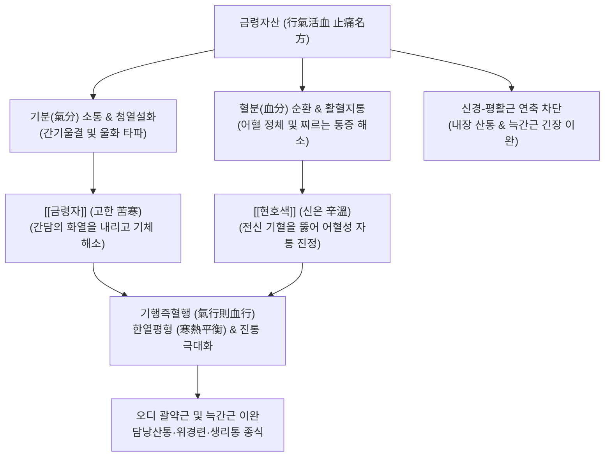

---
aliases:
  - 금령자산
  - 金鈴子散
  - Jinlingzi-san
  - Melia and Corydalis Powder
tags:
  - 처방/이기화해제
  - 이기화해제/소간지통
  - 간울화화
  - 협통
  - 위완통
  - 생리통
---
# 🍵 [[금령자산]] (金鈴子散, Jinlingzi-san / Melia and Corydalis Powder)

> **핵심 3줄 요약 (Key Summary)**:
> - 🌿 기본 구성: [[금령자]](천련자), [[현호색]] 동량 배오 (온주 또는 미온수로 복용).
> - 🎯 간울화화(肝鬱化火) 및 기체혈어(氣滯血瘀)로 인한 늑간신경통·담낭염 등의 협통(脇痛), 스트레스성 위경련·위완통, 산기통(고환통), 열성 월경통.
> - 🔬 현호색 l-THP의 중추 도파민 D2 수용체 길항 및 진통, 금령자 토센다닌의 신경근 접합부 칼슘 유입 차단 및 담도·소화관 평활근 연축 억제.
> - <font color="#fa7e7e">⚠️ 주의사항: 금령자(천련자)는 과량·장기 복용 시 간독성 위험이 있으므로 1회 9~12g 이하 엄수 및 3주 이상 연속 투여 금기, 비위 허한성 냉통은 온리제 배오.</font>

---

## 📌 목차
1. [기본 처방 정보 & 군신좌사 구성](#1-기본-처방-정보--군신좌사-구성)
2. [방제학적 약재 상호작용 & 시너지 네트워크](#2-방제학적-약재-상호작용--시너지-네트워크)
3. [현대 분자약리학적 효능 & 작용 기전](#3-현대-분자약리학적-효능--작용-기전)
4. [적응 병증 및 체질별 감별 (Sweet Spot vs 금기)](#4-적응-병증-및-체질별-감별-sweet-spot-vs-금기)
5. [유사 처방군 감별 매트릭스](#5-유사-처방군-감별-매트릭스)
6. [임상 가감례 & 현대 질환별 응용](#6-임상-가감례--현대-질환별-응용)
7. [💡 사용자 진료실 핵심 필기 & 임상 팁 (원문 보존)](#7--사용자-진료실-핵심-필기--임상-팁-원문-보존)
8. [출처 및 학술 참고 문헌 (References)](#8-출처-및-학술-참고-문헌-references)

---

## 1. 기본 처방 정보 & 군신좌사 구성

* **출전**: 금원사대가(金元四大家) 유완소(劉完素)의 《소문병기기보명집(素問病機氣宜保命集)》
* **치법**: 행기소간(行氣疏肝), 활혈지통(活血止痛), 설열산결(泄熱散結)
* **적응증**: 간울화화(肝鬱化火), 혈어기체(血瘀氣滯), 심복협륵자통, 위완작통, 산기동통, 부인 경행복통

| 구분 | 약재명 | 표준 용량 | 본초 효능 & 방제 내 역할 |
| :--- | :--- | :--- | :--- |
| **군약 (君藥)** | [[금령자]] (천련자) | 9~12g | 행기소간(行氣疏肝), 청열설화, 담도와 위장관의 기체와 울열을 해소하고 지통 |
| **신약 (臣藥)** | [[현호색]] | 9~12g | 활혈산어(活血散瘀), 행기지통, 혈분(血分)의 어혈을 타파하여 신속한 중추성 진통 |

* **복용법**:
  - 두 약재를 동량으로 곱게 가루 내어 1회 6~9g씩 온주(溫酒)나 미온수에 타서 복용하거나, 첩당 각 9~12g씩 전탕하여 복용합니다.
  - 현호색은 식초로 볶아서(초현호색 醋炒延胡索) 사용하면 알칼로이드 성분의 수용화가 촉진되어 진통 효과가 극대화됩니다.

---

## 2. 방제학적 약재 상호작용 & 시너지 네트워크



* **기혈쌍치(氣血雙治)와 기행즉혈행(氣行則血行)**:
  - [[금령자]]가 기분(氣分)으로 들어가 기울열(氣鬱熱)을 풀어헤치면, [[현호색]]이 혈분(血分)으로 들어가 엉킨 피를 흩뜨립니다.
  - "기가 돌면 피도 돌고(氣行則血行), 피가 통하면 아프지 않다(血通則不痛)"는 원리를 단 두 가지 약재의 정밀한 배합으로 실현했습니다.
* **한열상제(寒熱相濟)의 절묘한 배오**:
  - 금령자의 차가운 성질(고한 苦寒)이 현호색의 따뜻한 성질(신온 辛溫)과 상쇄되어, 한쪽으로 치우치지 않으면서도 울화(鬱火)로 인한 열성 통증을 안전하게 다스립니다.

---

## 3. 현대 분자약리학적 효능 & 작용 기전

```
                  [금령자산 탕전액 복용]
                            │
     ┌──────────────────────┼──────────────────────┐
     ▼                      ▼                      ▼
[중추 도파민 D2 차단 및 진통] [평활근 연축 및 칼슘 유입 차단] [간담도계 항염증 및 담즙 분비]
l-THP (테트라하이드로팔마틴)   토센다닌 (Toosendanin)      리모노이드 / 알칼로이드
오피오이드 수용체 간접 활성화   ACh 유리 억제 & Ca2+ 차단   담낭 내압 강하 & 염증성 부종 억제
모르핀 유사 비마약성 진통      위장관 경련·오디괄약근 이완   우상복부 통증 및 소화장애 해소
```

1. **중추 도파민 D2 수용체 길항 및 강력한 비마약성 진통**:
   - [[현호색]]의 주 활성 성분인 l-테트라하이드로팔마틴(l-THP)은 뇌간 및 척수 후각의 도파민 $D_2$ 수용체를 길항하고 오피오이드 수용체 경로를 활성화합니다.
   - 이는 중독성이나 호흡 억제 부작용 없이 급만성 통증 신호 전달을 강력히 차단합니다.
2. **신경근 연접부 차단 및 평활근 경련 이완**:
   - [[금령자]]의 토센다닌(Toosendanin)은 신경근 접합부에서 아세틸콜린(ACh) 유리를 억제하고 세포막 전압의존성 칼슘 통로를 차단합니다.
   - 위장관 평활근 연축과 오디 괄약근(Sphincter of Oddi) 경련을 신속히 풀어주어 산통(Colic pain)을 즉각 완화합니다.
3. **해부생체역학적 늑간근 및 복벽 긴장 완화**:
   - 흉협부의 [[외늑간근]], [[내늑간근]] 및 복직근 상부의 병리적 근막 긴장을 해소하여 심호흡 시의 흉곽 팽창 제한과 결리는 옆구리 통증을 개선합니다.

---

## 4. 적응 병증 및 체질별 감별 (Sweet Spot vs 금기)

### 1) Sweet Spot (최적 적용군)
* **주요 체질**: 평소 스트레스를 많이 받아 간화(肝火)가 치솟기 쉬운 소양인 및 태음인
* **핵심 증상**:
  - 협통(脇痛): 늑간신경통, 만성 간염, 담낭염, 담석증으로 인한 옆구리의 타는 듯하거나 찌르는 통증(입이 쓰고 열감이 있음).
  - 위완통(胃脘痛): 스트레스성 위경련, 급만성 신경성 위염, 명치가 타는 듯이 아픈 통증.
  - 산기통(疝氣痛): 고환 및 서혜부가 붓고 땡기며 화끈거리는 비뇨기계 통증.
  - 부인과 통증: 열증(熱證)을 동반하고 생리혈이 검붉으며 덩어리가 나오는 심한 월경통.
* **설진/맥진**: 설홍태황(舌紅苔黃) 또는 설변홍(舌邊紅), 맥현삭(脈弦數) 혹은 현활(弦滑).

### 2) 금기 및 신중 투여군
* **간기능 저하자 및 간경화 환자**: 금령자(천련자)의 토센다닌 성분은 고용량 복용 시 간독성을 유발할 수 있으므로, 간수치가 심하게 상승한 환자에게는 단독 대량 투여 금기.
* **허한성(虛寒性) 통증 환자**: 따뜻한 찜질을 대면 편해지고 배가 차가운 비위허한 환자에게 단독 사용하면 복냉과 설사를 악화시키므로 금기 (온리제 합방 필수).

---

## 5. 유사 처방군 감별 매트릭스

| 처방명 | 핵심 구성 차이 | 주치 및 임상 차별점 | 맥진/설진 차이 |
| :--- | :--- | :--- | :--- |
| [[금령자산]] | 금령자, 현호색 | **간울화화 기체혈어**, 타는 듯하고 찌르는 급성 협통·위경련·생리통 | 설홍태황, 맥현삭 |
| [[시호소간산]] | 시호, 지각, 작약, 천궁, 향부자 등 | 화열보다는 **간기울결 기체(氣滯)** 위주의 뻐근한 협통과 팽만 | 설태박백, 맥현 |
| [[좌금환]] | 황련, 오수유 (6:1) | **간화범위(肝火犯胃)**, 속쓰림, 산역(신트림), 구토, 심번구고 | 설홍태황, 맥현삭 |
| [[일관전]] | 사삼, 맥문동, 당귀, 생지황, 구기자, 천련자 | **간신음허(肝腎陰虛)** 기반에 협통과 구갈이 동반된 만성 허증 | 설홍소진, 맥세삭 |
| [[실소산]] | 오령지, 포황 | 기체나 열증보다는 **순수 어혈(瘀血)**로 인한 하복부 자통 | 설자암어점, 맥삽 |

---

## 6. 임상 가감례 & 현대 질환별 응용

### 1) 주요 가감례
* **담낭염으로 인한 발열과 황달이 동반된 경우**: [[인진호]] 12g, [[대황]] 6g 가미 (인진호탕 합방).
* **속쓰림과 위산 역류가 심한 경우**: [[황련]] 4g, [[오수유]] 2g, [[모려]] 12g 가미.
* **통증 부위가 차갑고 오한이 있는 한산(寒疝) 통증**: [[오수유]] 4g, [[소회향]] 6g, [[육계]] 4g 가미.
* **생리통이 극심하고 혈괴가 많은 경우**: [[당귀]] 8g, [[천궁]] 6g, [[익모초]] 12g 가미.

### 2) 현대 질환별 응용
* **담석증 및 담낭염성 산통**: 오디 괄약근 경련을 풀어 담즙 배출을 돕고 우상복부 산통 완화.
* **늑간신경통(Intercostal Neuralgia)**: 대상포진 후 신경통이나 늑골 부위의 칼로 베는 듯한 신경병증성 통증 완화.
* **난치성 원발성 생리통(Dysmenorrhea)**: 비스테로이드성 소염진통제(NSAIDs)에 반응하지 않는 골반강 연축성 생리통 치료.

---

## 7. 💡 사용자 진료실 핵심 필기 & 임상 팁 (원문 보존)

> [!tip] **진료실 실전 노하우 (User Clinical Insight)**
> 
> ### 1) 금령자(천련자) 간독성 주의 및 과량 투여 금기
> * **반응 메커니즘**: 천련자에 함유된 리모노이드계 토센다닌은 과량 복용하거나 장기 복용할 경우 간세포 미토콘드리아 손상을 유발하여 AST/ALT 상승, 오심, 복통을 일으킬 수 있음.
> * **실전 대처법**: 1회 용량을 엄격히 준수(9~12g 이하)하고, 2~3주 이상의 연속 장기 복용을 피하며, 급성 통증이 완화되면 즉시 투여를 중단하거나 완화한 처방으로 전환함.
> 
> ### 2) 한증(寒證) 및 허증(虛證) 환자 단독 사용 금기
> * **임상 징후**: 금령자의 성질이 대단히 차갑고 쓰기 때문에, 통증 부위에 열감이 없고 따뜻한 찜질을 대면 통증이 편해지는 허한성 통증 환자에게 단독 투여하면 배가 차가워지고 설사를 유발함.
> * **실전 대처법**: 반드시 [[육계]], [[오수유]], [[소회향]] 등의 온리제(溫裏劑)를 합방하여 한열의 균형을 맞추어 처방함.
> 
> ### 3) 초현호색(醋炒延胡索) 조제 노하우
> * 현호색의 강력한 진통 성분인 알칼로이드(l-THP)는 산성 환경에서 염(Salt)을 형성하여 물에 쉽게 녹아 나옴.
> * 따라서 탕전 전 반드시 식초로 살짝 볶은 초현호색을 사용하거나, 탕전 시 식초를 소량(반 티스푼) 떨어뜨려 달이면 진통 효과가 2배 이상 상승함.

---

## 8. 출처 및 학술 참고 문헌 (References)

1. Liu, W. S. (金代). 《소문병기기보명집(素問病機氣宜保命集)》: "金鈴子散 治熱厥心痛 或發或止 身熱足便 腹脅諸痛."
2. * **Du Y et al. (2026)**. L-tetrahydropalmatine attenuates ketamine reward effect via modulating the miR-27a-3p/MAP2K4 axis. *Frontiers in genetics*, 17: 1701742. [PMID: 42445731](https://pubmed.ncbi.nlm.nih.gov/42445731/)
