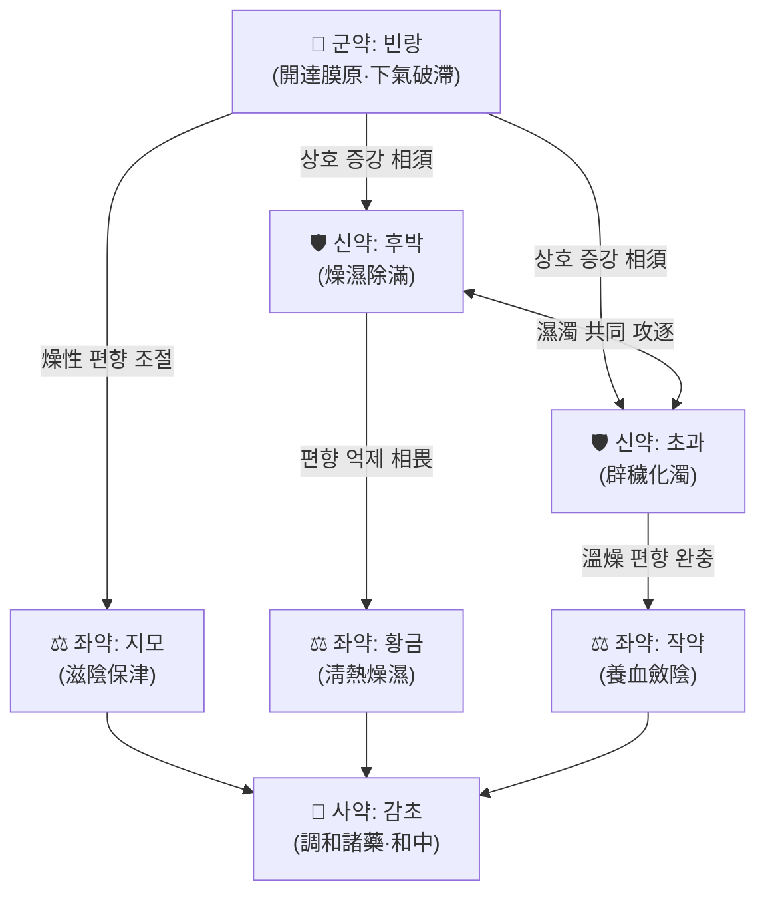

# 🍵 [[달원음]] (達原飮, Dayuan Yin)

> **핵심 3줄 요약 (Key Summary)**:
> - 🌿 온역(瘟疫) 초기 사기(邪氣)가 **막원(膜原)**에 잠복한 병증을 전문적으로 다스리는 오유성(吳又可) 『[[온역론]]』(溫疫論)의 대표 방제. [[빈랑]]·[[후박]]·[[초과]] 3약을 君·臣으로 삼아 **개달막원(開達膜原)·벽예화탁(辟穢化濁)**하고, [[지모]]·[[황금]]·[[작약]]·[[감초]]로 **청열보진(淸熱保津)·화영조화(和營調和)**한다.
> - 🎯 **憎寒發熱이 晝夜 지속되고 日晡(오후 늦게)에 甚해지며**, 두통·신체통, 舌上白苔如積粉(설태가 두껍고 가루를 쌓은 듯), 脈不浮不沉而數한 **습탁(濕濁)이 盛한 실열·습열형 태음인** 환자에서 최적 적응. 여름·장마철 발열성 감염, 비정형 폐렴, COVID-19 등 신종 감염병 초기 대응 처방으로 재조명되었다.
> - 🔬 네트워크 약리학·분자도킹 기반 **다표적·다경로(multi-target, multi-pathway)** 기전, HCoV-229E 유발 폐렴 완화 및 **Ras/Raf1/MEK/ERK 경로 조절**, 휘발성 성분의 항바이러스 가능성, 발열 랫트 약동학 및 **해열 기전·조직 분포** 연구가 보고되었다.
> - ⚠️ 주의사항: 津液이 不足한 陰虛·虛弱 환자, 순수 太陽表證이 未解한 상태, 임산부([[빈랑]]의 자궁 흥분 가능성)에는 신중 투여. 장기 복용 시 破氣·傷陰 우려. 반드시 辨證 후 사용.

---
## 📌 목차
1. [기본 처방 정보 & 군신좌사 구성](#1-기본-처방-정보--군신좌사-구성)
2. [방제학적 약재 상호작용 & 시너지 네트워크](#2-방제학적-약재-상호작용--시너지-네트워크)
3. [현대 분자약리학적 효능 & 작용 기전](#3-현대-분자약리학적-효능--작용-기전)
4. [적응 병증 및 체질별 감별 (Sweet Spot vs 금기)](#4-적응-병증-및-체질별-감별-sweet-spot-vs-금기)
5. [유사 처방군 감별 매트릭스](#5-유사-처방군-감별-매트릭스)
6. [임상 가감례 & 현대 질환별 응용](#6-임상-가감례--현대-질환별-응용)
7. [💡 사용자 진료실 핵심 필기 & 임상 팁 (원문 보존)](#7--사용자-진료실-핵심-필기--임상-팁-원문-보존)
8. [출처 및 학술 참고 문헌 (References)](#8-출처-및-학술-참고-문헌-references)
---
## 1. 기본 처방 정보 & 군신좌사 구성

* **출전**: 오유성(吳有性, 吳又可) 『[[온역론]]』(溫疫論, 1642) — 「瘟疫初起, 先憎寒而後發熱, 日後但熱而不憎寒也. 其脈不浮不沉而數, 晝夜發熱, 日晡益甚, 頭疼身痛, 舌上白苔如積粉…… 宜達原飮」
* **치법**: 개달막원(開達膜原), 벽예화탁(辟穢化濁), 청열조습(淸熱燥濕), 화영생진(和營生津)
* **복용법(원전)**: 물 2종(鍾)에 달여 8분(八分)을 취하여 **午後溫服**(오후에 따뜻하게 복용). 溫疫은 邪가 膜原에 있어 藥力이 表裏 사이를 行하므로 午後 복용이 要諦로 전해진다.

| 구분 | 약재명 | 표준 용량(원방 기준) | 본초 효능 & 방제 내 역할 |
| :--- | :--- | :--- | :--- |
| **군약 (君藥)** | [[빈랑]] (檳榔) | 원방 二錢 / 현대 6~10g | 消積下氣·行水殺蟲. 膜原에 막힌 氣機를 **뚫어 내리는(開達)** 主藥. 下氣破滯之力이 가장 강해 瘟疫 초기의 邪氣를 아래로 引導 |
| **신약 (臣藥)** | [[후박]] (厚朴) | 원방 一錢 / 현대 4~6g | 燥濕除滿·下氣消痰. 濕濁으로 인한 胸腹痞滿을 제거하고 陳皮·枳實類와 함께 氣滯를 풀어 君藥을 보좌 |
| **신약 (臣藥)** | [[초과]] (草果) | 원방 五分 / 현대 2~4g | 燥濕溫中·辟穢截瘧. **탁예(濁穢)를 쫓는 芳香辟穢** 작용으로 膜原의 濕濁瘟疫之邪를 직접 공략 |
| **좌약 (佐藥)** | [[지모]] (知母) | 원방 一錢 / 현대 6~9g | 淸熱瀉火·滋陰潤燥. 溫疫의 熱을 淸하면서 **津液을 保護**하여 燥性 약재의 편향을 억제 |
| **좌약 (佐藥)** | [[황금]] (黃芩) | 원방 一錢 / 현대 6~9g | 淸熱燥濕·瀉火解毒. 上焦·膜原의 伏熱을 淸解 |
| **좌약 (佐藥)** | [[작약]] (白芍) | 원방 一錢 / 현대 6~9g | 養血斂陰·和營止痛. 熱로 傷한 陰血을 收斂하고 攣急疼痛을 완화 |
| **사약 (使藥)** | [[감초]] (甘草) | 원방 五分 / 현대 2~3g | 調和諸藥·緩急和中. 諸藥의 峻烈함을 緩하고 脾胃를 保護 |

> **배오 특징**: 이 처방의 골자는 **芳香辟穢하는 3약(빈랑·후박·초과) + 苦寒淸熱하는 3약(지모·황금·작약) + 調和의 1약(감초)** 이라는 3:3:1 구조다. 즉 前半部(빈랑·후박·초과)는 氣機를 열고 濕濁을 化하는 **升散·開達**의 軸이고, 後半部(지모·황금·작약)는 熱을 淸하고 陰을 지키는 **淸降·收斂**의 軸이어서, 溫病學 특유의 **升中有降, 燥中有潤**의 균형을 이룬다. 오유성은 麻黃·桂枝類의 辛溫發汗을 瘟疫 초기에 쓰면 反히 津液을 傷하고 邪를 裏로 引한다고 보아, **發汗하지 않고 膜原을 開達**하는 이 방제를 創方했다는 점이 經方과의 결정적 차이다.

---
## 2. 방제학적 약재 상호작용 & 시너지 네트워크

* **[[빈랑]] + [[후박]] + [[초과]] 배오**: 세 약재 모두 芳香·辛溫燥烈 계열로, 相須(서로 필요로 하여 효능을 증강) 관계를 이룬다. [[빈랑]]이 下氣破滯로 邪의 出路를 열면, [[후박]]이 除滿으로 痞塞을 풀고, [[초과]]가 辟穢로 濁穢을 쫓아 **막원(膜原)이라는 반표반리(半表半裏)의 空隙을 삼방향에서 동시에 개통**한다. 특히 [[초과]]의 芳香은 濕濁瘟疫之邪에 대한 방향성이 독특하여, 단순 消化劑인 [[평위산]] 계열과 구별되는 지점이다.
* **[[지모]] + [[작약]] + [[황금]] 배오**: 위 3약의 辛溫燥烈함이 熱盛陰傷 환자에서 津液을 燒灼할 우려가 있는데, [[지모]]의 滋陰潤燥와 [[작약]]의 養血斂陰이 이를 **潤滑·완충**하고, [[황금]]이 淸熱瀉火로 伏熱을 직접 제거한다. 즉 相畏(억제) 관계를 이용한 **燥潤幷用, 剛柔相濟**의 전형적 설계다.
* **[[감초]] + 전방(全方)**: 調和諸藥의 使藥으로서 7味 諸藥을 脾胃로 引導하고, [[작약]]과 配하여 芍藥甘草湯의 緩急止痛 작용을 兼한다. 결과적으로 이 방제는 **膜原의 邪를 開達하면서도 津液과 脾胃를 동시에 지키는** 溫病學的 平衡 설계로 요약된다.

---
## 3. 현대 분자약리학적 효능 & 작용 기전

### 1) 화학 성분 프로파일링 — 다성분 복합체의 실체 규명
* Peng J, Ge C (2024)는 **UPLC-QTOF-MS와 molecular networking**을 결합하여 달원음 전탕액의 화학 성분을 종합적으로 프로파일링하였다(PMID: 38808627). 이는 달원음이 단일 성분이 아닌 **수십 종 이상의 다성분 복합체**로 구성되어 있으며, 분자 네트워킹 기법을 통해 구조적으로 유사한 성분군(동일 골격·유도체 계열)을 묶어 동정할 수 있음을 보여준다. 개별 지표 성분의 정량값 및 성분 목록의 세부는 **근거 미확인**(원문 미확보).
* **휘발성 성분(volatile components)** 의 역할은 Zhang XR, Li TN (2020)이 별도로 조명하였다(PMID: 33101037). [[초과]]·[[후박]] 등 芳香性 약재 유래 휘발성 성분이 COVID-19 팬데믹 상황에서 중요한 역할을 할 수 있다는 관점을 제시한 연구로, 芳香辟穢라는 전통적 효능 기술(記述)이 **휘발성 대사체의 생물활성**으로 해석될 가능성을 시사한다. 다만 구체적 항바이러스 역가(IC50 등) 및 표적 단백질은 **근거 미확인**.

### 2) 항바이러스·항염증 및 신호전달 경로 조절
* **Ras/Raf1/MEK/ERK 경로**: Li R, Zhang W (2024)는 **HCoV-229E(인체 코로나바이러스 229E) 유발 폐렴 모델**에서 달원음이 폐렴 증상을 완화하며 **Ras/Raf1/MEK/ERK 신호전달 경로를 조절**함을 보고하였다(PMID: 39495380). 이는 달원음의 효능이 단순 항염 수준을 넘어 **세포 증식·분화·염증성 사이토카인 전사 조절에 관여하는 MAPK 계열 상위 신호**에 작용함을 의미한다.
* **네트워크 약리학 기반 다표적 기전**: Ruan X, Du P (2020)는 네트워크 약리학과 분자도킹을 통해 COVID-19 치료에 있어 달원음의 기전을 분석하였다(PMID: 32536965). 단일 표적이 아닌 **성분–표적–경로의 복합 네트워크**로 작용하는 다표적(multi-target) 특성을 제시한 연구로, 항바이러스·항염증·면역조절이 동시에 얽힌 기전 양상을 보여준다. 네트워크 내 개별 핵심 표적의 목록과 도킹 점수는 **근거 미확인**.

### 3) 해열 작용의 물질적 기반과 조직 분포
* Hou YJ, Xiao KN (2025a)은 유명 고전방(名方) 달원음의 **조직 분포 성분과 해열 기전**을 규명하였다(PMID: 40686150). 즉 혈중 성분뿐 아니라 어느 조직(장기)에 분포하는지를 밝힘으로써, 해열 효능이 어떤 성분에 의해 어떤 장기 표적에서 발현되는지를 추적한 연구다. 개별 성분의 조직별 농도 수치는 **근거 미확인**.
* Hou YJ, Xiao KN (2025b)는 **정상 랫트와 발열 랫트** 두 군에서의 달원음 **약동학(pharmacokinetics)** 을 비교하였다(PMID: 39929633). 발열이라는 병태생리 상태가 위장관 흡수·혈류 분포·대사 효소 활성에 영향을 주어 정상군과 발열군의 약물 노출 양상이 달라질 수 있음을 시사하며, 이는 **"해열 목적으로 쓸 때의 용량·용법 설계가 정상 상태와 같지 않을 수 있다"**는 임상적 함의로 이어진다. 구체적 AUC·Cmax·Tmax 등의 수치는 **근거 미확인**.

### 4) 정리 — 기전 요약
| 연구 축 | 핵심 내용 | 출처 |
| :--- | :--- | :--- |
| 성분 프로파일링 | UPLC-QTOF-MS + molecular networking으로 다성분 복합체 규명 | PMID: 38808627 |
| 휘발성 성분 | 芳香性 약재 유래 휘발성 성분의 COVID-19 대응 가능성 | PMID: 33101037 |
| 신호 경로 | HCoV-229E 폐렴 완화 + Ras/Raf1/MEK/ERK 조절 | PMID: 39495380 |
| 다표적 기전 | 네트워크 약리학·분자도킹 기반 COVID-19 기전 분석 | PMID: 32536965 |
| 해열·분포 | 조직 분포 성분 및 해열 기전 규명 | PMID: 40686150 |
| 약동학 | 정상 vs 발열 랫트 약동학 비교 | PMID: 39929633 |

---
## 4. 적응 병증 및 체질별 감별 (Sweet Spot vs 금기)

### [✅ 최적 적응증 (Sweet Spot)]
* **원전 조문**: 『溫疫論』 — 瘟疫 초기 先憎寒後發熱, 脈不浮不沉而數, 晝夜發熱 日晡益甚, 頭疼身痛, **舌上白苔如積粉**, 或 胸膈痞滿, 或 噁心欲吐. 이 條文이 이 처방의 존재 이유이며, 邪가 表도 裏도 아닌 **膜原**에 있는 상태를 특징으로 한다.
* **체질 소견**: 주로 **태음인** 또는 습담이 旺盛한 체형(복부 비만 경향, 살집이 있고 땀이 많거나 반대로 濕氣가 잘 정체됨). 少陰人·少陽人 중에서도 濕濁이 裏에 鬱滯한 경우에는 加減하여 응용 가능하나 기본 방향은 **實證·濕濁·鬱熱** 쪽이다.
* **임상 주치**: 발열이 오후·저녁에 심해지고 아침에는 덜한 **日晡潮熱型 발열**, 해열제로도 잘 떨어지지 않는 지속열, 몸이 무겁고 머리가 무거운 頭重身痛, 胸腹痞悶, 口苦 또는 口中粘膩, 便溏 또는 便粘.
* **설진/맥진**: **舌苔 白厚如積粉**(설태가 두껍고 가루를 쌓은 듯하며 잘 벗겨지지 않음), 설질은 홍하거나 담홍. 맥은 **不浮不沉而數**(부맥도 침맥도 아니면서 數한 것) — 즉 表熱도 裏熱도 아닌 半表半裏 膜原의 위치를 반영하는 맥상이다.
* **전형적 진료실 상황**: 여름·장마철 집단 발열성 질환, 원인 불명 열, 독감·코로나19 등 바이러스성 호흡기 감염 초기로 해열제에 반응이 더딘 습열형 환자.

### [⚠️ 신중 투여 및 금기 (Caution / Contraindication)]
* **순수 太陽表證 未解**: 『溫疫論』 원전도 表證이 있으면 먼저 表를 풀 것을 강조한다. 惡寒·無汗·鼻塞 등 表證이 뚜렷한 단계에서는 先解表 후 達原飮을 고려해야 하며, 무리하게 膜原을 攻하면 邪를 引하여 裏로 入하게 할 우려가 있다.
* **陰虛·津液 不足·虛弱 환자**: [[빈랑]]·[[후박]]·[[초과]]의 辛溫燥烈한 破氣·燥濕 작용이 陰血을 傷할 수 있다. 마르고 形氣가 虛한 환자, 만성 소모성 질환자에는 부적합하며, 굳이 쓸 경우 [[지모]]·[[작약]]의 비중을 늘리거나 [[맥문동]]·[[현삼]] 등을 加한다.
* **임산부 및 虛弱 노인·소아**: [[빈랑]]은 傳統的으로 子宮 興奮 가능성이 언급되는 약재이므로 **임산부에는 원칙적으로 신중**, 노인·소아는 감량이 필요하다. (현대적 안전성 데이터는 **근거 미확인**.)
* **만성 위장질환자**: 破氣·攻下 작용으로 胃痛·泄瀉를 유발할 수 있어 脾胃虛寒者에는 加減 없이 투여하지 않는다.
* **양약 병용**: 해열진통제·항응고제·당뇨약 등과의 상호작용 데이터는 **근거 미확인**. 발열 랫트에서 약동학 양상이 달라진다는 보고(PMID: 39929633)를 감안하여, 他 약물 복용 중인 환자에서는 반응 관찰을 강화한다.

---
## 5. 유사 처방군 감별 매트릭스

| 처방명 | 핵심 구성 차이 | 주치 및 체질 차이 | 맥진/설진 차이 |
| :--- | :--- | :--- | :--- |
| [[달원음]] | 기준 구성: 빈랑·후박·초과 + 지모·황금·작약·감초 | **瘟疫 초기 邪伏膜原, 憎寒發熱·日晝夜熱·日晡益甚**. 습탁 實熱型 태음인. 발열성 감염 초기 | 설태 **백후여적분**, 맥 **불부불침이삭** |
| [[소시호탕]] | 시호·황금·반하·인삼·생강·대조·감초 (인삼·시호 중심) | **少陽 半表半裏 往來寒熱**, 口苦咽乾目眩, 胸脇苦滿. 少陽人 또는 중간 체형 | 설태 박백, 맥 **현(弦)** |
| [[곽향정기산]] | 곽향·자소엽·백지·대복피·반하곡 등 해표화습 중심 | **外感風寒 + 內傷濕滯**(여름 감모·食傷·水土不服). 습담 체질 | 설태 **백니(白膩)**, 맥 **유완(濡緩)** |
| [[삼인탕]] | 행인·백두구·의이인 + 곽향·반하·후박 등 | **濕溫 初起, 濕重於熱** — 身重·午後熱·胸悶不飢. 습이 盛한 체형 | 설태 **백니**, 맥 **유연(濡軟)** |

> ⚠️ 표 내부에서는 마크다운 열 구분자 파괴를 방지하기 위해 파이프(`|`)가 들어간 링크를 쓰지 않고 순수한 [[처방명]] 단독 형태로만 작성합니다.
>
> **감별 요점**: 네 처방 모두 "발열 + 胸悶 + 습"이라는 공통 키워드를 공유하지만, ① **邪의 위치**(膜原 vs 少陽 vs 表+裏 vs 中焦 濕溫) ② **熱과 濕의 비중**(달원음·삼인탕은 濕濁 개통이 핵심, 소시호탕은 少陽 樞機, 곽향정기산은 表寒+內濕) ③ **설태의 질감**(積粉樣 vs 白膩 vs 薄白) 세 축으로 갈린다. 특히 **舌苔如積粉 + 脈不浮不沉而數**는 달원음만의 특징적 조합이다.

---
## 6. 임상 가감례 & 현대 질환별 응용

* **수반 증상별 가감법** (『溫疫論』 원전 가감 및 전통 방제학적 응용 — 현대 논문 근거는 **미확인**):
  * 脇下痛·胸脇苦滿 동반 시 → + [[시호]] (少陽 樞機 兼治)
  * 大便秘結·腹滿 甚한 경우 → + [[대황]] (瘟疫 下法; 三消飮·承氣類 방향으로 전환 검토)
  * 熱이 盛하고 口渴이 뚜렷할 때 → + [[석고]], [[지모]]·[[황금]] 배량 증량
  * 濕濁이 甚하여 嘔逆·痞滿 동반 시 → + [[곽향]], [[반하]], [[진피]]
  * 咽喉痛·咳嗽 동반 시 → + [[길경]], [[우방자]], [[패모]]
  * 氣虛·病後 회복기 乏力 시 → + [[인삼]] 또는 [[태자삼]] (단, 邪가 未盡한 時에는 補益 留邪 注意)
* **복약 지침**: 원전은 **午後溫服**을 강조한다. 發熱이 日晡에 甚해지는 병리와 膜原이라는 半表半裏 위치를 고려한 복용 타이밍 설계로 해석된다.
* **현대 질환별 임상 매핑**:
  * **호흡기·감염**: COVID-19 및 신종 코로나바이러스 감염(PMID: 32536965, PMID: 33101037), HCoV-229E 유발 폐렴(PMID: 39495380), 인플루엔자·비정형 폐렴 등 발열성 호흡기 감염 초기.
  * **발열성 질환 일반**: 해열제에 반응이 느린 지속열·日晡潮熱형 발열(PMID: 39929633, PMID: 40686150의 해열·약동학 연구 배경).
  * **소화기**: 습탁으로 인한 胸腹痞滿, 口中粘膩, 便溏·便粘, 食慾不振 — 단, 脾胃虛寒者는 加減 필수.
  * **기타**: 寒熱往來를 동반한 瘧疾類(截瘧 목적의 [[초과]] 응용), 습열형 피부질환·구내염 등 濕熱 鬱蒸 병증에 加減 응용 보고가 있으나 **현대 논문 근거 미확인**.

---
## 7. 💡 사용자 진료실 핵심 필기 & 임상 팁 (원문 보존)

> [!tip] **진료실 실전 노하우 (User Clinical Insight)**
> - 📌 **원문 메모 미제공 안내**: 본 노트 작성 시 원장님의 기존 진료실 필기 원문이 제공되지 않았습니다. 따라서 **보존할 원문은 현재 공란**이며, 아래는 템플릿 형식에 맞춘 항목별 기록 자리입니다. 원문 필기를 확보하면 이 블록에 그대로 이관하십시오(임의로 창작하지 않았습니다).
> - 🧭 **체질별 선택 기준 (기록용 항목)**:
>   - 太陰人 + 濕濁·痞滿 + 日晡熱 패턴 → 本方 原方 검토
>   - 少陰人·虛弱者 → 原方 그대로는 破氣 우려, [[지모]]·[[작약]] 증량 및 [[인삼]] 加 감량 검토
>   - 少陽人 → 少陽 樞機 兼證이면 [[소시호탕]] 계열과의 合方 여부 판단
> - 🗣️ **환자 티칭 포인트(기록용 항목)**: 오후~저녁에 열이 오르는 양상, 혀 상태(두꺼운 백태), 복부 팽만감의 변화를 기록하게 하고, 복용 후 대변 양상(무르게 나오는지)을 확인.
> - 🔍 **복약 반응 관찰 포인트(기록용 항목)**: 오후 발열 곡선의 변화, 설태의 두께·박리 여부, 痞滿 감소 시점. 발열 상태에서는 약물 노출이 달라질 수 있으므로(PMID: 39929633) 반응 관찰 기간을 넉넉히 잡을 것.

---
## 8. 출처 및 학술 참고 문헌 (References)

1. **Hou YJ, Xiao KN (2025)**. *Pharmacokinetics study of Dayuanyin in normal and febrile rats*. **Zhongguo Zhong Yao Za Zhi**. PMID: 39929633.
   - 🔗 https://pubmed.ncbi.nlm.nih.gov/39929633/
   - **[연구 요약]**: 정상 랫트와 발열 랫트 두 군에서 달원음 투여 후 **약동학을 비교**한 연구. 발열이라는 병태생리 조건이 약물 노출 양상을 변화시킬 수 있음을 시사한다. 개별 약동학 파라미터(AUC, Cmax 등)는 **근거 미확인**.

2. **Ruan X, Du P (2020)**. *Mechanism of Dayuanyin in the treatment of coronavirus disease 2019 based on network pharmacology and molecular docking*. **Chin Med**. PMID: 32536965.
   - 🔗 https://pubmed.ncbi.nlm.nih.gov/32536965/
   - **[연구 요약]**: 네트워크 약리학 + 분자도킹으로 COVID-19에 대한 달원음의 **다표적·다경로 기전**을 분석. 성분–표적–경로 네트워크를 구축하여 항바이러스·항염증 관련 기전 가능성을 제시. 개별 핵심 표적 목록은 **근거 미확인**.

3. **Peng J, Ge C (2024)**. *Comprehensive profiling of the chemical constituents in Dayuanyin decoction using UPLC-QTOF-MS combined with molecular networking*. **Pharm Biol**. PMID: 38808627.
   - 🔗 https://pubmed.ncbi.nlm.nih.gov/38808627/
   - **[연구 요약]**: UPLC-QTOF-MS와 **molecular networking**을 결합하여 달원음 전탕액의 화학 성분을 종합 프로파일링한 연구. 다성분 복합체로서의 물질적 기반을 제시. 성분 목록·정량값은 **근거 미확인**.

4. **Hou YJ, Xiao KN (2025)**. *[Identification of tissue distribution components and mechanism of antipyretic effect of famous classical formula Dayuanyin]*. **Zhongguo Zhong Yao Za Zhi**. PMID: 40686150.
   - 🔗 https://pubmed.ncbi.nlm.nih.gov/40686150/
   - **[연구 요약]**: 고전명방 달원음의 **조직 분포 성분**을 동정하고 **해열 기전**을 규명한 연구. 해열 작용의 물질적·장기적 기반을 추적. 조직별 농도 데이터는 **근거 미확인**.

5. **Li R, Zhang W (2024)**. *Dayuan Yin alleviates symptoms of HCoV-229E-induced pneumonia and modulates the Ras/Raf1/MEK/ERK pathway*. **Nat Prod Bioprospect**. PMID: 39495380.
   - 🔗 https://pubmed.ncbi.nlm.nih.gov/39495380/
   - **[연구 요약]**: **HCoV-229E 유발 폐렴 모델**에서 달원음이 폐렴 증상을 완화하고 **Ras/Raf1/MEK/ERK 신호전달 경로를 조절**함을 보고. MAPK 계열 상위 신호 조절을 통한 항염·폐손상 보호 기전 시사.

6. **Zhang XR, Li TN (2020)**. *The Important Role of Volatile Components From a Traditional Chinese Medicine Dayuan-Yin Against the COVID-19 Pandemic*. **Front Pharmacol**. PMID: 33101037.
   - 🔗 https://pubmed.ncbi.nlm.nih.gov/33101037/
   - **[연구 요약]**: 달원음 중 **휘발성 성분**([[초과]]·[[후박]] 등 芳香性 약재 유래)의 COVID-19 대응에 있어서의 역할을 조명한 연구. 芳香辟穢의 전통 효능 기술을 휘발성 대사체 활성으로 해석할 가능성을 제시. 구체 항바이러스 역가는 **근거 미확인**.

7. **오유성(吳有性, 1642)**. 『[[온역론]]』(溫疫論).
   - **[고전 원전]**: 達原飮의 창방 문헌. 「瘟疫初起, 先憎寒而後發熱, 日後但熱而不憎寒也. 其脈不浮不沉而數, 晝夜發熱, 日晡益甚, 頭疼身痛, 舌上白苔如積粉…… 宜達原飮」 및 **午後溫服** 복약 지침, 加減法의 근거.

> **작성 메모**: 본 노트의 현대 분자약리 기전·임상 근거는 위 1~6번 PubMed 문헌 및 7번 고전 원전에 한정하여 서술하였으며, 제공되지 않은 논문이나 PMID는 인용하지 않았다. 수치·표적 목록 등 원문 미확보 항목은 모두 '근거 미확인'으로 명시하였다.