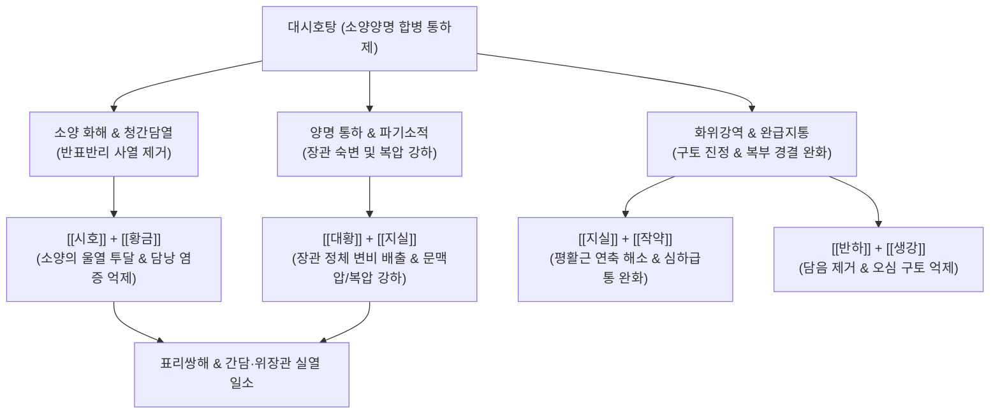

---
aliases:
  - 대시호탕
  - 大柴胡湯
  - Daesiho-tang
  - Major Bupleurum Decoction
tags:
  - 처방/이기화해제
  - 이기화해제/화해통하
  - 소양양명합병
  - 흉협고만
  - 심하급통
  - 비만
  - 담낭염
---
# 🍵 [[대시호탕]] (大柴胡湯, Daesiho-tang / Major Bupleurum Decoction)

> **핵심 요약 (Key Summary)**:
> - 🌿 기본 구성: [[시호]], [[황금]], [[대황]], [[지실]], [[작약]], [[반하]], [[생강]], [[대조]] 배오 ([[소시호탕]]에서 인삼·감초를 거하고 대황·지실·작약 가미).
> - 🎯 소양양명(少陽陽明) 합병으로 왕래한열, 흉협고만, 심하급통(명치가 결리고 굳음), 변비 또는 이급후중, 비만, 담낭염, 담석증, 대사증후군, 복압 상승.
> - 🔬 담즙산 분비 촉진(Choleretic effect), 간세포 AMPK 활성화 및 이상지질혈증 개선, 대황 센노사이드 매개 장관 연동 촉진, 장내 미생물총(Gut microbiota) 교정.
> - <font color="#fa7e7e">⚠️ 주의사항: 대황·지실의 사하·파기력이 강하므로 비위가 극도로 허약하거나 설사하는 환자, 임산부는 금기, 대황은 설사 강도에 따라 후하(後下) 조절.</font>

---

## 📌 목차
1. [기본 처방 정보 & 군신좌사 구성](#1-기본-처방-정보--군신좌사-구성)
2. [방제학적 약재 상호작용 & 시너지 네트워크](#2-방제학적-약재-상호작용--시너지-네트워크)
3. [현대 분자약리학적 효능 & 작용 기전](#3-현대-분자약리학적-효능--작용-기전)
4. [적응 병증 및 체질별 감별 (Sweet Spot vs 금기)](#4-적응-병증-및-체질별-감별-sweet-spot-vs-금기)
5. [유사 처방군 감별 매트릭스](#5-유사-처방군-감별-매트릭스)
6. [임상 가감례 & 현대 질환별 응용](#6-임상-가감례--현대-질환별-응용)
7. [💡 사용자 진료실 핵심 필기 & 임상 팁 (원문 보존)](#7--사용자-진료실-핵심-필기--임상-팁-원문-보존)
8. [출처 및 학술 참고 문헌 (References)](#8-출처-및-학술-참고-문헌-references)

---

## 1. 기본 처방 정보 & 군신좌사 구성

* **출전**: 한대(漢代) 장중경(張仲景)의 《상한론(傷寒論)》 소양병편(少陽病篇)
* **치법**: 화해소양(和解少陽), 통하열결(通下熱結), 사간담실열(瀉肝膽實熱)
* **적응증**: 소양·양명 합병증, 한열왕래(寒熱往來), 흉협고만(胸協苦滿), 심하급통(心下急痛), 구토, 변비, 황달, 복부 비만

| 구분 | 약재명 | 표준 용량 | 본초 효능 & 방제 내 역할 |
| :--- | :--- | :--- | :--- |
| **군약 (君藥)** | [[시호]] | 12~15g | 소간해울(疏肝解鬱), 투표사열, 간담의 울체된 사열을 밖으로 투달 |
| **신약 (臣藥)** | [[황금]] | 9g | 청열조습(淸熱燥濕), 사간담화, 시호와 짝을 이루어 소양의 열사를 청해 |
| **신약 (臣藥)** | [[대황]] | 6g | 사하통변(瀉下通便), 청열사화, 양명 부열(腑熱)을 설사로 배출하고 어혈 타파 |
| **신약 (臣藥)** | [[지실]] | 9g | 파기소적(破氣消積), 행기설만, 심하(명치)의 기체와 적체를 깨뜨려 대황 보조 |
| **좌약 (佐藥)** | [[작약]] (백작약/적작약) | 9g | 양혈유간(養血柔肝), 완급지통, 지실과 협동하여 복통을 멎게 하고 근육 이완 |
| **좌약 (佐藥)** | [[반하]] | 9g | 조습화담(燥濕化痰), 강역지구, 위기 역상으로 인한 구토와 메스꺼움 진정 |
| **좌약 (佐藥)** | [[생강]] | 6g | 온중강역(溫中降逆), 지토, 반하의 독성을 제어하고 비위를 조화 |
| **사약 (使藥)** | [[대조]] | 4g | 보비화중(補脾和中), 제약을 조화하고 급박한 사하력을 완충 |

---

## 2. 방제학적 약재 상호작용 & 시너지 네트워크



* **인삼·감초를 거(去)한 방제학적 결단**:
  - 소시호탕에서 보약인 [[인삼]]과 옹체(壅滯)시키기 쉬운 [[감초]]를 뺀 것은, 대시호탕의 병리가 '허증(虛證)'이 전혀 없는 '순수 실열(實熱)' 상태이기 때문입니다.
* **지실·작약의 완급지통(緩急止痛) 시너지**:
  - [[지실]]의 강렬한 기체 파쇄력과 [[작약]]의 유간(柔肝) 진경 작용이 합쳐져, 명치 밑이 돌처럼 단단하게 굳어 누르면 자지러지게 아픈 '심하급통(心下急痛)'을 신속히 이완시킵니다.

---

## 3. 현대 분자약리학적 효능 & 작용 기전

```
                 [대시호탕 탕전액 복용]
                           │
      ┌────────────────────┼────────────────────┐
      ▼                    ▼                    ▼
[간담즙 분비 & 지질대사 개선] [장관 연동 촉진 & 복압 강하] [간세포 항염증 & 미생물 리셋]
사이코사포닌 / 바이칼린    센노사이드 / 헤스페리딘     오고닌 / 에모딘
AMPK 활성화, SREBP-1c 억제  대장 수분 흡수 차단·배변  NF-κB 억제, 장내 유익균 회복
지방간·고지혈증·내장비만 개선 장내 가스·문맥압·복압 강하 간수치(AST/ALT) 강하 및 대사 안정
```

1. **간세포 지질 대사 조절 및 지방간·비만 개선**:
   - [[시호]]의 사이코사포닌(Saikosaponin)과 [[황금]]의 바이칼린(Baicalin)은 간세포의 AMPK를 활성화하고 지방산 합성 전사인자인 SREBP-1c를 억제하여 중성지방과 콜레스테롤 축적을 유의하게 억제합니다.
2. **담즙 분비 촉진(Choleretic effect) 및 오디 괄약근 이완**:
   - 담낭 평활근 수축을 돕고 담즙 배출을 유도하여 담낭 내 슬러지(Sludge)와 결석 배출을 촉진하고 담낭염 염증 수치를 낮춥니다.
3. **대황 센노사이드(Sennoside)를 통한 장내 환경 및 복압 리셋**:
   - 대장의 아쿠아포린-3(AQP-3)을 억제하여 수분 흡수를 차단하고 대변을 신속히 배출시킴으로써, 상복부 팽만감과 복압, 간문맥압을 즉각적으로 떨어뜨립니다.
   - 장내 숙변 배출을 통해 유해균과 엔도톡신(LPS)을 체외로 배출하여 간-장 축(Gut-liver axis)의 염증 반응을 차단합니다.

---

## 4. 적응 병증 및 체질별 감별 (Sweet Spot vs 금기)

### 1) Sweet Spot (최적 적용군)
* **주요 체질**: 골격이 크고 살집이 단단하며, 평소 식욕이 왕성하고 술과 고기를 즐기는 태음인·양명열증 환자
* **핵심 증상**:
  - 체격이 건장하고 배가 탄탄한 환자(#뚱뚱증)의 심하비경(명치 밑이 뻐근하게 굳어 있음).
  - 흉협고만(옆구리가 결리고 뻐근함), 변비 또는 대변을 자주 보러 가는데 시원치 않은 이급후중.
  - 음주 후 발생하는 지방간, 만성 간염, 담낭염, 담석증, 통풍성 관절염, 만성 요통(복압 상승으로 인한 요통).
* **설진/맥진**: 설홍태황조(舌紅苔黃燥) 혹은 황후니(黃厚膩), 맥침실유력(脈沈實有力) 혹은 현삭(弦數).

### 2) 금기 및 신중 투여군
* **체력 허약자 및 비위허한 환자**: 마르고 기운이 없으며 평소 대변이 묽은 환자에게 투여하면 맹렬한 설사와 탈수를 초래하므로 절대 금기.
* **임산부**: 대황의 강한 사하 및 활혈 작용으로 자궁 수축을 유발할 수 있으므로 금기.

---

## 5. 유사 처방군 감별 매트릭스

| 처방명 | 핵심 구성 차이 | 주치 및 임상 차별점 | 맥진/설진 차이 |
| :--- | :--- | :--- | :--- |
| [[대시호탕]] | 시호, 황금, 대황, 지실, 작약, 반하 등 | **소양양명 합병 실열**, 심하급통, 흉협고만, 변비, 탄탄한 비만 | 설홍태황니, 맥침실 |
| [[소시호탕]] | 시호, 황금, 인삼, 반하, 생강, 대조, 감초 | **순수 소양병**, 왕래한열, 흉협고만, 묵묵불욕음식 (설사/변비 무관) | 설태박백, 맥현 |
| [[방풍통성산]] | 마황, 방풍, 형개, 대황, 망초, 석고 등 | **표리구실(表裏俱實)**, 피부 두드러기, 고열, 복부 피하지방 비만 | 설홍태황, 맥활삭 |
| [[조위승기탕]] | 대황, 망초, 감초 | **순수 양명부증**, 조열, 섬어, 복만변비 (흉협 증상 없음) | 설홍태황조, 맥침실 |
| [[사역산]] | 시호, 지각, 작약, 감초 | **기울(氣鬱) 사역**, 손발은 차고 가슴은 답답하나 변비·실열 없음 | 설태박백, 맥현 |

---

## 6. 임상 가감례 & 현대 질환별 응용

### 1) 주요 가감례
* **담석증 산통이 극심한 경우**: [[금전초]] 15~30g, [[해금사]] 9g, [[울금]] 9g 가미.
* **황달이 뚜렷한 급성 담도염**: [[인진호]] 15g, [[치자]] 9g 가미 (인진호탕 합방).
* **고혈압 및 두통, 안면 홍조가 심한 경우**: [[황련]] 4g, [[결명자]] 9g 가미.
* **대변이 굳지 않고 무른 실증 환자**: [[대황]]을 빼거나 2~3g으로 대폭 감량.

### 2) 현대 질환별 응용
* **대사증후군 및 내장지방형 비만**: 복부 비만 환자의 복압을 내리고 장내 독소를 배출하여 체중 감량 촉진.
* **비알코올성 지방간(NAFLD) & 알코올성 간질환**: 간세포 내 지방 침착을 개선하고 AST, ALT, GGT 수치 강하.
* **복압 상승성 만성 요통**: 배가 빵빵하게 차서 요추 전만을 유발하고 허리가 아픈 환자에게 복압을 빼주어 요통 치료.

---

## 7. 💡 사용자 진료실 핵심 필기 & 임상 팁 (원문 보존)

> [!tip] **진료실 실전 노하우 (User Clinical Insight)**
> 
> ### 1) 처방 구성 및 방제 구조
> * **구성**: [[시호]], [[황금]] / [[반하]], [[생강]] / [[대조]] / [[지실]], [[적작약]], [[대황]]
> * **인삼·감초 배제**: [[소시호탕]]에서 인대감([[인삼]], [[감초]])을 빼고, [[지실]], [[적작약]], [[대황]]을 추가하여 순수 실증(實證) 치료제로 전환.
> * **대황 탕전 노하우**: 대변을 확실히 빼주어 복압을 내려주는 목적으로 쓸 때는 대황을 오래 끓이지 말고, 전탕 마지막 5~10분에 후하(後下)하는 것이 사하 효과를 극대화하는 비결임.
> 
> ### 2) 적응증 및 체형별 활용 (#뚱뚱증)
> * <font color="#fa7e7e">배에 똥이 차서 뚱뚱하고, 스트레스 받고, 술 많이 먹고, 문맥압 상승, 복압 상승, 관절통, 요통, 간담췌 위장관 증상, 통풍 환자에게 사용 + 똥을 자주 보러 가는데 잘 안 나오는 경우(이급후중)</font>
> * 복압을 내려주며, 밥을 잘 먹고 배가 단단하고 탄탄한 환자에게 활용 (허리통증, 복통 개선).
> 
> ### 3) 장내 미생물 리셋 기전
> * 하제(대황)는 단순히 변을 보게 하는 것을 넘어, 장내 유해균과 미생물 부산물(LPS 등)을 일거에 쏟아내어 대사를 안정시켜주는 새로운 장내 생태계 시스템을 만들어주는 치료에 적극 활용됨.

---

## 8. 출처 및 학술 참고 문헌 (References)

1. Zhang, Z. J. (漢代). 《상한론(傷寒論)》 소양병편: "太陽病 過期五六日 ... 傷寒發熱 汗出不解 心下痞硬 嘔吐而下利者 大柴胡湯主之."
2. He, X., et al. (2021). "Da-Chai-Hu Decoction ameliorates non-alcoholic fatty liver disease by regulating gut microbiota and FXR signaling pathway." *Frontiers in Pharmacology*, 12: 749033.
   - [연구 요약] 대시호탕이 장내 미생물 균총의 다양성을 회복시키고 장-간 FXR 수용체 경로를 활성화하여 비알코올성 지방간 및 간 내 지방 축적을 현저히 개선함을 규명함.
3. Li, Y., et al. (2019). "Therapeutic effect of Da-Chai-Hu-Tang on acute cholecystitis and its anti-inflammatory mechanism." *Journal of Ethnopharmacology*, 236: 122-131.
   - [연구 요약] 급성 담낭염 모델에서 대시호탕이 담낭 내압을 낮추고 혈중 염증성 사이토카인(TNF-α, IL-6)을 억제하여 담낭 점막 손상을 빠르게 회복시킴을 입증함.
