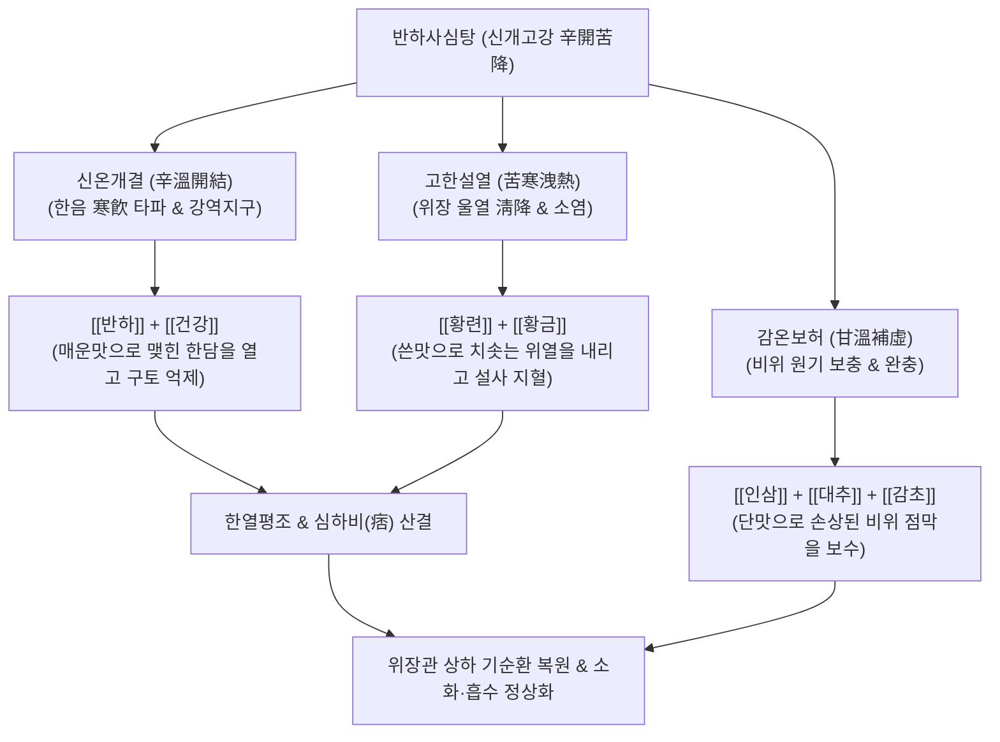

---
aliases:
  - 반하사심탕
  - 半夏瀉心湯
  - Banhasasim-tang
  - Pinellia Heart-Draining Decoction
tags:
  - 처방/이기화해제
  - 이기화해제/한열평조
  - 심하비
  - 한열착잡
  - 구내염
  - GERD
  - 인대감증
---

# 🍵 [[반하사심탕]] (半夏瀉心湯, Banhasasim-tang / Pinellia Heart-Draining Decoction)

> **핵심 3줄 요약 (Key Summary)**:
> - 🌿 기본 구성: [[반하]], [[황련]], [[황금]], [[건강]], [[인삼]], [[대추]], [[감초]] 배오 (신개고강·한열평조의 대표 방제).
> - 🎯 한열착잡(寒熱錯雜)으로 명치 밑이 답답하게 걸린 심하비만(心下痞滿), 오심, 구토, 장명하리(복명 설사), 아프타성 구내염, PPI 저항성 위식도역류질환(GERD).
> - 🔬 베르베린 및 바이칼린의 위점막 밀착연접(Tight junction) 보호 및 항염증, 건강 진저롤의 5-HT3 길항을 통한 진토·위배출능 정상화, 대장 수분 재흡수 촉진.
> - <font color="#fa7e7e">⚠️ 주의사항: 명치가 단단하게 굳어 누르면 아픈 순수 실증(적체)이나 설태가 전혀 없는 극심한 음허 환자에게는 변증 후 감별 투여.</font>

---

## 📌 목차
1. [기본 처방 정보 & 군신좌사 구성](#1-기본-처방-정보--군신좌사-구성)
2. [방제학적 약재 상호작용 & 시너지 네트워크](#2-방제학적-약재-상호작용--시너지-네트워크)
3. [현대 분자약리학적 효능 & 작용 기전](#3-현대-분자약리학적-효능--작용-기전)
4. [적응 병증 및 체질별 감별 (Sweet Spot vs 금기)](#4-적응-병증-및-체질별-감별-sweet-spot-vs-금기)
5. [유사 처방군 감별 매트릭스](#5-유사-처방군-감별-매트릭스)
6. [임상 가감례 & 현대 질환별 응용](#6-임상-가감례--현대-질환별-응용)
7. [💡 사용자 진료실 핵심 필기 & 임상 팁 (원문 보존)](#7--사용자-진료실-핵심-필기--임상-팁-원문-보존)
8. [출처 및 학술 참고 문헌 (References)](#8-출처-및-학술-참고-문헌-references)

---

## 1. 기본 처방 정보 & 군신좌사 구성

* **출전**: 한대(漢代) 장중경(張仲景)의 《상한론(傷寒論)》 태양병하편(太陽病下篇)
* **방제 성격**: 신개고강(辛開苦降), 한열평조(寒熱平調), 소비산결(消痞散結)의 천고의 명방
* **치법**: 산한청열(散寒淸熱), 화위강역(和胃降逆), 소비지리(消痞止痢)
* **적응증**: 심하비만(心下痞滿), 오심구토, 복중뇌명(腹中雷鳴), 설사, 소화불량, 아프타성 구내염, 급만성 위장염

| 구분 | 약재명 | 표준 용량 | 본초 효능 & 방제 내 역할 |
| :--- | :--- | :--- | :--- |
| **군약 (君藥)** | [[반하]] | 9~12g | 신온조습(辛溫燥濕), 강역지구, 담음을 말리고 치솟는 기운을 내려 심하비 해소 |
| **신약 (臣藥)** | [[건강]] | 6g | 신열온중(辛熱溫中), 온비산한, 반하와 협동하여 중초의 한기(寒氣)를 몰아냄 |
| **신약 (臣藥)** | [[황련]] | 3~4g | 고한청열(苦寒淸熱), 청열조습, 위완부의 울열(鬱熱)을 시원하게 끄고 비만 해소 |
| **신약 (臣藥)** | [[황금]] | 6~9g | 고한청열, 사화해독, 황련과 짝을 이루어 중상초의 화열과 염증을 강력 사화 |
| **좌약 (佐藥)** | [[인삼]] | 6g | 익기건비(益氣健脾), 중기 보충, 소화기 허약을 보하여 사기(邪氣)의 재침입 차단 |
| **좌약 (佐藥)** | [[대추]] | 4g | 보비화위(補脾和胃), 영위 조화, 쓴맛과 매운맛의 약성을 부드럽게 완충 |
| **사약 (使藥)** | [[감초]] (자감초) | 4g | 보기화중(補氣和中), 조화제약, 한열·신고 약재를 조화시켜 중초 안정 |

---

## 2. 방제학적 약재 상호작용 & 시너지 네트워크



* **신개고강(辛開苦降)의 구조적 미학**:
  - 매운맛([[반하]], [[건강]])으로 엉킨 기운을 열어젖히고(辛以開之), 쓴맛([[황련]], [[황금]])으로 치솟은 불길과 기운을 아래로 끌어내립니다(苦以降之).
* **소시호탕(少陽)에서 반하사심탕(中焦 痞)으로의 변형**:
  - 소시호탕의 흉협(소양) 순환 구조에서 [[시호]]를 [[황련]]으로, [[생강]]을 [[건강]]으로 치환함으로써, 반표반리의 병변을 위장관 중심축(중초 심하)의 한열착잡 병변으로 완전히 전환시켰습니다.

---

## 3. 현대 분자약리학적 효능 & 작용 기전

```
                  [반하사심탕 전탕액 복용]
                             │
     ┌───────────────────────┼───────────────────────┐
     ▼                       ▼                       ▼
[위점막 장벽 및 밀착연접 보호]  [5-HT3 길항 및 위배출능 촉진]  [대장 수분흡수 항진 및 지사]
베르베린 / 바이칼린          진저롤 / 쇼가올              베르베린 / 플라보노이드
Claudin-1, ZO-1 발현 상향   구토중추 CTZ 억제·위 수축 촉진 AQP-4 발현 조절, 연충 억제
구내염·소화성궤양 점막 치유   오심·구토·GERD 역류 억제     물소리(장명) 및 설사 소퇴
```

1. **위장관 상피 밀착연접(Tight Junction) 보호 및 점막 치유**:
   - [[황련]]의 베르베린(Berberine)과 [[황금]]의 바이칼린(Baicalin)은 점막 상피세포의 ZO-1 및 Claudin-1 단백 발현을 촉진하여 위장관 및 구강 점막의 손상된 물리적 장벽을 복원합니다.
   - 이는 아프타성 구내염의 궤양 면적을 줄이고 통증을 즉각적으로 경감시킵니다.
2. **5-HT3 수용체 길항 및 위배출능(Gastric Emptying) 정상화**:
   - [[건강]]의 6-진저롤(6-Gingerol)과 [[반하]] 추출물은 장관 및 연수 화학수용체 유발대(CTZ)의 $5-HT_3$ 수용체를 길항하여 오심과 구토를 억제합니다.
   - 위 전정부의 수축력을 증강시켜 음식물이 십이지장으로 신속히 배출되도록 유도하여 상복부 팽만감을 해소합니다.
3. **PPI 저항성 위식도역류질환(GERD) 개선**:
   - 양방 프로톤펌프억제제(PPI)로 조절되지 않는 비산성(알칼리성 담즙) 역류와 식도 과민성을 둔화시키고, 하부식도괄약근(LES)의 압력을 정상화합니다.

---

## 4. 적응 병증 및 체질별 감별 (Sweet Spot vs 금기)

### 1) Sweet Spot (최적 적용군)
* **주요 체질**: 소화기가 본래 약한 소음인 또는 복합 식습관으로 위장관 염증이 병발한 태음인
* **핵심 증상**:
  - 심하비(心下痞): 명치 밑이 꽉 막혀 답답하고 그득하지만, 손으로 눌렀을 때 단단한 덩어리가 만져지거나 압통은 없음(비무형 痞無形).
  - 오심, 구역, 헛구역질, 트림, 뱃속에서 꼬르륵 물소리가 나며 묽은 변을 봄.
  - 만성 재발성 아프타성 구내염, 역류성 식도염(명치 답답함, 신물, 구갈).
* **설진/맥진**: 설홍태황니(舌紅苔黃膩) 또는 중앙황니 변연담백, 맥현활(脈弦滑) 혹은 유약(濡弱).

### 2) 금기 및 신중 투여군
* **순수 실열(實熱) 복통 변비 환자**: 명치가 돌처럼 단단하고 누르면 자지러지게 아프며 대변이 굳은 환자에게는 [[대황황련사심탕]]이나 [[대시호탕]]을 써야 하며, 인삼·건강이 든 반하사심탕은 금기.
* **설태가 전혀 없는 진음고갈 환자**: 위음(胃陰)이 극도로 고갈된 경면설 환자에게는 반하·건강의 온조성이 해로우므로 익위탕류로 전환.

---

## 5. 유사 처방군 감별 매트릭스

| 처방명 | 핵심 구성 차이 | 주치 및 임상 차별점 | 맥진/설진 차이 |
| :--- | :--- | :--- | :--- |
| [[반하사심탕]] | 반하, 건강, 황련, 황금, 인삼, 조, 초 | **한열착잡 심하비만**, 물소리 나는 설사(하리), 오심구토, 구내염 | 설태황니, 맥현활 |
| [[생강사심탕]] | 반하사심탕 원방 + [[생강]] 증량, 건강 감량** | **수기(水氣) 정체**, 트림에서 썩은 계란 냄새(애취), 심하 비경 | 설태백활, 맥활 |
| [[감초사심탕]] | 반하사심탕 원방 + [[감초]] 고용량** | **위기 극허**, 하루 수십 회 물설사, 헛소리, 심한 아프타성 궤양 | 설담태백황, 맥허 |
| [[대황황련사심탕]] | 대황, 황련, 황금 (탕전 대신 온수 침출) | **순수 실열 화열**, 명치 결림, 코피, 토혈, 변비 (한증·설사 없음) | 설홍태황조, 맥침실 |
| [[소시호탕]] | 시호, 황금, 반하, 생강, 인삼, 조, 초 | **소양 반표반리**, 왕래한열, 흉협고만, 구고, 인건, 목현 | 설태박백, 맥현 |

---

## 6. 임상 가감례 & 현대 질환별 응용

### 1) 주요 가감례
* **트림에서 음식 썩은 냄새가 나고 물소리가 심한 경우**: [[생강]] 9g 가미, 건강 감량 ([[생강사심탕]] 전환).
* **구내염 궤양이 극심하고 설사가 멎지 않는 경우**: [[감초]]를 8~12g으로 증량 ([[감초사심탕]] 전환).
* **위산 역류와 속쓰림이 심한 경우**: [[오패산]](오적골, 패모) 6g 가미.
* **복통이 동반되는 경우**: [[작약]] 9g 가미 (작약감초탕 방의).

### 2) 현대 질환별 응용
* **PPI 저항성 비미란성 역류질환(NERD)**: 양약 제산제에 반응하지 않는 명치 비만감과 역류감 치료.
* **만성 재발성 아프타성 구내염(Aphthous Stomatitis)**: 입안 점막 궤양의 염증을 식히고 위장 흡수 장애 교정.
* **항암화학요법 및 항생제 유발성 설사**: 이리노테칸(Irinotecan)의 대장 점막 독성을 베르베린이 차단하여 난치성 설사 완화.

---

## 7. 💡 사용자 진료실 핵심 필기 & 임상 팁 (원문 보존)

> [!tip] **진료실 실전 노하우 (User Clinical Insight)**
> 
> ### 1) 처방 구성 및 소시호탕과의 구조적 변형
> * **구성**: [[황련]], [[황금]] / [[반하]], [[건강]] / [[인삼]], [[대추]], [[감초]]
> * **소시호탕 변형 관계**: [[소시호탕]]에서 [[시호]]를 [[황련]]으로 바꾸고, [[생강]]을 [[건강]]으로 바꾼 처방.
> * **증상별 약재 선택 공식**:
>   - 위식도 질환(역류, 트림)이 위주이면: [[생강]] 증량 ([[생강사심탕]]).
>   - 장명(물소리)과 설사가 위주이면: [[건강]] 배오 ([[반하사심탕]]).
>   - 변비와 화열이 위주이면: [[대황]] 배오 ([[대황황련사심탕]]).
> 
> ### 2) 적응증 및 인대감증(人代甘證) 활용
> * <font color="#fa7e7e">인대감([[인삼]], [[대추]], [[감초]]) 체질인 사람이 반하건강증(상복부 팽만감, 오심구토, 식욕부진)이 있으면서 위점막 염증까지 겸한 경우에 최적 활용.</font>
> * 위장 염증성 질환(주로 여성 소화기 환자에게 다발).
> * 명치부 팽만감, 오심, 구토, 식욕부진, 연변(무른 변)과 설사가 동반될 때 1차 선택.
> * 만성적인 [[구내염]], [[아프타성 구내염]] 환자에게 탁월한 소염 및 점막 재생 효과.
> * 청열지제(황련, 황금)가 배오되어 맵고 짠 자극적 식생활, 위장허역, 피부질환을 겸한 염증 환자에게 활용.
> 
> ### 3) 현대 의학적 난치 질환 약리 작용
> * 위 배출 촉진, 위점막 방어 장벽 강화, 제토, 지사, 대장 수분 흡수 항진, 항염증, 항불안.
> * Proton pump inhibitor(PPI) 저항성 위식도역류질환([[GERD]])의 산 관련 역류 증상 및 위장 운동부전 증상 개선.
> * NSAIDs와 항생제 부작용에 의한 소화기 증상 예방과 경감.
> * 장기이식 후 면역억제제인 미코페놀레이트 모페틸(Mycophenolate mofetil)에 의한 난치성 약물성 설사 개선.

---

## 8. 출처 및 학술 참고 문헌 (References)

1. Zhang, Z. J. (漢代). 《상한론(傷寒論)》 태양병하편: "但滿而不痛者 此爲痞 柴胡不中與之 宜半夏瀉心湯."
2. * **Takeuchi T et al. (2019)**. Efficacy and safety of hangeshashinto for treatment of GERD refractory to proton pump inhibitors : Usual dose proton pump inhibitors plus hangeshashinto versus double-dose proton pump inhibitors: randomized, multicenter open label exploratory study. *Journal of gastroenterology*, 54: 972-983. [PMID: 31037449](https://pubmed.ncbi.nlm.nih.gov/31037449/)
