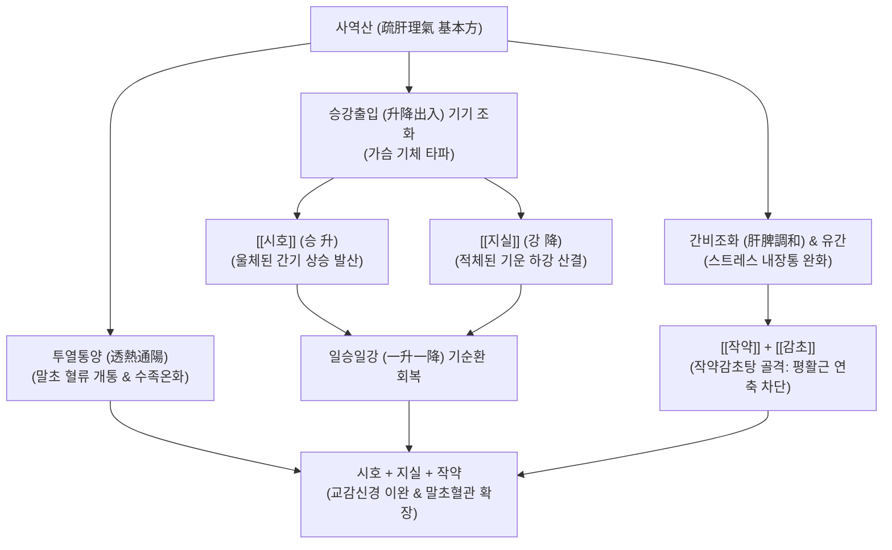

---
aliases:
  - 사역산
  - 四逆散
  - Sayeok-san
  - Four Frigid Extremities Powder
tags:
  - 처방/이기화해제
  - 이기화해제/소간해울
  - 양궐
  - 수족냉증
  - 간기울결
  - 과민성대장증후군
---

# 🍵 [[사역산]] (四逆散, Sayeok-san / Four Frigid Extremities Powder)

> **핵심 3줄 요약 (Key Summary)**:
> - 🌿 기본 구성: [[시호]], [[지실]], [[작약]], [[감초]] 각 동량(4~6g) 배오 (이기·소간의 기본 골격 방제).
> - 🎯 간울기체(肝鬱氣滯)로 양기가 속에서 뭉쳐 손발 끝만 차가워지는 양궐(陽厥) 수족냉증, 가슴 답답함, 옆구리 결림, 신경성 복통, 과민성 대장 증후군(IBS).
> - 🔬 교감신경 과긴장 억제 및 말초 미세혈관 평활근 이완, 소화관 세로토닌(5-HT) 수용체 조절을 통한 장운동 정상화, HPA축 코르티솔 과잉 분비 억제.
> - <font color="#fa7e7e">⚠️ 주의사항: 양기가 실제로 쇠약하여 온몸이 차가운 진한(眞寒) 사역증([[사역탕]]증)에는 절대 사용 금기, 반드시 울열(鬱熱)이 내재된 양궐을 확인 후 투여.</font>

---

## 📌 목차
1. [기본 처방 정보 & 군신좌사 구성](#1-기본-처방-정보--군신좌사-구성)
2. [방제학적 약재 상호작용 & 시너지 네트워크](#2-방제학적-약재-상호작용--시너지-네트워크)
3. [현대 분자약리학적 효능 & 작용 기전](#3-현대-분자약리학적-효능--작용-기전)
4. [적응 병증 및 체질별 감별 (Sweet Spot vs 금기)](#4-적응-병증-및-체질별-감별-sweet-spot-vs-금기)
5. [유사 처방군 감별 매트릭스](#5-유사-처방군-감별-매트릭스)
6. [임상 가감례 & 현대 질환별 응용](#6-임상-가감례--현대-질환별-응용)
7. [💡 사용자 진료실 핵심 필기 & 임상 팁 (원문 보존)](#7--사용자-진료실-핵심-필기--임상-팁-원문-보존)
8. [출처 및 학술 참고 문헌 (References)](#8-출처-및-학술-참고-문헌-references)

---

## 1. 기본 처방 정보 & 군신좌사 구성

* **출전**: 한대(漢代) 장중경(張仲景)의 《상한론(傷寒論)》 소음병편(少陰病篇)
* **방제 성격**: 후세 수많은 이기·소간 처방([[시호소간산]], [[소요산]], [[혈부축어탕]] 등)의 모태가 되는 기본 골격방
* **치법**: 투열해울(透熱解鬱), 소간이기(疏肝理氣), 조화간비(調和肝脾)
* **적응증**: 양궐(陽厥), 수족불온(손발 차가움), 흉협창만, 완복통, 이급후중, 담도경련, 신경성 위장염

| 구분 | 약재명 | 표준 용량 | 본초 효능 & 방제 내 역할 |
| :--- | :--- | :--- | :--- |
| **군약 (君藥)** | [[시호]] | 6g | 소간해울(疏肝解鬱), 승발투열, 울체된 간기를 펴서 속의 양기를 사지로 투달 |
| **신약 (臣藥)** | [[지실]] | 6g | 파기산결(破氣散結), 강역하기, 시호의 승산(升散)을 견제하고 흉격의 기체를 강하 |
| **좌약 (佐藥)** | [[작약]] (백작약) | 6g | 양혈유간(養血柔肝), 완급지통, 감초와 결합하여 내장 평활근 연축성 통증 해소 |
| **사약 (使藥)** | [[감초]] (자감초) | 4g | 보기건비(補氣健脾), 조화제약, 작약과 협동하여 완급지통 극대화 |

---

## 2. 방제학적 약재 상호작용 & 시너지 네트워크



* **일승일강(一升一降)의 기기(氣機) 소통**:
  - [[시호]]의 위로 흩뜨리는 성질(升)과 [[지실]]의 아래로 내리는 성질(降)이 완벽한 짝을 이루어, 중초에 꽉 막혀 있던 기의 출입(出入)과 승강(升降)을 회복시킵니다.
* **작약감초탕(芍藥甘草湯)의 내장통 제어 결합**:
  - 처방 내에 [[작약]]과 [[감초]]가 내재되어 있어, 간목(肝木)의 횡역으로 인한 위경련, 장경련, 담도 연축성 복통을 부드럽게 달래줍니다.

---

## 3. 현대 분자약리학적 효능 & 작용 기전

```
                  [사역산 탕전액 복용]
                            │
     ┌──────────────────────┼──────────────────────┐
     ▼                      ▼                      ▼
[교감신경 긴장 완화 & 혈류]  [장관 신경총 5-HT 조절]   [HPA축 스트레스 호르몬 정상화]
사이코사포닌 / 헤스페리딘    파에오니플로린 / 글리시리진  플라보노이드 복합체
알파-아드레날린 수용체 억제   5-HT3/5-HT4 균형 조절   CRH 및 코르티솔 분비 억제
말초혈관 연축 완화·수족온화  IBS 복통 및 배변장애 개선 불안·신경증·자율신경실조증 개선
```

1. **말초 혈관 연축 억제 및 수족 혈류 순환 촉진**:
   - 스트레스로 인해 과항진된 교감신경의 알파-아드레날린성 혈관 수축 반응을 억제하여, 사지 말단의 모세혈관 혈류량을 증대시킵니다.
   - 이는 가슴은 답답하고 얼굴은 상열감이 있는데 손발 끝만 얼음장처럼 차가운 스트레스성 수족냉증(레이노 증후군, 혈관운동성 냉증)을 신속히 온화하게 만듭니다.
2. **장관신경계(ENS) 세로토닌 수용체 조절 및 과민성 장(IBS) 개선**:
   - [[작약]]의 파에오니플로린(Paeoniflorin)과 [[지실]]의 나린진(Naringin)은 장관 평활근의 비정상적 경련을 차단하고 5-HT 수용체 경로를 조절하여, 복통과 함께 나타나는 설사와 변비의 불규칙한 배변 장애를 안정화합니다.
3. **간-뇌 축(Gut-brain axis) HPA축 정상화**:
   - 만성 구속 스트레스 모델에서 혈중 ACTH 및 코르티솔 농도를 낮추고, 뇌 내 도파민 및 세로토닌 대사를 안정시켜 신체화 장애(Somatization)를 경감시킵니다.

---

## 4. 적응 병증 및 체질별 감별 (Sweet Spot vs 금기)

### 1) Sweet Spot (최적 적용군)
* **주요 체질**: 스트레스를 쉽게 받고 속으로 삭이며 예민한 소음인 또는 간기울결형 소양인
* **핵심 증상**:
  - 양궐(陽厥): 손발은 차가우나 가슴은 답답하고 한숨을 자주 쉬며, 스트레스를 받으면 손발이 더 시려짐.
  - 신경성 소화기 증상: 긴장하면 배가 살살 아프고 화장실을 가야 하는 과민성 대장 증후군(IBS), 뒤가 묵직한 이급후중.
  - 협륵통 및 유방 팽통: 옆구리가 뻐근하게 결리고, 생리 전 유방이 단단하게 붓고 아픔.
* **설진/맥진**: 설담홍태백(舌淡紅苔白) 혹은 설변미홍, 맥현(脈弦) 혹은 현긴(弦緊).

### 2) 금기 및 신중 투여군
* **진한(眞寒) 음성양허 사역 환자**: 맥이 미약하여 거의 잡히지 않고(맥미욕절), 온몸이 얼음장 같으며 맑은 물설사를 하는 환자에게는 절대 금기 (반드시 [[사역탕]]을 사용).
* **음혈 극허 환자**: 피가 부족하고 진액이 말라 바짝 마른 환자는 사역산의 이기 작용이 진액을 더 말릴 수 있으므로 [[소요산]]이나 [[일관전]]으로 전환.

---

## 5. 유사 처방군 감별 매트릭스

| 처방명 | 핵심 구성 차이 | 주치 및 임상 차별점 | 맥진/설진 차이 |
| :--- | :--- | :--- | :--- |
| [[사역산]] | 시호, 지실, 작약, 감초 (4미) | **양기울결(기울) 양궐**, 가슴 답답함 + 말초 수족냉증, IBS | 설태박백, 맥현 |
| [[사역탕]] | 부자, 건강, 감초 | **심신양허 음성격양 진한**, 맥미욕절, 전신 궐랭 (생명 위독) | 설담태백활, 맥침미약 |
| [[시호소간산]] | 사역산 + 천궁, 향부자, 진피 (지실 대신 지각) | 기체뿐 아니라 **혈체(혈어)와 통증**이 뚜렷한 심한 협통·위통 | 설암태박, 맥현긴 |
| [[소요산]] | 시호, 당귀, 작약, 백출, 복령, 감초, 박하, 생강 | 기울과 함께 **혈허(血虛) 및 비허(脾虛)**가 겸해진 피로·생리불순 | 설담태백, 맥현세 |
| [[대시호탕]] | 시호, 황금, 대황, 지실, 작약, 반하 등 | **소양양명 실열**, 심하급통, 변비, 흉협고만 (대변 소통 목적) | 설홍태황니, 맥침실 |

---

## 6. 임상 가감례 & 현대 질환별 응용

### 1) 주요 가감례
* **기침이 동반되는 경우**: [[오미자]] 4g, [[건강]] 4g 가미 (상한론 원문 가감법).
* **가슴이 두근거리는 경우 (심계)**: [[복령]] 8g 가미.
* **소변이 시원치 않은 경우**: [[복령]] 8g, [[택사]] 6g 가미.
* **설사가 심하고 복통이 심한 경우**: [[백출]] 6g 가미.
* **열감이 뚜렷하고 입이 쓴 경우**: [[황금]] 6g, [[치자]] 4g 가미.

### 2) 현대 질환별 응용
* **스트레스성 수족냉증 & 레이노 증후군(Raynaud's phenomenon)**: 추위나 정서적 자극으로 손가락 혈관이 수축하여 하얗게 질리는 냉증 치료.
* **과민성 대장 증후군 (IBS-M, IBS-D)**: 긴장 시 발생하는 복통 및 무른 변 완화.
* **신경성 담도 이상 운동증**: 기질적 결석이 없는데도 우상복부가 결리고 뻐근한 담도 연축 완화.

---

## 7. 💡 사용자 진료실 핵심 필기 & 임상 팁 (원문 보존)

> [!tip] **진료실 실전 노하우 (User Clinical Insight)**
> 
> ### 1) 사역산의 4미 골격 구조
> * **기본 구성**: [[시호]], [[작약]], [[지실]], [[감초]] 4미로 이루어진 초간결 명방.
> * 이 4가지 약재의 배합은 이후 한의학 역사상 모든 이기·소간·활혈 방제([[시호소간산]], [[가미소요산]], [[혈부축어탕]])의 척추(Spine)가 되는 핵심 모듈임.
> 
> ### 2) 양궐(陽厥)과 음궐(陰厥)의 실전 감별
> * 환자가 "손발이 너무 차가워요"라고 호소할 때 무조건 보양제([[부자]], [[건강]])를 쓰면 큰 실수를 범하게 됨.
> * 환자의 가슴을 만져보거나 질문했을 때:
>   - **사역산증(양궐)**: 손발은 얼음장인데 가슴은 답답하고 열감이 있으며, 한숨을 쉬고, 스트레스받으면 손발이 더 차가워짐. 맥은 팽팽하고 힘이 있음(맥현 脈弦).
>   - **사역탕증(음궐)**: 온몸이 차갑고, 배도 차고, 찬물을 싫어하며, 맥이 가늘고 힘이 없음(맥침미 脈沈微).

---

## 8. 출처 및 학술 참고 문헌 (References)

1. Zhang, Z. J. (漢代). 《상한론(傷寒論)》 소음병편: "少陰病 四逆 其人或咳 或悸 或小便不利 或泄利下重者 四逆散主之."
