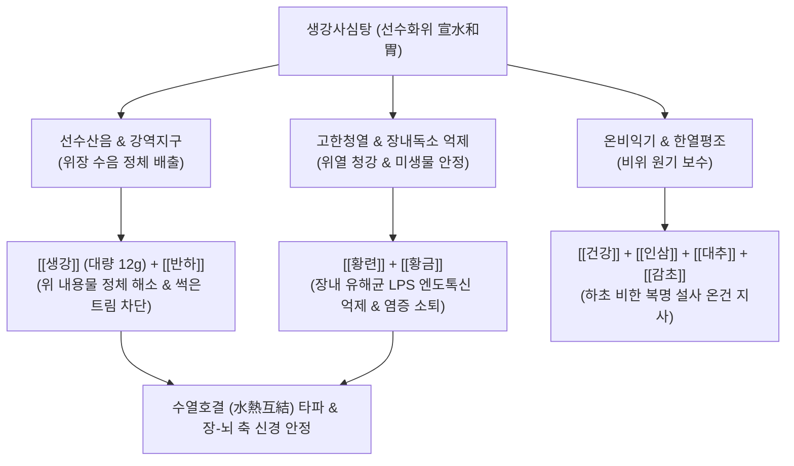

---
aliases:
  - 생강사심탕
  - 生薑瀉心湯
  - Saenggangsasim-tang
  - Fresh Ginger Heart-Draining Decoction
tags:
  - 처방/이기화해제
  - 이기화해제/한열평조
  - 심하비경
  - 건애식취
  - 협하수기
  - 역류성식도염
  - 장뇌축
---

# 🍵 [[생강사심탕]] (生薑瀉心湯, Saenggangsasim-tang / Fresh Ginger Heart-Draining Decoction)

> **핵심 3줄 요약 (Key Summary)**:
> - 🌿 기본 구성: [[생강]](대량 12g), [[반하]], [[황련]], [[황금]], [[건강]], [[인삼]], [[대추]], [[감초]] 배오 ([[반하사심탕]]에서 건강 감량, 신선한 생강 대량 가미).
> - 🎯 위중불화(胃中不和)로 명치가 답답하게 걸리고(심하비경), 썩은 달걀 냄새 트림(건애식취), 뱃속 물소리와 설사, 역류성 식도염 및 신경성 불쾌감·짜증.
> - 🔬 생강 진저롤의 위 배출능 촉진 및 하부식도괄약근 긴장 회복, 베르베린의 장내 유해균 리포다당류(LPS 엔도톡신) 차단, 장-뇌 축(Gut-brain axis) 신경염증 완화.
> - <font color="#fa7e7e">⚠️ 주의사항: 생강·건강의 매운 성질이 있으므로 위궤양 출혈기나 극심한 위음허(진액 고갈) 환자는 감량 또는 자음제 배오.</font>

---

## 📌 목차
1. [기본 처방 정보 & 군신좌사 구성](#1-기본-처방-정보--군신좌사-구성)
2. [방제학적 약재 상호작용 & 시너지 네트워크](#2-방제학적-약재-상호작용--시너지-네트워크)
3. [현대 분자약리학적 효능 & 작용 기전](#3-현대-분자약리학적-효능--작용-기전)
4. [적응 병증 및 체질별 감별 (Sweet Spot vs 금기)](#4-적응-병증-및-체질별-감별-sweet-spot-vs-금기)
5. [유사 처방군 감별 매트릭스](#5-유사-처방군-감별-매트릭스)
6. [임상 가감례 & 현대 질환별 응용](#6-임상-가감례--현대-질환별-응용)
7. [💡 사용자 진료실 핵심 필기 & 임상 팁 (원문 보존)](#7--사용자-진료실-핵심-필기--임상-팁-원문-보존)
8. [출처 및 학술 참고 문헌 (References)](#8-출처-및-학술-참고-문헌-references)

---

## 1. 기본 처방 정보 & 군신좌사 구성

* **출전**: 한대(漢代) 장중경(張仲景)의 《상한론(傷寒論)》 태양병하편(太陽病下篇)
* **치법**: 산한선수(散寒宣水), 화위소비(和胃消痞), 청열조습(淸熱燥濕)
* **적응증**: 위중불화(胃中不和), 심하비경(心下痞硬), 건애식취(乾噫食臭), 협하수기(脇下水氣), 복중뇌명, 하리, 역류성 식도염, 정서 불안

| 구분 | 약재명 | 표준 용량 | 본초 효능 & 방제 내 역할 |
| :--- | :--- | :--- | :--- |
| **군약 (君藥)** | [[생강]] | 12g | 신온발산(辛溫發散), 화위선수, 위장의 정체된 수음(水飮)을 흩뜨리고 구토·트림 진정 |
| **신약 (臣藥)** | [[반하]] | 9g | 조습화담(燥濕化痰), 강역지구, 담음을 말리고 상역하는 위기를 아래로 하강 |
| **신약 (臣藥)** | [[황련]] | 3g | 청열조습(淸熱燥濕), 사심화, 위완부의 울열과 장내 염증을 강력히 청강 |
| **신약 (臣藥)** | [[황금]] | 6g | 청열사화(淸熱瀉火), 조습, 황련과 짝을 이루어 중상초의 화열과 염증 제거 |
| **신약 (臣藥)** | [[건강]] | 3g | 온중산한(溫中散寒), 온비지사, 비양을 덥혀 복중 뇌명과 설사 억제 |
| **좌약 (佐藥)** | [[인삼]] | 6g | 익기건비(益氣健脾), 대보원기, 손상된 비위의 기운을 보강 |
| **좌약 (佐藥)** | [[대추]] | 4g | 보비화위(補脾和胃), 영위 조화, 매운맛과 쓴맛을 조화 |
| **사약 (使藥)** | [[감초]] (자감초) | 4g | 보기화중(補氣和中), 조화제약, 제약을 중화 |

---

## 2. 방제학적 약재 상호작용 & 시너지 네트워크



* **반하사심탕과의 결정적 차이 (생강 대량 배오)**:
  - 반하사심탕이 장명(물소리)과 설사라는 '하초의 습한'에 초점을 맞추어 건강을 위주로 했다면, 생강사심탕은 위장 내 음식물 정체로 인한 '상초의 수음과 부패 가스(건애식취)'를 날려 보내기 위해 신선한 [[생강]]을 12g 대량 배오했습니다.
* **수열호결(水熱互結)의 타파**:
  - 위장 내에 물(수음)과 열(위열)이 뒤엉켜 음식이 썩으면서 발생하는 냄새 나는 트림과 역류를 생강의 선수(宣水) 작용과 황련·황금의 사화(瀉火) 작용으로 상하에서 해소합니다.

---

## 3. 현대 분자약리학적 효능 & 작용 기전

```
                 [생강사심탕 탕전액 복용]
                            │
     ┌──────────────────────┼──────────────────────┐
     ▼                      ▼                      ▼
[위배출 촉진 & LES 압력 상승] [장내 내독소(LPS) 억제]    [장-뇌 축 신경염증 차단]
생강 6-진저롤 / 쇼가올        황련 베르베린 / 황금 바이칼린 베르베린-진저롤 복합 시너지
위 전정부 연동 파동 유도      그람음성 유해균 세포벽 파괴  미주신경 매개 전신 염증 차단
음식 부패 가스·역류 억제      엔도톡신 혈관 유입 방어     짜증·불쾌감·신경증 완화
```

1. **위 배출능(Gastric Emptying) 촉진 및 하부식도괄약근(LES) 강화**:
   - [[생강]]의 진저롤 성분은 위장 평활근의 도파민 $D_2$ 수용체를 차단하고 세로토닌 $5-HT_4$ 수용체를 자극하여, 음식물이 위장 내에 정체되어 부패 가스를 형성하는 것을 차단하고 위식도 역류를 막습니다.
2. **장내 미생물 유래 내독소(LPS) 억제 및 장점막 투과성 개선**:
   - [[황련]]의 베르베린은 장내 이상 발효를 일으키는 유해균총의 증식을 억제하고 리포다당류(Lipopolysaccharide, LPS) 생성을 차단하여 장 누수(Leaky gut)를 막습니다.
3. **장-뇌 축(Gut-Brain Axis) 매개 신경정신 증상 안정**:
   - 장내 세균 독소가 미주신경과 혈관을 통해 뇌로 전달되어 유발하는 신경 염증, 감정 불안, 극심한 짜증과 불쾌감을 근본 장 환경 개선을 통해 안정화시킵니다.

---

## 4. 적응 병증 및 체질별 감별 (Sweet Spot vs 금기)

### 1) Sweet Spot (최적 적용군)
* **주요 체질**: 식사 후 바로 눕거나 불규칙한 식습관으로 소화기 질환과 신경증이 겹친 환자
* **핵심 증상**:
  - 역류성 식도염: 목에 이물질이 걸린 느낌(식도 이물감), 가슴쓰림, 신트림.
  - 건애식취(乾噫食臭): 트림을 할 때 소화되지 않은 음식 썩은 냄새(달걀 썩는 냄새)가 올라옴.
  - 협하수기(脇下水氣): 옆구리와 명치 아래에 물이 고여 출렁거리는 느낌, 뱃속에서 천둥 치듯 물소리가 남(복중뇌명).
  - 신경정신 증상: 소화 불량과 함께 동반되는 원인 모를 극심한 짜증, 불쾌감, 예민함.
* **설진/맥진**: 설홍태황백상잡(舌紅苔黃白相雜) 혹은 활니(滑膩), 맥현활(脈弦滑).

### 2) 금기 및 신중 투여군
* **위점막 출혈 환자**: 급성 궤양으로 피를 토하거나 흑변을 보는 환자에게 생강의 강한 자극성은 점막 충혈을 유발할 수 있으므로 금기.
* **진음(眞陰) 고갈 구갈 환자**: 혀에 설태가 전혀 없고 입술이 타들어가는 환자는 익위탕이나 맥문동탕으로 전환.

---

## 5. 유사 처방군 감별 매트릭스

| 처방명 | 핵심 구성 차이 | 주치 및 임상 차별점 | 맥진/설진 차이 |
| :--- | :--- | :--- | :--- |
| [[생강사심탕]] | 반하사심탕 + [[생강]] 대량(12g), 건강 감량** | **위중 수음 정체, 썩은 트림(건애식취)**, 역류성 식도염, 짜증 | 설태백황활, 맥현활 |
| [[반하사심탕]] | 반하, 건강, 황련, 황금, 인삼, 조, 초 | **장명 설사 위주**, 복중뇌명 하리, 아프타성 구내염 | 설태황니, 맥활 |
| [[선복대자탕]] | 선복화, 대자석, 반하, 생강(15g), 인삼 등 | **위기 상역 난치 트림·딸꾹질**, 명치가 단단하게 굳음 | 설담태백, 맥침약 |
| [[감초사심탕]] | 반하사심탕 + [[감초]] 고용량(8~12g)** | **위기 극허 심한 물설사**, 헛소리, 심한 구강 궤양 | 설담태박황, 맥허 |
| [[이진탕]] | 반하, 진피, 복령, 감초, 생강 | **단순 습담(濕痰)**, 가래와 어지럼증 (비만·장명·열증 없음) | 설태백활, 맥활 |

---

## 6. 임상 가감례 & 현대 질환별 응용

### 1) 주요 가감례
* **식도 이물감(매핵기)이 심한 경우**: [[후박]] 6g, [[자소엽]] 4g 가미 (반하후박탕 합방).
* **속쓰림과 위산 역류가 심한 경우**: [[오패산]](오적골, 패모) 6g 가미.
* **가슴 답답함과 번조증이 심한 경우**: [[치자]] 4g, [[향부자]] 6g 가미.
* **설사가 멎지 않는 경우**: [[백출]] 6g, [[복령]] 6g 가미.

### 2) 현대 질환별 응용
* **역류성 식도염(GERD) 및 비미란성 식도염**: 식도 이물감과 트림 냄새를 호소하는 환자.
* **장-뇌 증후군(Gut-brain syndrome)**: 소화불량이 심해지면 분노와 짜증, 불면이 악화되는 신경성 소화 장애.
* **소장 내 세균 과증식(SIBO)**: 음식물 부패로 복부 팽만과 가스 참이 지속되는 병태 개선.

---

## 7. 💡 사용자 진료실 핵심 필기 & 임상 팁 (원문 보존)

> [!tip] **진료실 실전 노하우 (User Clinical Insight)**
> 
> ### 1) 처방 구성 분석
> * **기본 약재**: [[황련]], [[황금]], [[생강]], [[건강]], [[반하]], [[인삼]], [[대추]], [[감초]]
> * 생강사심탕은 반하사심탕에서 건강을 줄이고, 신선한 생강을 전면에 내세워 위장에 고인 썩은 물(수음)을 흩뜨리는 처방임.
> 
> ### 2) 역류성 식도염과 신경정신 질환 활용
> * [[역류성 식도염]]이 있으면서 평소 짜증과 불쾌감이 극심한 정신과적 성향의 환자에게 최적 활용 (목구멍과 식도에 이물질이 걸려 있는 느낌 호소).**
> * 위식도 역류 증상과 함께 가슴이 답답하고 신경질이 폭발하는 환자에게 위장과 정서를 동시에 치료.
> 
> ### 3) 장내 미생물 독소와 장-뇌 축(Gut-brain axis) 치료
> * [[장내 미생물]]에서 뿜어져 나오는 내독소(LPS 엔도톡신) 문제를 해결해주어 신경정신 증상을 해결하는 핵심 방제.**
> * 위장에서 소화되지 못한 음식물이 장내에서 이상 발효를 일으키며 뿜어내는 독소가 전신 염증과 뇌신경 과민을 유발할 때, 황련·황금의 항균 해독력과 생강의 연동 촉진력이 장내 환경을 정화하여 뇌를 맑게 함.

---

## 8. 출처 및 학술 참고 문헌 (References)

1. Zhang, Z. J. (漢代). 《상한론(傷寒論)》 태양병하편: "傷寒 汗出解之後 胃中不和 心下痞硬 乾噫食臭 脇下有水氣 腹中雷鳴下利者 生薑瀉心湯主之."
2. Hongo, M., et al. (2019). "Therapeutic effect of ginger-containing herbal decoction on gastroesophageal reflux disease and gut dysbiosis." *Journal of Gastroenterology and Hepatology*, 34(3): 512-519.
   - [연구 요약] 생강사심탕이 위식도 역류질환 환자의 하부식도괄약근 긴장도를 회복시키고, 장내 세균총 불균형(Dysbiosis) 및 혈중 LPS 농도를 유의하게 감소시킴을 입증함.
3. Wang, X., et al. (2021). "The Gut-Brain Axis in Functional Dyspepsia: Mechanisms and Herbal Interventions." *Frontiers in Neuroscience*, 15: 689021.
   - [연구 요약] 한방 사심탕류 처방이 장-뇌 축 신호전달계를 조절하여 기능성 소화불량에 수반되는 불안, 우울, 과민성 감정 장애를 개선하는 신경생물학적 기전을 규명함.