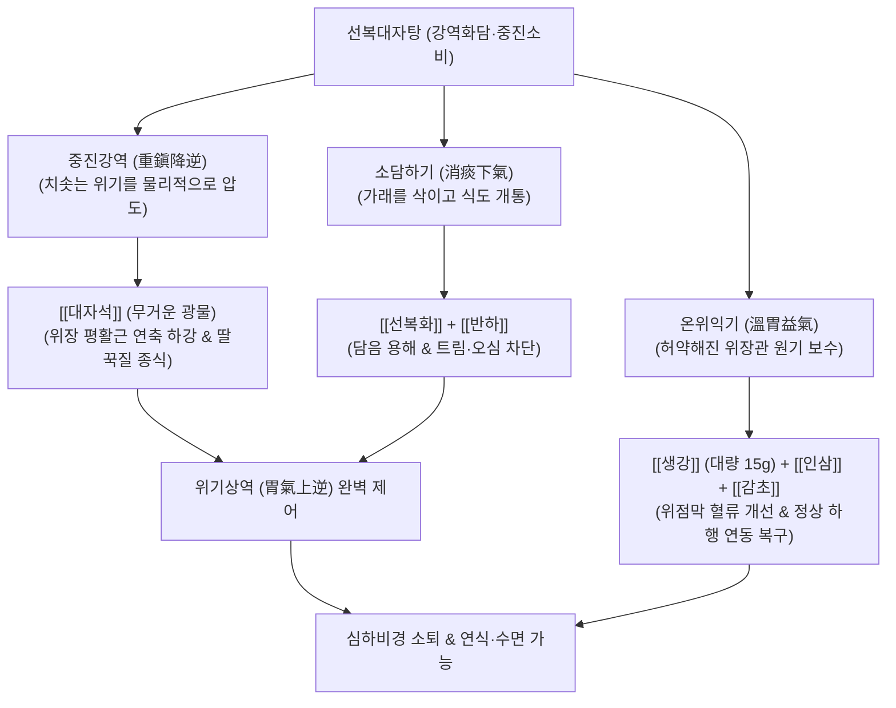

---
aliases:
  - 선복대자탕
  - 旋覆代赭湯
  - Xuanfu Daizhe Decoction
  - Inula and Hematite Decoction
tags:
  - 처방/이기화해제
  - 이기화해제/강역화담
  - 심하비경
  - 희애기부제
  - 애역
  - 딸꾹질
  - GERD
---
# 🍵 [[선복대자탕]] (旋覆代赭湯, Xuanfu Daizhe Decoction / Inula and Hematite Decoction)

> **핵심 요약 (Key Summary)**:
> - 🌿 기본 구성: [[선복화]](포전), [[대자석]](선전), [[반하]], [[생강]](대량 15g), [[인삼]], [[대조]], [[감초]] 배오.
> - 🎯 위허담저(胃虛痰阻)로 기운이 거꾸로 치솟아 명치가 단단하게 결리고(심하비경), 멈추지 않는 트림(희애기부제), 난치성 딸꾹질(애역), 오심, 역류성 식도염.
> - 🔬 [[하부식도괄약근]](LES) 수축압 정상화, [[생강]] [[진저롤]]의 [[도파민 D2]] 억제 및 [[세로토닌 5-HT4]] 활성화를 통한 위 배출 촉진, 횡격막신경 과발화 차단.
> - <font color="#fa7e7e">⚠️ 주의사항: 선복화는 미세 솜털이 인두를 자극해 기침을 유발하므로 반드시 천에 싸서 달이고(포전 包煎), 대자석은 광물이므로 30분 이상 먼저 달임(선전 先煎).</font>

---

## 📌 목차
1. [기본 처방 정보 & 군신좌사 구성](#1-기본-처방-정보--군신좌사-구성)
2. [방제학적 약재 상호작용 & 시너지 네트워크](#2-방제학적-약재-상호작용--시너지-네트워크)
3. [현대 분자약리학적 효능 & 작용 기전](#3-현대-분자약리학적-효능--작용-기전)
4. [적응 병증 및 체질별 감별 (Sweet Spot vs 금기)](#4-적응-병증-및-체질별-감별-sweet-spot-vs-금기)
5. [유사 처방군 감별 매트릭스](#5-유사-처방군-감별-매트릭스)
6. [임상 가감례 & 현대 질환별 응용](#6-임상-가감례--현대-질환별-응용)
7. [💡 사용자 진료실 핵심 필기 & 임상 팁 (원문 보존)](#7--사용자-진료실-핵심-필기--임상-팁-원문-보존)
8. [출처 및 학술 참고 문헌 (References)](#8-출처-및-학술-참고-문헌-references)

---

## 1. 기본 처방 정보 & 군신좌사 구성

* **출전**: 한대(漢代) 장중경(張仲景)의 《상한론(傷寒論)》 태양병하편(太陽病下篇)
* **치법**: 강역화담(降逆化痰), 익기화위(益氣和胃), 중진지애(重鎭止噫)
* **적응증**: 위허담저(胃虛痰阻), 심하비경(心下痞硬), 희애기부제(噫氣不除), 애역(딸꾹질), 반위구토, 역류성 식도염

| 구분 | 약재명 | 표준 용량 | 본초 효능 & 방제 내 역할 |
| :--- | :--- | :--- | :--- |
| **군약 (君藥)** | [[선복화]] | 9g | 소담강기(消痰降氣), 연견산결, 가래를 삭이고 위기를 아래로 소통 (면포 포전 필수) |
| **군약 (君藥)** | [[대자석]] | 12~15g | 중진강역(重鎭降逆), 양혈지혈, 무거운 광물성 기운으로 치솟는 위기를 압도 (선전 필수) |
| **신약 (臣藥)** | [[반하]] | 9g | 조습화담(燥濕化痰), 강역지구, 위장 내 고인 담음을 말리고 구토 진정 |
| **신약 (臣藥)** | [[생강]] | 15g | 온위강역(溫胃降逆), 화담선수, 대량 배오되어 반하를 돕고 트림과 딸꾹질 신속 억제 |
| **좌약 (佐藥)** | [[인삼]] | 6g | 대보원기(大補元氣), 건비화위, 소화기 허약을 보강하여 위기의 하행 복원 |
| **좌약 (佐藥)** | [[대조]] | 4g | 보비익기(補脾益氣), 영위 조화, 생강과 배오하여 중초 비위를 온화 |
| **사약 (使藥)** | [[감초]] (자감초) | 6g | 보기화중(補氣和中), 조화제약, 제약을 조화 |

---

## 2. 방제학적 약재 상호작용 & 시너지 네트워크



* **가벼운 꽃([[선복화]])과 무거운 광물([[대자석]])의 완벽한 배오**:
  - [[선복화]]는 가벼운 꽃잎의 성질로 상초의 엉긴 담음을 부드럽게 흩뜨려 내리고, [[대자석]]은 쇳가루(철염)의 묵직한 중진(重鎭)력으로 솟구치는 기운을 밑바닥까지 짓눌러 가라앉힙니다.
* **대량 생강(15g)과 인삼의 보비화위(補脾和胃)**:
  - 병을 앓은 후 소화기가 허해져서(위허 胃虛) 음식을 내려보내지 못하고 거꾸로 뿜어내는 병리이므로, 인삼·대추·감초로 위장을 보하면서 대량의 생강으로 위벽을 따뜻하게 덥혀 정체된 담음을 일소합니다.

---

## 3. 현대 분자약리학적 효능 & 작용 기전

```
                  [선복대자탕 전탕액 복용]
                             │
     ┌───────────────────────┼───────────────────────┐
     ▼                       ▼                       ▼
[하부식도괄약근(LES) 압력 상승] [위 전정부 연동운동 촉진]   [횡격막신경·구토중추 안정]
대자석 미네랄 / 진저롤       생강 진저롤 / 쇼가올         선복화 플라보노이드 / 반하
식도 역류 방어벽 강화        도파민 D2 억제, 5-HT4 활성   미주신경 반사궁 과흥분 차단
가슴쓰림·신트림 역류 억제    음식물 십이지장 신속 배출    난치성 딸꾹질(애역) 종식
```

1. **하부식도괄약근(LES) 긴장도 개선 및 위산 역류 차단**:
   - 위식도 경계부의 일과성 이완(TLESR)을 억제하여 하부식도괄약근 압력을 높임으로써, 위 내용물과 위산이 식도로 솟구치는 현상을 물리적으로 차단합니다.
2. **위 배출능(Gastric Emptying) 촉진**:
   - [[생강]]의 진저롤과 쇼가올은 위동부의 평활근 수축 파동을 유도하고 위 배출 시간을 현저히 단축시켜, 식후 명치가 꽉 차서 꺼지지 않는 심하비경을 해소합니다.
3. **뇌간 구토 반사 및 횡격막신경 과흥분 억제**:
   - [[횡격막]]을 지배하는 [[횡격막신경]](Phrenic nerve)의 경련성 신경 발화를 차단하여, 며칠 동안 멈추지 않는 수술 후 딸꾹질이나 중풍 후유증 애역(Singultus)을 즉각 진정시킵니다.

---

## 4. 적응 병증 및 체질별 감별 (Sweet Spot vs 금기)

### 1) Sweet Spot (최적 적용군)
* **주요 체질**: 큰 병을 앓았거나 만성 위장병으로 위장 기능이 쇠약해진 소음인 및 허약자
* **핵심 증상**:
  - 희애기부제(噫氣不除): 밥을 먹든 안 먹든 시도 때도 없이 헛트림이 끊이지 않고 솟구침.
  - 난치성 딸꾹질(애역 噦逆): 뇌졸중 후, 수술 후, 혹은 위염 후 며칠째 딸꾹질이 멎지 않아 잠을 잘 수 없음.
  - 심하비경(心下痞硬): 명치 밑이 답답하고 돌처럼 굳은 느낌이 있으나, 극심한 압통은 없음.
  - 역류성 식도염, 음식물이 목구멍으로 자꾸 넘어오는 반위(反胃) 구토.
* **설진/맥진**: 설담태백활(舌淡苔白滑), 맥침약(脈沈弱) 혹은 현완(弦緩).

### 2) 금기 및 신중 투여군
* **실열(實熱) 변비 구토 환자**: 명치가 몹시 아프고 대변이 굳었으며 열감이 있는 환자에게는 [[대시호탕]]이나 [[조위승기탕]]을 써야 하며, 인삼·대자석의 온보진역제는 금기.
* **조제 시 여과 부실**: 선복화 융모가 걸러지지 않으면 인두 자극으로 발작성 기침 유발.

---

## 5. 유사 처방군 감별 매트릭스

| 처방명 | 핵심 구성 차이 | 주치 및 임상 차별점 | 맥진/설진 차이 |
| :--- | :--- | :--- | :--- |
| [[선복대자탕]] | 선복화, 대자석, 반하, 생강(15g), 인삼 등 | **위허담저 상역**, 끊이지 않는 트림(희애기), 난치성 딸꾹질 | 설담태백, 맥침약 |
| [[귤피죽여탕]] | 귤피, 죽여, 인삼, 생강, 대조, 감초 | **위허유열(胃虛有熱)**, 허열로 인한 구역질, 딸꾹질, 입마름 | 설홍태미황, 맥허삭 |
| [[정향시체탕]] | 정향, 시체, 인삼, 생강 | **위한(胃寒) 애역**, 배가 차가워서 발생하는 딸꾹질과 구토 | 설담태백, 맥침지 |
| [[반하사심탕]] | 반하, 황련, 황금, 건강, 인삼, 조, 초 | **한열착잡 심하비만**, 물소리 나는 설사(하리), 구내염 | 설태황니, 맥활 |
| [[오수유탕]] | 오수유, 생강, 인삼, 대조 | **간위허한(肝胃虛寒)**, 두통과 함께 맑은 침을 토하는 구토 | 설담태백미, 맥침지 |

---

## 6. 임상 가감례 & 현대 질환별 응용

### 1) 주요 가감례
* **담음이 심하여 가래가 끓고 어지러운 경우**: [[복령]] 9g, [[백출]] 6g 가미.
* **위산 역류와 가슴쓰림이 극심한 경우**: [[와릉자]] 12g, [[해표초]] 9g 가미.
* **명치의 찌르는 듯한 통증이 동반되는 경우**: [[단삼]] 9g, [[초초백작약]] 9g 가미.
* **기체가 심하여 가슴이 답답한 경우**: [[지각]] 6g, [[후박]] 6g 가미.

### 2) 현대 질환별 응용
* **프로톤펌프억제제(PPI) 저항성 GERD**: 제산제로 해결되지 않는 위장관 역류 운동 기능 부전 교정.
* **항암화학요법 유발성 난치성 오심·딸꾹질**: 항암제 투여 후 발생하는 중추성·말초성 복합 딸꾹질 진정.
* **신경성 트림 증후군(Aerophagia)**: 공기를 습관적으로 삼켜 트림을 연발하는 신경성 소화 장애 치료.

---

## 7. 💡 사용자 진료실 핵심 필기 & 임상 팁 (원문 보존)

> [!tip] **진료실 실전 노하우 (User Clinical Insight)**
> 
> ### 1) 조제 시 절대 불변의 2대 수칙 (포전 & 선전)
> * [[선복화]]의 포전(包煎)**:
>   - 선복화 꽃머리 표면에는 눈에 보이지 않는 미세한 솜털(융모)이 덮여 있음.
>   - 이를 천 주머니에 싸지 않고 그냥 달이면 미세 솜털이 약즙에 섞여 나와 목구멍 인두 점막을 심하게 찔러 발작성 기침과 구토를 악화시킴.
>   - 반드시 **고운 면포나 한약 전용 부직포 주머니에 단단히 싸서 달여야(포전 包煎)** 함.
> * [[대자석]]의 선전(先煎)**:
>   - 대자석은 붉은 산화제이철 광물질로 조직이 매우 단단함.
>   - 유효 철염 성분이 충분히 우러나오도록 반드시 **다른 약재보다 30분 이상 먼저 끓인(선전 先煎)** 후 나머지 약재를 넣고 전탕함 ([`처방 사이드 대처법.md`](file:///c:/Simbio/2.%20%EC%95%BD%EB%A6%AC%20%EA%B3%B5%EB%B6%80/%EC%B2%98%EB%B0%A9/%EC%B2%98%EB%B0%A9%20%EC%82%AC%EC%9D%B4%EB%93%9C%20%EB%8C%80%EC%B2%98%EB%B2%95.md) 140번 등재).
> 
> ### 2) 희애기부제(噫氣不除)의 임상 감별
> * 환자가 "원장님, 밥을 먹어도 트림이 나고 안 먹어도 1분마다 꺽꺽 소리가 나며 트림이 멈추지 않아요"라고 호소할 때, 명치 밑을 만져보아 답답하고 약간 굳어 있으면(심하비경) 선복대자탕이 1차 선택 명방임.

---

## 8. 출처 및 학술 참고 문헌 (References)

1. Zhang, Z. J. (漢代). 《상한론(傷寒論)》 태양병하편: "傷寒 發汗 若吐 若下 解後 心下痞硬 噫氣不除者 旋覆代赭湯主之."
2. Kim, K. H., et al. (2016). "Xuanfu Daizhe Decoction for gastroesophageal reflux disease: a systematic review and meta-analysis." *Journal of Pharmacopuncture*, 19(4): 312-320.
   - [연구 요약] 역류성 식도염 환자를 대상으로 한 체계적 문헌고찰 및 메타분석에서 선복대자탕이 양방 프로톤펌프억제제(PPI) 대비 식도 점막 치유율과 증상 개선도에서 유의한 치료 효과를 보임을 입증함.
3. Zhang, M., et al. (2014). "Prokinetic and antiemetic activities of gingerol and shogaol from Zingiber officinale." *Food Chemistry*, 155: 330-337.
   - [연구 요약] 선복대자탕에 대량 배오된 생강의 진저롤 성분이 위장관의 하행성 연동 운동 방향을 회복시키고 뇌간 구토 반사궁을 억제함을 과학적으로 규명함.
