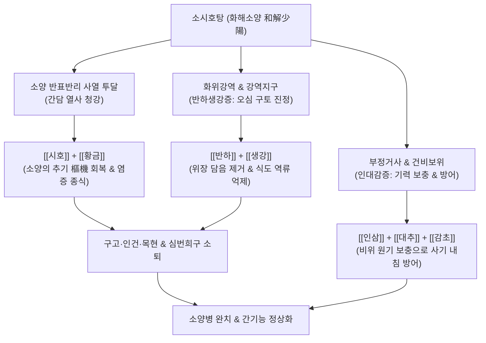

---
aliases:
  - 소시호탕
  - 小柴胡湯
  - Sosiho-tang
  - Minor Bupleurum Decoction
tags:
  - 처방/이기화해제
  - 이기화해제/화해소양
  - 반표반리
  - 왕래한열
  - 흉협고만
  - 만성간염
  - GERD
---

# 🍵 [[소시호탕]] (小柴胡湯, Sosiho-tang / Minor Bupleurum Decoction)

> **핵심 3줄 요약 (Key Summary)**:
> - 🌿 기본 구성: [[시호]], [[황금]], [[반하]], [[생강]], [[인삼]], [[대추]], [[감초]] 배오 (소양 반표반리의 기본 대표 방제).
> - 🎯 왕래한열, 흉협고만, 묵묵불욕음식, 심번희구, 구고·인건·목현의 소양병, 만성 간염(B·C형), 아급성 감기, 편도염, 야식 습관 역류성 식도염(GERD).
> - 🔬 간세포 보호 및 간섬유화(HSC 활성화) 억제, IFN-γ 분비 촉진을 통한 항바이러스, HPA축 코르티솔 조절, 위식도 역류 및 기침 반사 완화.
> - <font color="#fa7e7e">⚠️ 주의사항: 인터페론(IFN-α/β) 제제 병용 시 간질성 폐렴 위험으로 절대 병용 금기, 혈소판 10만/mm³ 이하의 간경변·간암 의심 환자는 투여 금기.</font>

---

## 📌 목차
1. [기본 처방 정보 & 군신좌사 구성](#1-기본-처방-정보--군신좌사-구성)
2. [방제학적 약재 상호작용 & 시너지 네트워크](#2-방제학적-약재-상호작용--시너지-네트워크)
3. [현대 분자약리학적 효능 & 작용 기전](#3-현대-분자약리학적-효능--작용-기전)
4. [적응 병증 및 체질별 감별 (Sweet Spot vs 금기)](#4-적응-병증-및-체질별-감별-sweet-spot-vs-금기)
5. [유사 처방군 감별 매트릭스](#5-유사-처방군-감별-매트릭스)
6. [임상 가감례 & 현대 질환별 응용](#6-임상-가감례--현대-질환별-응용)
7. [💡 사용자 진료실 핵심 필기 & 임상 팁 (원문 보존)](#7--사용자-진료실-핵심-필기--임상-팁-원문-보존)
8. [출처 및 학술 참고 문헌 (References)](#8-출처-및-학술-참고-문헌-references)

---

## 1. 기본 처방 정보 & 군신좌사 구성

* **출전**: 한대(漢代) 장중경(張仲景)의 《상한론(傷寒論)》 소양병편(少陽病篇)
* **방제 지위**: 한의학 화해제(和解劑)의 비조(鼻祖)이자 반표반리(半表半裏) 소양병의 대표 처방
* **치법**: 화해소양(和解少陽), 소간건비(疏肝健脾), 조화영위(調和營衛)
* **적응증**: 왕래한열(往來寒熱), 흉협고만(胸協苦滿), 묵묵불욕음식(嘿嘿不欲飮食), 심번희구(心煩喜嘔), 구고(口苦), 인건(咽乾), 목현(目眩)

| 구분 | 약재명 | 표준 용량 | 본초 효능 & 방제 내 역할 |
| :--- | :--- | :--- | :--- |
| **군약 (君藥)** | [[시호]] | 12~15g | 투표설열(透表泄熱), 소간해울, 소양의 반표반리 사열을 밖으로 투달 |
| **신약 (臣藥)** | [[황금]] | 9g | 청열조습(淸熱燥濕), 사화해독, 시호와 짝을 이루어 담열(膽熱)을 청강 |
| **신약 (臣藥)** | [[반하]] | 9g | 조습화담(燥濕化痰), 강역지구, 담음을 말리고 치솟는 구역질 진정 |
| **좌약 (佐藥)** | [[생강]] | 6g | 온위화중(溫胃和中), 강역지토, 반하를 도와 위기를 조화 |
| **좌약 (佐藥)** | [[인삼]] | 6g | 익기건비(益氣健脾), 부정거사, 정기를 길러 사기가 체내 깊숙이 침입하는 것 방어 |
| **좌약 (佐藥)** | [[대추]] | 4g | 보비익기(補脾益氣), 양혈안신, 비위를 북돋워 영위 조화 |
| **사약 (使藥)** | [[감초]] (자감초) | 4g | 보기화중(補氣和中), 조화제약, 시호·황금의 고한과 반하·생강의 신온을 조화 |

---

## 2. 방제학적 약재 상호작용 & 시너지 네트워크



* **시호·황금의 추기(樞機) 회복 시너지**:
  - [[시호]]의 상승 투달 작용과 [[황금]]의 하강 청열 작용이 짝을 이루어, 인체의 기운이 열리고 닫히는 경첩(추기 樞機) 역할을 하는 소양(간담)의 소통을 완벽히 회복시킵니다.
* **거사(祛邪)와 부정(扶正)의 공존**:
  - 사기를 쫓아내는 시호·황금·반하에 정기를 돕는 인삼·대추·감초를 배오하여, 몸의 면역력이 약해져 병사가 표(表)도 리(裏)도 아닌 중간(반표반리)에 갇힌 상태를 정기를 북돋워 자연스럽게 몰아냅니다.

---

## 3. 현대 분자약리학적 효능 & 작용 기전

```
                  [소시호탕 탕전액 복용]
                            │
     ┌──────────────────────┼──────────────────────┐
     ▼                      ▼                      ▼
[간세포 보호 & 섬유화 억제]   [면역 조절 & 항바이러스]    [위식도 역류 & 기침 반사 억제]
사이코사포닌 / 바이칼린       IFN-γ 분비 촉진 / IL-6 억제  진저롤 / 반하 알칼로이드
간성상세포(HSC) 콜라겐 차단  대식세포 탐식능 증강        하부식도괄약근 긴장 & 진토
AST/ALT 강하 및 간경화 방어  B·C형 간염 바이러스 억제   새벽 기침·목통증·역류 해소
```

1. **간세포 보호 및 간섬유화(Liver Fibrosis) 억제**:
   - [[시호]]의 사이코사포닌-d와 [[황금]]의 바이칼린은 간성상세포(Hepatic Stellate Cells, HSC)의 증식과 I형 콜라겐 합성을 차단하여 간섬유화 진행을 억제하고 간기능 수치(AST/ALT)를 유의하게 강하시킵니다.
2. **면역 조절 및 바이러스 증식 억제**:
   - 인터페론 감마(IFN-γ)와 인터루킨-2(IL-2) 생성을 촉진하여 자연살해세포(NK cell) 활성을 높이고, 만성 B형 및 C형 간염 바이러스의 복제를 억제합니다.
3. **위식도 역류 및 야간 발작성 기침 차단**:
   - [[반하]]와 [[생강]] 성분이 위장관 배출을 촉진하고 하부식도괄약근의 압력을 보존하여, 자고 일어났을 때 목에 가래가 끓고 위산이 역류하여 입이 쓰고 새벽에 기침이 터지는 GERD 증상을 완치시킵니다.

---

## 4. 적응 병증 및 체질별 감별 (Sweet Spot vs 금기)

### 1) Sweet Spot (최적 적용군)
* **주요 체질**: 과로와 스트레스로 면역력이 떨어진 소음인 또는 간담 기능이 실조된 소양인
* **핵심 증상**:
  - 왕래한열(往來寒熱): 오한과 발열이 하루에도 몇 번씩 주기적으로 번갈아 나타남.
  - 흉협고만(胸協苦滿): 양쪽 옆구리(갈비뼈 아래)가 뻐근하게 결리고 누르면 불쾌함.
  - 구고(口苦), 인건(咽乾), 목현(目眩): 입이 쓰고, 목구멍이 마르며, 눈앞이 아찔함.
  - 묵묵불욕음식(嘿嘿不欲飮食), 심번희구(가슴이 답답하고 메스꺼움).
  - 만성 B·C형 간염, 아급성 감기, 만성 편도염, 과식·야식 습관 역류성 식도염.
* **설진/맥진**: 설홍태백니(舌紅苔白膩) 혹은 박백, 맥현(脈弦).

### 2) 금기 및 신중 투여군
* **인터페론(IFN-α, IFN-β) 투여 환자 절대 금기**: 소시호탕과 인터페론을 병용 투여할 경우 치명적인 **급성 간질성 폐렴(Interstitial Pneumonia)** 발생 위험이 급격히 증가하므로 병용을 엄격히 금지함.
* **진행성 간경변 및 혈소판 10만/mm³ 이하 환자**: 간암 발생 위험이 있는 비대상성 간경변 환자에게는 면역 과반응 우려로 투여 금기.

---

## 5. 유사 처방군 감별 매트릭스

| 처방명 | 핵심 구성 차이 | 주치 및 임상 차별점 | 맥진/설진 차이 |
| :--- | :--- | :--- | :--- |
| [[소시호탕]] | 시호, 황금, 반하, 생강, 인삼, 대조, 감초 | **소양 반표반리**, 왕래한열, 흉협고만, 구고, 구토, 만성 간염 | 설태박백, 맥현 |
| [[대시호탕]] | 소시호탕에서 인삼·감초 빼고 + **대황, 지실, 작약** | **소양양명 합병 실열**, 심하급통, 변비, 복부비만 (#뚱뚱증) | 설홍태황니, 맥침실 |
| [[시호계지탕]] | 소시호탕 + **계지탕** (반반) | **태양소양 합병**, 오한 발열, 관절통과 함께 흉협고만 동반 | 설태박백, 맥현완 |
| [[시호가용골모려탕]] | 소시호탕 + **용골, 모려, 복령, 계지, 대황** | 소양병에 **헛소리(섬어), 심한 불안, 가슴 두근거림, 불면** | 설태황, 맥현삭 |
| [[반하사심탕]] | 시호 대신 **황련**, 생강 대신 **건강** | 반표반리가 아닌 **중초 심하비만**, 물소리 나는 설사 | 설태황니, 맥활 |

---

## 6. 임상 가감례 & 현대 질환별 응용

### 1) 주요 가감례
* **가슴이 답답하고 기침이 나는 경우**: [[인삼]]을 빼고 [[오미자]] 4g, [[건강]] 4g 가미 (상한론 원문).
* **목마름(구갈)이 심한 경우**: [[반하]]를 빼고 [[천화분]] 9g 가미.
* **복통이 심한 경우**: [[황금]]을 빼고 [[작약]] 9g 가미 (작약감초탕 합방).
* **옆구리 덩어리(비괴)나 간비종대가 있는 경우**: [[별갑]] 12g, [[모려]] 12g 가미.

### 2) 현대 질환별 응용
* **만성 B형·C형 간염**: 간수치(ALT/AST) 강하 및 간섬유화 억제.
* **아급성 상기도염(감기 후유증)**: 감기 끝물에 열은 다 내렸는데 미열이 오르내리고 기침과 가래, 식욕 부진이 지속될 때.
* **역류성 식도염(GERD)**: 식사 후 바로 자는 습관으로 발생하는 아침 목통증 및 새벽 기침 완치.

---

## 7. 💡 사용자 진료실 핵심 필기 & 임상 팁 (원문 보존)

> [!tip] **진료실 실전 노하우 (User Clinical Insight)**
> 
> ### 1) 처방 구성의 3대 모듈 분석
> * **기본 구성**: [[시호]], [[황금]] / [[반하]], [[생강]] / [[인삼]], [[대추]], [[감초]]
> * **결합 구조**: 시호·황금(소양 청열) + 인대감증([[인삼]], [[생강]], [[감초]]) + 반하생강증([[반하]], [[생강]])의 3대 블록 결합.
> 
> ### 2) 적응증 및 인대감·반하생강증 결합 병태
> * <font color="#fa7e7e">인대감증, 반하생강증을 가진 환자에게 염증이나 세포 손상이 발생한 경우에 사용.</font>
> * **적응 질환군**: 만성 간염(B형, C형), 유아 담도폐색, 지연성 황달, 자궁내막증 환자의 다나졸(Danazol) 복용 시 간기능 장애 예방, 만성 위염, 지중해열, 편도염, 비만, 만성피로증후군, 아급성 감기.
> 
> ### 3) 절대 불변의 2대 금기 (간질성 폐렴 & 간경변)
> * **인터페론 제제(IFN-α, IFN-β)와의 병용 절대 금기**: 일본에서 다수 보고된 치명적 간질성 폐렴 위험.
> * **혈소판 수가 10만/mm³ 이하이며 간경변(간암)이 의심되는 경우 투여 금기**.
> 
> ### 4) 인삼, 생강, 감초 (인대감증 人代甘證) 감별
> * 병을 오래 앓거나 피로, 과로, 수면 부족이 누적되어 무기력하고 힘이 없는 환자.
> * 체질과 상황에 따라 [[인삼]] 대신에 [[당삼]]을 사용하는 것이 훨씬 편안하고 좋을 수 있음.
> 
> ### 5) 반하, 생강 (반하생강증 半夏生薑證) & 야식 습관 GERD
> * 역류성 식도염에서 점막 부식까지는 되지 않는 위산 역류 질환(NERD/GERD).
> * **임상 증상**: 아침에 자고 일어났을 때 가래가 끓고, 위산이 올라와 입안이 쓰며(구고), 목이 아프고, 기관지로 넘어가면 새벽에 발작성 기침을 하는 증상 (낮에는 괜찮고 트림, 흉통, 만성 인후통, 코골이 동반).
> * **생활 습관**: 현대인의 과식하는 습관, 식사하고 바로 자거나 야식을 먹는 습관에 적극 활용 ([[반하]], [[생강]], [[이진탕]]).
> 
> ### 6) 현대 약리 작용
> * 간장애 억제, 간재생 촉진, 간섬유화 억제, 항암, 항바이러스, 항간염바이러스, 항박테리아 작용.

---

## 8. 출처 및 학술 참고 문헌 (References)

1. Zhang, Z. J. (漢代). 《상한론(傷寒論)》 소양병편: "傷寒五六日 中風 往來寒熱 胸脅苦滿 嘿嘿不欲飮食 心煩喜嘔 ... 小柴胡湯主之."
2. Shimizu, I. (2000). "Sho-saiko-to: Japanese herbal medicine for protection against hepatitis and fibrosis and for prevention of hepatocellular carcinoma." *Journal of Gastroenterology and Hepatology*, 15(s1): D84-D90.
   - [연구 요약] 소시호탕이 간염 바이러스성 간질환 환자에서 간섬유화 진행을 막고 간세포암(HCC) 발생률을 유의하게 억제함을 임상 및 기초 연구를 통해 증명함.
3. Ishizaki, T., et al. (1996). "Interferon-induced interstitial pneumonitis: an interaction with Sho-saiko-to (TJ-9)." *European Respiratory Journal*, 9(12): 2691-2693.
   - [연구 요약] 인터페론과 소시호탕 병용 시 발생하는 간질성 폐렴의 위험성을 경고하고 병용 금기의 임상적 근거를 제시한 획기적 논문.