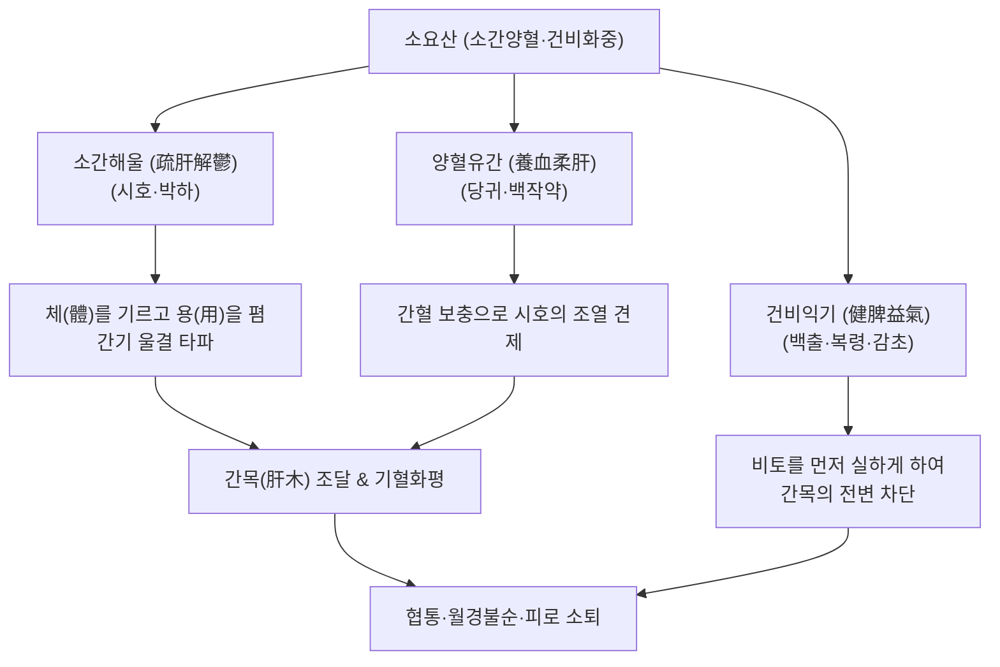

---
aliases:
  - 소요산
  - 逍遙散
  - Soyo-san
  - Free and Easy Wanderer
  - Rambling Powder
tags:
  - 처방/이기화해제
  - 이기화해제/소간해울
  - 간울혈허
  - 간비불화
  - 월경부조
  - 신경쇠약
---

# 🍵 [[소요산]] (逍遙散, Soyo-san / Free and Easy Wanderer Powder)

> **핵심 3줄 요약 (Key Summary)**:
> - 🌿 기본 구성: [[시호]], [[당귀]], [[백작약]], [[백출]], [[복령]], [[감초]], [[박하]], [[생강]] 배오 (소간양혈·건비화중의 비조).
> - 🎯 간울혈허(肝鬱血虛) 및 간비불화로 인한 양 옆구리 결림(협통), 잦은 한숨, 두통목현, 식욕 부진, 피로, 월경불순 및 신경성 유방통.
> - 🔬 시냅스 간극 5-HT 세로토닌 및 BDNF 발현 상향, HPA축 코르티솔 정상화, 간세포 항산화 및 장-간 축 미세혈류 촉진.
> - <font color="#fa7e7e">⚠️ 주의사항: 화열(火熱)이 성하여 안면홍조와 번열이 심한 환자는 [[가미소요산]](단치소요산)을 쓰고, 순수 음허로 진액이 마른 환자는 자음제 배오.</font>

---

## 📌 목차
1. [기본 처방 정보 & 군신좌사 구성](#1-기본-처방-정보--군신좌사-구성)
2. [방제학적 약재 상호작용 & 시너지 네트워크](#2-방제학적-약재-상호작용--시너지-네트워크)
3. [현대 분자약리학적 효능 & 작용 기전](#3-현대-분자약리학적-효능--작용-기전)
4. [적응 병증 및 체질별 감별 (Sweet Spot vs 금기)](#4-적응-병증-및-체질별-감별-sweet-spot-vs-금기)
5. [유사 처방군 감별 매트릭스](#5-유사-처방군-감별-매트릭스)
6. [임상 가감례 & 현대 질환별 응용](#6-임상-가감례--현대-질환별-응용)
7. [💡 사용자 진료실 핵심 필기 & 임상 팁 (원문 보존)](#7--사용자-진료실-핵심-필기--임상-팁-원문-보존)
8. [출처 및 학술 참고 문헌 (References)](#8-출처-및-학술-참고-문헌-references)

---

## 1. 기본 처방 정보 & 군신좌사 구성

* **출전**: 송대(宋代) 《태평혜민화제국방(太平惠民和劑局方)》 부인규문(婦人規門)
* **방제 성격**: "간체(肝體)는 음(陰)이고 간용(肝用)은 양(陽)"이라는 한의학 간장 생리론을 완벽히 구현한 소간이기·양혈건비의 표준 처방
* **치법**: 소간해울(疏肝解鬱), 양혈유간(養血柔肝), 건비익기(健脾益氣)
* **적응증**: 간울혈허(肝鬱血虛), 협륵창통, 두목혼현, 신피식소, 월경부조, 유방창통

| 구분 | 약재명 | 표준 용량 | 본초 효능 & 방제 내 역할 |
| :--- | :--- | :--- | :--- |
| **군약 (君藥)** | [[시호]] | 6g | 소간해울(疏肝解鬱), 승양달표, 맺힌 간기를 부드럽게 흩뜨려 소통 |
| **신약 (臣藥)** | [[당귀]] | 6g | 보혈양혈(補血養血), 화혈조경, 간혈(肝血)을 채워 시호의 승산(조열)을 완충 |
| **신약 (臣藥)** | [[백작약]] | 6g | 양혈유간(養血柔肝), 완급지통, 간목의 횡역을 달래고 당귀와 함께 음혈 자양 |
| **좌약 (佐藥)** | [[백출]] | 6g | 건비익기(健脾益氣), 조습, 비토를 보강하여 간병이 비장으로 전변하는 것 방어 |
| **좌약 (佐藥)** | [[복령]] | 6g | 영심안신(寧心安神), 건비삼습, 백출을 도와 수습을 배출하고 정신 안정 |
| **좌약 (佐藥)** | [[생강]] | 3g | 강역지구(降逆止嘔), 온중화위, 시호의 약성을 돕고 비위를 조화 |
| **좌약 (佐藥)** | [[박하]] | 2g | 신량발산(辛凉發散), 소간해울 보조, 상초의 미세한 기체열을 발산 (후하) |
| **사약 (使藥)** | [[감초]] (자감초) | 3g | 보기화중(補氣和中), 조화제약, 작약과 결합하여 완급지통 |

---

## 2. 방제학적 약재 상호작용 & 시너지 네트워크



* **체용겸고(體用兼顧)의 묘방**:
  - 간은 혈을 저장하므로 몸체는 음(陰)이고, 기운을 소통시키므로 작용은 양(陽)입니다.
  - [[시호]]·[[박하]]로 간의 작용(用)을 시원하게 소통시키면서, [[당귀]]·[[백작약]]으로 간의 몸체(體, 음혈)를 채워주므로, 기를 흩뜨리면서도 혈을 상하지 않게 합니다.
* **선실비토(先實脾土)의 원칙**:
  - 《금궤요략》의 "간병을 보면 비장으로 전변할 것을 알고 마땅히 비장을 먼저 실하게 한다(見肝之病 知肝傳脾 當先實脾)"는 법칙에 따라 사군자탕 골격([[백출]], [[복령]], [[감초]])을 내재시켰습니다.

---

## 3. 현대 분자약리학적 효능 & 작용 기전

```
                  [소요산 탕전액 복용]
                            │
     ┌──────────────────────┼──────────────────────┐
     ▼                      ▼                      ▼
[뇌 세로토닌·BDNF 신경가소성] [HPA축 코르티솔 정상화]   [난소-자궁 미세혈류 개선]
사이코사포닌 / 파에오니플로린  글리시리진 / 페룰산        다당체 / 진저롤
5-HT1A 활성 & CREB 인산화   ACTH 분비 억제 & 부신 안정 에스트로겐 수용체 감도 정상화
불안·우울·무기력증 해소     만성 스트레스 피로 회복    생리통·생리주기 불순 교정
```

1. **세로토닌(5-HT) 시스템 조절 및 해마 신경세포 보호**:
   - [[백작약]]의 파에오니플로린과 [[시호]]의 사이코사포닌은 뇌 해마 부위의 세로토닌 $5-HT_{1A}$ 수용체 활성을 높이고 뇌신경영양인자(BDNF)의 발현을 촉진하여 만성 스트레스로 인한 우울·불안 반응을 유의하게 개선합니다.
2. **시상하부-뇌하수체-부신(HPA) 축 과항진 완화**:
   - 스트레스 호르몬인 코르티솔(Cortisol) 및 ACTH의 과잉 분비를 정상 범위로 되돌려, 만성 피로와 면역력 저하를 방어합니다.
3. **난소-자궁 호르몬 수용체 감도 정상화**:
   - [[당귀]]의 페룰산(Ferulic acid)과 식물성 에스트로겐 유사 성분이 골반강 혈류 순환을 촉진하고 자궁 내막의 국소 염증을 완화하여 배란 장애와 월경 불순을 교정합니다.

---

## 4. 적응 병증 및 체질별 감별 (Sweet Spot vs 금기)

### 1) Sweet Spot (최적 적용군)
* **주요 체질**: 신경이 예민하고 혈색이 다소 창백하며 쉽게 피로해지는 소음인 및 소양인 여성
* **핵심 증상**:
  - 간울혈허: 가슴과 옆구리가 뻐근하게 결리고, 한숨을 쉬면 편안해짐.
  - 두통목현: 신경을 쓰면 머리가 지끈거리고 어지러움.
  - 소화장애: 스트레스만 받으면 입맛이 뚝 떨어지고 소화가 안 됨(간비불화).
  - 부인과 질환: 월경주기 불순, 생리 전 유방이 단단하게 붓고 아픔, 생리혈 양 감소.
* **설진/맥진**: 설담홍태박백(舌淡紅苔薄白), 맥현세(脈弦細).

### 2) 금기 및 신중 투여군
* **간화(肝火)가 극심한 안면홍조 환자**: 얼굴이 붉게 달아오르고, 눈이 충혈되며, 성격이 불같고 혀가 새빨간 환자에게는 목단피와 치자가 추가된 [[가미소요산]]을 써야 함.
* **음허화왕(陰虛火旺) 진액 고갈 환자**: 혀에 설태가 없고 식은땀이 비 오듯 쏟아지는 환자에게는 일관전이나 육미지황탕류로 전환.

---

## 5. 유사 처방군 감별 매트릭스

| 처방명 | 핵심 구성 차이 | 주치 및 임상 차별점 | 맥진/설진 차이 |
| :--- | :--- | :--- | :--- |
| [[소요산]] | 시호, 당귀, 작약, 백출, 복령, 감초, 박하, 생강 | **간울 + 혈허 + 비약**, 협통, 두통, 피로, 생리불순 (화열 경증) | 설담태박백, 맥현세 |
| [[가미소요산]] | 소요산 + [[목단피]], [[치자]] | 간울혈허에 **화(火)가 상열**, 갱년기 안면홍조, 발한, 번열 | 설홍태황, 맥현삭 |
| [[시호소간산]] | 시호, 지각, 작약, 천궁, 향부자, 진피, 감초 | 혈허·비약보다는 **순수 기체(氣滯) 통증**, 심한 늑간통·위통 | 설태박백, 맥현긴 |
| [[사역산]] | 시호, 지실, 작약, 감초 (4미) | **양기울결 양궐**, 가슴 답답 + 말초 수족냉증, IBS 복통 | 설태박백, 맥현 |
| [[귀비탕]] | 인삼, 황기, 백출, 복령, 산조인, 용안육 등 | **사려과다 심비양허**, 불면, 건망, 빈혈, 심계 (기울 경증) | 설담무태, 맥세약 |

---

## 6. 임상 가감례 & 현대 질환별 응용

### 1) 주요 가감례
* **열감이 나타나고 가슴이 답답한 경우**: [[목단피]] 4g, [[치자]] 4g 가미 ([[가미소요산]] 전환).
* **혈허(빈혈)가 심하여 얼굴이 누렇고 어지러운 경우**: [[숙지황]] 6~8g 가미 (흑소요산 黑逍遙散).
* **생리통이 극심한 경우**: [[향부자]] 6g, [[현호색]] 6g 가미.
* **가슴과 옆구리가 바늘로 찌르듯 아픈 경우**: [[울금]] 6g, [[단삼]] 6g 가미.

### 2) 현대 질환별 응용
* **월경전증후군(PMS) & 월경불순**: 배란 장애, 황체기 단축, 생리 전 감정 기복 치료.
* **신경성 소화불량 & 과민성 대장 증후군**: 정서적 긴장 시 악화되는 복통과 식욕 부진 완화.
* **만성 피로 증후군 및 경증 우울증**: 항우울제 복용에 거부감이 있는 환자의 신경안정 및 기력 회복.

---

## 7. 💡 사용자 진료실 핵심 필기 & 임상 팁 (원문 보존)

> [!tip] **진료실 실전 노하우 (User Clinical Insight)**
> 
> ### 1) 소요산과 가미소요산의 실전 선택 기준
> * 환자가 "스트레스받으면 옆구리가 결리고 피곤하고 생리주기가 들쭉날쭉해요"라고 할 때:
>   - **소요산**: 열감이나 얼굴 붉어짐이 별로 없고, 추위도 타고, 몸이 전반적으로 허약하고 기운이 처질 때 최적.
>   - **가미소요산**: 가슴에서 불이 올라오고, 에어컨을 찾으며, 갱년기처럼 얼굴이 확 달아오르고 짜증이 폭발할 때(화열 有) 선택.
> 
> ### 2) 흑소요산(黑逍遙散)의 임상 응용
> * 소요산에 [[숙지황]](생지황)을 가미한 흑소요산은 음혈(陰血)이 극도로 부족하여 피부가 가렵고 바짝 마르며 생리량이 현저히 줄어든 간혈허 환자에게 특효를 발휘함.

---

## 8. 출처 및 학술 참고 문헌 (References)

1. 宋代. 《태평혜민화제국방(太平惠民和劑局方)》: "逍遙散 治血虛倦怠 頭目昏眩 肢體疼痛 嗜臥 婦人經血不調."
2. Chen, R., et al. (2020). "Xiaoyaosan improves depressive-like behaviors in rats through regulating the gut microbiota and HPA axis." *Phytomedicine*, 79: 153348.
   - [연구 요약] 소요산이 장내 세균총 환경을 개선하고 HPA축 호르몬 과분비를 억제하여 스트레스 유발 우울 및 불안 유사 행동을 정상화함을 입증함.
3. Zhang, Y., et al. (2018). "Antidepressant effects of Xiaoyaosan: a review of current pharmacological mechanisms." *Biomedicine & Pharmacotherapy*, 108: 1475-1483.
   - [연구 요약] 소요산의 신경생화학적 기전을 종합 검토하여 뇌 유래 신경영양인자(BDNF), 시냅스 가소성 및 염증성 사이토카인 억제 경로를 규명함.