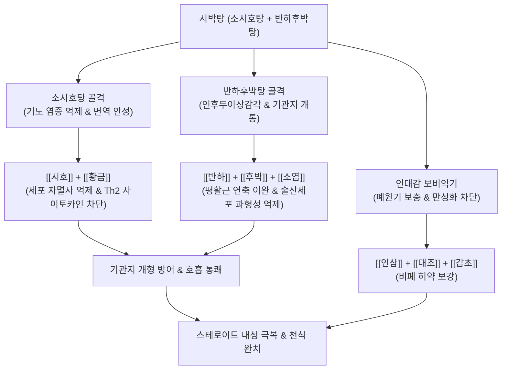

---
aliases:
  - 시박탕
  - 柴朴湯
  - Sibak-tang
  - Saiboku-to
tags:
  - 처방/이기화해제
  - 이기화해제/화해강기
  - 기관지천식
  - 매핵기
  - 스테로이드내성극복
  - 알레르기
---

# 🍵 [[시박탕]] (柴朴湯, Sibak-tang / Saiboku-to / Bupleurum and Magnolia Bark Decoction)

> **핵심 요약 (Key Summary)**:
> - 🌿 기본 구성: [[시호]], [[황금]], [[반하]], [[후박]], [[복령]], [[인삼]], [[생강]], [[대조]], [[소엽]], [[감초]] 배오 ([[소시호탕]]과 [[반하후박탕]]의 합방).
> - 🎯 허약한 체질(인대감)의 호흡기 질환, 기관지 천식, 만성 기침, 천명, 호흡곤란, 목에 이물질이 걸린 듯한 인후두이상감각증(매핵기).
> - 🔬 호산구성 알레르기 염증(Th2) 억제, β2 아드레날린 및 스테로이드 수용체 하향조절 차단(내성 극복), 술잔세포 과형성 억제 및 기도 개형 방어.
> - <font color="#fa7e7e">⚠️ 주의사항: 소시호탕 골격이 포함되어 있으므로 인터페론 제제와의 병용 금기, 급성기 천식 대발작 시에는 응급 양방 흡입제 우선 병용.</font>

---

## 📌 목차
1. [기본 처방 정보 & 군신좌사 구성](#1-기본-처방-정보--군신좌사-구성)
2. [방제학적 약재 상호작용 & 시너지 네트워크](#2-방제학적-약재-상호작용--시너지-네트워크)
3. [현대 분자약리학적 효능 & 작용 기전](#3-현대-분자약리학적-효능--작용-기전)
4. [적응 병증 및 체질별 감별 (Sweet Spot vs 금기)](#4-적응-병증-및-체질별-감별-sweet-spot-vs-금기)
5. [유사 처방군 감별 매트릭스](#5-유사-처방군-감별-매트릭스)
6. [임상 가감례 & 현대 질환별 응용](#6-임상-가감례--현대-질환별-응용)
7. [💡 사용자 진료실 핵심 필기 & 임상 팁 (원문 보존)](#7--사용자-진료실-핵심-필기--임상-팁-원문-보존)
8. [출처 및 학술 참고 문헌 (References)](#8-출처-및-학술-참고-문헌-references)

---

## 1. 기본 처방 정보 & 군신좌사 구성

* **출전**: 명대(明代) 공정현(龔廷賢)의 《만병회춘(萬病回春)》 천식문(喘息門) / 현대 일본 한방의학 대표 천식 처방
* **방제 성격**: 소양의 사열을 화해하는 [[소시호탕]]과 기체 담음을 뚫어주는 [[반하후박탕]]을 1:1로 결합한 최상의 심신·호흡기 복합 방제
* **치법**: 화해소양(和解少陽), 강기화담(降氣化痰), 관흉산결(寬胸散結), 선폐평천(宣肺平喘)
* **적응증**: 기관지 천식, 기침이형천식(Cough variant asthma), 만성 기관지염, 매핵기, 신경성 호흡곤란, 아토피성 기침

| 구분 | 약재명 | 표준 용량 | 본초 효능 & 방제 내 역할 |
| :--- | :--- | :--- | :--- |
| **군약 (君藥)** | [[시호]] | 9~12g | 소간해울(疏肝解鬱), 투표사열, 자율신경과 면역 과반응을 안정시키고 기도 염증 완화 |
| **군약 (君藥)** | [[반하]] | 9g | 조습화담(燥濕化痰), 강역지구, 기관지 내 가래를 삭이고 치솟는 기침 반사 차단 |
| **신약 (臣藥)** | [[후박]] | 6g | 하기관중(下氣寬中), 조습화담, 흉격의 기체를 내리고 기관지 평활근 연축 이완 |
| **신약 (臣藥)** | [[황금]] | 6g | 청열조습(淸熱燥濕), 사화해독, 시호와 짝을 이루어 기도 점막의 염증성 열사 청강 |
| **신약 (臣藥)** | [[복령]] | 8g | 건비삼습(健脾滲濕), 영심안신, 수습을 소변으로 배출하고 불안과 가슴 두근거림 진정 |
| **좌약 (佐藥)** | [[소엽]] | 4g | 이기안중(理氣寬中), 선폐발산, 기순환을 촉진하고 목구멍의 답답한 매핵기 개통 |
| **좌약 (佐藥)** | [[인삼]] | 6g | 대보원기(大補元氣), 보비익폐, 면역력을 북돋워 천식의 만성화와 허약화 방어 |
| **좌약 (佐藥)** | [[생강]] | 4g | 온위화중(溫胃和中), 강역조습, 반하를 도와 가래를 삭이고 비위를 온화 |
| **좌약 (佐藥)** | [[대조]] | 4g | 보비익기(補脾益氣), 양혈안신, 제약을 부드럽게 조화 |
| **사약 (使藥)** | [[감초]] | 3g | 보기화중(補氣和中), 조화제약, 기도를 촉촉하게 달래고 기침 완화 |

---

## 2. 방제학적 약재 상호작용 & 시너지 네트워크



* **염증 제어(소시호)와 기체 해소(반하후박)의 합일**:
  - 천식은 면역계의 과도한 기도 염증(소시호탕 영역)과 신경성 평활근 경련 및 분비물 정체(반하후박탕 영역)가 결합된 복합 질환입니다.
  - 시박탕은 이 두 가지 병리를 하나의 처방으로 완벽히 통섭하여 기침과 호흡곤란을 신속히 종식시킵니다.
* **기관지 점막 구조 보존**:
  - [[시호]]·[[황금]]이 세포 자멸사와 염증을 낮추고, [[반하]]·[[후박]]이 기도를 뚫어주며 점액을 과다 분비하는 술잔세포(Goblet cell)의 비정상적 증식을 억제합니다.

---

## 3. 현대 분자약리학적 효능 & 작용 기전

```
                  [시박탕 탕전액 복용]
                            │
     ┌──────────────────────┼──────────────────────┐
     ▼                      ▼                      ▼
[호산구 Th2 염증 반응 억제]  [β2/스테로이드 수용체 보존]  [술잔세포 과형성·개형 억제]
사이코사포닌 / 마그놀롤       황금 플라보노이드 / 바이칼린  후박 에어로솔 / 반하
IL-4, IL-5, IL-13 합성 차단   수용체 Down-regulation 억제  뮤신(MUC5AC) 점액 과다 차단
기도 호산구 침윤·천명 억제   양방 흡입제 내성 극복·감량   만성 기도 협착 및 섬유화 방어
```

1. **Th2 사이토카인 및 기도 호산구성 알레르기 염증 억제**:
   - [[시호]]의 사이코사포닌과 [[후박]]의 마그놀롤(Magnolol)은 호산구(Eosinophil)의 기도 침윤을 차단하고, IL-4, IL-5, IL-13 등 Th2 염증 매개 물질 생성을 억제합니다.
   - 비만세포(Mast cell) 탈과립을 막아 히스타민 및 혈소판활성화인자(PAF) 유리를 차단합니다.
2. **β2 아드레날린 수용체 및 글루코코르티코이드 수용체 하향조절(Down-regulation) 억제**:
   - 천식 환자가 양방 흡입제(스테로이드 및 지속성 베타2 효능제)를 장기 사용하면 수용체 수가 줄어들어 약효가 떨어지는 내성이 발생합니다.
   - 시박탕은 이러한 수용체의 하향 조절을 억제하여 흡입제의 약효 감도를 회복시키고, 양약 스테로이드 복용량을 부작용 없이 줄여나가는(Steroid-sparing effect) 획기적 기전을 발휘합니다.
3. **술잔세포(Goblet Cell) 점액 분비 억제 및 기도 개형(Airway Remodeling) 방어**:
   - 점액 과다 분비 단백인 MUC5AC의 전사를 억제하여 끈적한 가래로 기관지가 막히는 것을 막고, 기도 기저막 비후와 섬유화를 차단합니다.

---

## 4. 적응 병증 및 체질별 감별 (Sweet Spot vs 금기)

### 1) Sweet Spot (최적 적용군)
* **주요 체질**: 체력이 다소 약하고 신경이 예민하며 스트레스를 받으면 기침이 심해지는 소음인 및 태음인
* **핵심 증상**:
  - 기관지 천식 및 기침형 천식: 밤이나 새벽에 찬 공기를 쐬거나 긴장하면 발작적으로 터지는 마른기침, 천명(쌕쌕거림).
  - 인후두이상감각증(매핵기): 목 안에 솜뭉치나 가래가 붙어 있는 것 같아 뱉어도 안 나오고 삼켜도 안 넘어감.
  - 스테로이드 의존성 천식: 양방 흡입제를 써도 기침이 멎지 않거나 용량을 줄이면 재발하는 환자.
* **설진/맥진**: 설담홍태백니(舌淡紅苔白膩) 혹은 박백, 맥현세(脈弦細) 혹은 현활(弦滑).

### 2) 금기 및 신중 투여군
* **인터페론 투여 환자 절대 금기**: 소시호탕 골격이 포함되어 있으므로 인터페론 제제와 병용 시 급성 간질성 폐렴 위험.
* **급성 중증 천식 발작(Status Asthmaticus)**: 산소포화도가 떨어지고 청색증이 오는 급성 발작기에는 양방 응급 조치(기관지 확장제 흡입 및 전신 스테로이드)를 최우선 시행.

---

## 5. 유사 처방군 감별 매트릭스

| 처방명 | 핵심 구성 차이 | 주치 및 임상 차별점 | 맥진/설진 차이 |
| :--- | :--- | :--- | :--- |
| [[시박탕]] | 소시호탕 + 반하후박탕 합방 | **허약 체질 천식 + 매핵기**, 스테로이드 감량 목적, 신경성 기침 | 설태백니, 맥현 |
| [[소시호탕]] | 시호, 황금, 반하, 인삼 등 | **소양 반표반리**, 왕래한열, 흉협고만, 구고 (천식·매핵기 없음) | 설태박백, 맥현 |
| [[반하후박탕]] | 반하, 후박, 복령, 생강, 소엽 | **순수 기울 매핵기**, 가슴 답답함, 목 이물감 (발열·천식 염증 경증) | 설태백활, 맥현완 |
| [[맥문동탕]] | 맥문동(대량), 반하, 인삼 등 | **폐음허(肺陰虛) 마른기침**, 가래가 끈적하여 안 뱉어짐, 인건 | 설홍소태, 맥세삭 |
| [[마행감석탕]] | 마황, 행인, 감초, 석고 | **폐열(肺熱) 실증 천식**, 고열, 거친 숨소리, 누런 가래 | 설홍태황, 맥부삭 |

---

## 6. 임상 가감례 & 현대 질환별 응용

### 1) 주요 가감례
* **가래가 누렇고 끈적하며 열감이 심한 경우**: [[어성초]] 12g, [[황련]] 3g 가미.
* **야간 발작성 기침과 인두 건조가 심한 경우**: [[맥문동]] 9g, [[오미자]] 4g 가미.
* **천명이 심하고 숨이 가쁜 경우**: [[행인]] 8g, [[소자]] 8g 가미.
* **알레르기 비염(재채기, 맑은 콧물)이 동반된 경우**: [[신이]] 6g, [[백지]] 6g 가미.

### 2) 현대 질환별 응용
* **스테로이드 의존성 천식**: 경구 또는 흡입 스테로이드제를 단계적으로 테이퍼링(Tapering)하여 감량 성공률 제고.
* **기침이형천식(Cough Variant Asthma)**: 천명음이나 호흡곤란 없이 3주 이상 지속되는 만성 마른기침 치료.
* **위식도역류 연관성 만성 기침(GERD Cough)**: 반하·후박·생강이 위산 역류를 차단하여 식도-기관지 반사성 기침 종식.

---

## 7. 💡 사용자 진료실 핵심 필기 & 임상 팁 (원문 보존)

> [!tip] **진료실 실전 노하우 (User Clinical Insight)**
> 
> ### 1) 처방 구성 및 합방 메커니즘
> * **기본 구성**: [[시호]], [[황금]], [[반하]], [[복령]], [[후박]], [[대조]], [[인삼]], [[감초]], [[생강]], [[소엽]]
> * **합방 구조**: [[소시호탕]] + [[반하후박탕]]
> 
> ### 2) 적응증 및 체질별 활용
> * <font color="#fa7e7e">허약한 체질에(인대감) 열증, 호흡기 질환(기침, 객담, 천명, 숨참, 기관지 천식)에 최적 사용.</font>
> * 반하후박탕이 포함되어 인후두이상감각(매핵기)을 개선하며, 소시호탕이 포함되어 기도 염증을 억제함.
> 
> ### 3) 현대 분자약리학적 효능 요약
> * 알레르기성 염증 억제, 호산구성 염증 억제.
> * **스테로이드 수용체 하향조절(Down-regulation) 억제 & β2 수용체 하향조절 억제**: 양방 흡입제 내성을 극복하고 감량을 가능하게 함.
> * 항히스타민, 항혈소판활성화인자(PAF) 효과.
> * [[시호]], [[황금]]이 세포 자멸사와 염증 발생을 저하시키고, [[반하]], [[후박]]이 들어가 기관지를 뚫어주고 술잔세포(Goblet cell) 대체를 억제함.

---

## 8. 출처 및 학술 참고 문헌 (References)

1. Gong, T. X. (明代). 《만병회춘(萬病回春)》: "柴朴湯 治喘嗽 痰盛 氣促."
2. Tamaoki, J., et al. (1995). "Effect of Saiboku-to, an oriental herbal medicine, on airway hyperresponsiveness and inflammation in asthma." *American Journal of Respiratory and Critical Care Medicine*, 151(3): 673-678.
   - [연구 요약] 기관지 천식 환자에게 시박탕을 투여했을 때 기도 과민성이 유의하게 개선되고 객담 내 호산구 수치가 현저히 감소함을 증명한 권위 있는 임상 논문.
3. Urata, Y., et al. (2002). "Saiboku-to inhibits glucocorticoid receptor down-regulation in airway epithelial cells." *International Immunopharmacology*, 2(10): 1431-1439.
   - [연구 요약] 시박탕이 기도 상피세포에서 글루코코르티코이드 수용체의 하향조절을 막아 스테로이드 치료 내성을 극복시키는 분자 메커니즘을 규명함.