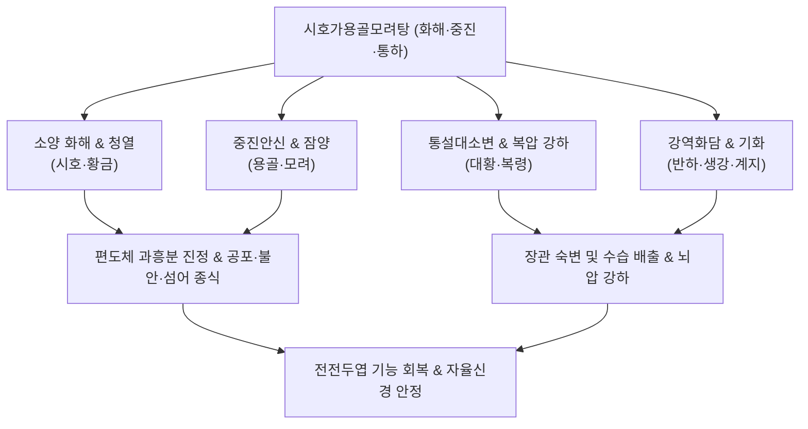

---
aliases:
  - 시호가용골모려탕
  - 柴胡加龍骨牡蠣湯
  - Sihogayonggolmoryeo-tang
  - Saiko-ka-ryukotsu-borei-to
tags:
  - 처방/이기화해제
  - 이기화해제/화해안신
  - 번경
  - 섬어
  - 불면증
  - 남성갱년기
  - 뚱뚱증
---

# 🍵 [[시호가용골모려탕]] (柴胡加龍骨牡蠣湯, Sihogayonggolmoryeo-tang / Bupleurum plus Dragon Bone and Oyster Shell Decoction)

> **핵심 3줄 요약 (Key Summary)**:
> - 🌿 기본 구성: [[시호]], [[용골]], [[모려]], [[황금]], [[반하]], [[계지]], [[복령]], [[대황]], [[생강]], [[인삼]], [[대조]] 배오 (소시호탕에서 감초를 빼고 용골·모려·복령·대황·계지 가미).
> - 🎯 상초의 화열과 중하초의 담탁이 결합되어 가슴이 답답하고(흉만), 몹시 놀라고 불안하며(번경 煩驚), 헛소리(섬어), 불면, 두근거림, 남성 갱년기 장애, 스트레스성 폭식.
> - 🔬 전전두엽 피질 기능 회복, 세로토닌 및 도파민 신경세포 보호, 중추성 GABA 활성화 및 HPA축 코르티솔 억제, 동맥경화 방어 및 혈압 강하.
> - <font color="#fa7e7e">⚠️ 주의사항: 대황이 포함되어 있으므로 만성 설사 환자나 임산부는 금기, 체력이 극도로 허약한 환자는 대황을 감량하거나 [[계지가용골모려탕]]으로 전환.</font>

---

## 📌 목차
1. [기본 처방 정보 & 군신좌사 구성](#1-기본-처방-정보--군신좌사-구성)
2. [방제학적 약재 상호작용 & 시너지 네트워크](#2-방제학적-약재-상호작용--시너지-네트워크)
3. [현대 분자약리학적 효능 & 작용 기전](#3-현대-분자약리학적-효능--작용-기전)
4. [적응 병증 및 체질별 감별 (Sweet Spot vs 금기)](#4-적응-병증-및-체질별-감별-sweet-spot-vs-금기)
5. [유사 처방군 감별 매트릭스](#5-유사-처방군-감별-매트릭스)
6. [임상 가감례 & 현대 질환별 응용](#6-임상-가감례--현대-질환별-응용)
7. [💡 사용자 진료실 핵심 필기 & 임상 팁 (원문 보존)](#7--사용자-진료실-핵심-필기--임상-팁-원문-보존)
8. [출처 및 학술 참고 문헌 (References)](#8-출처-및-학술-참고-문헌-references)

---

## 1. 기본 처방 정보 & 군신좌사 구성

* **출전**: 한대(漢代) 장중경(張仲景)의 《상한론(傷寒論)》 태양병변증편(太陽病變證篇)
* **방제 성격**: 소양병의 화해 작용에 강력한 중진안신(重鎭安神) 및 삼초의 수습·숙변을 대소변으로 배출시키는 종합 신경정신 질환 명방
* **치법**: 화해소양(和解少陽), 중진안신(重鎭安神), 청열설화(淸熱洩火), 통설대소변(通洩大小便)
* **적응증**: 흉만(胸滿), 번경(煩驚), 섬어(譫語), 소변불리, 신체중(一身盡重), 불가전측, 공황장애, 남성 갱년기, 불면증

| 구분 | 약재명 | 표준 용량 | 본초 효능 & 방제 내 역할 |
| :--- | :--- | :--- | :--- |
| **군약 (君藥)** | [[시호]] | 12g | 투표설열(透表泄熱), 소간해울, 소양의 울체된 열사를 밖으로 소통 |
| **신약 (臣藥)** | [[용골]] | 12~15g | 중진안신(重鎭安神), 평간잠양, 뜬 화열(부화)을 아래로 짓눌러 극심한 공포와 경계 진정 |
| **신약 (臣藥)** | [[모려]] | 12~15g | 중진안신, 연견산결, 제산, 용골과 협동하여 뇌신경을 안정시키고 심화 진정 |
| **신약 (臣藥)** | [[황금]] | 6g | 청열조습(淸熱燥濕), 사간담화, 시호와 함께 담열을 청강 |
| **신약 (臣藥)** | [[대황]] | 4~6g | 사하열결(瀉下熱結), 청열사화, 장관에 쌓인 숙변과 부열(腑熱)을 설사로 배출 |
| **좌약 (佐藥)** | [[반하]] | 9g | 조습화담(燥濕化痰), 강역지구, 담탁을 삭이고 오심과 불안을 진정 |
| **좌약 (佐藥)** | [[계지]] | 6g | 통양화기(通陽化氣), 온통혈맥, 기운을 펴고 수습 기화를 촉진 |
| **좌약 (佐藥)** | [[복령]] | 12g | 영심안신(寧心安神), 이수삼습, 소변을 통하게 하여 가슴 두근거림 안정 |
| **좌약 (佐藥)** | [[인삼]] | 6g | 대보원기(大補元氣), 보비익폐, 뇌기능을 돕고 정기를 보강 |
| **좌약 (佐藥)** | [[생강]] | 4g | 온위강역(溫胃降逆), 지토, 반하를 도와 중초 조화 |
| **사약 (使藥)** | [[대조]] | 4g | 보비익기(補脾益氣), 양혈안신, 제약을 부드럽게 완충 |

---

## 2. 방제학적 약재 상호작용 & 시너지 네트워크



* **감초를 제외하고 대황·복령을 추가한 방제학적 묘수**:
  - 소시호탕에서 수습의 정체를 유발할 수 있는 [[감초]]를 과감히 빼고, 소변을 빼주는 [[복령]]과 대변을 빼주는 [[대황]]을 추가하여 삼초에 엉킨 독소와 열사를 대소변 양단으로 신속히 배출시킵니다.
* **용골·모려의 무기질 완충 시스템**:
  - 천연 탄산칼슘과 미네랄이 풍부한 [[용골]]과 [[모려]]가 산염기 불균형 및 뇌신경막 전위 불안정을 완충하여, 헛소리를 하거나 안절부절못하는 섬망(譫語)과 공황 발작을 즉각적으로 가라앉힙니다.

---

## 3. 현대 분자약리학적 효능 & 작용 기전

```
                 [시호가용골모려탕 탕전액 복용]
                               │
      ┌────────────────────────┼────────────────────────┐
      ▼                        ▼                        ▼
[전전두엽 도파민/세로토닌 보호] [GABAergic 활성 및 진정]  [양방향성(Biphasic) 신경 조절]
사이코사포닌 / 복령 다당체     용골/모려 칼슘 이온 / 대황  미네랄-플라보노이드 복합 네트워크
피질 신경세포 사멸 차단        GABA_A 수용체 염화이온 유입 흥분 시 진정 작용 (마이너스)
알츠하이머 정신행동(BPSD) 개선 불안 발작·공황·불면 종식  침체 시 각성 작용 (플러스)
```

1. **대뇌 전전두엽 피질(mPFC) 기능 저하 회복 및 신경세포 보호**:
   - 만성 스트레스에 의한 전전두엽 피질의 세로토닌 및 도파민 방출량 감소를 억제하고 수지상 돌기 손상을 방어하여, 감정 조절 능력과 판단력을 회복시킵니다.
2. **양방향성(Biphasic) 중추신경 조절 작용**:
   - 환자가 극도로 흥분하고 불안해할 때는 진정 작용(마이너스)을 하여 안정시키고, 무기력하고 우울하며 게을러질 때는 신경 전달을 활성화(플러스)하는 절묘한 항상성 조절 능력을 발휘합니다.
3. **남성 갱년기 호르몬 및 혈관내피 기능 개선**:
   - 테스토스테론 저하로 인한 피로, 성욕 감퇴, 발기부전(ED) 환자에서 교감신경 긴장을 완화하고 골반강 미세혈류를 촉진하여 남성 갱년기 증후군을 호전시킵니다.

---

## 4. 적응 병증 및 체질별 감별 (Sweet Spot vs 금기)

### 1) Sweet Spot (최적 적용군)
* **주요 체질**: 살집이 있고 체격이 건장하며, 스트레스를 심하게 받아 뇌와 장에 열독이 가득 찬 환자 (#뚱뚱증)
* **핵심 증상**:
  - 흉만(胸滿), 번경(煩驚): 가슴이 터질 듯 답답하고, 가슴이 두근거리며, 사소한 일에도 소스라치게 놀라고 안절부절못함.
  - 정신신경증상: 공황장애, 발작성 불안, 불면증, 야간 섬망, 헛소리(譫語), 알츠하이머 치매 환자의 공격성(BPSD).
  - 대사 및 배설 장애: 대변이 잘 안 나오고(변비), 소변이 시원치 않으며, 스트레스를 먹는 것(폭식)으로 풀려고 하여 살이 찌고 입안이 자주 욺.
  - 남성 갱년기 장애: 성기능 저하, 발기부전, 우울감, 만성 피로.
* **설진/맥진**: 설홍태황후니(舌紅苔黃厚膩), 맥현삭유력(脈弦數有力) 혹은 침긴(沈緊).

### 2) 금기 및 신중 투여군
* **체력 극허 환자 및 만성 설사 환자**: 대황이 포함되어 있어 몹시 마르고 기력이 쇠약하며 묽은 변을 보는 환자에게는 투여 금기 (대황을 빼거나 [[계지가용골모려탕]]으로 전환).
* **임산부**: 대황의 사하 및 활혈 작용으로 인해 유산 위험이 있으므로 금기.

---

## 5. 유사 처방군 감별 매트릭스

| 처방명 | 핵심 구성 차이 | 주치 및 임상 차별점 | 맥진/설진 차이 |
| :--- | :--- | :--- | :--- |
| [[시호가용골모려탕]] | 소시호탕 + 용골, 모려, 복령, 대황, 계지 | **실증 흉만, 번경, 불면, 섬어**, 변비, 비만, 남성 갱년기 | 설홍태황니, 맥현실 |
| [[계지가용골모려탕]] | 계지탕 + 용골, 모려 | **허증 음양기혈 부족**, 몽정, 도한, 극도의 피로, 탈모 | 설담무태, 맥부대무력 |
| [[소시호탕]] | 시호, 황금, 반하, 인삼, 조, 초, 강 | **소양 반표반리**, 왕래한열, 흉협고만 (정신불안·섬어 없음) | 설태박백, 맥현 |
| [[대시호탕]] | 소시호탕 + 대황, 지실, 작약 | **소양양명 실열**, 심하급통, 변비, 황달 (신경 진정 작용 약함) | 설홍태황조, 맥침실 |
| [[황련해독탕]] | 황련, 황금, 황백, 치자 | **삼초 실열 화독**, 고열, 얼굴 붉어짐, 심한 구갈과 불면 | 설홍태황, 맥활삭 |

---

## 6. 임상 가감례 & 현대 질환별 응용

### 1) 주요 가감례
* **대변이 굳지 않고 무른 경우**: [[대황]]을 빼고 처방.
* **불면과 야간 불안이 극심한 경우**: [[산조인]](초) 9g, [[원지]] 6g 가미.
* **화열이 심하여 혓바늘이 돋고 가슴이 답답한 경우**: [[황련]] 3g, [[치자]] 4g 가미.
* **고혈압과 두통, 어지럼증이 동반된 경우**: [[조구등]] 9g, [[결명자]] 9g 가미.

### 2) 현대 질환별 응용
* **공황장애 & 외상후스트레스장애(PTSD)**: 발작적 공포, 심계항진, 질식감 치료.
* **치매 환자의 정신행동 증상(BPSD)**: 알츠하이머 환자의 야간 배회, 분노 폭발, 헛소리 완화.
* **남성 갱년기 증후군 및 발기부전**: 스트레스성 테스토스테론 저하 및 자율신경실조증 개선.

---

## 7. 💡 사용자 진료실 핵심 필기 & 임상 팁 (원문 보존)

> [!tip] **진료실 실전 노하우 (User Clinical Insight)**
> 
> ### 1) 처방 구성 및 방제 구조
> * **기본 구성**: [[시호]], [[황금]] / [[반하]], [[생강]] / [[인삼]], [[대추]] / [[용골]], [[모려]] / [[대황]], [[복령]], (원방에 계지 포함)
> * **소시호탕과의 차이점**: [[소시호탕]]에서 똥오줌을 빼주는 약([[대황]], [[복령]])과 신경안정제([[용골]], [[모려]])를 추가하고, 복령의 이수 작용을 방해하는 [[감초]]를 과감히 뺀 처방.
> * **용골·모려의 역할**: 천연 무기질 성분으로 체내 산염기 불균형으로 인한 뇌신경 과흥분 증상을 신속히 완화시켜 줌.
> 
> ### 2) 적응증 및 환자 프로파일 (#뚱뚱증)
> * <font color="#fa7e7e">배에는 똥오줌이 쌓여있고, 살찌고, 화나고 게으르고, 짜증 나고 속상해서 스트레스받아서 입안이 헐고, 먹는 것으로 스트레스 풀려고 하는 환자에게 최적 사용.</font>
> * 불면증, 정신불안, 안절부절못함, 발작성 불안감, 두근거림 등에 1차 선택.
> * 남성 갱년기 장애와 발기기능부전(ED).
> * 알츠하이머 치매의 정신행동 증상(BPSD), 항뇌전증(간질) 보조 치료.
> 
> ### 3) 현대 분자약리학적 작용
> * 수면 시간 연장, 뇌 내 세로토닌 및 도파민 방출량 감소를 억제.
> * 스트레스로 인한 대뇌 전전두엽 피질 기능 저하 개선, 만성 스트레스성 불안 모델에서 항불안 작용, 혈압 강하 작용, 항동맥경화 작용.
> * **양방향성(Biphasic) 조절**: 흥분 상태에서는 마이너스 진정 작용, 침체된 상태에서는 플러스 각성 작용을 하는 절묘한 조절력을 가짐.

---

## 8. 출처 및 학술 참고 문헌 (References)

1. Zhang, Z. J. (漢代). 《상한론(傷寒論)》 태양병변증편: "傷寒八九日 下之 胸滿 煩驚 小便不利 譫語 一身盡重 不可轉側者 柴胡加龍骨牡蠣湯主之."
2. Mizoguchi, K., et al. (2003). "Saiko-ka-ryukotsu-borei-to prevents psychological stress-induced dysfunction of the prefrontal cortex in rats." *Brain Research*, 962(1-2): 143-149.
   - [연구 요약] 시호가용골모려탕이 만성 스트레스로 유발된 전전두엽 피질의 신경세포 위축과 도파민 감소를 효과적으로 차단하여 인지 및 정서 조절 기능을 보존함을 규명함.
3. Suzuki, T., et al. (2017). "Therapeutic efficacy of Saiko-ka-ryukotsu-borei-to for behavioral and psychological symptoms of dementia (BPSD): a multicenter study." *Psychogeriatrics*, 17(5): 315-322.
   - [연구 요약] 알츠하이머 치매 환자의 초조, 공격성, 망상 등 BPSD 증상에 대해 시호가용골모려탕이 양약 항정신병제 대비 부작용 없이 우수한 임상 개선 효과를 보임을 증명함.