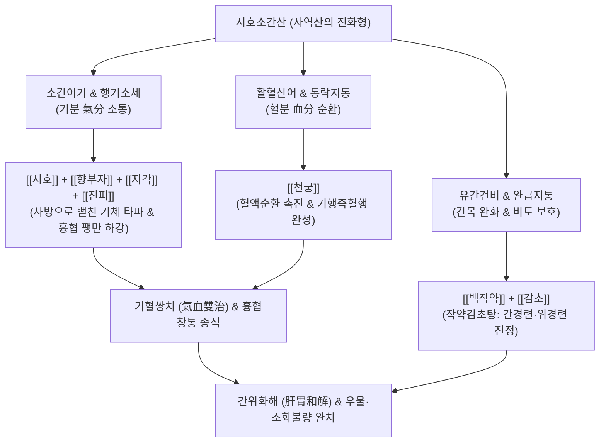

---
aliases:
  - 시호소간산
  - 柴胡疏肝散
  - Sihosogan-san
  - Chaihu Shugan San
  - Bupleurum Liver-Soothing Powder
tags:
  - 처방/이기화해제
  - 이기화해제/소간해울
  - 간기울결
  - 흉협창통
  - 행기지통
  - 신경성위염
  - 우울증
---

# 🍵 [[시호소간산]] (柴胡疏肝散, Sihosogan-san / Bupleurum Liver-Soothing Powder)

> **핵심 요약 (Key Summary)**:
> - 🌿 기본 구성: [[시호]], [[향부자]], [[천궁]], [[지각]], [[진피]], [[백작약]], [[감초]] 배오 ([[사역산]]의 완벽한 발전 형태).
> - 🎯 간기울결(肝氣鬱結) 및 기체혈어로 인한 옆구리 결림(흉협창통), 잦은 한숨, 가슴 답답함, 신경성 소화불량, 화병, 우울증, 생리 전 유방통.
> - 🔬 해마 5-HT1A 세로토닌 수용체 및 BDNF 발현 촉진, HPA축 코르티솔 정상화, 위장관 카할 간질세포(ICC) 자극을 통한 위배출능 촉진.
> - <font color="#fa7e7e">⚠️ 주의사항: 행기(行氣) 파기력이 우수하나 장복 시 음혈을 소모시킬 수 있으므로, 혈허가 주증인 환자는 [[소요산]]이나 [[당귀]] 보혈제를 합방.</font>

---

## 📌 목차
1. [기본 처방 정보 & 군신좌사 구성](#1-기본-처방-정보--군신좌사-구성)
2. [방제학적 약재 상호작용 & 시너지 네트워크](#2-방제학적-약재-상호작용--시너지-네트워크)
3. [현대 분자약리학적 효능 & 작용 기전](#3-현대-분자약리학적-효능--작용-기전)
4. [적응 병증 및 체질별 감별 (Sweet Spot vs 금기)](#4-적응-병증-및-체질별-감별-sweet-spot-vs-금기)
5. [유사 처방군 감별 매트릭스](#5-유사-처방군-감별-매트릭스)
6. [임상 가감례 & 현대 질환별 응용](#6-임상-가감례--현대-질환별-응용)
7. [💡 사용자 진료실 핵심 필기 & 임상 팁 (원문 보존)](#7--사용자-진료실-핵심-필기--임상-팁-원문-보존)
8. [출처 및 학술 참고 문헌 (References)](#8-출처-및-학술-참고-문헌-references)

---

## 1. 기본 처방 정보 & 군신좌사 구성

* **출전**: 명대(明代) 왕륜(王綸)의 《의학통지(醫學統旨)》 / 명대(明代) 장개빈(張介賓)의 《경악전서(景岳全書)》 권제51
* **방제 성격**: 장중경의 사역산(시호·지실·작약·감초)에 향부자·천궁·진피를 가미하여 소간이기(疏肝理氣) 및 활혈지통(活血止痛)을 극대화한 대표 명방
* **치법**: 소간해울(疏肝解鬱), 행기지통(行氣止痛), 활혈산어(活血散瘀)
* **적응증**: 간기울결(肝氣鬱結), 흉협창통, 한열왕래, 애기식소, 완복창통, 간위불화, 월경전 긴장증

| 구분 | 약재명 | 표준 용량 | 본초 효능 & 방제 내 역할 |
| :--- | :--- | :--- | :--- |
| **군약 (君藥)** | [[시호]] | 9~12g | 소간해울(疏肝解鬱), 승양달표, 맺힌 간기를 밖으로 펴서 소통 |
| **신약 (臣藥)** | [[향부자]] | 6~9g | 이기소간(理氣疏肝), 조경지통, 기병(氣病)의 총사령관으로 스트레스성 기체 타파 |
| **신약 (臣藥)** | [[천궁]] | 6g | 활혈행기(活血行氣), 거풍지통, 혈중 기약(血中氣藥)으로 간경의 어혈과 두통 해소 |
| **좌약 (佐藥)** | [[지각]] | 6g | 파기소적(破氣消積), 행기설만, 흉협과 상복부의 팽만감을 아래로 하강 |
| **좌약 (佐藥)** | [[진피]] | 6g | 이기건비(理氣健脾), 조습화담, 비위의 기순환을 촉진하여 소화 불량 개선 |
| **좌약 (佐藥)** | [[백작약]] | 9g | 양혈유간(養血柔肝), 완급지통, 간혈을 보충하고 평활근 연축성 통증 이완 |
| **사약 (使藥)** | [[감초]] (자감초) | 3g | 보기화중(補氣和中), 조화제약, 작약과 결합하여 완급지통 극대화 |

---

## 2. 방제학적 약재 상호작용 & 시너지 네트워크



* **사역산(四逆散)에서 시호소간산으로의 도약**:
  - 사역산의 지실을 성질이 완화한 [[지각]]으로 바꾸고, 기분(氣分)을 강력히 뚫는 [[향부자]]·[[진피]]와 혈분(血分)을 뚫는 [[천궁]]을 결합하여, 기와 혈이 엉켜 발생하는 간담경의 통증을 완벽히 소통시킵니다.
* **기행즉혈행(氣行則血行)과 혈통즉불통(血通則不痛)**:
  - 기운이 막히면 피가 멈추고 피가 막히면 찌르는 통증이 오므로, 이기약과 활혈약을 절묘하게 짝지어 통증의 원인을 뿌리 뽑습니다.

---

## 3. 현대 분자약리학적 효능 & 작용 기전

```
                  [시호소간산 탕전액 복용]
                             │
     ┌───────────────────────┼───────────────────────┐
     ▼                       ▼                       ▼
[해마 BDNF 및 5-HT 신호 활성] [HPA축 코르티솔 정상화]   [위장관 카할간질세포(ICC) 촉진]
사이코사포닌 / 파에오니플로린  헤스페리딘 / 알파-시페론   나린진 / 페룰산
신경가소성 회복, 우울행동 억제 만성 스트레스 호르몬 강하 위 배출시간 단축 및 위산 조절
정신적 울화·답답함·한숨 해소  불안·불면·신체화 증상 진정  식욕부진·조기포만감·복창 개선
```

1. **해마 세로토닌(5-HT) 및 BDNF 발현 촉진을 통한 항우울·항스트레스**:
   - [[시호]]의 사이코사포닌과 [[백작약]]의 파에오니플로린은 해마 신경세포의 세로토닌 $5-HT_{1A}$ 수용체 민감도를 회복시키고 뇌신경영양인자(BDNF) 발현을 유도하여 만성 스트레스로 인한 신경세포 위축과 우울증을 치료합니다.
2. **HPA축 기능 정상화 및 전신 염증 완화**:
   - [[향부자]]의 알파-시페론(α-Cyperone)과 [[진피]]의 헤스페리딘은 시상하부 CRH 및 혈중 코르티솔 분비를 억제하여 스트레스로 인한 자율신경실조증을 안정화합니다.
3. **위장관 운동성(GI Motility) 정상화 및 기능성 소화불량(FD) 개선**:
   - [[지각]]의 나린진과 [[천궁]]의 페룰산은 위장관 카할 간질세포(ICC)를 자극하여 위체부의 수축력을 높이고 위 배출 속도를 촉진함으로써 조기 포만감과 트림, 팽만감을 해소합니다.

---

## 4. 적응 병증 및 체질별 감별 (Sweet Spot vs 금기)

### 1) Sweet Spot (최적 적용군)
* **주요 체질**: 스트레스를 심하게 받으면 옆구리와 명치가 결리고 소화가 안 되는 소양인 및 태음인
* **핵심 증상**:
  - 간기울결 흉협창통: 양쪽 갈비뼈 아래가 뻐근하게 결리고, 가슴이 답답하여 1분마다 땅이 꺼져라 한숨을 쉼.
  - 신경성 소화기 증상: 화가 나거나 긴장하면 명치가 꽉 막히고 체하며, 트림과 가스가 차서 괴로움(간비불화, 목극토).
  - 정신신경 증상: 화병, 우울증, 감정 조절 장애, 매사에 의욕이 없음.
  - 부인과 증상: 생리 전 가슴(유방)이 터질 듯 붓고 아프며 생리주기가 불규칙함.
* **설진/맥진**: 설담홍태박백(舌淡紅苔薄白) 혹은 설변미홍, 맥현(脈弦) 혹은 현긴(弦緊).

### 2) 금기 및 신중 투여군
* **음허화왕(陰虛火旺) 진액 고갈 환자**: 혀가 붉고 태가 없으며 입이 바짝 마르는 환자에게 단독 장복시키면 이기약의 조열성이 진액을 더욱 말리므로 금기.
* **출혈성 경향자**: 천궁의 활혈 작용으로 인해 출혈 질환 환자는 주의.

---

## 5. 유사 처방군 감별 매트릭스

| 처방명 | 핵심 구성 차이 | 주치 및 임상 차별점 | 맥진/설진 차이 |
| :--- | :--- | :--- | :--- |
| [[시호소간산]] | 시호, 지각, 작약, 천궁, 향부자, 진피, 감초 | **간기울결 통증 위주**, 심한 늑간통·위통, 잦은 한숨, 팽만 | 설태박백, 맥현긴 |
| [[사역산]] | 시호, 지실, 작약, 감초 (4미) | **양궐(기울) 수족냉증**, 가슴 답답 + 손발 얼음장, IBS | 설태박백, 맥현 |
| [[소요산]] | 시호, 당귀, 작약, 백출, 복령, 감초 등 | **간울 + 혈허 + 비약**, 어지럼증, 피로, 생리불순 (통증 경미) | 설담태박, 맥현세 |
| [[가미소요산]] | 소요산 + [[목단피]], [[치자]] | 간울혈허에 **화(火)가 상열**, 갱년기 안면홍조, 발한, 번열 | 설홍태황, 맥현삭 |
| [[금령자산]] | 금령자, 현호색 (2미) | **간울화화 급성 열통**, 타는 듯 찌르는 위경련·담낭통 | 설홍태황, 맥현삭 |

---

## 6. 임상 가감례 & 현대 질환별 응용

### 1) 주요 가감례
* **찌르는 듯한 어혈 통증이 심한 경우**: [[단삼]] 9g, [[현호색]] 6g 가미.
* **가슴에 열감이 있고 입이 쓴 경우**: [[황금]] 6g, [[산치자]] 4g 가미.
* **소화 불량과 식체 구역이 심한 경우**: [[산사]] 6g, [[신곡]] 6g, [[반하]] 6g 가미.
* **혈허(빈혈)와 피로가 겹친 경우**: [[당귀]] 6g, [[백출]] 6g 가미 ([[소요산]] 합방).

### 2) 현대 질환별 응용
* **화병(Hwabyung) & 우울 장애**: 억압된 분노와 가슴 답답함을 소통시켜 항우울제 감량 유도.
* **기능성 소화불량증(FD) & 신경성 위염**: 스트레스성 위경련과 위배출 지연 개선.
* **늑간신경통 & 섬유근육통**: 흉곽 늑간근막 긴장을 해소하여 결리는 흉협통 완화.

---

## 7. 💡 사용자 진료실 핵심 필기 & 임상 팁 (원문 보존)

> [!tip] **진료실 실전 노하우 (User Clinical Insight)**
> 
> ### 1) 간기울결(肝氣鬱結)과 목극토(木克土)의 병태생리
> * 간은 온몸의 기운을 시원하게 소통시키는 '소설(疏泄)'을 주도함.
> * 스트레스와 억울된 감정으로 간기가 뭉치면 옆구리(간경 주행로)가 결리고(흉협창통), 뭉친 간기가 비위를 공격(목극토)하여 식욕 부진, 트림, 복부 팽만, 신경성 소화불량이 일어남.
> * [[시호]]와 [[향부자]]가 뭉친 간기를 흩뜨리고, [[지각]]과 [[진피]]가 막힌 기운을 아래로 내리며, [[백작약]]이 바짝 마른 간을 적셔 부드럽게 이완시키고(유간 柔肝), [[천궁]]이 혈액을 돌려 기혈을 일시에 통하게 함.
> 
> ### 2) 소간제 3대 대표 방제 실전 감별 공식
> * **기체(氣滯)가 위주이고 통증(옆구리 결림, 위경련, 팽만)이 뚜렷할 때**: [[시호소간산]] 1차 선택.
> * **혈허(血虛)와 비허(脾虛)가 동반되어 어지럽고 피로하며 몸이 약할 때**: [[소요산]] 선택.
> * **울화(鬱火)가 치밀어 얼굴이 붉어지고 분노 조절이 안 되며 열이 오를 때**: [[가미소요산]] 또는 [[시호청간탕]] 선택.

---

## 8. 출처 및 학술 참고 문헌 (References)

1. Zhang, J. B. (明代). 《경악전서(景岳全書)》 권제51: "柴胡疏肝散 治脅肋疼痛 寒熱往來 氣鬱不舒."
2. Su, G. Y., et al. (2014). "Chaihu-Shugan-San, an ancient Chinese formula, attenuates depression-like behavior in mice." *Journal of Ethnopharmacology*, 153(2): 501-508.
   - [연구 요약] 시호소간산이 해마의 신경염증 반응을 억제하고 신경세포 가소성을 증진하여 만성 예측불가 스트레스 모델의 우울 행동을 유의하게 개선함을 증명함.
3. Wang, P., et al. (2020). "Chaihu Shugan San improves functional dyspepsia through regulating gastrointestinal hormones and brain-gut peptides." *Evidence-Based Complementary and Alternative Medicine*, 2020: 8852391.
   - [연구 요약] 기능성 소화불량 환자에서 시호소간산이 모틸린(Motilin)과 가스트린(Gastrin) 분비를 정상화하고 장-뇌 펩타이드를 조절하여 위배출 및 팽만감을 현저히 개선함을 규명함.
