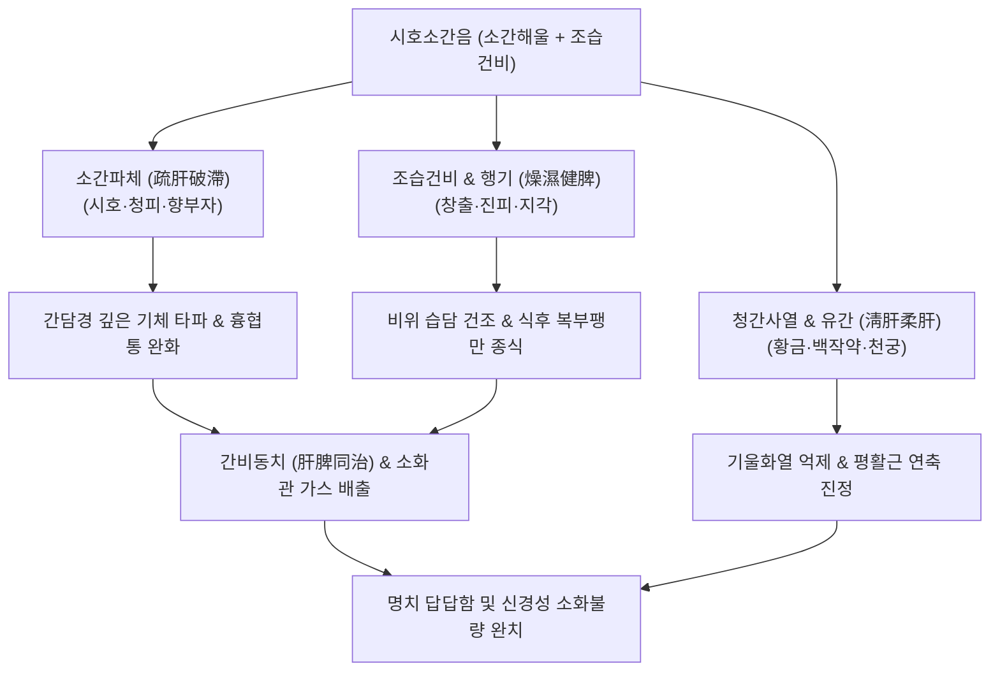

---
aliases:
  - 시호소간음
  - 柴胡疏肝飮
  - Sihosogan-yin
  - Bupleurum Liver-Soothing Drink
tags:
  - 처방/이기화해제
  - 이기화해제/소간화습
  - 간울습열
  - 흉협창만
  - 식후복창
  - 소화불량
---

# 🍵 [[시호소간음]] (柴胡疏肝飮, Sihosogan-yin / Bupleurum Liver-Soothing Drink)

> **핵심 3줄 요약 (Key Summary)**:
> - 🌿 기본 구성: [[시호]], [[청피]], [[진피]], [[백작약]], [[천궁]], [[지각]], [[향부자]], [[창출]], [[황금]], [[생강]], [[감초]] 배오 (소간산에 창출·청피·황금 가미).
> - 🎯 간기울결(肝氣鬱結)에 비위의 습담(濕痰)과 가벼운 울열(鬱熱)이 겹쳐 발생하는 흉협창만, 식후 극심한 복부 팽만, 트림, 소화불량, 정서 억울.
> - 🔬 소화관 평활근 연동 촉진(창출 아트락틸로딘), 담즙 분비 촉진(Choleretic effect), 장내 가스 정체 해소 및 위점막 염증 완화.
> - <font color="#fa7e7e">⚠️ 주의사항: 창출·청피의 건조하고 파기하는 성질이 강하므로, 기혈이 극도로 쇠약하거나 진액이 마른 환자는 장복을 피하고 보혈건비제 배오.</font>

---

## 📌 목차
1. [기본 처방 정보 & 군신좌사 구성](#1-기본-처방-정보--군신좌사-구성)
2. [방제학적 약재 상호작용 & 시너지 네트워크](#2-방제학적-약재-상호작용--시너지-네트워크)
3. [현대 분자약리학적 효능 & 작용 기전](#3-현대-분자약리학적-효능--작용-기전)
4. [적응 병증 및 체질별 감별 (Sweet Spot vs 금기)](#4-적응-병증-및-체질별-감별-sweet-spot-vs-금기)
5. [유사 처방군 감별 매트릭스](#5-유사-처방군-감별-매트릭스)
6. [임상 가감례 & 현대 질환별 응용](#6-임상-가감례--현대-질환별-응용)
7. [💡 사용자 진료실 핵심 필기 & 임상 팁 (원문 보존)](#7--사용자-진료실-핵심-필기--임상-팁-원문-보존)
8. [출처 및 학술 참고 문헌 (References)](#8-출처-및-학술-참고-문헌-references)

---

## 1. 기본 처방 정보 & 군신좌사 구성

* **출전**: 원대(元代) 주단계(朱丹溪)의 《단계심법(丹溪心法)》 / 조선 《동의보감(東醫寶鑑)》 잡병편(雜病篇) 기문(氣門)
* **방제 성격**: 시호소간산의 기혈 소통 구조에 비위의 습담을 말리는 [[창출]]과 간담의 어두운 기체를 뚫는 [[청피]], 열을 식히는 [[황금]]을 더해 소화기 습열(濕熱)을 겸한 간울증을 치료하는 방제
* **치법**: 소간해울(疏肝解鬱), 조습건비(燥濕健脾), 행기화중(行氣和中), 청열사화(淸熱瀉火)
* **적응증**: 간울기체, 협륵창통, 완복비만, 식후도포(식후 배가 터질 듯함), 애기트림, 담음 식체

| 구분 | 약재명 | 표준 용량 | 본초 효능 & 방제 내 역할 |
| :--- | :--- | :--- | :--- |
| **군약 (君藥)** | [[시호]] | 8~10g | 소간해울(疏肝解鬱), 간기를 밖으로 펴서 흉협의 울체를 해소 |
| **신약 (臣藥)** | [[청피]] | 6g | 파기소적(破氣消積), 소간파체, 간담의 깊은 기체를 강력히 뚫어 지통 |
| **신약 (臣藥)** | [[향부자]] | 6g | 이기소간(理氣疏肝), 조경지통, 전신 기순환을 촉진하고 정서 안정 |
| **신약 (臣藥)** | [[창출]] | 6g | 조습건비(燥濕健脾), 거풍산한, 비위의 수습을 말려 헛배 부름 해소 |
| **좌약 (佐藥)** | [[지각]] | 6g | 파기설만(破氣洩滿), 흉격의 가스를 아래로 하강 |
| **좌약 (佐藥)** | [[진피]] | 6g | 이기건비(理氣健脾), 조습화담, 중초 비위를 화평하게 조절 |
| **좌약 (佐藥)** | [[황금]] | 4g | 청열조습(淸熱燥濕), 사간화, 기체가 오래되어 생긴 가벼운 속열 청강 |
| **좌약 (佐藥)** | [[천궁]] | 6g | 활혈행기(活血行氣), 혈액 순환을 돕고 두통 완화 |
| **좌약 (佐藥)** | [[백작약]] | 8g | 양혈유간(養血柔肝), 완급지통, 간목을 부드럽게 감싸 복통 완화 |
| **좌약 (佐藥)** | [[생강]] | 4g | 온중강역(溫中降逆), 비위를 온화하게 달래고 구토 진정 |
| **사약 (使藥)** | [[감초]] | 3g | 보기화중(補氣和中), 조화제약, 파기약의 거친 기운을 완충 |

---

## 2. 방제학적 약재 상호작용 & 시너지 네트워크



* **청피(靑皮)와 진피(陳皮)의 동시 배오**:
  - 어린 귤껍질인 청피는 간담으로 들어가 맺힌 기운을 부수고(파기 破氣), 익은 귤껍질인 진피는 비위로 들어가 기를 부드럽게 돌려주므로(이기 理氣), 간과 비위를 동시에 다스립니다.
* **창출과 황금의 습열(濕熱) 제어**:
  - 스트레스로 간기가 뭉치면 비위의 수습 대사가 막혀 습담이 생기고 열이 발생하는데, 창출로 습을 말리고 황금으로 열을 식혀 소화기 염증과 팽만을 신속히 진정시킵니다.

---

## 3. 현대 분자약리학적 효능 & 작용 기전

```
                 [시호소간음 탕전액 복용]
                            │
     ┌──────────────────────┼──────────────────────┐
     ▼                      ▼                      ▼
[위장관 평활근 수축 조절]   [담즙 분비 및 소화효소 촉진] [간-장 축 항염증 및 스트레스 완화]
창출 아트락틸로딘 / 헤스페리딘 시호 사이코사포닌 / 청피 황금 바이칼린 / 페룰산
위 배출 속도 가속화         담낭 배출 촉진, 슬러지 방어 NF-κB 염증 차단 및 장 가스 감소
식후 더부룩함·가스 팽만 해소 지방 소화 촉진 및 협통 완화 신경성 위염·과민성 장증후군 개선
```

1. **위장관 평활근 연동 가속 및 가스 배출**:
   - [[창출]]의 아트락틸로딘(Atractylodin)과 [[진피]]의 헤스페리딘은 위 전정부와 소장의 수축 파동을 증대시켜 식후 정체된 음식물과 장내 가스를 신속히 배출시킵니다.
2. **담즙산 분비 촉진(Choleretic effect) 및 담낭 운동성 개선**:
   - [[시호]]와 [[청피]]의 정유 성분이 담낭 평활근 연축을 풀고 담즙 분비를 도와 기름진 음식 섭취 후 발생하는 우상복부 팽만감을 해소합니다.
3. **스트레스성 소화기 염증 차단**:
   - [[황금]]의 바이칼린과 [[백작약]]의 파에오니플로린이 위점막 염증성 사이토카인을 억제하여 신경성 위염의 속쓰림과 통증을 완화합니다.

---

## 4. 적응 병증 및 체질별 감별 (Sweet Spot vs 금기)

### 1) Sweet Spot (최적 적용군)
* **주요 체질**: 평소 몸이 무겁고 소화가 잘 안 되며, 스트레스를 받으면 배가 빵빵해지는 태음인 및 소양인
* **핵심 증상**:
  - 식후도포(食後倒飽): 밥을 조금만 먹어도 배가 산더미처럼 부풀어 오르고 가스가 차서 괴로움.
  - 흉협창만 및 잦은 트림: 갈비뼈 아래가 그득하고 결리며 헛트림이 계속 나옴.
  - 입안이 텁텁하고 아침에 혀에 백황색 기름진 태가 낌(습담울열).
* **설진/맥진**: 설홍태백후니(舌紅苔白厚膩) 혹은 황니(黃膩), 맥현완(脈弦緩) 혹은 현활(弦滑).

### 2) 금기 및 신중 투여군
* **음혈 극허 환자**: 혀가 새빨갛고 바짝 말라 있으며 체중이 현저히 감소한 환자에게는 창출·청피의 조열성이 진액을 더 말리므로 금기.
* **임산부**: 청피, 지각의 강한 파기(破氣) 작용으로 인해 임신 초기 환자에게는 신중 투여.

---

## 5. 유사 처방군 감별 매트릭스

| 처방명 | 핵심 구성 차이 | 주치 및 임상 차별점 | 맥진/설진 차이 |
| :--- | :--- | :--- | :--- |
| [[시호소간음]] | 시호소간산 + [[창출]], [[청피]], [[황금]] | **간울 + 비위 습담·식후 복창**, 가스 참, 텁텁함, 헛배 부름 | 설태백후니, 맥현활 |
| [[시호소간산]] | 시호, 지각, 작약, 천궁, 향부자, 진피, 감초 | **간기울결 통증 위주**, 심한 늑간통·위통, 잦은 한숨 (습담 경증) | 설태박백, 맥현긴 |
| [[시호소간탕]] | 시호소간산의 전탕제형 (± 울금, 현호색) | **급성 극심한 협통·담도산통**, 신경성 위경련의 신속 지통 | 설태박백, 맥현실 |
| [[평위산]] | 창출, 후박, 진피, 감초, 생강, 대조 | **순수 비위 습체**, 물 찬 듯 출렁거림, 묽은 변 (간울 증상 없음) | 설태백후니, 맥완 |
| [[분신기음]] | 칠정기울 전신 처방 (16미 복합방) | **전신 기체수종**, 부종, 소변불리, 가슴 답답함 (전신 팽만) | 설태백니, 맥침현 |

---

## 6. 임상 가감례 & 현대 질환별 응용

### 1) 주요 가감례
* **식체(음식 얹힘)가 심한 경우**: [[산사]] 6g, [[신곡]] 6g, [[맥아]] 6g 가미.
* **가슴에 열감이 뚜렷하고 입이 쓴 경우**: [[산치자]] 4g, [[황련]] 3g 가미.
* **가스가 차서 방귀가 자주 나오고 냄새가 독한 경우**: [[목향]] 4g, [[빈랑]] 4g 가미.
* **스트레스로 인한 어지럼증 동반 시**: [[반하]] 6g, [[천마]] 4g 가미.

### 2) 현대 질환별 응용
* **기능성 팽만감(Functional Abdominal Bloating)**: 식사만 하면 배가 터질 듯 가스가 차는 환자.
* **과민성 대장 증후군 가스형(IBS-C / Bloating)**: 복부 불쾌감과 함께 잦은 트림과 방귀를 호소하는 환자.
* **비알코올성 지방간 및 담낭 운동장애**: 스트레스 후 발생하는 우상복부 둔통과 소화장애 치료.

---

## 7. 💡 사용자 진료실 핵심 필기 & 임상 팁 (원문 보존)

> [!tip] **진료실 실전 노하우 (User Clinical Insight)**
> 
> ### 1) 시호소간산과 시호소간음의 감별 공식
> * 환자가 "스트레스받으면 옆구리가 아프고 체해요"라고 할 때 설태와 복부 팽만을 확인:
>   - **시호소간산**: 설태가 얇고 깨끗하며, 찌르는 듯하거나 결리는 '통증(협통, 위통)'이 주 증상일 때 선택.
>   - **시호소간음**: 설태가 미끈거리고 두껍게 끼어 있으며(습담), 통증보다는 '식후 헛배 부름, 가스 참, 트림, 더부룩함'이 주 증상일 때 창출과 청피가 들어간 시호소간음을 선택.
> 
> ### 2) 청피(靑皮)의 파기(破氣) 효능 활용
> * 진피만으로 꺼지지 않는 단단한 가스 팽만에는 청피가 간담의 울체된 기운을 뚫어주어 복압을 신속히 떨어뜨리는 결정적 역할을 함.

---

## 8. 출처 및 학술 참고 문헌 (References)

1. 朱丹溪. 《단계심법(丹溪心法)》: "柴胡疏肝飮 治氣鬱脇痛 寒熱往來 食少腹脹."
2. 許浚. 《동의보감(東醫寶鑑)》 잡병편 권제2 기문: "柴胡疏肝飮 治怒氣傷肝 脇下疼痛 痞悶不舒."
3. Liu, H., et al. (2021). "Atractylodin promotes gastrointestinal motility and modulates gut microbiota in functional dyspepsia." *Biomedicine & Pharmacotherapy*, 141: 111867.
   - [연구 요약] 창출의 아트락틸로딘 성분이 기능성 소화불량 모델에서 위 배출능을 촉진하고 소화관 평활근 연동을 정상화함을 규명함.