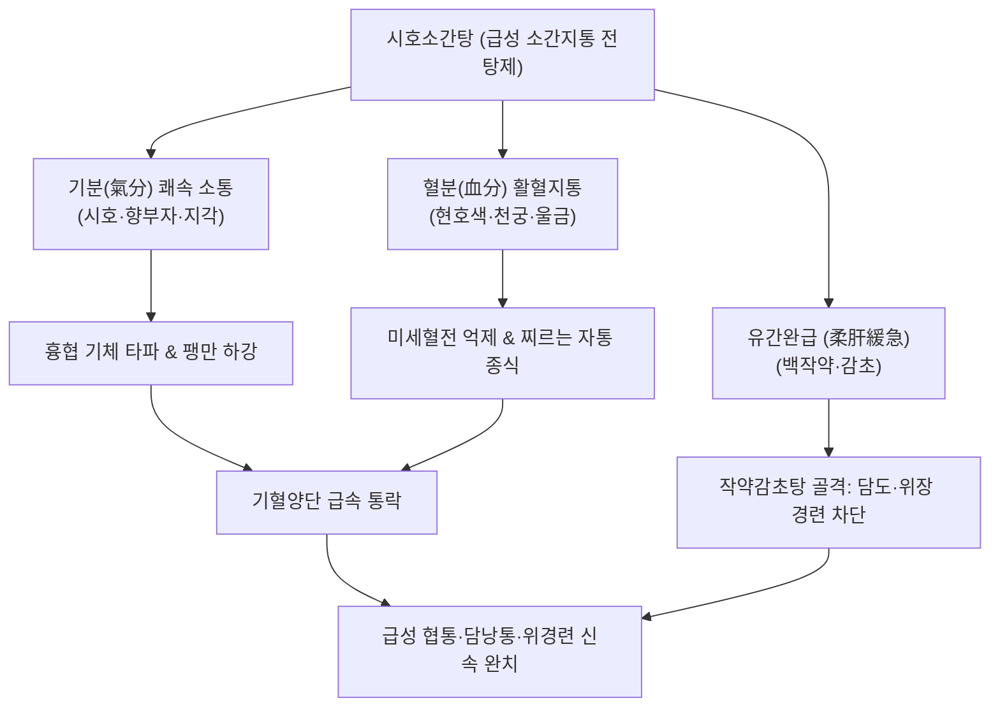

---
aliases:
  - 시호소간탕
  - 柴胡疏肝湯
  - Sihosogan-tang
  - Bupleurum Liver-Soothing Decoction
tags:
  - 처방/이기화해제
  - 이기화해제/소간지통
  - 급성협통
  - 담도산통
  - 위경련
  - 늑간신경통
---

# 🍵 [[시호소간탕]] (柴胡疏肝湯, Sihosogan-tang / Bupleurum Liver-Soothing Decoction)

> **핵심 3줄 요약 (Key Summary)**:
> - 🌿 기본 구성: [[시호]], [[향부자]], [[천궁]], [[지각]], [[진피]], [[백작약]], [[울금]], [[현호색]], [[감초]] 배오 (시호소간산의 탕제 제형 + 울금·현호색 강화).
> - 🎯 간기울결(肝氣鬱結) 및 기체혈어로 인한 급성 옆구리 통증(협통), 담도 연축 및 담석증 산통, 스트레스성 위경련, 극심한 늑간신경통.
> - 🔬 오피오이드/도파민 D2 경로 차단을 통한 신속한 비마약성 진통(현호색 l-THP), 오디 괄약근 및 내장 평활근 연축 이완(울금 커큐민), 간문맥 혈류 개선.
> - <font color="#fa7e7e">⚠️ 주의사항: 활혈파기력이 강하므로 임산부는 복용 금기, 급성 복통이 가라앉고 혈허가 드러나면 보혈제로 전방.</font>

---

## 📌 목차
1. [기본 처방 정보 & 군신좌사 구성](#1-기본-처방-정보--군신좌사-구성)
2. [방제학적 약재 상호작용 & 시너지 네트워크](#2-방제학적-약재-상호작용--시너지-네트워크)
3. [현대 분자약리학적 효능 & 작용 기전](#3-현대-분자약리학적-효능--작용-기전)
4. [적응 병증 및 체질별 감별 (Sweet Spot vs 금기)](#4-적응-병증-및-체질별-감별-sweet-spot-vs-금기)
5. [유사 처방군 감별 매트릭스](#5-유사-처방군-감별-매트릭스)
6. [임상 가감례 & 현대 질환별 응용](#6-임상-가감례--현대-질환별-응용)
7. [💡 사용자 진료실 핵심 필기 & 임상 팁 (원문 보존)](#7--사용자-진료실-핵심-필기--임상-팁-원문-보존)
8. [출처 및 학술 참고 문헌 (References)](#8-출처-및-학술-참고-문헌-references)

---

## 1. 기본 처방 정보 & 군신좌사 구성

* **출전**: 명대(明代) 왕긍당(王肯堂)의 《증치준승(證治準繩)》 / 청대(淸代) 오겸(吳謙)의 《의종금감(醫宗金鑑)》
* **방제 성격**: 시호소간산(산제)의 처방을 탕약(湯劑)으로 전탕하면서 행기활혈지통의 성약인 [[울금]]과 [[현호색]]을 배오하여 급성 통증 제어력을 극대화한 방제
* **치법**: 소간해울(疏肝解鬱), 활혈산어(活血散瘀), 통락지통(通絡止痛)
* **적응증**: 간기울결 협통, 담도산통, 위완자통, 늑간신경통, 외상 후 흉협통

| 구분 | 약재명 | 표준 용량 | 본초 효능 & 방제 내 역할 |
| :--- | :--- | :--- | :--- |
| **군약 (君藥)** | [[시호]] | 10~12g | 소간해울(疏肝解鬱), 승발투열, 간담의 맺힌 기운을 풀고 사열을 투달 |
| **신약 (臣藥)** | [[현호색]] | 8~10g | 활혈산어(活血散瘀), 행기지통, 혈분의 어혈과 신경성 자통을 신속 진정 |
| **신약 (臣藥)** | [[울금]] | 8g | 행기해울(行氣解鬱), 양혈파어, 간담의 기혈을 뚫고 담즙 분비 촉진 |
| **신약 (臣藥)** | [[향부자]] | 8g | 이기소간(理氣疏肝), 조경지통, 전신 기순환을 통솔 |
| **신약 (臣藥)** | [[천궁]] | 6g | 활혈행기(活血行氣), 거풍지통, 혈액 순환을 돕고 두통·협통 완화 |
| **좌약 (佐藥)** | [[지각]] | 6g | 파기소적(破氣消積), 행기설만, 흉협의 가스와 팽만감을 하강 |
| **좌약 (佐藥)** | [[진피]] | 6g | 이기건비(理氣健脾), 조습화담, 비위를 조화 |
| **좌약 (佐藥)** | [[백작약]] | 10g | 양혈유간(養血柔肝), 완급지통, 간목을 부드럽게 감싸 평활근 연축 차단 |
| **사약 (使藥)** | [[감초]] | 3g | 보기화중(補氣和中), 조화제약, 작약과 결합하여 완급지통 |

---

## 2. 방제학적 약재 상호작용 & 시너지 네트워크



* **산제(시호소간산) 대비 탕제의 신속한 약효 발현**:
  - 만성적인 스트레스에는 가루약인 산제가 완만하게 기운을 펴주지만, 통증이 격렬한 급성기에는 탕제로 달여 복용함으로써 혈중 유효 성분 농도를 신속히 올려 진통 효과를 즉각 유도합니다.
* **현호색·울금의 강력한 진통 시너지**:
  - [[현호색]]의 l-THP와 [[울금]]의 커큐미노이드가 혈관과 담도의 경련을 동시에 풀어주어 찌르는 듯한 늑간통과 담낭 산통을 멎게 합니다.

---

## 3. 현대 분자약리학적 효능 & 작용 기전

```
                 [시호소간탕 탕전액 복용]
                            │
     ┌──────────────────────┼──────────────────────┐
     ▼                      ▼                      ▼
[중추 통증전달 신호 차단]   [담도·위장 평활근 연축 이완]  [간 미세순환 촉진 & 항염증]
현호색 l-THP / 천궁 페룰산   울금 커큐민 / 작약 파에오니플로린 시호 사이코사포닌 / 헤스페리딘
도파민 D2 길항 & 오피오이드  오디괄약근 경련 차단, Ca2+ 억제 간문맥압 강하, 염증 사이토카인 저하
신경병증성 흉협통 즉각 완화  담도산통·위경련 신속 진정    간세포 부종 완화 및 기능 회복
```

1. **중추 도파민 D2 수용체 길항을 통한 강력 진통**:
   - [[현호색]]의 테트라하이드로팔마틴(l-THP)은 뇌간 및 척수 후각의 통증 전달 신경을 억제하여 비마약성 진통 효과를 빠르게 발휘합니다.
2. **오디 괄약근(Sphincter of Oddi) 및 내장 평활근 이완**:
   - [[울금]]과 [[백작약]]의 유효 성분이 평활근 세포막 칼슘 채널을 차단하여 담도 경련과 위경련을 신속히 풀어줍니다.
3. **간문맥 혈류 개선 및 항염증 작용**:
   - 간 혈관 저항을 낮추고 미세 순환을 촉진하여 간문맥압을 안정화시키고 늑간근막의 염증성 부종을 흡수합니다.

---

## 4. 적응 병증 및 체질별 감별 (Sweet Spot vs 금기)

### 1) Sweet Spot (최적 적용군)
* **주요 체질**: 감정 기복이 크고 스트레스를 받으면 급격한 통증 발작이 일어나는 소양인 및 태음인
* **핵심 증상**:
  - 급성 흉협통: 숨을 깊이 들이마시거나 몸을 돌릴 때 옆구리가 칼로 찌르듯 아픔.
  - 담석증 및 담낭염 산통: 우상복부가 조여오며 우측 어깨로 방사되는 통증.
  - 스트레스성 급성 위경련: 신경을 쓴 직후 명치가 쥐어짜듯 아프고 식은땀이 남.
  - 대상포진 후 늑간신경통: 수포가 가라앉은 후에도 갈비뼈를 따라 지속되는 신경통.
* **설진/맥진**: 설암홍태박백(舌暗紅苔薄白) 혹은 어점(瘀點), 맥현긴(脈弦緊) 혹은 현삭(弦數).

### 2) 금기 및 신중 투여군
* **임산부 절대 금기**: 현호색, 천궁, 울금의 강력한 활혈산어 및 자궁 수축 촉진 작용.
* **소화성 궤양 활동성 출혈 환자**: 활혈 작용으로 출혈 경향이 증가할 수 있으므로 주의.

---

## 5. 유사 처방군 감별 매트릭스

| 처방명 | 핵심 구성 차이 | 주치 및 임상 차별점 | 맥진/설진 차이 |
| :--- | :--- | :--- | :--- |
| [[시호소간탕]] | 시호소간산 + [[울금]], [[현호색]] (탕제)** | **급성 극심한 늑간통·담도산통·위경련**, 신속한 지통 목적 | 설암태박, 맥현긴 |
| [[시호소간산]] | 시호, 지각, 작약, 천궁, 향부자, 진피, 감초 (산제) | **만성 간기울결 통증**, 뻐근한 협통, 잦은 한숨, 완만 지통 | 설태박백, 맥현 |
| [[금령자산]] | 금령자, 현호색 (2미) | **간울화화 급성 열통**, 타는 듯한 협통, 입이 씀 (황달·열증) | 설홍태황, 맥현삭 |
| [[대시호탕]] | 시호, 황금, 대황, 지실, 작약, 반하 등 | **소양양명 실열 변비**, 심하급통, 흉협고만, 복부비만 | 설홍태황니, 맥침실 |
| [[사역산]] | 시호, 지실, 작약, 감초 (4미) | **양기울결 양궐**, 가슴 답답 + 손발 얼음장, IBS 복통 | 설태박백, 맥현 |

---

## 6. 임상 가감례 & 현대 질환별 응용

### 1) 주요 가감례
* **담석증 산통이 극심한 경우**: [[금전초]] 15~30g, [[해금사]] 9g 가미.
* **화열(火熱)이 치밀어 입이 쓰고 얼굴이 붉은 경우**: [[산치자]] 6g, [[황금]] 6g 가미.
* **위산 역류와 속쓰림이 동반된 경우**: [[와릉자]] 12g, [[모려]] 12g 가미.
* **외상성 타박으로 어혈이 심한 경우**: [[도인]] 8g, [[홍화]] 4g 가미.

### 2) 현대 질환별 응용
* **담도 이상운동증 & 담석산통**: 오디 괄약근 경련을 풀어 산통 신속 완화.
* **늑간신경통(Intercostal Neuralgia)**: 늑골 골절 후유증이나 대상포진성 흉협통 치료.
* **스트레스성 급성 위경련**: 평활근 경련을 즉각적으로 이완시키는 한방 진경제.

---

## 7. 💡 사용자 진료실 핵심 필기 & 임상 팁 (원문 보존)

> [!tip] **진료실 실전 노하우 (User Clinical Insight)**
> 
> ### 1) 시호소간산(산제)과 시호소간탕(탕제)의 운용 차이
> * **산제(시호소간산)**: 가루로 만들어 6~9g씩 장복하며, 만성적인 스트레스성 옆구리 결림과 소화불량을 서서히 풀어낼 때 사용.
> * **탕제(시호소간탕)**: 환자가 "숨도 못 쉴 정도로 옆구리가 쑤셔요", "명치가 쥐어짜듯 아파요"라며 급성 통증을 호소할 때, 현호색과 울금을 보강하여 전탕액으로 투여하여 30분~1시간 내 즉각적인 진통을 유도함.
> 
> ### 2) 초현호색(醋炒延胡索) 전탕 팁
> * 현호색은 반드시 식초로 볶아서 전탕해야 진통 유효 알칼로이드가 최대로 추출되어 양방 진통제 수준의 강력한 소염진통 효과를 발휘함.

---

## 8. 출처 및 학술 참고 문헌 (References)

1. 王肯堂. 《증치준승(證治準繩)》: "柴胡疏肝湯 治肝氣鬱結 脇肋刺痛 寒熱往來."
2. 吳謙. 《의종금감(醫宗金鑑)》: "柴胡疏肝湯 疏肝理氣 活血止痛 爲脇痛之要劑."
