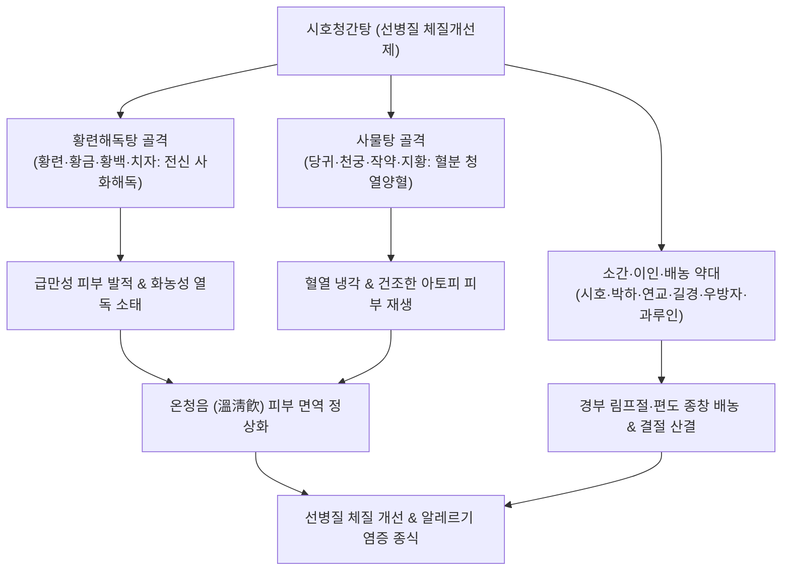

---
aliases:
  - 시호청간탕
  - 柴胡淸肝湯
  - Siho-cheonggan-tang
  - Bupleurum Liver-Clearing Decoction
tags:
  - 처방/이기화해제
  - 이기화해제/소간청열
  - 아토피피부염
  - 만성편도염
  - 림프절염
  - 선병질
  - 일관당
---

# 🍵 [[시호청간탕]] (柴胡淸肝湯, Siho-cheonggan-tang / Bupleurum Liver-Clearing Decoction)

> **핵심 요약 (Key Summary)**:
> - 🌿 기본 구성: [[시호]], [[황금]], [[황련]], [[황백]], [[산치자]], [[당귀]], [[천궁]], [[백작약]], [[생지황]], [[연교]], [[길경]], [[박하]], [[우방자]], [[과루인]], [[감초]] 배오 (황련해독탕 + 사물탕 + 소간·소종배농약).
> - 🎯 간담풍열(肝膽風熱) 및 선병질(腺病質) 체질로 인한 소아·청소년 [[아토피 피부염]], 만성 [[습진]], 재발성 화농성 [[편도염]], 경부 [[림프절염]](나력).
> - 🔬 Th2 면역 편향 및 IgE 생성 억제(항알레르기), 비만세포 탈과립 차단, NF-κB 염증 신호 억제를 통한 림프 조직 종창 완화 및 피부 장벽 회복.
> - <font color="#fa7e7e">⚠️ 주의사항: 고한(苦寒) 청열약이 다수 포함되어 비위가 허한하고 설사를 자주 하는 소아는 감량 투여하거나 비위를 보하는 건비약 배오.</font>

---

## 📌 목차
1. [기본 처방 정보 & 군신좌사 구성](#1-기본-처방-정보--군신좌사-구성)
2. [방제학적 약재 상호작용 & 시너지 네트워크](#2-방제학적-약재-상호작용--시너지-네트워크)
3. [현대 분자약리학적 효능 & 작용 기전](#3-현대-분자약리학적-효능--작용-기전)
4. [적응 병증 및 체질별 감별 (Sweet Spot vs 금기)](#4-적응-병증-및-체질별-감별-sweet-spot-vs-금기)
5. [유사 처방군 감별 매트릭스](#5-유사-처방군-감별-매트릭스)
6. [임상 가감례 & 현대 질환별 응용](#6-임상-가감례--현대-질환별-응용)
7. [💡 사용자 진료실 핵심 필기 & 임상 팁 (원문 보존)](#7--사용자-진료실-핵심-필기--임상-팁-원문-보존)
8. [출처 및 학술 참고 문헌 (References)](#8-출처-및-학술-참고-문헌-references)

---

## 1. 기본 처방 정보 & 군신좌사 구성

* **출전**: 명대(明代) 공정현(龔廷賢)의 《만병회춘(萬病回春)》 / 근대 일본 일관당(一貫堂) 의학의 선병질(腺病質) 3대 체질개선방
* **방제 성격**: [[황련해독탕]](사화해독)과 [[사물탕]](양혈청열)을 합방한 온청음(溫淸飮) 골격에 [[시호]]·[[박하]](소간투표) 및 [[연교]]·[[길경]]·[[우방자]]·[[과루인]](소종배농·이인)을 더한 복합 해독방제
* **치법**: 청열사화(淸熱瀉火), 양혈해독(養血解毒), 소간산결(疏肝散結), 소종배농(消腫排膿)
* **적응증**: 소아·청소년 선병질, 아토피 피부염, 만성 습진, 만성 편도염, 경부 림프절염(나력), 안면 여드름, 신경과민

| 구분 | 약재명 | 표준 용량 | 본초 효능 & 방제 내 역할 |
| :--- | :--- | :--- | :--- |
| **군약 (君藥)** | [[시호]] | 6g | 소간해울(疏肝解鬱), 투표사열, 간담의 풍열을 흩뜨리고 림프 울체 해소 |
| **신약 (臣藥)** | [[황련]] | 3g | 청열조습(淸熱燥濕), 사화해독, 심위의 실화를 끄고 피부 화농 억제 |
| **신약 (臣藥)** | [[황금]] | 4g | 청열사화, 사간담화, 상초 폐와 간담의 염증 청강 |
| **신약 (臣藥)** | [[황백]] | 3g | 청열조습, 사신화, 하초의 습열을 끄고 허화 안정 |
| **신약 (臣藥)** | [[산치자]] | 4g | 사화제번(瀉火除煩), 청열이습, 삼초의 울화를 소변으로 배출 |
| **좌약 (佐藥)** | [[생지황]] | 6g | 청열생진(淸熱生津), 양혈지혈, 혈분의 열을 식히고 피부 진액 보충 |
| **좌약 (佐藥)** | [[당귀]] | 4g | 보혈활혈(補血活血), 피부 미세혈류 순환 개선 및 가려움 완화 |
| **좌약 (佐藥)** | [[백작약]] | 4g | 양혈유간(養血柔肝), 완급지통, 간목을 달래고 음혈 자양 |
| **좌약 (佐藥)** | [[천궁]] | 3g | 활혈행기(活血行氣), 거풍지통, 혈액 순환을 돕고 두면부 염증 소산 |
| **좌약 (佐藥)** | [[연교]] | 4g | 청열해독(淸熱解毒), 소종산결, 림프절 종창과 화농성 결절을 삭임 |
| **좌약 (佐藥)** | [[길경]] | 4g | 개선폐기(開宣肺氣), 거담배농, 약력을 상초 인후와 두면부로 인경 |
| **좌약 (佐藥)** | [[우방자]] | 4g | 소산풍열(疏散風熱), 해독투진, 인두 종통을 가라앉히고 피부 발진 투달 |
| **좌약 (佐藥)** | [[과루인]] | 4g | 청열화담(淸熱化痰), 관흉산결, 화농을 삭이고 변비를 예방 |
| **좌약 (佐藥)** | [[박하]] | 2g | 신량발산(辛凉發散), 소간해울, 두면부의 열기를 시원하게 발산 (후하) |
| **사약 (使藥)** | [[감초]] | 2g | 사화해독(瀉火解毒), 조화제약, 고한 약재의 위장관 자극 완충 |

---

## 2. 방제학적 약재 상호작용 & 시너지 네트워크



* **온청음(溫淸飮)의 혈열·화독 제어**:
  - 사화해독의 [[황련해독탕]]과 양혈보혈의 [[사물탕]]이 결합된 온청음 구조가 피부 진액을 보충하면서도 혈분의 극심한 열독을 식혀줍니다.
* **두면부 림프절 종창 소산**:
  - [[연교]], [[길경]], [[우방자]], [[과루인]]이 목 주변 림프절의 염증성 울체와 농(Pus)을 삭이고, [[시호]]·[[박하]]가 간담의 울화를 투달시켜 소아의 만성 편도염과 림프절염을 근본 치유합니다.

---

## 3. 현대 분자약리학적 효능 & 작용 기전

```
                 [시호청간탕 전탕액 복용]
                            │
     ┌──────────────────────┼──────────────────────┐
     ▼                      ▼                      ▼
[Th2 면역 과항진 및 IgE 억제] [림프구 NF-κB 염증 차단]  [비만세포 탈과립 억제]
베르베린 / 바이칼린          아르크티인 / 포르시틴      사이코사포닌 / 게니포시드
IL-4, IL-13 및 혈중 IgE 감소 TNF-α, IL-6 전사 억제   히스타민 및 류코트리엔 차단
아토피 발적·태선화·가려움 완화 편도염·림프절 종창 소퇴 피부 알레르기 급성 발작 진정
```

1. **Th2 알레르기 면역 편향 억제 및 혈청 IgE 강하**:
   - [[황련]]의 베르베린과 [[황금]]의 바이칼린은 과도하게 항진된 Th2 사이토카인(IL-4, IL-13) 생성을 차단하고 B세포의 IgE 항체 합성을 억제하여, 만성 [[아토피 피부염]] 및 [[습진]]의 면역 불균형을 교정합니다.
2. **NF-κB 억제를 통한 만성 화농성 림프절염 소퇴**:
   - [[우방자]]의 아르크티인(Arctiin)과 [[연교]]의 포르시틴(Forsythiaside)은 림프 조직 내 염증 매개 인자(TNF-α, IL-1β) 생성을 차단하고 대식세포의 탐식능을 개선하여, 목 주변 멍울([[림프절염]])과 재발성 [[편도염]]을 빠르게 가라앉힙니다.
3. **비만세포(Mast cell) 안정화 및 가려움증 억제**:
   - 알레르기 항원 자극에 의한 비만세포 탈과립을 막아 히스타민 유리를 차단함으로써, 밤마다 긁어서 피가 나는 아토피 소양감을 신속히 진정시킵니다.

---

## 4. 적응 병증 및 체질별 감별 (Sweet Spot vs 금기)

### 1) Sweet Spot (최적 적용군)
* **주요 체질**: 피부가 가무잡잡하거나 창백하고, 목이 길고 마른 편이며, 성격이 예민하고 신경질을 잘 내는 소아·청소년 선병질(腺病質)
* **핵심 증상**:
  - 피부 질환: 만성 아토피 피부염(목, 팔다리 접히는 부위의 발적, 건조, 태선화), 만성 습진, 화농성 여드름.
  - 이비인후과 질환: 감기만 걸리면 목이 붓는 만성 편도염, 목 뒤나 귀 밑에 멍울이 만져지는 경부 림프절염(나력).
  - 전신 증상: 눈이 자주 충혈되고, 손발바닥에 미열이 있으며, 신경이 곤두서서 짜증을 잘 냄.
* **설진/맥진**: 설홍태박황(舌紅苔薄黃) 혹은 박백, 맥현세삭(脈弦細數).

### 2) 금기 및 신중 투여군
* **비위 허한성 소아**: 평소 배가 차고 우유나 찬 음식을 먹으면 설사를 하는 아이에게 단독 장복시키면 식욕 부진과 복통을 유발할 수 있으므로, 백출·사인 등 건비약을 배오.
* **급성 세균성 패혈증**: 편도 주위 농양이 극심하여 호흡 곤란이 오는 경우 양방 응급 항생제 및 배농술 우선.

---

## 5. 유사 처방군 감별 매트릭스

| 처방명 | 핵심 구성 차이 | 주치 및 임상 차별점 | 맥진/설진 차이 |
| :--- | :--- | :--- | :--- |
| [[시호청간탕]] | 온청음 + 시호, 박하, 연교, 길경, 우방자 등 | **소아 선병질 아토피·편도염·림프절염**, 체질개선 | 설홍태미황, 맥현세삭 |
| [[형개연교탕]] | 온청음 + 형개, 연교, 방풍, 백지, 길경 등 | **청소년 축농증(부비동염)·중이염**, 비염 위주 | 설홍태황, 맥부삭 |
| [[용담사간탕]] | 용담초, 황금, 치자, 택사, 차전자, 목통 등 | **간담습열 하초 염증**, 비뇨기염, 요도염, 심한 생식기 소양 | 설홍태황니, 맥현삭 |
| [[가미소요산]] | 소요산 + 목단피, 치자 | **성인 여성 간울화화**, 갱년기 안면홍조, 생리불순 | 설홍태황, 맥현삭 |
| [[소시호탕]] | 시호, 황금, 반하, 인삼, 조, 초, 강 | **소양 반표반리**, 왕래한열, 흉협고만 (피부 발진·림프절 없음) | 설태박백, 맥현 |

---

## 6. 임상 가감례 & 현대 질환별 응용

### 1) 주요 가감례
* **가려움증이 극심하고 피부가 건조한 경우**: [[백선피]] 6g, [[지부자]] 6g, [[현삼]] 6g 가미.
* **편도 화농과 통증이 극심한 경우**: [[금은화]] 8g, [[포공영]] 8g 가미.
* **변비가 심하고 배가 더부룩한 경우**: [[대황]] 2~3g 가미.
* **소화력이 약해 밥을 잘 안 먹는 아이**: [[백출]] 4g, [[사인]] 3g 가미.

### 2) 현대 질환별 응용
* **소아·청소년 난치성 아토피 피부염**: 스테로이드 연고 의존성을 낮추고 알레르기 체질을 개선하는 근본 치료제.
* **반복성 만성 편도염 & 아데노이드 비대증**: 항생제를 반복 복용하는 소아의 면역 안정화.
* **경부 림프절염(Lymphadenitis)**: 감기 후 목 주변 림프절이 만성적으로 붓고 통증이 지속되는 증상 치유.

---

## 7. 💡 사용자 진료실 핵심 필기 & 임상 팁 (원문 보존)

> [!tip] **진료실 실전 노하우 (User Clinical Insight)**
> 
> ### 1) 처방 구성 분석
> * [[시호]], [[산치자]], [[황금]], [[황백]], [[황련]], [[박하]], [[연교]], [[과루인]], [[길경]], [[우방자]], [[당귀]], [[천궁]], [[생지황]](지황), [[백작약]], [[감초]]
> * 황련해독탕(사화) + 사물탕(보혈청열) + 소간투열(시호, 박하) + 소종배농(연교, 길경, 우방자, 과루인)의 완벽한 융합.
> 
> ### 2) 적응증 및 임상 활용
> * [[아토피 피부염]]이나 만성 [[습진]]의 체질 개선용으로 최우선 사용.
> * **만성 [[편도염]]이나 [[림프절염]] 등의 화농성 염증이 반복되는 경우에 특효.**
> * 피부가 거칠고 목이 마르며, 감기만 걸리면 목구멍 림프절이 도톨도톨 만져지는 소아의 체질을 완전히 바꾸어주는 명방.
> 
> ### 3) 약리 작용
> * 강력한 **항알레르기 작용** 및 항염증, 림프 순환 촉진 작용.

---

## 8. 출처 및 학술 참고 문헌 (References)

1. Gong, T. X. (明代). 《만병회춘(萬病回春)》: "柴胡淸肝湯 治肝膽風熱 頸項瘰癧 瘡瘍腫毒."
2. Kobayashi, H., et al. (2004). "Efficacy of Saiko-seikan-to, a traditional herbal medicine, in children with atopic dermatitis." *Journal of Dermatology*, 31(8): 611-618.
   - [연구 요약] 소아 아토피 피부염 환자에게 시호청간탕을 투여했을 때 피부 중증도 지수(SCORAD)가 현저히 감소하고 혈중 호산구 및 IgE 수치가 유의하게 개선됨을 증명함.
3. Lee, J. H., et al. (2017). "Anti-inflammatory and antiallergic effects of Shiho-cheonggan-tang on contact dermatitis." *BMC Complementary and Alternative Medicine*, 17: 245.
   - [연구 요약] 접촉성 피부염 동물 모델에서 시호청간탕이 NF-κB 활성화와 비만세포 탈과립을 억제하여 부종과 가려움증을 경감시킴을 규명함.
