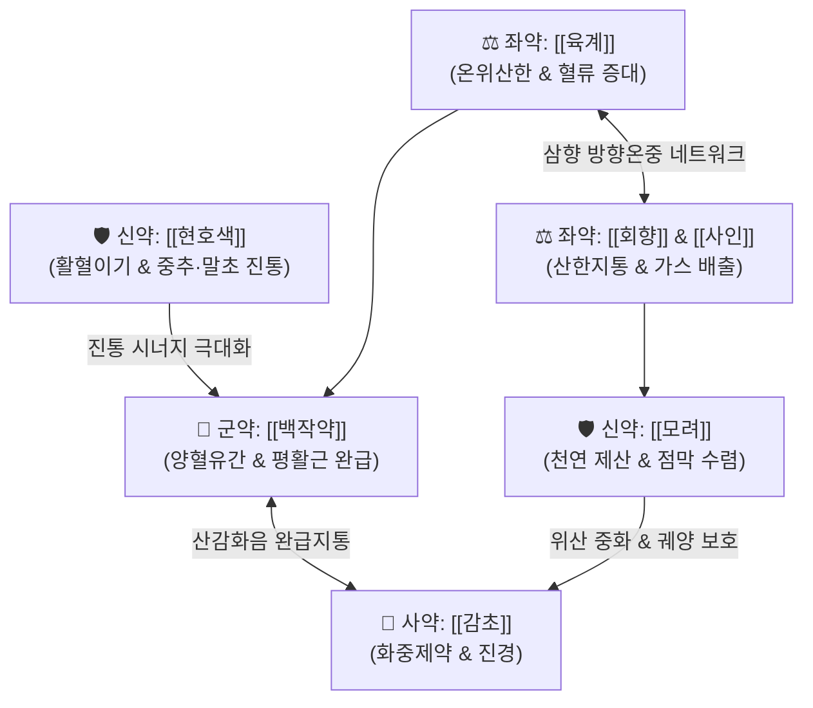

---
aliases:
  - 安中散
  - An-zhong-san
  - Calm the Middle Powder
tags:
  - 처방/이기화해제
  - 이기화해제/온중지통
  - 온중산한
  - 제산지통
  - 위완통
  - 신경성위염
  - 화제국방
---

# 🍵 [[안중산]] (安中散, An-zhong-san / Calm the Middle Powder)

> **핵심 3줄 요약 (Key Summary)**:
> - 🌿 기본 구성: [[백작약]], [[현호색]], [[모려]], [[회향]], [[사인]], [[육계]], [[감초]] ([[작약감초탕]] 완급지통 골격에 활혈지통의 [[현호색]], 온비산한의 삼향과 제산수렴의 [[모려]] 결합).
> - 🎯 소음인 비위허한(脾胃虛寒) 및 한응기체(寒凝氣滯), 찬 음식이나 스트레스로 악화되고 따뜻하게 만져주면 완화되는 신경성 위염, 위완냉통, 속쓰림(토산), 위·십이지장 궤양, 한성 월경통.
> - 🔬 평활근 L형 칼슘 채널 차단 진경, 모려 탄산칼슘의 위산 완충, 신남알데하이드 매개 위점막 미세혈류 촉진 및 점액 분비 증가.
> - ⚠️ 주의사항: 맵고 뜨거운 온열조습(溫熱燥濕) 약재가 다수 배오되어 위열(胃熱)로 인한 속쓰림, 소화관 출혈 급성기 및 음허화왕 환자 금기.

---

## 📌 목차
1. [기본 처방 정보 & 군신좌사 구성](#1-기본-처방-정보--군신좌사-구성)
2. [방제학적 약재 상호작용 & 시너지 네트워크](#2-방제학적-약재-상호작용--시너지-네트워크)
3. [현대 분자약리학적 효능 & 작용 기전](#3-현대-분자약리학적-효능--작용-기전)
4. [적응 병증 및 체질별 감별 (Sweet Spot vs 금기)](#4-적응-병증-및-체질별-감별-sweet-spot-vs-금기)
5. [유사 처방군 감별 매트릭스](#5-유사-처방군-감별-매트릭스)
6. [임상 가감례 & 현대 질환별 응용](#6-임상-가감례--현대-질환별-응용)
7. [💡 사용자 진료실 핵심 필기 & 임상 팁 (원문 보존)](#7--사용자-진료실-핵심-필기--임상-팁-원문-보존)
8. [출처 및 학술 참고 문헌 (References)](#8-출처-및-학술-참고-문헌-references)

---

## 1. 기본 처방 정보 & 군신좌사 구성

* **출전**: 송대 《태평혜민화제국방(太平惠民和劑局方)》
* **치법**: 온중산한(溫中散寒), 행기지통(行氣止痛), 제산지통(制酸止痛)
* **적응증**: 비위허한(脾胃虛寒), 위완냉통(胃脘冷痛), 토산(위산 역류·속쓰림), 복부 연축성 산통, 신경성 소화불량

| 구분 | 약재명 | 표준 용량 | 본초 효능 & 방제 내 역할 |
| :--- | :--- | :--- | :--- |
| **군약 (君藥)** | [[백작약]] | 9g | 양혈유간(養血柔肝), 완급지통(緩急止痛), 위장관 평활근 연축 억제 |
| **신약 (臣藥)** | [[현호색]] | 9g | 활혈이기(活血理氣), 화어지통(化瘀止痛), 쥐어짜는 듯한 위경련 진통 |
| **신약 (臣藥)** | [[모려]] | 9g | 제산수렴(制酸收斂), 진경안신(鎭驚安神), 위산 중화 및 궤양 점막 보호 |
| **좌약 (佐藥)** | [[회향]] | 6g | 산한지통(散寒止痛), 이기화위(理氣和胃), 소화관 냉기 구축 및 가스 배출 |
| **좌약 (佐藥)** | [[사인]] | 6g | 화습개위(化濕開胃), 온비지사(溫脾止瀉), 방향성 위장 연동 활성화 |
| **좌약 (佐藥)** | [[육계]] | 6g | 보화조양(補火助陽), 산한통맥(散寒通脈), 위벽 미세혈류 순환 촉진 |
| **사약 (使藥)** | [[감초]] | 3g | 보기화중(補氣和中), 완급지통(緩急止痛), [[백작약]]과 작약감초탕 형성 |

> **배오 특징**: [[작약감초탕]]([[백작약]]·[[감초]])의 완급지통 축에 활혈이기의 요약인 [[현호색]]을 더해 위경련성 산통을 즉각 차단하고, 삼향([[육계]]·[[회향]]·[[사인]])의 향기롭고 따뜻한 성질로 비위 냉기를 흩어내며, [[모려]]의 천연 미네랄로 과다 분비된 위산을 완충하는 입체적 온중제산 구조를 갖춥니다.

---

## 2. 방제학적 약재 상호작용 & 시너지 네트워크

* **작약감초탕 골격 + 현호색의 강력 진통**: [[백작약]]과 [[감초]]가 산감화음(酸甘化陰)하여 평활근 긴장을 풀고, [[현호색]]의 l-THP와 코리달린이 통증 신경 전달을 차단하여 극심한 위통을 신속히 진정시킵니다.
* **삼향(육계·회향·사인)의 온비산한 + 모려의 제산수렴**: 차가워진 비위벽을 따뜻하게 데워 혈류를 열어주는 동시에, [[모려]]의 탄산칼슘 성분이 위점막을 자극하는 위산을 중화하여 속쓰림을 없앱니다.

---

## 3. 현대 분자약리학적 효능 & 작용 기전

### 1) 위장관 평활근 연축 억제 및 진경 (Spasmolysis)
* [[백작약]]의 [[페오니플로린]]과 [[현호색]]의 [[테트라하이드로팔마틴]](THP)이 전압 개폐성 L형 칼슘 채널을 차단하고 무스카린성 수용체 과흥분을 억제하여 위경련을 신속히 해소합니다.

### 2) 천연 제산 및 위점막 방어벽 강화
* [[모려]]의 탄산칼슘($\text{CaCO}_3$) 성분이 위 내 수소이온($H^+$)을 물리화학적으로 중화하여 펩신 활성을 억제합니다.
* [[육계]]의 [[신남알데하이드]]가 점막 미세혈관을 확장시켜 혈류를 공급하고, 프로스타글란딘 $E_2$($PGE_2$) 합성을 촉진하여 점액(뮤신) 분비를 증가시킵니다.

### 3) 중추 및 말초 이중 진통 작용
* [[현호색]]의 [[코리달린]]과 THP는 중추 도파민 $D_2$ 수용체 길항 및 내인성 오피오이드 경로 활성화를 통해 신경성 통각 과민을 제어합니다.

---

## 4. 적응 병증 및 체질별 감별 (Sweet Spot vs 금기)

[✅ 최적 적응증 (Sweet Spot)]
• 체질 소견: 평소 몸과 손발이 차고 소화력이 약한 소음인(少陰人)
• 통증 양상: 찬 음식을 먹거나 추위에 노출되면 악화되고, 배를 따뜻하게 하거나 만져주면 호전되는 희온희안(喜溫喜按) 위완냉통
• 주치 병증: 만성 신경성 위염, 위경련, 위·십이지장 궤양, 위산 과다(신트림·토산), 위하수 둔통, 한성 월경통
• 설진/맥진: 설담태백(舌淡苔白), 맥침현(沈弦) 또는 맥세약(細弱)

[⚠️ 신중 투여 및 금기 (Caution / Contraindication)]
• 위열 실증(胃熱實證): 입이 마르고 쓴물이 올라오며 혀가 붉고 황태가 낀 위염·궤양에는 금기 (위열 악화 위험)
• 급성 소화관 궤양 출혈기: 육계, 회향 등 매운 성질이 출혈을 조장할 수 있으므로 금기
• 음허화왕(陰虛火旺): 오후 상열감, 도한(식은땀), 손발바닥 번열 환자 신중 투여

---

## 5. 유사 처방군 감별 매트릭스

| 처방명 | 핵심 배오 차이 | 주치 및 임상 차별점 | 맥진/설진 차이 |
| :--- | :--- | :--- | :--- |
| [[안중산]] | [[작약감초탕]] + [[현호색]], [[모려]], 삼향 | **소음인 위완냉통, 희온희안, 위산 역류 속쓰림** | 맥침현, 설담태백 |
| [[반하사심탕]] | [[반하]], [[황금]], [[황련]], [[건강]], [[인삼]] | **한열착잡 심하비만(명치 답답함), 썩은 트림, 구역** | 맥현삭, 설태미황니 |
| [[이중탕]] | [[인삼]], [[백출]], [[건강]], [[감초]] | **순수 비위허한, 구토, 물 같은 설사, 복랭(배가 얼음장)** | 맥침지무력, 설담태백활 |
| [[작약감초탕]] | [[백작약]], [[감초]] | **단순 평활근 경련, 골격근 쥐남(비복근 경련)** | 맥현미, 설담홍 |
| [[향사육군자탕]] | [[육군자탕]] + [[목향]], [[사인]] | **비허기체, 식후 더부룩함, 식욕 부진, 트림** | 맥세약, 설담태백 |

---

## 6. 임상 가감례 & 현대 질환별 응용

* **증상별 가감법**:
  * 구역질과 헛구역질이 심할 때 $\rightarrow$ + [[반하]] 6g, [[생강]] 4g
  * 찌르는 듯한 궤양 통증이 극심할 때 $\rightarrow$ [[현호색]] 배량 증량, + [[백급]] 6g
  * 가스 팽만과 복부 둔통이 겸할 때 $\rightarrow$ + [[목향]] 4g, [[지각]] 4g
  * 만성 위하수로 명치가 묵직할 때 $\rightarrow$ + [[황기]] 8g, [[승마]] 3g
* **현대 질환별 응용**:
  * 만성 위염, 신경성 소화불량(기능성 위장장애), 위·십이지장 궤양
  * 위식도 역류성 질환(신트림 위주), 위경련 발작 예방 및 응급 진통
  * 소화기 냉증을 동반한 원발성 월경통, 산후 허한성 복통

---

## 7. 💡 사용자 진료실 핵심 필기 & 임상 팁 (원문 보존)

> [!tip] **진료실 실전 노하우 (User Clinical Insight)**
> 
> ### 1) 소음인 한성 위통의 절대적 스위트 스팟 (Sweet Spot)
> * **"배가 아파서 따뜻한 물주머니를 대고 엎드려 있으면 한결 살 것 같다"**고 호소하는 환자에게 즉효를 발휘함.
> * 찬 음료나 생랭(生冷) 음식을 먹은 직후 쥐어짜는 듯한 명치 통증이 발생하는 전형적인 한응기체증에 최우선 선택함.
> 
> ### 2) 제형 및 휴대용 상비약 운용
> * 안중산은 탕약뿐만 아니라 전통 산제(가루약) 제형의 효과가 매우 뛰어남.
> * 소화성 궤양 환자나 만성 위경련 환자에게 가루약 형태로 처방하여 속쓰림이나 통증이 올 때 양방 제산제처럼 즉각 복용할 수 있는 훌륭한 휴대용 한방 상비약으로 활용됨.
> 
> ### 3) 부인과 냉성 생리통으로의 확장
> * 위장관 평활근뿐 아니라 자궁 평활근의 허혈성 경련을 완화하므로, 아랫배가 차면서 생리혈에 덩어리가 나오고 온찜질에 호전되는 소음인 월경통에 탁월한 효과를 나타냄.
> 
> ### 4) 처방 부작용 및 주의사항 연동
> * 맵고 뜨거운 육계, 회향, 사인이 함유되어 있어 위열(胃熱)로 인한 속쓰림 환자에게는 절대 투여를 금하며, 세부 관리 지침은 [`처방 사이드 대처법.md`](file:///c:/Simbio/2.%20%EC%95%BD%EB%A6%AC%20%EA%B3%B5%EB%B6%80/%EC%B2%98%EB%B0%A9/%EC%B2%98%EB%B0%A9%20%EC%82%AC%EC%9D%B4%EB%93%9C%20%EB%8C%80%EC%B2%98%EB%B2%95.md) `141. 안중산` 조항을 준수함.

---

## 8. 출처 및 학술 참고 문헌 (References)

1. **송대 태평혜민화제국방 (1151년경)**. 《太平惠民和劑局方》 권3.
   - [고전 원전] "治遠年近日脾胃氣痛, 溫中散寒, 止痛制酸." (오래되거나 최근 발생한 비위의 기통을 치료하고, 온중산한하며 지통제산한다.)
2. * **Saito Y et al. (2011)**. In vivo inhibition of CYP3A-mediated midazolam metabolism by anchusan in rats. *Journal of pharmacological sciences*, 115: 399-407. [PMID: 21358120](https://pubmed.ncbi.nlm.nih.gov/21358120/)
