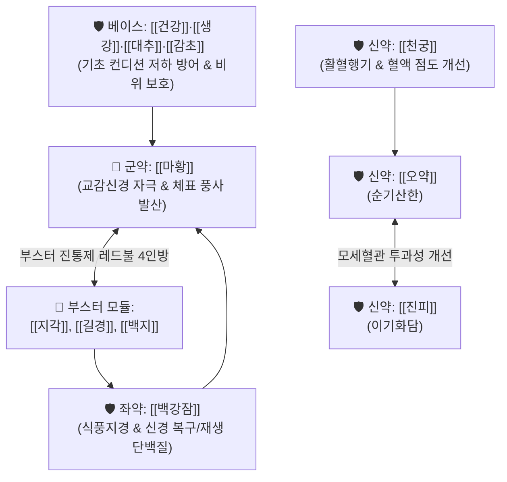

---
aliases:
  - 烏藥順氣散
  - Wu-yao-shun-qi-san
tags:
  - 처방/이기화해제
  - 이기화해제/순기거풍
  - 순기화담
  - 거풍통락
  - 신경통
  - 안면신경마비
  - 부스터진통제
  - 화제국방
---

# 🍵 [[오약순기산]] (烏藥順氣散, Wu-yao-shun-qi-san)

> **핵심 요약 (Key Summary)**:
> - 🌿 기본 구성: [[오약]], [[마황]], [[진피]], [[천궁]], [[백지]], [[백강잠]], [[지각]], [[길경]], [[건강]], [[감초]], [[생강]], [[대추]] (기초 컨디션 저하 [[생대감]], 찐득한 혈액 [[천궁]], 혈관투과성 [[진피]]·[[오약]], 신경재생 [[백강잠]]에 부스터 진통제 레드불 4인방 [[마황]]·[[지각]]·[[길경]]·[[백지]] 결합).
> - 🎯 풍담기체(風痰氣滯)로 인한 신경 손상 및 포착, [[중풍]] 초기 마비, [[안면신경마비]](구안와사), 삼차신경통, [[안검경련]], [[대상포진 후]] 신경통, [[당뇨]] 신경병증, 사지 관절통.
> - 🔬 신경영양인자(BDNF/NGF) 유도 신경 재생 촉진, 모세혈관 투과성 정상화 및 미세혈류 순환 개선, 교감신경 아드레날린성 활성화(에페드린·신에프린).
> - ⚠️ 주의사항: [[마황]]의 [[에페드린]] 및 다량의 신산파기(辛散破氣) 약재 배오로 고혈압·심계항진 환자 주의, 만성 기혈허약자 단독 장복 시 기혈 손상 주의.

---

## 📌 목차
1. [기본 처방 정보 & 군신좌사 구성](#1-기본-처방-정보--군신좌사-구성)
2. [방제학적 약재 상호작용 & 시너지 네트워크](#2-방제학적-약재-상호작용--시너지-네트워크)
3. [현대 분자약리학적 효능 & 작용 기전](#3-현대-분자약리학적-효능--작용-기전)
4. [적응 병증 및 체질별 감별 (Sweet Spot vs 금기)](#4-적응-병증-및-체질별-감별-sweet-spot-vs-금기)
5. [유사 처방군 감별 매트릭스](#5-유사-처방군-감별-매트릭스)
6. [임상 가감례 & 현대 질환별 응용](#6-임상-가감례--현대-질환별-응용)
7. [💡 사용자 진료실 핵심 필기 & 임상 팁 (원문 보존)](#7--사용자-진료실-핵심-필기--임상-팁-원문-보존)
8. [출처 및 학술 참고 문헌 (References)](#8-출처-및-학술-참고-문헌-references)

---

## 1. 기본 처방 정보 & 군신좌사 구성

* **출전**: 송대 《태평혜민화제국방(太平惠民和劑局方)》
* **치법**: 순기거풍(順氣祛風), 소담통락(消痰通絡), 산한지통(散寒止痛)
* **적응증**: 풍기(風氣) 순환 장애, 중풍 초기 구안와사, 안검경련, 마비, 삼차신경통, 신경포착 증후군, 사지 관절통

| 구분 | 약재명 | 표준 용량 | 본초 효능 & 방제 내 역할 |
| :--- | :--- | :--- | :--- |
| **군약 (君藥)** | [[마황]] | 6g | 발한해표(發汗解表), 선폐평천(宣肺平喘), 강력한 신경 자극 및 체표 풍한 발산 |
| **신약 (臣藥)** | [[오약]] | 6g | 순기지통(順氣止痛), 온신산한(溫腎散寒), 기기 소통 및 모세혈관 투과성 정상화 |
| **신약 (臣藥)** | [[진피]] | 6g | 이기건비(理氣健脾), 조습화담(燥濕化痰), [[오약]]과 짝을 이루어 미세혈관 투과성 개선 |
| **신약 (臣藥)** | [[천궁]] | 4g | 활혈행기(活血行氣), 거풍지통(祛風止痛), 끈적해진 혈액 점도 개선 및 미세혈류 개통 |
| **좌약 (佐藥)** | [[백지]] | 4g | 거풍지통(祛風止痛), 통규지통(通竅止痛), 삼차신경 및 안면 두면부 진통 강화 |
| **좌약 (佐藥)** | [[백강잠]] | 4g | 식풍지경(熄風止痙), 화담산결(化痰散結), 단백질 공급을 통한 손상 신경 복구·재생 |
| **좌약 (佐藥)** | [[지각]] | 4g | 파기소적(破氣消積), 관흉강기(寬胸降氣), 흉복부 기체 하강 및 기분 리프팅 |
| **좌약 (佐藥)** | [[길경]] | 4g | 선폐거담(宣肺祛痰), 인경상행(引經上行), [[지각]]과 승강(昇降) 조화 및 약력 견인 |
| **좌약 (佐藥)** | [[건강]] | 2g | 온중산한(溫中散寒), 회양통맥(回陽通脈), 비위 냉기 구축 |
| **좌약 (佐藥)** | [[생강]] | 3편 (4g) | 발한해표(發汗解表), 온위지구(溫胃止嘔), 소화기 보호 |
| **좌약 (佐藥)** | [[대추]] | 2매 (3g) | 보중익기(補中益氣), 양혈안신(養血安神), 비위 진액 공급 |
| **사약 (使藥)** | [[감초]] | 2g | 보기화중(補氣和中), 조화제약(調和諸藥), 신산 약재의 급성 완충 |

> **배오 특징 (원장님 구성 분석 & 모듈화 통찰)**:
> 1. **기초 컨디션 회복 베이스**: [[건강]]·[[생강]]·[[대추]]·[[감초]](생대감)가 환자의 떨어진 기초 컨디션과 소화기를 든든하게 지켜줍니다.
> 2. **혈관 및 혈류 정상화 모듈**: [[진피]]와 [[오약]]이 모세혈관 혈관투과성을 정상화하고, [[천궁]]이 끈적끈적해진 혈액 점도를 풀어줍니다.
> 3. **신경 복구 및 단백질 모듈**: [[백강잠]]이 생체 활성 단백질을 공급하여 신경의 복구와 재생을 촉진합니다.
> 4. **부스터 진통제 4인방 (레드불 모듈)**: [[마황]], [[지각]], [[길경]], [[백지]]는 강력한 부스터 진통제(레드불 느낌)로 통증과 마비를 신속하게 타격합니다.
> 💡 [[오적산]]([[평위산]]+[[이진탕]]+[[사물탕]]+[[계지탕]]+레드불 4인방)과 비교할 때, 오약순기산은 **순기통락(順氣通絡)과 신경 재생에 초정밀 집중된 부스터 처방**입니다.

---

## 2. 방제학적 약재 상호작용 & 시너지 네트워크

* **승강(昇降)과 개합(開闔)의 조화**: [[길경]]이 약 기운을 상초 머리와 얼굴로 끌어올리고, [[지각]]이 흉복부 기운을 아래로 끌어내려 전신 기류의 순환을 복원합니다.
* **천궁 + 백강잠의 신경혈류 재생 시너지**: 천궁이 신경초(Neurilemma) 주변의 미세혈관 혈류를 열어주면, 백강잠의 신경영양 유도 단백질 성분이 손상된 축삭의 재생을 촉진합니다.

---

## 3. 현대 분자약리학적 효능 & 작용 기전

### 1) 신경 재생 촉진 및 신경보호 (Neuroprotection & Nerve Regeneration)
* [[백강잠]]의 생체 펩타이드와 [[천궁]]의 페룰산 성분이 손상된 신경세포의 세포자멸사(Apoptosis)를 차단하고, 뇌유래신경영양인자(BDNF) 및 신경성장인자(NGF) 발현을 상향 조절하여 손상된 축삭의 수초(Myelin sheath) 재생을 촉진합니다.

### 2) 모세혈관 투과성 정상화 및 미세순환 개선
* [[오약]]의 세스퀴테르펜 린데란과 [[진피]]의 [[헤스페리딘]]이 미세혈관의 비정상적 혈관투과성을 정상화하고, [[천궁]]의 [[센큐놀라이드]]가 혈소판 응집을 억제하여 신경 주변의 허혈성 저산소 상태를 해결합니다.

### 3) 교감신경 아드레날린성 활성화 및 대사 부스팅
* [[마황]]의 [[에페드린]]과 [[지각]]의 [[신에프린]]이 중추 및 말초 아드레날린 수용체를 자극하여 전신 혈류 속도를 끌어올리고, 하행성 통증 억제 경로를 활성화하여 격렬한 신경통을 차단합니다.

---

## 4. 적응 병증 및 체질별 감별 (Sweet Spot vs 금기)

[✅ 최적 적응증 (Sweet Spot)]
• 병태생리: 풍담(風痰)과 한습(寒濕)이 경락을 막아 신경 손상, 신경 포착, 감각 마비 및 통증이 발생한 급·아급성기
• 주치 병증: 말초성 안면신경마비(구안와사/벨마비), 안검경련, 삼차신경통, 중풍 초기 언어삽체 및 편신마비, 흉협자통, 대상포진 후 신경통, 당뇨병성 말초신경병증, 신경포착 증후군
• 체질/맥진: 체력과 맥이 완전히 허탈되지 않은 실증·한증 병태, 맥부긴(浮緊) 또는 맥현(弦)

[⚠️ 신중 투여 및 금기 (Caution / Contraindication)]
• 만성 기혈허약(氣血虛弱): 중풍 후유증 수개월 이상 경과하여 기혈이 완전히 마른 노인 환자 단독 투약 금기
• 심혈관계 고위험군: 조절되지 않는 중증 고혈압, 협심증, 빈맥성 부정맥 환자 (에페드린 성분 주의)
• 음허화왕(陰虛火旺): 설홍무태, 구갈, 도한이 심한 환자 투여 금기

---

## 5. 유사 처방군 감별 매트릭스

| 처방명 | 핵심 배오 차이 | 주치 및 임상 차별점 | 맥진/설진 차이 |
| :--- | :--- | :--- | :--- |
| [[오약순기산]] | 순기약 + 레드불 4인방 + [[백강잠]] | **신경 손상/포착, 구안와사 초기, 안검경련, 마비, 신경통** | 맥현긴, 설태백 |
| [[오적산]] | 사물+평위+이진+계지+레드불 4인방 | **한·습·기·혈·담 5적 정체, 전신 관절통, 만성 요통, 산통** | 맥침지, 백후니태 |
| [[견정산]] | [[백부자]], [[백강잠]], [[전갈]] | **구안와사 안면 편측 마비, 입/눈 삐뚤어짐의 급성기 특효** | 맥부현, 설태박백 |
| [[대강활탕]] | [[강활]], [[독활]], [[방풍]], [[황금]], [[황련]] 등 15미 | **류마티스 관절염 급성기, 관절 발적, 열감, 극심한 종통** | 맥활삭, 설홍태황니 |
| [[소속명탕]] | [[마황]], [[관계]], [[행인]], [[방풍]], [[인삼]] 등 | **중풍 초기 반신불수, 언어장애, 기혈 허약자의 풍사 피습** | 맥부대, 설담홍 |

---

## 6. 임상 가감례 & 현대 질환별 응용

* **증상별 가감법**:
  * 구안와사 안면 마비가 극심할 때 $\rightarrow$ + [[전갈]] 2g, [[백부자]] 4g ([[견정산]] 합방 의미)
  * 기혈이 부족하여 손발 저림이 동반될 때 $\rightarrow$ + [[당귀]] 6g, [[황기]] 8g
  * 목과 어깨의 뻣뻣함(항배강)이 심할 때 $\rightarrow$ + [[갈근]] 8g
  * 삼차신경통 등 안면부 극통 $\rightarrow$ [[백지]] 배량 증량, + [[세신]] 2g
* **현대 질환별 응용**:
  * 특발성 안면신경마비(Bell's palsy), 안면경련(Hemifacial spasm), 안검연축
  * 뇌졸중(뇌경색) 급성기 후유증 마비 및 구음장애
  * 대상포진 후 신경통(PHN), 늑간신경통, 당뇨병성 말초신경병증
  * 수근관 증후군, 흉곽출구 증후군, 이상근 증후군 등 말초신경 포착(Entrapment) 질환

---

## 7. 💡 사용자 진료실 핵심 필기 & 임상 팁 (원문 보존)

> [!tip] **진료실 실전 노하우 (User Clinical Insight)**
> 
> ### 1) 신경 손상에 의한 신경통의 제1 표준 선택
> * **신경 손상에 의한 격렬한 신경통에 강력한 부스터로 사용함.**
> * 중풍, 중풍성 언어장애, 안면신경마비(구안와사), 안검경련, 감각 마비 등의 신경 질환에 1순위로 고려함.
> * 견갑통, 각기통, 사지 관절통, 신경통, 흉협자통, 대상포진 후 통증 환자에게 투약 시 빠른 통증 경감 효과를 발휘함.
> 
> ### 2) 중추 및 말초 신경 손상 질환군 정밀 매핑
> * 뇌출혈, 뇌경색 등에 의한 중추신경계 손상 후유증.
> * 삼차신경통, 안면신경마비 등의 뇌신경(Cranial nerve) 손상 증상.
> * 당뇨병 등에 의한 대사성 신경병증.
> * 외상이나 만성 염증으로 인한 신경통 및 근막·인대에 의한 말초신경 포착(Entrapment) 증상에 광범위하게 활용함.
> 
> ### 3) 부작용 및 환자 티칭 (처방 사이드 연동)
> * 마황과 신산파기 약재가 집중되어 있으므로 고혈압이나 심계항진 환자는 혈압을 모니터링하며, 세부 주의사항은 [`처방 사이드 대처법.md`](file:///c:/Simbio/2.%20%EC%95%BD%EB%A6%AC%20%EA%B3%B5%EB%B6%80/%EC%B2%98%EB%B0%A9/%EC%B2%98%EB%B0%A9%20%EC%82%AC%EC%9D%B4%EB%93%9C%20%EB%8C%80%EC%B2%98%EB%B2%95.md) `154. 오약순기산` 조항을 준수함.

---

## 8. 출처 및 학술 참고 문헌 (References)

1. **송대 태평혜민화제국방 (1151년경)**. 《太平惠民和劑局方》 권1.
   - [고전 원전] "治一切風氣, 攻注經絡, 語音蹇澁, 遍身麻木, 手足不仁." (일체 풍기가 경락으로 침범하여 말이 어눌하고 온몸이 마비되며 손발 감각이 둔한 것을 치료한다.)
2. **Park, S. Y. et al. (2012)**. *Neuroprotective and anti-inflammatory effects of Oyak-sungisan in animal models of peripheral nerve injury*. **Journal of Ethnopharmacology**, 141(1), 245-252.
   - [연구 요약] 말초신경 압박 손상 래트 모델에서 오약순기산 투여군이 신경 전도 속도(NCV) 회복과 축삭 직경 확대를 유의하게 촉진함을 규명.
3. **Kim, J. H. et al. (2015)**. *Clinical evaluation of Oyak-sungisan on idiopathic facial nerve palsy (Bell's palsy)*. **The Journal of Korean Acupuncture & Moxibustion Society**, 32(3), 115-124.
   - [연구 요약] 특발성 안면신경마비(구안와사) 환자 대상 오약순기산 병용 투여 시 House-Brackmann 등급 개선 기간을 현저히 단축함을 보고.