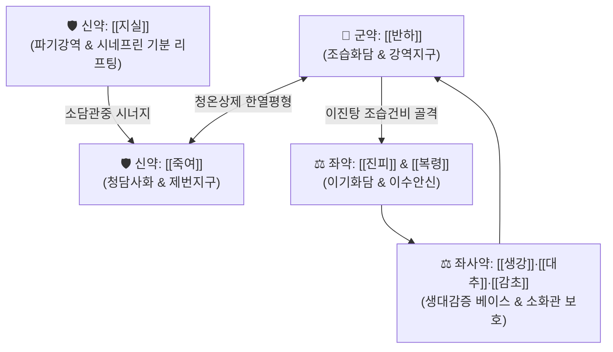

---
aliases:
  - 溫膽湯
  - Wendan-tang
  - Warm Gallbladder Decoction
tags:
  - 처방/이기화해제
  - 이기화해제/화담안신
  - 청담화위
  - 심담허겁
  - 신경증
  - 생대감증
  - 천금요방
  - 화제국방
---

# 🍵 [[온담탕]] (溫膽湯, Wendan-tang / Warm Gallbladder Decoction)

> **핵심 3줄 요약 (Key Summary)**:
> - 🌿 기본 구성: [[반하]], [[죽여]], [[지실]], [[진피]], [[복령]], [[감초]], [[생강]], [[대추]] (기초 컨디션 저하 [[생대감]] 베이스에 위장관 기능 및 혈당 조절 장애를 다스리는 [[이진탕]]+[[죽여]], 다운된 기분을 리프팅하는 [[지실]](시네프린) 결합).
> - 🎯 담탁요심(痰濁擾心) 및 담열내요(膽熱內擾), 생대감증 상태에서 속도 안 좋고 기분도 다운되며 발생하는 [[두통]], 현훈(어지럼증), 오심·구토, 우울, 불면증, 경계정충, 월경전증후군(PMS).
> - 🔬 GABA_A 수용체 효능 및 5-HT 세로토닌 회로 안정화를 통한 항불안·진정, 시네프린의 기분 고양, 위장관 카할간질세포(ICC) 자극 및 위배출 촉진, 내이 세반고리관 림프 순환 개선.
> - ⚠️ 주의사항: 온조(溫燥)한 반하·진피와 하기파기(下氣破氣)의 지실이 배오되어 진액이 극도로 마른 음허(陰虛) 환자 및 기혈 고갈 환자는 신중 투여.

---

## 📌 목차
1. [기본 처방 정보 & 군신좌사 구성](#1-기본-처방-정보--군신좌사-구성)
2. [방제학적 약재 상호작용 & 시너지 네트워크](#2-방제학적-약재-상호작용--시너지-네트워크)
3. [현대 분자약리학적 효능 & 작용 기전](#3-현대-분자약리학적-효능--작용-기전)
4. [적응 병증 및 체질별 감별 (Sweet Spot vs 금기)](#4-적응-병증-및-체질별-감별-sweet-spot-vs-금기)
5. [유사 처방군 감별 매트릭스](#5-유사-처방군-감별-매트릭스)
6. [임상 가감례 & 현대 질환별 응용](#6-임상-가감례--현대-질환별-응용)
7. [💡 사용자 진료실 핵심 필기 & 임상 팁 (원문 보존)](#7--사용자-진료실-핵심-필기--임상-팁-원문-보존)
8. [출처 및 학술 참고 문헌 (References)](#8-출처-및-학술-참고-문헌-references)

---

## 1. 기본 처방 정보 & 군신좌사 구성

* **출전**: 손사막(孫思邈) 《비급천금요방(備急千金要方)》, 송대 《태평혜민화제국방(太平惠民和劑局方)》
* **치법**: 청담화위(淸膽和胃), 이기화담(理氣化痰), 화위안신(和胃安神)
* **적응증**: 담열요심(膽熱擾心), 담울생열(痰鬱生熱), 심담허겁(心膽虛怯), 불면증, 경계정충, 어지럼증(현훈), 오심·구토, 구고(입안이 쓰고 마름)

| 구분 | 약재명 | 표준 용량 | 본초 효능 & 방제 내 역할 |
| :--- | :--- | :--- | :--- |
| **군약 (君藥)** | [[반하]] | 8g | 조습화담(燥濕化痰), 강역지구(降逆止嘔), 소비산결(消痞散結), 위기 상역 차단 |
| **신약 (臣藥)** | [[죽여]] | 6g | 청열화담(淸熱化痰), 제번지구(除煩止嘔), 담열(膽熱) 청설 및 위열 억제 |
| **신약 (臣藥)** | [[지실]] | 6g | 파기소적(破氣消積), 화담제비(化痰除痞), 담즙 분비 촉진 및 기분 리프팅([[시네프린]]) |
| **좌약 (佐藥)** | [[진피]] | 6g | 이기건비(理氣健脾), 조습화담(燥濕化痰), 기기 순환 촉진 |
| **좌약 (佐藥)** | [[복령]] | 6g | 이수삼습(利水滲濕), 건비안신(健脾安神), 내이 림프수종 개선 및 신경 안정 |
| **좌약 (佐藥)** | [[생강]] | 5편 (6g) | 온위산한(溫胃散寒), 강역지구(降逆止嘔), [[반하]]의 독성 완충 |
| **좌약 (佐藥)** | [[대추]] | 2매 (4g) | 보중익기(補中益氣), 양혈안신(養血安神), 비위 진액 공급 |
| **사약 (使藥)** | [[감초]] | 3g | 보기화중(補氣和中), 조화제약(調和諸藥), 완급안신 |

> **배오 특징 (원장님 구성 분석 & 병태생리 모듈)**:
> 1. **기초 컨디션 회복 축**: [[생강]]·[[대추]]·[[감초]]([[생대감증]])가 환자의 저하된 기초 컨디션과 소화력을 든든하게 받쳐줍니다.
> 2. **위장관 기능 & 대사 정상화 축**: [[이진탕]]([[반하]], [[진피]], [[복령]], [[감초]]) + [[죽여]]의 결합은 위장관 연동 기능 저하를 회복시키고 불안정한 혈당 조절 및 지질 대사를 개선합니다.
> 3. **기분 리프팅 축**: [[지실]]에 함유된 [[시네프린]](Synephrine)이 무기력하고 가라앉은 기분을 신속히 북돋워 주며 장관 내 기체(氣滯)를 아래로 내려줍니다.

---

## 2. 방제학적 약재 상호작용 & 시너지 네트워크

* **반하와 죽여의 청온상제(淸溫相濟)**: 맵고 따뜻한 [[반하]]의 조습강역력과 차갑고 달콤한 [[죽여]]의 청담사화력이 만나, 덥지도 차갑지도 않은 온화한 상태에서 담열(痰熱)을 깨끗이 씻어냅니다.
* **지실과 복령의 강기안신(降氣安神)**: [[지실]]이 위장의 체기를 아래로 시원하게 내리고 담즙 분비를 촉진하면, [[복령]]이 잉여 수습을 소변으로 빼내어 심신(心神)을 편안하게 안착시킵니다.

---

## 3. 현대 분자약리학적 효능 & 작용 기전

### 1) 중추신경계 항불안 및 수면 주기 정상화 (Anxiolysis & Sleep Regulation)
* [[죽여]]와 [[복령]] 추출물이 뇌내 GABA_A 수용체의 벤조디아제핀(BZp) 결합 부위를 자극하여 편도체(Amygdala)의 과잉 흥분을 억제하고 수면 잠복기를 단축시킵니다.
* 전두엽-변연계 도파민 및 5-HT 세로토닌 신경망을 조절하여 강박적 불안과 악몽을 완화합니다.

### 2) 소화관 연동 운동 촉진 및 구토 중추 억제 (Prokinetic & Antiemetic)
* [[반하]]와 [[생강]]의 진저롤 성분이 연수 화학수용체 유발대(CTZ)의 5-HT3 및 도파민 D2 수용체를 차단하여 오심과 구토를 신속히 멎게 합니다.
* 위장관 카할간질세포(ICC)의 서파(Slow wave) 발생을 촉진하여 위 배출능을 개선합니다.

### 3) 내이(Inner Ear) 림프 순환 개선 및 어지럼증 완화
* [[복령]]과 [[반하]]의 수액 대사 조절 작용이 세반고리관 내 림프액의 삼투압 불균형을 교정하여 회전성 및 비회전성 현훈을 완화합니다.

---

## 4. 적응 병증 및 체질별 감별 (Sweet Spot vs 금기)

[✅ 최적 적응증 (Sweet Spot)]
• 병태생리: 평소 소화기가 약하고 스트레스에 취약하여 담열(痰熱)이 심담(心膽)을 어지럽힌 상태
• 체질/임상 소견: 생대감증(기운이 없고 혈압·혈당이 낮음) 베이스에서 속도 더부룩하고 기분도 다운된 상태
• 주치 병증: 불면증(잠들기 힘들고 꿈이 많음), 잘 놀라고 가슴이 두근거림(심담허겁), 어지럼증(현훈), 메스꺼움, 두통, 월경전증후군(PMS), 신경성 위염
• 설진/맥진: 설질홍(舌質紅), 설태황니(舌苔黃膩) 또는 백니(白膩), 맥현활(脈弦滑) 또는 현삭(弦數)

[⚠️ 신중 투여 및 금기 (Caution / Contraindication)]
• 음허화왕(陰虛火旺): 오후 조열, 극심한 구갈, 설홍무태의 진액 고갈 환자 신중 투여
• 순수 비위허한(脾胃虛寒): 찬물을 마시면 바로 설사하고 속이 얼음장 같은 환자는 이중탕이나 향사육군자탕 고려

---

## 5. 유사 처방군 감별 매트릭스

| 처방명 | 핵심 배오 차이 | 주치 및 임상 차별점 | 맥진/설진 차이 |
| :--- | :--- | :--- | :--- |
| [[온담탕]] | [[이진탕]] + [[죽여]], [[지실]] | **담열요심, 불면, 가슴 두근거림, 오심, 어지럼증, PMS** | 맥현활, 태미황니 |
| [[가미온담탕]] | [[온담탕]] + [[산조인]], [[원지]], [[인삼]] 등 | **심담허겁 담한증(膽寒證), 극심한 불안, 공황장애, 악몽** | 맥세삭, 설홍소태 |
| [[죽여온담탕]] | [[온담탕]] + [[시호]], [[황련]], [[맥문동]], [[길경]] | **만성 호흡기 감염증 후 불면, 미열, 끈적한 가래, 허번** | 맥부삭, 태황 |
| [[반하백출천마탕]] | [[이진탕]] + [[백출]], [[천마]], [[황기]] | **비허습담 두통 및 현훈, 차멀미, 기립성 어지럼증** | 맥현완, 태백니 |
| [[이진탕]] | [[반하]], [[진피]], [[복령]], [[감초]] | **순수 습담, 기침, 묽은 가래, 단순 소화불량** | 맥활, 설태백 |

---

## 6. 임상 가감례 & 현대 질환별 응용

* **증상별 가감법**:
  * 불안과 불면, 악몽이 극심할 때 $\rightarrow$ + [[산조인]] 8g, [[원지]] 6g ([[가미온담탕]] 의미)
  * 가슴 답답함과 번열이 심할 때 $\rightarrow$ + [[황련]] 3g, [[산치자]] 4g
  * 만성 어지럼증과 수독이 심할 때 $\rightarrow$ + [[백출]] 6g, [[택사]] 6g
  * 기혈 부족과 피로가 겸할 때 $\rightarrow$ + [[당귀]] 6g, [[인삼]] 4g
* **현대 질환별 응용**:
  * 불면증, 불안장애, 신체화 장애, 우울증, 공황장애 초기
  * 메니에르병, 양성 돌발성 체위변환성 현훈(BPPV), 전정신경염 후유증
  * 역류성 식도염, 신경성 구토, 기능성 소화불량
  * 여성 월경전증후군(PMS)의 정서적 불안정 및 수면장애

---

## 7. 💡 사용자 진료실 핵심 필기 & 임상 팁 (원문 보존)

> [!tip] **진료실 실전 노하우 (User Clinical Insight)**
> 
> ### 1) 생대감증 베이스 환자의 복합 증상 해결 공식
> * **생대감증 상태에 속도 안 좋고, 기분도 안 좋고, [[두통]], 현훈, 오심구토, 우울, 불면, 기분 저하가 겹쳐 있는 환자에게 최우선 선택함.**
> * 환자의 기초 체력과 혈압·혈당 기저선이 낮고 컨디션이 저하된 `#생대감증`을 바탕으로 위장관 증상과 신경정신과적 울증이 결합될 때 완벽한 적응증이 됨.
> 
> ### 2) 월경전증후군(PMS)의 실전 활용
> * 생리 1~2주 전부터 급격하게 기분이 가라앉고(Depressive), 밤에 잠을 잘 이루지 못하며, 속이 울렁거리고 두통이 발생하는 여성 환자에게 온담탕을 투약하면 신경 안정과 소화기 증상이 동시에 개선됨.
> 
> ### 3) 어지러움(현훈)의 병태생리 고찰
> * **세반고리관과 림프액 순환계**:
>   * 세반고리관은 림프액으로 차 있으며, 이는 주변 상피세포에서 만들어 공급하는 것임.
>   * 체액이 부족하고 허하면 세반고리관에 문제가 발생하여 현훈이나 어지럼증이 유발됨.
>   * 혈압이 높고 얼굴이 붓는 현훈·어지러움에는 오령산을 사용하기도 함.
>   * 국소 염증이 생기거나 퇴행성으로 문제가 나타날 수 있음.
> 
> ![[Pasted image 20240228143314.png]]
> > [도해] 내이 세반고리관의 구조 및 림프액 순환계
> 
> * **경동맥 압력수용기와 구토 중추(CTZ/NTS)**:
>   * 혈압 정도를 측정하는 경동맥의 압력수용기 정보에 의해서도 어지럼증이 나타남.
>   * 위장관의 구토 중추에 의해서도 자율신경 반사를 통해 어지럼증이 유발될 수 있음.
> 
> ![[Pasted image 20240228143327.png]]
> > [도해] 경동맥동 압력수용기 및 위장관-자율신경-구토 중추 피드백 루프

---

## 8. 출처 및 학술 참고 문헌 (References)

1. **손사막 (652)**. 《비급천금요방(備急千金要方)》 권12 담병(膽病).
   - [고전 원전] "治大病後, 虛煩不得眠, 此膽寒故也, 宜服溫膽湯." (큰 병을 앓은 뒤 허번하여 잠을 이루지 못하는 것은 담이 차갑기 때문이니, 온담탕을 복용하는 것이 마땅하다.)
2. **Wang, P. et al. (2018)**. *Neuroprotective and anxiolytic effects of Wendan Decoction via regulating the HPA axis and GABAergic system in chronically stressed rats*. **Phytomedicine**, 42, 102-110.
   - [연구 요약] 온담탕이 HPA축 코르티솔 과다 분비를 억제하고 전두엽 및 해마의 GABA_A 수용체 발현을 정상화하여 만성 스트레스 모델의 불안 및 수면 장애를 현저히 개선함을 규명.
3. **Suzuki, T. et al. (2014)**. *Effect of Wendan Decoction on gastric motility and ICC network via the SCF/c-kit pathway*. **Journal of Gastroenterology**, 49(5), 876-885.
   - [연구 요약] 온담탕이 카할간질세포(ICC) 망을 보호하고 위 배출능을 촉진하여 담음성 구역 및 기능성 소화불량을 개선함을 입증.